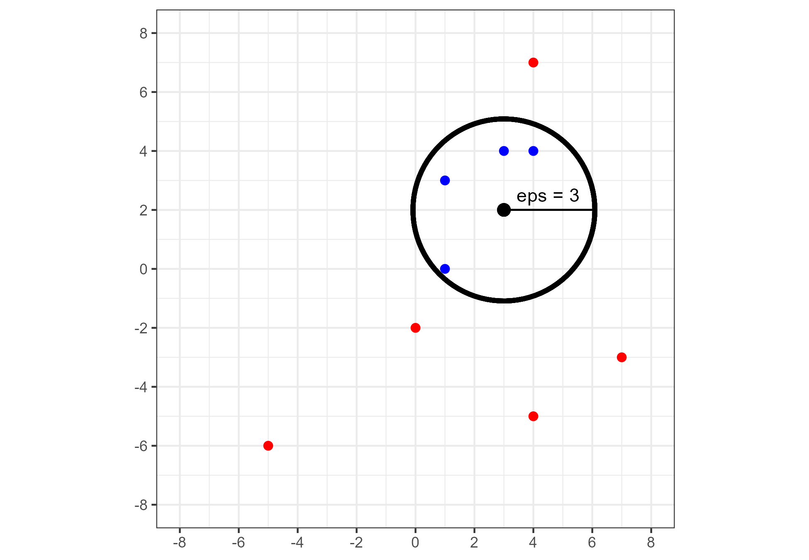
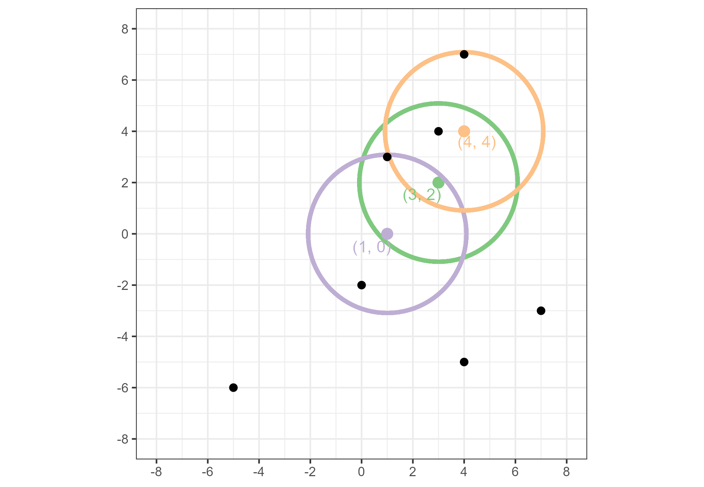
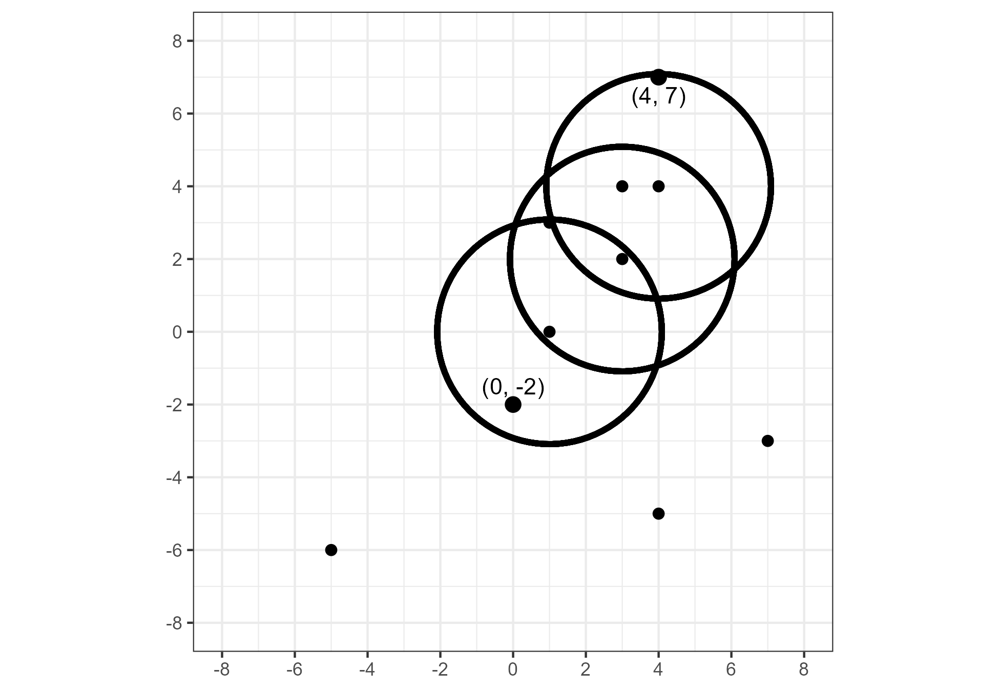

```{r setup, include=FALSE}
options(
  dplyr.print_min = 6, dplyr.print_max = 6, width = 70,
  digits = 3, htmltools.dir.version = FALSE
)
knitr::opts_chunk$set(
  comment = "#>",
  echo = FALSE,
  collapse = TRUE,
  warning = FALSE,
  message = FALSE,
  cache = TRUE,
  fig.align = "center",
  fig.pos = "!htbp"
)

library(ggplot2)
library(cmcR) # remotes::install_github("CSAFE-ISU/cmcR")
library(tidyverse)
library(x3ptools) # remotes::install_github("heike/x3ptools")
library(rgl)
library(magrittr)
```

# Literature Review

## Preliminaries: Forensic Examinations

A bullet casing is found at the scene of a murder.
The bullet is recovered from the victim during autopsy.
A handwritten letter threatening the victim is found in their pocket.
The assailant's shoeprints are discovered fleeing the area.
Who left this evidence?
Investigators obtain the gun, shoes, and handwriting samples of a suspect.
This evidence, along with the crime scene evidence, is sent to a forensic laboratory for analysis.
Forensic examiners compare the evidence to establish whether they share a common source. 
The suspect is charged after the examiners conclude that there is sufficient agreement between the crime scene and suspect's samples.

The procedure described above, in which evidence is analyzed to determine its origin, is called the *source identification* problem [@Ommen2018].
Historically, forensic examiners have relied on tools (e.g., microscopes), case facts, and experience to develop an opinion on the similarity of two pieces of evidence.
More recently, algorithms to automatically compare evidence and provide an objective measure of similarity have been introduced.
These algorithms can be used in a forensic examination to supplement and inform the examiner's conclusion.
We propose an automatic, objective solution to the source identification problem; specifically in the context of comparing fired *cartridge cases.*
Cartridge case comparison is a sub-discipline of Firearm and Tool Mark Identification, which is reviewed in the next section.

### Firearm and Tool Mark Identification

Firearm and tool mark identification involves studying markings or impressions left by a hard surface such as a firearm or screwdriver on a softer surface [@Thompson2017].
For example, a barrel's rifling leaves tool marks on a bullet as it travels out of the gun.

#### The Firing Process

In this section, we describe the basic process of firing a cartridge out of a handgun or rifle.
A *cartridge* consists of a metal casing containing primer, gunpowder, and a bullet.
Figure \@ref(fig:cartridgeDiagram) shows a cross-section of a cartridge featuring these components [@calibersExplained].


```{r cartridgeDiagram,echo=FALSE,fig.cap="A cartridge containing primer, powder, and a bullet. The firing process is initiated by loading a cartridge into the barrel of a firearm.",out.width=".5\\textwidth"}
knitr::include_graphics("images/bulletdiagram1.png")
```


First, a cartridge is loaded into the back of the barrel in an area called the *chamber*.
Figure \@ref(fig:pistolParts) shows an example of a cartridge loaded into the chamber of a pistol [@rattenbury].
Note that the hammer of the pistol in Figure \@ref(fig:pistolParts) is pulled to hold the firing pin under spring tension.
Upon squeezing the trigger, the firing pin releases and travels forwards at a high velocity.
The firing pin strikes the primer of the cartridge case, causing it to explode.

```{r pistolParts,echo=FALSE,fig.cap="Cross-section of a pistol with a chambered cartridge and drawn-back hammer. Pulling the trigger releases the firing pin which strikes the cartridge case primer.",out.width=".5\\textwidth"}
knitr::include_graphics("images/Parts-pistol.png")
```

The explosion of the primer ignites the powder in the cartridge [@hampton].
As shown in \@ref(fig:firingCartridge), gas rapidly expands in the cartridge that pushes the bullet down the barrel.
Simultaneously, the rest of the cartridge moves towards the back of the barrel and presses against the back wall of the barrel, known as the *breech face*, with considerable force.

```{r firingCartridge,echo=FALSE,fig.cap="A cartridge after a firing pin has struck the primer. The explosion of the primer ignites the powder within the cartridge, causing gas to rapidly expand and force the bullet down the barrel.",out.width=".5\\textwidth"}
knitr::include_graphics("images/firingCartridgeDiagram.jpg")
```

Any markings on the breech face are imprinted onto the cartridge case, creating the so-called *breech face impressions*.
These impressions are analogous to a barrel's "fingerprint" left on the cartridge case.
Figure \@ref(fig:impressionDiagram) shows cartoon examples of breech face markings that appear on cartridge cases [@hampton].

```{r impressionDiagram,echo=FALSE,fig.cap="Examples of common breech face impression patterns. These are considered analogous to a breech face fingerprint left on the cartridge surface.",out.width=".5\\textwidth"}
knitr::include_graphics("images/breechFaceImpressionDiagram.jpg")
```

Figure \@ref(fig:realCartridgeCase) shows the base of a fired cartridge [@hampton].
The hole to the south-east of the center of the primer is the impression left by the firing pin.
Note the horizontal striated breech face markings on the primer to the left of the firing pin impression.
We focus on the comparison of such markings.

```{r realCartridgeCase,echo=FALSE,fig.cap="A fired 9mm Luger cartridge case with visible firing pin and breech face impressions.",out.width=".7\\textwidth"}
knitr::include_graphics("images/realCartridgeCaseImage.jpg")
```

<!-- The extractor pin and ejector pushes the cartridge case out of the chamber. -->
<!-- As shown in Figure \@ref(fig:extractorMarkings), this may leave additional markings on the cartridge surface \citep{hampton}. -->
<!-- Firing pin, breech face, and extractor pin and ejector markings are all used in a forensic examination to determine whether two cartridge cases were fired from the same firearm. -->
<!-- We focus on the comparison of breech face impressions specifically. -->

<!-- ```{r,echo=FALSE,fig.cap="\\label{fig:extractorMarkings} Examples of common extractor pin and ejector markings. Forensic examiners study impressions on the cartridge to identify the source of the fired cartridge.",out.width=".5\\textwidth"} -->
<!-- knitr::include_graphics("images/extractorPinDiagram.png") -->
<!-- ``` -->

#### An Overview of Firearm and Tool Mark Examinations

Trained firearm and tool mark examiners use a *comparison microscope* like the one in Figure \@ref(fig:comparisonMicroscope) to examine two pieces of evidence [@Zheng2014].
A comparison microscope combines the view of two compound microscopes into a single view via an *optical bridge*.
This allows an examiner to view two microscope stages simultaneously under the same eyepiece.
The right Figure \@ref(fig:comparisonMicroscope) shows the view of two bullets under a comparison microscope.
The white dotted line represents the split in the two fields of view.
The goal of using a comparison microscope is to assess the "agreement" of the features on two pieces of evidence.

```{r comparisonMicroscope,echo=FALSE,fig.cap="A comparison microscope consists of two stages upon which evidence is placed. These stages are placed under two compound microscopes that are joined together via an optical bridge and allow for viewing of both stages simultaneously under a single eyepiece. The image on the right shows an example of a bullet viewed under a comparison microscope.",out.width=".6\\textwidth"}
knitr::include_graphics("images/comparisonMicroscope.png")
```

Firearm examiners distinguish between three broad categories when characterizing the features of a fired bullet or cartridge case: class, subclass, and individual characteristics.
*Class characteristics* are features associated with the manufacturing of the firearm such as the size of ammunition chambered by the firearm, the orientation of the extractor and ejector, or the width and twist direction of the barrel rifling.
An early step in a forensic examination is to determine the class characteristics of the firearm of origin as they can narrow the relevant population of potential firearm sources [@Thompson2017].
For example, a 9mm cartridge case must have been fired by a firearm that can chamber 9mm ammunition.


If the discernible class characteristics match between two pieces of evidence, then the examiner uses a comparison microscope to compare the *individual characteristics* of the evidence.
Individual characteristics are markings attributed to imperfections on the firearm surface due to the manufacturing process, use, and wear of the tool.
For example, markings on the breech face of a barrel often form after repeated fires of the firearm.
Individual characteristics are assumed to occur randomly across different firearms and therefore can be used to distinguish between two firearms.
The examiner independently rotates and translates the stages of a comparison microscope to find the position where the markings on the two pieces of evidence match [@Zheng2014].
An examiner concludes that the evidence originated from the same firearm if the individual characteristics are in "sufficient agreement" [@AFTE1992].

*Subclass characteristics* exist between the macro-level class and micro-level individual characteristics.
These characteristics relate to markings reproduced across a subgroup of firearms.
For example, breech faces manufactured by the same milling machine may share similar markings [@firearmManufacturing].
It can be difficult to distinguish between individual and subclass characteristics during an examination.
An examiner's decision process may be affected if the existence of subclass characteristics is suspected.

Many firearm and tool mark examiners in the United States adhere to the Association of Firearm and Tool Mark Examiners (AFTE) Range of Conclusions when making their evidentiary conclusions [@AFTE1992].
According to these guidelines, six possible conclusions can be made in a firearm and tool mark examination:

1. **Identification**: Agreement of a combination of individual characteristics and all discernible class characteristics where the extent of agreement exceeds that which can occur in the comparison of tool marks made by different tools and is consistent with the agreement demonstrated by tool marks known to have been produced by the same tool.

2. **Inconclusive**: there are three possible inconclusive decisions

> 2.1 Some agreement of individual characteristics and all discernible class characteristics, but insufficient for an identification.

> 2.2 Agreement of all discernible class characteristics without agreement or disagreement of individual characteristics due to an absence, insufficiency, or lack of reproducibility.

> 2.3 Agreement of all discernible class characteristics and disagreement of individual characteristics, but insufficient for an elimination.

3. **Elimination**: Significant disagreement of discernible class characteristics and/or individual characteristics.

4. **Unsuitable**: Unsuitable for examination.

Forensic examinations first involve an examination of a "questioned" bullet or cartridge case for identifiable tool marks [@Thompson2017].
The examiner classifies markings by their class, individual, and subclass characteristics.
The examiner compares these characteristics to "known source" fires obtained from a suspect's firearm if one is available.
Otherwise, class characteristics from the questioned bullet can be used to narrow the relevant population and provide potential leads.
An examiner's decision may be used as part of an ongoing investigation or presented at trial as expert testimony.

Standard operating procedures for assessing and comparing evidence differ between forensic laboratories.
For example, some labs collapse the three possible inconclusive decisions into a single decision [@Neuman2022] or prohibit examiners from making an elimination based on differences in individual characteristics [@Duez2017].

### Why Should Firearm and Tool Mark Identification Change?

In 2009, the National Research Council released a report assessing a number of forensic disciplines including Firearm and Tool Mark analysis.
The report pointed out that firearm and tool mark analysis lacked a precisely defined process and that little research had been done to determine the reliability or repeatability of the methods.
*Reliability* refers to the ability to correctly classify evidence as originating from the same source or not.
*Repeatability* refers to the consistency of conclusions; for example, whether an examiner makes the same conclusion if presented with the same evidence on different occasions.
Two of the recommendations from this study were to establish rigorously-validated laboratory procedures and "develop automated techniques capable of enhancing forensic technologies [@council_strengthening_2009]."

A number of studies assess the reliability and repeatability of a firearm and tool mark examination (non-exhaustively: @DeFrance2003, @Hamby2009, @fadulempirical2011, @Stroman2014, @Baldwin2014, @Smith2016, @MATTIJSSEN2020).
These studies indicate that examiners have a low error rate when comparing evidence obtained under controlled conditions (i.e., for which ground-truth is known).
However, as pointed out in a 2016 report from the President's Council of Advisors on Science and Technology, many of these studies, save @Baldwin2014, were not "appropriately designed to test the foundational validity and estimate reliability [@pcast2016]."
The report called for more properly-designed studies to establish the scientific validity of the discipline.

Due to the opacity in the decision-making process, examiners are referred to as "black boxes" in a similar sense to black-box algorithms [@HumanFactorsCommittee2020].
Their evidentiary conclusions are fundamentally subjective and empirical evidence suggests that conclusions may differ if examiners are presented with the same evidence on different occasions [@Ulery2011; @Ulery2012].
Examiners rarely need to provide quantitative justification for their conclusion.
Even for qualitative justifications, it can be difficult to determine what the examiner is actually "looking at" to arrive at their conclusion [@Ulery2014].
This suggests the need to supplement these black box decisions with transparent, objective techniques that quantitatively measure the similarity between pieces of evidence.
As stated in @pcast2016, efforts should be made to "convert firearms analysis from a subjective method to an objective method" including "developing and testing image-analysis algorithms for comparing the similarity of tool marks."
This work focuses on the development of an algorithm for comparing breech face impressions on cartridge cases.

## Forensic Comparison Pipelines

Recent work in many forensic disciplines has focused on the development of algorithms to measure the similarity between pieces of evidence including glass [@Curran2000-hp; @Park2019; @openForSciR], handwriting [@crawford_handwriting_2020], shoe prints [@park_algorithm_2020], ballistics [@hare_automatic_2016; @tai_fully_2018], and tool marks [@Hadler2017; @Krishnan2018].
These algorithms often result in a numerical score for two pieces of evidence.
A numerical score can add more nuance to an evidentiary conclusion beyond simply stating whether the evidence originated from the same source as would be the case in binary classification.
For example, a larger similarity scores implies the evidence is more similar.
However, an examiner must ultimately reach one of two conclusions (or three, if admitting inconclusives).
Whether a conclusion should be based solely on an algorithm's similarity score or if an examiner should incorporate the similarity score into their own decision-making process is still up for debate [@Swofford2021].
In this work we view forensic comparison algorithms as a supplement to, rather than a replacement of, the traditional forensic examination.

We treat forensic comparison algorithms as evidence-to-classification "pipelines."
Broadly, the steps of the pipeline include @Rice2020:

1. capturing a digital representation of the evidence,

2. pre-processing this representation to isolate or emphasize a region of interest of the evidence,

3. comparing regions of interest from two different pieces of evidence to obtain a (perhaps high-dimensional) set of similarity features,

4. combining these features into a low-dimensional set of similarity scores, and

5. defining a classification rule based on these similarity features.

We add to this structure the emphasis that each step of the pipeline can be further broken-down into modularized pieces.
For example, the pre-processing step may include multiple sub-procedures to isolate a region of interest of the evidence.
Figure \@ref(fig:pipelineDiagram) shows two possible variations of the cartridge case comparison pipeline as well as the parameters requiring manual specification and alternative modules.
The benefits of this modularization include easing the process of experimenting with different parameters/sub-procedures and improving the comprehensibility of the pipeline.

```{r pipelineDiagram,echo=FALSE,echo=FALSE,fig.cap="Variations upon the cartridge case comparison pipeline. The first two columns detail the pipeline with different sub-procedures. The third columns shows the parameters that require manual specification at each step. The fourth column shows  alternative processing steps that could replace steps in the existing pipeline.",out.width="\\textwidth"}
knitr::include_graphics("images/pipelineDiagram_6-8-22.png")
```

In the following sections, we detail recent advances to each of the five steps in the pipeline outlined above.
We narrow our focus to advances made in comparing firearms evidence.

### Digital Representations of Evidence

Digital representations of cartridge case evidence commonly come in two forms: 2D optical images or 3D topographic scans.
A common way to take 2D optical images is to take a picture of the cartridge case surface lit up under a microscope, implying a dependence on the lighting conditions under which the picture was taken.
Some recent work has focused on comparing 2D optical images [@tai_fully_2018; @tong_fired_2014], although the use of 3D microscopes has recently become more prevalent to capture the surface of ballistics evidence.

Using a 3D microscope allows for the scanning of surfaces at the micron (or micrometer) level under light-agnostic conditions [@weller_2012].
Figure \@ref(fig:cartridgeCaseImages) shows a 2D image and 3D topography of the same cartridge case primer from @fadulempirical2011.
<!-- One common 3D scanning procedure is "disc scanning confocal microscopy." -->
<!-- This procedure works by shining a focused beam of light on the cartridge case surface. -->
<!-- This light is reflected back onto a pinhole allowing a limited height range to pass through. -->
<!-- The microscope scans through different height range "slices" and compiles all these slices into a single 3D topography of the cartridge case primer surface. -->
<!-- The Microdisplay Scan Confocal Microscope from Sensofar\texttrademark Metrology is shown in Figure \@ref(fig:sensofarScanner) \citep{bermudez2017confocal}. -->

<!-- ```{r,echo=FALSE,fig.cap="\\label{fig:sensofarScanner} The Microdisplay Scan Confocal Microscope from Sensofar\\texttrademark\\ Metrology. The cartridge case surface is captured by scanning through a range of vertical slices and compiling these slices into a single 3D topography.",out.width=".5\\textwidth"} -->
<!-- knitr::include_graphics("images/sensofarScanner.png") -->
<!-- ``` -->

<!-- Figure \@ref(fig:cartridgeCaseImages) shows a 2D image and 3D topography of the same cartridge case primer from \citet{fadulempirical2011}. -->

```{r cartridgeCaseImages,echo=FALSE,fig.cap="A cartridge case captured using 2D confocal reflectance microscopy (left) and 3D disc scanning confocal microscopy (right).",out.width="\\textwidth"}
knitr::include_graphics("images/fadul1-1_sidebyside.PNG")
```

Recently, Cadre Forensics\texttrademark introduced the TopMatch-3D High-Capacity Scanner [@topmatch].
Figure \@ref(fig:topMatchScanner) shows a TopMatch scanner with a tray of 15 fired cartridge cases [@topmatchFlyer].
This scanner collects images of a gel pad under various lighting conditions into which the cartridge case surface is impressed. Proprietary algorithms combine these images into a regular 2D array called a *surface matrix*.
Elements of the surface matrix represent the relative height value of the associated surface.  
The physical dimensions of these scans are about 5.5 $mm^2$ captured at a resolution of 1.84 microns per pixel (1000 microns equals 1 mm).

```{r topMatchScanner,echo=FALSE,fig.cap="The TopMatch-3D High-Capacity Scanner from Cadre Forensics\\texttrademark\\ . The scanner captures topographic scans of a gel pad into which a cartridge case surface is impressed.",out.width=".7\\textwidth"}
knitr::include_graphics("images/TopMatchSystem7.png")
```

The ISO standard x3p file format is commonly used to save 3D scans  [@ISO25178-72].
An x3p is a container consisting of a single surface matrix representing the height values of the surface and metadata concerning the parameters under which the scan was taken as shown in Figure \@ref(fig:x3pFlowchart) [@Zheng2020].
A number of studies suggest that 3D topographic scans of cartridge case surfaces lead to more accurate classifications than 2D optical images of the same evidence [@Tai2019; @tong_fired_2014; @song_3d_2014].

```{r x3pFlowchart,echo=FALSE,fig.cap="The hierarchy of information stored in the x3p file format for both bullet and cartridge case evidence.",out.width=".7\\textwidth"}
knitr::include_graphics("images/x3pFlowchart.jpg")
```

### Pre-processing Procedures for Forensic Data

After obtaining a surface's digital representation, we next want to isolate regions of the surface containing distinguishable markings.
Figure \@ref(fig:cartridgeCaseImages) shows an example of a 2D image and 3D scan of the same cartridge case.
In both representations, the corners of these arrays include regions of the cartridge case surface outside of the primer.
The center of the cartridge case primer contains an impression left by the firing pin during the firing process.
<!-- In most applications, impressions left by the firing pin are compared separately from the breech face impressions \citep{Zhang2016}. -->
<!-- Because we are interested in the comparison of breech face impressions between two cartridge cases, only the annular region surrounding the firing pin impression is of interest. -->
We wish to isolate the annular breech face region around the firing pin impression from the rest of the captured surface.

Both the 2D optical and 3D topographic representations of cartridge case surfaces are fundamentally pictorial in nature.
As such, breech face impression isolation commonly relies on image processing and computer vision techniques.
@tai_fully_2018 uses a combination of histogram equalization, Canny edge detection, and morphological operations to isolate breech face impressions in 2D images.
A Gaussian filter is another common tool to emphasize breech face impressions.
@tong_fired_2014 apply a low-pass Gaussian filter to remove noise via a Gaussian-weighted moving average operation.
@chu_validation_2013 and @song_estimating_2018 use a bandpass Gaussian filter to simultaneously remove noise and unwanted global structure from the scan.
@song_3d_2014 and @chen_convergence_2017 use a "robust" variant of the Gaussian filter to omit outliers from the scan [@ISO16610-71].

Instead of automatic procedures, others have used subjective human intervention to isolate the breech face impressions.
For example, @song_estimating_2018 performed "manually trimming to extract the breech face impression of interest" on a set of cartridge case scans.
In @Roth2015, examiners manually identify the borders of the breech face impression region by placing points around an image of the cartridge case primer.

### Forensic Data Feature Extraction

After isolating the breech face impressions, we compare two pre-processed cartridge case scans and compute a set of similarity features.
Because the cartridge cases at this point are represented as high-dimensional matrices, this process can be thought of as a dimensionality reduction of the high-dimensional surface arrays to a set of similarity statistics.

A variety of features have been proposed to quantify the similarity between two cartridge case surface arrays.
@tai_fully_2018 propose calculating the cross-correlation function (CCF) value between two cartridge cases across a grid of rotations.
The cross-correlation function measures the similarity between two matrices for every translation of one matrix against the other.
For two matching cartridge cases, we assume that the CCF will be largest after aligning the cartridge cases surfaces by their shared breech face impressions.
Conversely, we expect the CCF to be relatively small for two non-matching cartridge cases no matter the alignment.
@Riva2014 propose combining the CCF between two aligned scans with the element-wise median Euclidean distance and median difference between the normal vectors at each point of the surface.
@Riva2016 and @Riva2020 applied Principal Component Analysis to reduce these three features down to two principal components for the sake of fitting a 2D kernel density estimator.

Pertinent to this work is the cell-based comparison procedure originally outlined in @song_proposed_2013.
The underlying assumption of @song_proposed_2013 is similar to that of @tai_fully_2018: that two matching cartridge cases will exhibit higher similarity when they are close to being correctly aligned.
While @tai_fully_2018 measured similarity using the CCF between the two full scans, @song_proposed_2013 proposes partitioning the scans into a grid of "correlation cells" and counting the number of similar cells between the two scans.
The rationale behind this procedure is that many cartridge case scans have only a few regions with discriminatory markings.
As such, comparing full scans may result in a lower correlation than if one were to focus on the highly-discriminatory regions.
In theory, dividing the scans into cells allows for the identification of these regions.
After breaking a scan into a grid of cells, each cell is compared to the other scan to identify the rotation and translation, known together as the *registration*, at which the cross-correlation is maximized.
@song_proposed_2013 assumes that the cells from a truly matching pair of cartridge cases will "agree" on their registration in the other scan.
@song_proposed_2013 referred to the procedure of counting the number of similar cells the "Congruent Matching Cells" method.
Chapter 2 contains more details of this procedure.

### Similarity Scores & Classification Rules for Forensic Data

Following feature extraction, the dimensionality of these features is further reduced to a low-dimensional, usually univariate, similarity score.
We can define a decision boundary based on the value of the similarity score to classify cartridge case pairs as matching or non-matching.

After calculating the CCF across various possible registrations, @tai_fully_2018 propose using the maximum observed CCF value as the univariate similarity score.
They perform binary classifications by setting a CCF threshold above which pairs are classified as "matches" and below which as "non-matches."
@Tai2019 proposes setting a CCF cut-off that maximizes the precision and recall in a training set of pairwise comparisons.

@Riva2016 and @Riva2020 use a training set to fit two 2D kernel density estimates to a set of features from matching and non-matching comparisons.
Using these estimates, they compute a score-based likelihood ratio (SLR), which can be interpreted as a similarity score [@Garton2021].

For the Congruent Matching cells method, @song_proposed_2013 proposes using the number of cells that agree on a registration, the "congruent matching" cells, as a similarity score.
The criteria used to define "congruent matching" cells has changed across papers [@song_3d_2014; @tong_fired_2014; @tong_improved_2015; @chen_convergence_2017] and will be discussed in greater detail in Chapter 2.
The authors of these papers have consistently used six congruent matching cells as a decision boundary to distinguish matching and non-matching cartridge case pairs.

@zhang_convergence_2021 applies the Density-Based Spatial Clustering of Applications with Noise (DBSCAN) algorithm [@Ester1996] to the features from the cell-based comparison procedure to determine if any clusters form amongst the per-cell estimated registration values.
This is based on the assumption that any cells that come to a consensus on their registration should form a cluster in translation $(x,y)$ and rotation $\theta$ space.
@zhang_convergence_2021 proposes a binary classifier based on whether any clusters are identified by the DBSCAN algorithm [@Ester1996].
If a cluster is found for a particular pairwise comparison, then that pair is classified as a "match" and otherwise as a "non-match."

Apart from the algorithms described in @tai_fully_2018 and @Tai2019, the authors of these comparison algorithms have not provided publicly available code or data.
As such, although the results reported in associated papers are promising, it is difficult or impossible for other researchers to verify or reproduce the findings.
Results must be reproducible to be accepted by others in any scientific domain.
In the next section, we discuss recent challenges and opportunities in computationally reproducible research.

### Reproducibility of Comparison Pipelines

@nasem_2019 defines *reproducibility* as "obtaining consistent computational results using the same input data, computational steps, methods, code, and conditions of analysis."
While not exact in their definition of "consistent," the authors assert that, barring a few exceptions, it is reasonable to expect that the results obtained by a second researcher, after applying the exact same processing steps to the exact same data, be the exact same as the original results.
<!-- Among the exceptions given is if the original researcher had made a mistake in writing the original source code. -->
In either case, they assert that "a study's data and code have to be available in order for others to reproduce and confirm results."
Given data and code, researchers are able to verify the results, incorporate the materials into their own research, and improve or accelerate discovery [@Stodden2018b].

A number of studies indicate that computationally reproducible research is sparse across various disciplines.
@Stodden2018b and @Stodden2018a studied the reproducibility of articles sampled from the *Journal of Computational Physics* and the journal *Science*, respectively.
In the former, @Stodden2018b found that zero of 306 randomly selected articles from the *Journal of Computaional Physics* were "straightforward to reproduce with minimal effort" and, at best, that five articles were "reproducible after some tweaking."
In the latter, @Stodden2018a found that only 3 of 204 randomly selected articles from *Science* were "straightforward to reproduce with minimal effort;" despite a journal policy requiring that all code and data used in the paper be made available to any reader.
Similar findings were found in @CChang2022 (29 of 59 economic papers reproducible), @Iqbal2016 (zero of 268 biomedical papers provided raw data and 1 in 268 linked to a full study protocol), @Duvendack2015 (50\% or more published articles include data or code in only 27 of 333 economics journals), and @Gundersen2018 (24 of 400 AI conference papers included code).
A common recommendation amongst these authors is to establish of rigorous tools and standards to promote reproducibility.
This includes making code and data used in a paper easily-accessible to readers.

Infrastructure already exists to ease the process of developing, maintaining, and sharing open-source code and data.
Data repositories such as the NIST Ballistics Tool Mark Research Database [@Zheng2020] provide open access to raw data.
@Grning2018 discuss the use of package managers such as Conda ([https://anaconda.org/anaconda/conda](https://anaconda.org/anaconda/conda)), container software such as Docker ([https://www.docker.com/](https://www.docker.com/)), and virtual machine software to preserve the entire data analysis environment in-perpetuity.
For situations in which VMs or containers aren't available, software such as the `manager` R package allows users to "compare package inventories across machines, users, and time to identify changes in functions and objects [@Rice2020]."
@Piccolo2016 reference repositories like Bioconductor [@Huber2015] that make it easy to document and distribute code.
Further, software such as the `knitr` R package [@Xie2014] enable "literate programming" in which prose and executed code can be interwoven to make it easier to understand the code's function.
These tools make data, code, and derivative research findings more accessible, in terms of both acquisition and comprehensibility, to consumers and fellow researchers. 

## Diagnostic Tools

Forensic examiners often provide expert testimony in court cases.
As part of this testimony, an examiner is allowed to provide facts about the outcome of a forensic examination and their opinion about what the results mean.
A party to a court may challenge the examiner on the validity of the underlying scientific method or whether they interpreted the results correctly [@aafsArticle].
In these situations, examiners need to explain the process by which they reached an evidentiary conclusion to the fact finders of the case; namely, the judge or jury.
As algorithms are more often used in forensic examinations, the technical knowledge required to understand and explain an algorithm to lay-people has increased.
Indeed, even the most effective algorithms may be moot if an examiner can't explain the algorithm in their testimony.
While in some cases the authors of the algorithm have been willing to provide testimony to establish the validity of the algorithm [@trueAlleleTestimony], this will become less viable as algorithms become more prevalent.

The resources required to educate examiners on the theory and implementation of highly technical algorithms makes additional training seem currently implausible.
An alternative is to develop algorithms from the ground-up to be intuitive for examiners to understand and explain to others.
*Explainability* refers to the ability to identify the factors that contributed to the results of an algorithm [@Belle2021PrinciplesAP].
For example, understanding why a classifier predicted one class over another.
*Diagnostics* are tools to explain or justify the behavior of a model or algorithm in specific instances.
Myriad diagnostic tools exist to explain the results of an algorithm.
These range from identifying instances of the training set that illuminate how the model operates [@Deng2018] to fitting more transparent models that accurately approximate the complex model [@Puiutta2020] to explaining the behavior of the algorithm in a small region of interest of the prediction space [@LIME; @Goode2021].
Many of these methods require additional technical knowledge to interpret these explanations.

### Visual Diagnostics

A less technical approach is to use visualizations that facilitate understanding of model behavior.
Properly constructed visuals enable both exploratory data analysis and diagnostics [@Buja2009], which are critical steps in the data analysis process for anticipating and assessing model fit.
Given that many of the procedures by which cartridge case evidence is captured, processed, and compared are based on image processing techniques, a visual diagnostic is an intuitive mode of explanation for researchers and lay-people alike.
As stated in @cleveland1994elements, "graphical methods tend to show data sets as a whole, allowing us to summarize the behavior and to study detail. This leads to much more thorough data analyses."

Numerical statistics summarize the behavior of data, but miss the detail referenced in Cleveland's quote [@telea2014data].
To illustrate this, consider the famous data sets from [@Anscombe1973] known as Anscombe's quartet.
The two variables in each data set are plotted against one another in Figure \@ref(fig:anscombeQuartet).
There are clear differences in the relationship between `x` and `y` across these four data sets.

```{r anscombeQuartet, fig.cap="A visualization of Anscombe's quartet. Despite there being obvious differences between these four data sets, their summary statistics are nearly identical",fig.height = 3,fig.width=5}
library(magrittr)
library(dplyr)
anscombeLong <- data.frame(
  group  = rep(1:4, each = 11),
  x = unlist(datasets::anscombe[,c(1:4)]),
  y = unlist(datasets::anscombe[,c(5:8)])
)
rownames(anscombeLong) <- NULL

anscombeLong %>%
  ggplot(aes(x=x,y=y)) +
  geom_point() +
  facet_wrap(~ group,nrow = 2,labeller = labeller(group = c("1" = "Data Set 1","2" = "Data Set 2","3" = "Data Set 3","4" = "Data Set 4"))) +
  theme_bw() +
  labs(title = "Anscombe's Quartet")
```

Despite these differences, Table `r knitr::asis_output(ifelse(knitr::is_html_output(), '\\@ref(tab:anscombeStats-html)', '\\@ref(tab:anscombeStats-latex)'))` shows that summary statistics, namely the first two moments, are identical.
This demonstrates that visual diagnostics can be more effective at uncovering data behavior than summary statistics (at least low-order moments).

```{r anscombeStats-latex, echo=FALSE,warning=F,message=F,eval=knitr::is_latex_output(),cache = F,fig.align='center'}
data.frame("Data Set" = c(1,2,3,4),
           "xBar" = c(9,9,9,9),
           "xsd" = c(3.32,3.32,3.32,3.32),
           "ybar" = c(7.5,7.5,7.5,7.5),
           "ysd" = c(2.03,2.03,2.03,2.03)) %>%
  knitr::kable(format = "latex",escape = FALSE,
               col.names = c("Data Set",
                             "$\\bar{x}$",
                             "S.D. $x$",
                             "$\\bar{y}$",
                             "S.D. $y$"),
               caption = "Moments of the two variables in Anscombe's quartet.",
               linesep = "",booktabs = TRUE) %>%
  kableExtra::kable_styling(full_width = TRUE) 
```

```{r anscombeStats-html,echo=FALSE,warning=F,message=F,eval=knitr::is_html_output(),cache = F,fig.align='center'}
data.frame("Data Set" = c(1,2,3,4),
           "xBar" = c(9,9,9,9),
           "xsd" = c(3.32,3.32,3.32,3.32),
           "ybar" = c(7.5,7.5,7.5,7.5),
           "ysd" = c(2.03,2.03,2.03,2.03)) %>%
  knitr::kable(
    caption = "Moments of the two variables in Anscombe's quartet.",
    align = c("r","r","r","r","r"),
    col.names = c("Data Set",
                  "$\\bar{x}$",
                  "$S.D. $x$",
                  "$\\bar{y}$",
                  "S.D. $y$"),
    format = "html",escape = FALSE)
```

Given the pivotal role that visual diagnostics play in the data analysis pipeline, we now consider best practices in creating data visualizations.
Human brains are wired for seeing patterns and differences, and for understanding spatial relationships from this [@telea2014data].
As such, an effective visual diagnostic or data visualization is one that conveys patterns quickly and easily, and with minimal scope for understanding.
Arising originally from a psychological theory of perception, the Gestalt Laws of Perceptual Organization [@Goldstein2016-un] summarize important considerations when constructing statistical graphics.
The Gestalt laws are as follows:

- **Pragnanz - the law of simplicity:** Every stimulus pattern is seen in such a away that the resulting structure is as simple as possible.

- **Proximity:** Things that are near each other appear to be grouped together.

- **Good Continuation:** Points that, when connected, result in straight or smoothly curving lines are seen as belonging together, and the lines tend to be seen in such a way as to follow the smoothest path.

- **Similarity:** Similar things appear to be grouped together.

- **Common Region:** Elements that are within the same region of space appear to be grouped together.

- **Uniform Connectedness:** A connected region of visual properties, such as the lightness, color, texture, or motion, is perceived as a single unit.

- **Synchrony:** Visual events that occur at the same time are perceived as belonging together.

- **Common Fate:** Things that are moving in the same direction appear to be grouped together.

- **Familiarity:** Things that form patterns that are familiar or meaningful are likely to become grouped together.

These laws provide guidance on how to construct a visual that concisely conveys a pattern or difference in data.
For data visualization, additional laws include [@Midway2020]:

- **Use and Effective Geometry:** Choose a geometry (shape and features of a statistical graphic) that is appropriate to the data.

- **Colors Always Mean Something:** Colors in visuals can convey groupings or a range of values.

Figure \@ref(fig:chickweightExample) depicts a case study of the Gestalt principles in practice.
The plot shows the weight over time of chicks fed one of two experimental diets [@crowder1990analysis].
Individual points represent the weight of a single chick on a particular day.
Connected points represent the weight for a single chick over time.
This is an example of using an effective geometry (point & line graph to represent time series) along with the Gestalt law of Good Continuation.
We further apply the Gestalt law of Common Region to facet the data set into plots based on diet.
This implicitly communicates to the audience that the weights of two diet groups of chicks is expected to differ.
Indeed, appealing to the Gestalt law of Uniform Connectedness, the "motion" of the grouped time series suggests that chicks given Diet 2 tend to gain weight more rapidly than those given Diet 1.
This may suggest a particular modeling structure for these time series (e.g., diet fixed effect) or the need to assess the experimental design to ensure that the assumption that the chicks were randomly sampled from the same population is appropriate.
We see how such a plot can be used for both exploratory data analysis or as a post-hoc diagnostic tool.
Alternative to faceting, the time series from these two diet groups could be combined into a single plot and distinguished by color.

```{r chickweightExample,fig.cap="An example of a statistical graphic that uses the Gestalt Laws of Perceptual Organization to communicate data findings.",fig.height = 3,fig.width=5}
library(dplyr)

datasets::ChickWeight %>%
  as.data.frame() %>%
  filter(Diet %in% c(1,3)) %>%
  ggplot(aes(x = Time,y = weight,group = Chick
  )) +
  geom_point() +
  geom_line() +
  theme_bw() +
  ylim(c(0,NA)) +
  theme(legend.position = "bottom") +
  facet_wrap(~ Diet,labeller = labeller(Diet = c("1" = "Diet 1","3" = "Diet 2"))) +
  labs(y = "Weight (gm)",
       x = "Time (Days)",
       subtitle = "Chick weights over time for two experimental diets")
```

The R programming language [@Rlanguage] provides a variety of tools to create visual diagnostics.
Among the most robust of these tools is the ggplot2 package [@ggplot2].
This package extends the "Grammar of Graphics" introduced in @Wilkinson2005 to provide a user-friendly structure to create statistical graphics.
We use the `+` operator to "layer" features of a statistical graphic (e.g., elements, transformations, guides, labels) on a blank canvas.
Figure \@ref(fig:ggplot2Example) along with the accompanying code chunk demonstrates how to create a residual plot from a simple linear regression using the ggplot2 package.
This visual diagnostic allows the analyst or audience to determine whether the homoscedasticity or linear form assumptions underlying simple linear regression are met.
For those willing to learn the "grammar," the code used to create these statistical graphics can easily be re-used and tweaked to fit a specific application.

```{r ggplot2Example,echo=TRUE,fig.cap="An example of using the ggplot2 package to construct a residual plot from a simple linear regression. The features of the statistical graphic are combined layer-by-layer using the + operator as we see in the accompanying code chunk.",fig.height = 3,fig.width=5}
lmFit <- lm(formula = rating ~ complaints,data = datasets::attitude)

library(ggplot2)

ggplot(data = data.frame(Complaints = datasets::attitude$complaints,
                         Residuals = lmFit$residuals)) +
  geom_point(aes(x = Complaints,y = Residuals)) +
  geom_hline(yintercept = 0,linetype = "dashed") +
  labs(x = "% in-favor of handling of employee complaints")
```

Properly constructed visual diagnostics provide the audience with a nuanced yet intuitive explanation of the behavior of a model or algorithm that summary diagnostic statistics may not convey.
Tools like the ggplot2 package provide a coherent, thorough infrastructure for creating such visual diagnostics.
However, the tools discussed thus far are useful for creating *static* visualizations.
In the next section, we discuss the benefits of making a visual diagnostic interactive to user input.

### Interactive Diagnostics

Interactive diagnostic tools encourage both expert and lay users to engage with an analysis pipeline that otherwise may be technically or conceptually inaccessible.
Rather than answering a question posed by the author of a plot as a static plot does, such interactive diagnostic tools enable the audience to formulate and answer their own questions.
This leads to deeper engagement with the data [@telea2014data].
While the ggplot2 package eases the process of constructing visual diagnostics, software such as the shiny R package [@shiny] enables the consumer of the diagnostic to interact with the visualizations and underlying data.
The shiny package provides tools for using R to build web applications run on HTML, CSS, and JavaScript.
Among other functionality, these applications allow users to upload or create their own data, set parameters for an analysis, interact with visualizations or data sets (e.g., by hovering to display a tooltip), and export their analyses in various file formats [@Beeley2018-ci].

<!-- Figure \@ref(fig:IPDmada) \citep{wang2021ipdmada} shows a screenshot of the IPDmada shiny application that enables users to perform a meta-analysis of diagnostic test accuracy studies at the individual patient level (an individual patient data meta-analysis or IPD-MA) using a variety of statistical techniques. -->
<!-- As seen in \@ref(fig:IPDmada), the user can upload their own data csv file and select parameters that will enable the importing of the data. -->
<!-- The other tabs at the top of the application provide statistical tools to analyze the uploaded data. -->
<!-- This application is useful for researchers who are interested in analyzing diagnostic test accuracy data, yet do not necessarily have the coding skills to perform such an analysis in R themselves. -->

<!-- ```{r,fig.cap="\\label{fig:IPDmada} The IPDmada shiny application allows users to analyze individual patient data from a diagnostic test accuracy study using a variety of statistical techniques.",fig.height = 3,out.width=".7\\textwidth"} -->
<!-- knitr::include_graphics("images/IPDmadaShinyExample.png") -->
<!-- ``` -->

Several recently-released software provide interactive diagnostic applications for firarms and tool marks evidence.
Most notable of these software is the Virtual Comparison Microscopy application from Cadre Forensics\texttrademark.
In contrast to traditional Light Comparison Microscopy (LCM) that uses a comparison microscope, this software displays digital representations of the cartridge case surface on a computer screen.
Figure \@ref(fig:topMatchAnnotationExample) shows a screenshot of comparing two cartridge case surfaces [@Chapnick2020].
The functionality shown allows the user to manually annotate the surfaces of the two cartridge cases to identify similar and different markings.
For example, the user has selected a shade of blue to represent similarities between the two surfaces.
Conversely, shades of yellow and red represent differences between the two surfaces.
This sort of interactivity allows the user to customize their analysis more effectively than they could with a static visualization.
Further, we can save a history of the annotations for further analysis.
These annotations are a visual diagnostic tool that allows others to understand the specific patterns that the examiner looks at during an examination.
Another major benefit of using VCM over LCM is the ability to share scans over the internet rather than sending the physical specimen to another lab, which takes time and may damage the specimen.
@Duez2017, @Chapnick2020, and @Knowles2021 all demonstrate that performing forensic examinations using such VCM technology yields equally, if not more, accurate conclusions compared to traditional LCM methods.

```{r topMatchAnnotationExample,fig.cap="A screenshot of the TopMatch-3D\\texttrademark\\ Virtual Comparison Microscopy software. In this example, similar and different markings on the cartridge case scans are manually annotated by the user using shades of blue and yellow/red, respectively.",out.width = "\\textwidth"}
knitr::include_graphics("images/topMatchSoftwareAnnotation.jpg")
```


In Chapter 3, we introduce a suite of static and interactive visual diagnostic tools.
We discuss how these visual diagnostic tools can be used by both researchers and practitioners to understand the behavior of automatic cartridge case comparison algorithms.

## Automating and Improving the Cartridge Case Comparison Pipeline

In this section, we review preliminaries needed to understand various sub-routines of the cartridge case comparison pipeline.

### Image Processing Techniques

We first review image processing and computer vision algorithms used in cartridge case comparison algorithms.
Throughout this section, let $A, B \in \mathbb{R}^{k \times k}$ denote two images for $k > 0$.
We use lowercase letters and subscripts to denote a particular value of a matrix: $a_{ij}$ is the value in the $i$-th row and $j$-th column, starting in the top-left corner, of matrix $A$.
In our application, $A$ and $B$ represent the surface matrices of two cartridge cases.

#### Image Registration

*Image registration* involves transforming image $B$ to align best with image $A$ (or vice versa) [@Brown1992].
In our application, this transformation is composed of a discrete translation $(m^*,n^*) \in \mathbb{Z}^2$ and rotation by $\theta^* \in [-180^\circ, 180^\circ]$.
Together, we refer to $(m^*,n^*,\theta^*)$ as the "registration" of image $B$ to $A$.
To determine the optimal registration, we calculate the *cross-correlation function* between $A$ and $B$, denoted $(A \star B)$, which measures the similarity between $A$ and $B$ for every possible translation of $B$.
The CCF between $A$ and $B$ is a 2D array of dimension $2k - 1 \times 2k - 1$ where the value of the $m,n$-th element is given by:

$$
(a \star b)_{mn} = \sum_{i=1}^k \sum_{j=1}^k a_{mn} \cdot b_{i + m,j + n}
$$

where $1 \leq m,n \leq 2k -1$.
The value $(a \star b)_{mn}$ quantifies the similarity between $A$ and $B$ after $B$ is translated $m$ elements horizontally and $n$ elements vertically.

A natural choice for aligning $A$ and $B$ is the translation that maximizes the CCF.
However, we must also consider that $B$ may also need to be rotated to align optimally with $A$.
We therefore compute the maximum CCF value across a range of rotations of $B$.
Let $B_\theta$ denote $B$ rotated by an angle $\theta$ and $b_{\theta_{mn}}$ the $m,n$-th element of $B_\theta$. Then the estimated registration $(m^*, n^*, \theta^*)$ is:

$$
(m^*, n^*, \theta^*) = \arg \max_{m,n,\theta} (a \star b_{\theta})_{mn}.
$$

In practice, we consider a discrete range of rotations $\Theta \subset [-180^\circ, 180^\circ]$.
The registration procedure is given by:

1. For each $\theta \in \pmb{\Theta}$:

> 1.1 Rotate image $B$ by $\theta$ to obtain $B_\theta$.

> 1.2 Calculate the CCF between $A$ and $B_\theta$.

> 1.3 Determine the translation $[m_{\theta}^*,n_{\theta}^*]$ at which the CCF is maximized. Also, record the CCF value associated with this translation.

2. Across all $\theta \in \Theta$, determine the rotation $\theta^*$ at which the largest CCF value is achieved.

3. The estimated registration consists of rotation $\theta^*$ and translation $[m^*,n^*] \equiv [m_{\theta^*}^*,n_{\theta^*}^*]$.

In this instance, we refer to image $A$ as the "reference" and $B$, the image aligned to the reference, as the "target."
We represent the transformation to register $B$ to $A$ element-wise where the index $i,j$ maps to $i^*,j^*$ by:

$$
\begin{pmatrix} j^* \\ i^* \end{pmatrix} = \begin{pmatrix} n^* \\ m^* \end{pmatrix} + \begin{pmatrix} \cos(\theta^*) & -\sin(\theta^*) \\ \sin(\theta^*) & \cos(\theta^*) \end{pmatrix} \begin{pmatrix} j \\ i \end{pmatrix}.
$$

Under this transformation, the value $b_{ij}$ now occupies the the $i^*,j^*$-th element.
In practice, we use *nearest-neighbor interpolation* meaning $i^*$ and $j^*$ are rounded to the nearest integer.

Based on the definition given above, the CCF is computationally taxing.
In image processing, it is common to use an implementation based on the Fast Fourier Transform [@Brown1992].
This implementation leverages the Cross-Correlation Theorem, which states that for images $A$ and $B$ the CCF can be expressed in terms of a frequency-domain pointwise product:

$$
(A \star B)[m,n] = \mathcal{F}^{-1}\left(\overline{\mathcal{F}(A)} \odot \mathcal{F}(B)\right)[m,n]
$$

where $\mathcal{F}$ and $\mathcal{F}^{-1}$ denote the discrete Fourier and inverse discrete Fourier transforms, respectively, and $\overline{\mathcal{F}(A)}$ denotes the complex conjugate [@fft_brigham].
Because the product on the right-hand side is calculated pointwise, this result allows us to trade the moving sum computations from the definition of the CCF for two forward Fourier transformations, a pointwise product, and an inverse Fourier transformation.
The Fast Fourier Transform (FFT) algorithm can be used to reduce the computational load considerably.

Figure \@ref(fig:ccfTranslationExample) shows an example of two images $A$ and $B$ of dimension $100 \times 100$ and $21 \times 21$, respectively.
The white boxes in both of the images are of dimension $10 \times 10$.
The box in image A is centered on index [30,50] while the box in image B is centered on index [11,11].
The right image shows the result of calculating the CCF using image $A$ as reference and $B$ as template.
The CCF achieves a maximum of 1, indicating a perfect match, at the translation value of $[m^*,n^*] = [22,-2]$.
This means that if image B were overlaid onto image A such that their center indices coincided, then image B would need to be shifted 22 units "up" and 2 units "left" to match perfectly with image A.

```{r ccfTranslationExample,echo=FALSE,fig.cap="(Left) A reference image $A$ and template image $B$ both featuring a white box of dimension $10 \\times 10$. (Right) The cross-correlation function (CCF) between $A$ and $B$. The index at which the CCF is maximized represents the translation at which $A$ and $B$ are most similar.",out.width="\\textwidth"}
knitr::include_graphics("figures/unnamed-chunk-13-1.png")
```

#### Gaussian Filters

In image processing, a Gaussian filter (equivalently, blur or smoother) is a mathematical operator that imputes the values in an image using a locally-weighted sum of surrounding values.
We use a *lowpass* Gaussian filter to smooth the surface values of a cartridge case scan.
The weights are dictated according to the Gaussian function of a chosen standard deviation $\sigma$ given by:

$$
f(n,m;\sigma) = \frac{1}{2\pi\sigma^2} \exp\left(-\frac{1}{2\sigma^2}(n^2 + m^2)\right).
$$

It is common to populate a 2D array with the values of the Gaussian function treating the center index as the origin.
Such an array is called a *kernel*.
An example of a $3 \times 3$ Gaussian kernel $K$ with standard deviation $\sigma = 1$ is given below.

$$
K = 
\begin{pmatrix}
0.075 & 0.124 & 0.075 \\
0.124 & 0.204 & 0.124 \\
0.075 & 0.124 & 0.075
\end{pmatrix}.
$$

For an image $A$ and Gaussian kernel $K$ with standard deviation $\sigma$, the lowpass filtered version of $A$, denoted $A_{lp,\sigma}$ is given by:
$$
A_{lp,\sigma}[m,n] = \mathcal{F}^{-1}\left(\mathcal{F}(A) \odot \mathcal{F}(K)\right)[m,n].
$$
This operation, known as *convolution*, is extremely similar to the calculation of the CCF defined in the Image Registration section [@ISO1661021].

From left to right, Figure \@ref(fig:gaussianFilterExample) shows an image $A$ of a box injected with Gaussian noise (noise standard deviation $\sigma_n = 0.3$) followed by the application of various Gaussian filters.
In the middle of Figure \@ref(fig:gaussianFilterExample), we see that the lowpass filter (kernel standard deviation $\sigma_k = 2$) recovers some of the definition of the box by "smoothing" some of the Gaussian noise.

If a lowpass filter smooths values in an image, then a *highpass* filter performs a "sharpening" operation.
For an image $A$ and kernel standard deviation $\sigma$, the highpass filtered version $A_{hp}$ can be defined as:

$$
A_{hp,\sigma} = A - A_{lp,\sigma}.
$$

The highpass filter therefore removes larger-scale (smooth) structure from an image and retains high-frequency structure such as noise or edges.
The fourth facet of Figure \@ref(fig:gaussianFilterExample) shows a highpass-filtered image $A$ .
The smooth interior of the box is effectively removed from the image while the edges are preserved.

Finally, a *bandpass* Gaussian filter simultaneously performs highpass sharpening and lowpass smoothing operations.
Generally, the standard deviation of the highpass kernel will be considerably larger than that of the lowpass kernel.
This leads to retaining sharp edges while also reducing noise.
An example of a bandpass filtered image $A$ is shown in Figure \@ref(fig:gaussianFilterExample).
The edges of the box are better-preserved compared to the lowpass filter figure while the interior of the box is better-preserved compared to the highpass filter figure.

```{r gaussianFilterExample,echo=FALSE,fig.cap="An image $A$ of a box with Gaussian noise undergoing a lowpass, highpass, and bandpass filter operation.",out.width="\\textwidth"}
knitr::include_graphics("figures/unnamed-chunk-14-1.png")
```

Variations on the standard Gaussian filter include the "robust" Gaussian regression filter.
This filter fluctuates between a filter step, which applies a Gaussian filter, and outlier step, which identifies and omits outlier observations from the next filter step [@robustFilter].
Another alternative, the "edge preserving" filter, adapts the kernel weights when approaching the boundary of an image to mitigate so-called *boundary effects* [@Aurich1995].

We use Gaussian filters to change the values on the interior of a cartridge case surface to better emphasize breech face impressions.
In the next section, we discuss applying morphological operations to change the values on the edges of a cartridge case surface.


#### Morphological Operations

Mathematical morphology refers to a theory and collection of image processing techniques for geometrical structures [@Haralick1987].
In our application, these geometrical structures are cartridge case scans; specifically, binarized versions of these scans representing whether a particular pixel contains part of the cartridge case surface.
We discuss this in greater detail in Chapter 2.

Two fundamental operations in mathematical morphology are *dilation* and *erosion* [@Haralick1987].
For our purposes, these are both set operations on black and white, encoded as 0 and 1 respectively, images.
We call the set of black and white pixels the "background" and "foreground" of the image, respectively.
For an image $A$, let $W = \{(m,n) : A_{mn} = 1\}$ denote the foreground of $A$.
An example of a $7 \times 7$ binary image $A$ with $W = \{(3,3),(3,4),(3,5),(4,3),(4,4),(4,5),(5,3),(5,4),(5,5)\}$ is given below.

$$
A = 
\begin{pmatrix}
0 & 0 & 0 & 0 & 0 & 0 & 0 \\
0 & 0 & 0 & 0 & 0 & 0 & 0 \\
0 & 0 & 1 & 1 & 1 & 0 & 0 \\
0 & 0 & 1 & 1 & 1 & 0 & 0 \\
0 & 0 & 1 & 1 & 1 & 0 & 0 \\
0 & 0 & 0 & 0 & 0 & 0 & 0 \\
0 & 0 & 0 & 0 & 0 & 0 & 0
\end{pmatrix}
$$

A *structuring element* is a second, typically small, array $B$ of ones that affects the amount of dilation or erosion applied to $W$ within $A$.
For simplicity, the indexing of the structuring element uses the center element as the index origin.
For example, a $3 \times 3$ structuring element is given by $B = \{(-1,-1),(-1,0),(-1,1),(-1,0),(0,0),(0,1),(1,-1),(1,0),(1,1)\}$ or visually:

$$
B = 
\begin{pmatrix}
1 & 1 & 1 \\
1 & 1 & 1 \\
1 & 1 & 1 
\end{pmatrix}
$$

As the name suggests, a *dilation* grows the region $W$ within image $A$ by replacing 0-valued pixels that border $W$ with 1.
The structuring element $B$ dictates which pixels are replaced with 1.
We define the dilation of $W$ by $B$, denoted $W \oplus B$, element-wise:

$$
W \oplus B = \{[m,n] \in A : [m,n] = [i + k,j + l] \text{ for } [i,j] \in W \text{ and } [k,l] \in B\}
$$

In our example,
$$W \oplus B = \{[3,2],[3,3],[3,4],[3,5],[3,6],[4,2],[4,3],[4,4],[4,5],[4,6],[5,2],[5,3],[5,4],[5,5],[5,6]\}$$
or visually:

$$
W \oplus B = 
\begin{pmatrix}
0 & 0 & 0 & 0 & 0 & 0 & 0 \\
0 & 1 & 1 & 1 & 1 & 1 & 0 \\
0 & 1 & 1 & 1 & 1 & 1 & 0 \\
0 & 1 & 1 & 1 & 1 & 1 & 0 \\
0 & 1 & 1 & 1 & 1 & 1 & 0 \\
0 & 1 & 1 & 1 & 1 & 1 & 0 \\
0 & 0 & 0 & 0 & 0 & 0 & 0
\end{pmatrix}.
$$

The dilation operation by this $B$ has the effect of growing the region $W$ inside of $A$ by one index in each direction.

In contrast, *erosion* has the effect of shrinking $W$.
The erosion of $W$ by $B$ is:

$$
A \ominus B = \{[m,n] \in A: [m,n] + [k,l] \in A \text{ for every } [k,l] \in B\}.
$$

Using the same example as above, $W \ominus B = \{[3,3]\}$ or visually:

$$
W \ominus B =
\begin{pmatrix}
0 & 0 & 0 & 0 & 0 & 0 & 0 \\
0 & 0 & 0 & 0 & 0 & 0 & 0 \\
0 & 0 & 0 & 0 & 0 & 0 & 0 \\
0 & 0 & 0 & 1 & 0 & 0 & 0 \\
0 & 0 & 0 & 0 & 0 & 0 & 0 \\
0 & 0 & 0 & 0 & 0 & 0 & 0 \\
0 & 0 & 0 & 0 & 0 & 0 & 0
\end{pmatrix}.
$$

Erosion by this $B$ shrinks the region $W$ in $A$ by one index in each direction.

Figure \@ref(fig:dilationErosionExample) shows our example represented using black and white pixels.
In practice, the foreground set $W$ may contain disconnected regions to which dilation or erosion can be independently applied.

```{r dilationErosionExample,echo=FALSE,fig.cap="A $7 \\times 7$ image $A$ featuring a $3 \\times 3$ box undergoing dilation and erosion by a $3 \\times 3$ structuring element $B$.",out.width="\\textwidth"}
knitr::include_graphics("figures/unnamed-chunk-15-1.png")
```

This concludes our review of image processing techniques we use in subsequent chapters.
Next, we discuss a clustering procedure used in Chapter 4 to calculate similarity features.

### Density-Based Spatial Clustering of Applications with Noise

The Density-Based Spatial Clustering of Applications with Noise (DBSCAN) algorithm is a clustering procedure that assigns observations to clusters if they are in a region of high observation density [@Ester1996].
As we will see, the DBSCAN algorithm does not require the user to pre-specify the number of expected clusters as is required in common clustering algorithms like K-means.
Further, the algorithm does not require that all points be assigned to a cluster.
<!-- Points not assigned to a cluster at the end of the algorithm are called "noise points." -->

Let $D$ represent a $n \times p$ data set ($n$ observations, each of dimension $p$) and let $x,y,z \in D$ denote three observations.
The DBSCAN algorithm relies on the notion of $\epsilon$-neighborhoods.
Given some neighborhood radius $\epsilon \in \mathbb{R}$ and distance metric $d$, $y$ is in the $\epsilon$-neighborhood of $x$ if $d(x,y) \leq \epsilon$.
The *$\epsilon$-neighborhood* of $x$ is defined as the set $N_{\epsilon}(x) = \{y \in D : d(x,y) \leq \epsilon\}$.
Given a minimum number of points $Minpts \in \mathbb{N}$ (notation used in [@Ester1996]), observation $x$ is called a *core point* with respect to $\epsilon$ and $Minpts$ if $|N_{\epsilon}(x)| \geq Minpts$.
Core points are treated as the "seeds" of clusters in the DBSCAN algorithm.
The user must select values of $\epsilon$ and $Minpts$.

Figure \@ref(fig:epsNeighborhoodExample) shows an example of a data set $D \in \mathbb{R}^{10 \times 2}$.
We represent the 10 observations in $D$ on the Cartesian plane.
An $\epsilon$-neighborhood using the Euclidean distance metric and $\epsilon = 3$ is drawn around an observation $x$ located at $(3,2)$.
Points inside the circle are neighbors of $x$.
If, for example, $Minpts = 2$, then $x$ would be considered a core point.

```{r}
library(ggplot2)
library(magrittr)
plt <- data.frame(x = c(-5,0,1,1,3,4,4,4,7),
                  y = c(-6,-2,0,3,4,-5,4,7,-3),
                  color = c("red","red","blue","blue","blue","red","blue","red","red")) %>%
  ggplot() +
  geom_point(aes(x = x,y = y,colour = color),
             size = 2) +
  scale_colour_identity() +
  theme_bw() +
  coord_fixed(xlim = c(-8,8),ylim = c(-8,8)) +
  theme(axis.title = element_blank()) +
  geom_point(x = 3,y = 2,size = 3) +
  geom_point(x = 3,y = 2,pch = 21,fill = NA,stroke = 2,size = 48,
             inherit.aes = FALSE) +
  geom_segment(aes(x = 3,y = 2,xend = 6,yend = 2)) +
  geom_text(x = 4.5,y = 2.5,label = "eps = 3",check_overlap = TRUE) +
  scale_x_continuous(breaks = c(-8,-6,-4,-2,0,2,4,6,8)) +
  scale_y_continuous(breaks = c(-8,-6,-4,-2,0,2,4,6,8))

ggsave(filename = "figures/dbscanExample_corePoint.png",plot = plt)
```


```{r epsNeighborhoodExample,echo=FALSE,fig.cap="An $\\epsilon$-neighborhood around a observation located at $(3,2)$ for $\\epsilon = 3$. Points are colored blue if they are neighbors to this observation and red otherwise.",out.width=".8\\textwidth"}

```

@Ester1996 introduces two relational notions, *density-reachability* and *density-connectivity*, to identify regions of high observation density.
A point $y$ is *directly density-reachable* to a point $x$ if $x$ is a core point and $y \in N_{\epsilon}(x)$.
In Figure \@ref(fig:epsNeighborhoodExample), the observation located at $(1,0)$ is directly density-reachable to the observation located at $(3,2)$.
More broadly, a point $x_m$ is *density-reachable* to a point $x_1$ if there exists a chain of observations $x_1,x_2,...,x_{m-1},x_m$ such that $x_{i+1}$ is directly density-reachable from $x_i$, $i = 1,...,n$.
Density reachability captures the notion of "neighbors of neighbors" for core points.
The DBSCAN algorithm agglomerates density-reachable points into single clusters.

Figure \@ref(fig:densityReachableExample) highlights three points $(1,0), (3,2)$, and $(4,4)$.
Using $\epsilon = 3$ and $Minpts = 2$, we see that all three of these points are core points.
Further, the points at $(1,0)$ and $(4,4)$ are density-reachable by way of the point $(3,2)$.

```{r}
plt <-  data.frame(x = c(-5,0,1,3,4,4,7),
                   y = c(-6,-2,3,4,-5,7,-3)) %>%
  ggplot() +
  geom_point(x = 3,y = 2,size = 3,colour = "#7fc97f") +
  geom_point(x = 3,y = 2,pch = 21,fill = NA,stroke = 2,size = 48,
             inherit.aes = FALSE,colour = "#7fc97f") +
  
  geom_point(x = 1,y = 0,size = 3,colour = "#beaed4") +
  geom_point(x = 1,y = 0,pch = 21,fill = NA,stroke = 2,size = 48,
             inherit.aes = FALSE,colour = "#beaed4") +
  geom_point(x = 4,y = 4,size = 3,colour = "#fdc086") +
  geom_point(x = 4,y = 4,pch = 21,fill = NA,stroke = 2,size = 48,
             inherit.aes = FALSE,colour = "#fdc086") +
  geom_text(x = 2.35,y = 1.55,label = "(3, 2)",colour = "#7fc97f",check_overlap = TRUE) +
  geom_text(x = .4,y = -.5,label = "(1, 0)",colour = "#beaed4",check_overlap = TRUE) +
  geom_text(x = 4.5,y = 3.6,label = "(4, 4)",colour = "#fdc086",check_overlap = TRUE) +
  geom_point(aes(x = x,y = y),
             size = 2) +
  scale_colour_identity() +
  theme_bw() +
  coord_fixed(xlim = c(-8,8),ylim = c(-8,8)) +
  theme(axis.title = element_blank()) +
  scale_x_continuous(breaks = c(-8,-6,-4,-2,0,2,4,6,8)) +
  scale_y_continuous(breaks = c(-8,-6,-4,-2,0,2,4,6,8))

ggsave(filename = "figures/dbscanExample_densityReachable.png",plot = plt)
```


```{r densityReachableExample,echo=FALSE,fig.cap="An example of three points that are density-reachable with respect to $\\epsilon = 3$ and $Minpts = 2$.",out.width=".8\\textwidth"}

```

Finally, a point $y$ is *density-connected* to a point $x$ with respect to $\epsilon$ and $Minpts$ if there exists a point $z$ such that both $x$ and $y$ are density-reachable to $z$ (with respect to $\epsilon$ and $Minpts$).
While density-reachability requires that all points in-between two points also be core points, density-connectivity extends the notion of "neighbors of neighbors" to include points that are merely within the neighborhood of density-reachable points.
Figure \@ref(fig:densityConnectedExample) illustrates how the points located at $(4,7)$ and $(0,-2)$ are density-connected but not density-reachable.

```{r}
plt <-   data.frame(x = c(-5,0,1,1,3,4,4,4,7,3),
                    y = c(-6,-2,0,3,4,-5,4,7,-3,2)) %>%
  ggplot() +
  geom_point(x = 3,y = 2,pch = 21,fill = NA,stroke = 2,size = 48) +
  geom_point(x = 1,y = 0,pch = 21,fill = NA,stroke = 2,size = 48) +
  geom_point(x = 4,y = 4,pch = 21,fill = NA,stroke = 2,size = 48) +
  geom_text(x = 0,y = -1.5,label = "(0, -2)",check_overlap = TRUE) +
  geom_text(x = 4,y = 6.5,label = "(4, 7)",check_overlap = TRUE) +
  geom_point(aes(x = x,y = y),
             size = 2) +
  geom_point(data = data.frame(x = c(0,4),y = c(-2,7)),
             aes(x=x,y=y),size = 3) +
  scale_colour_identity() +
  theme_bw() +
  coord_fixed(xlim = c(-8,8),ylim = c(-8,8)) +
  theme(axis.title = element_blank()) +
  scale_x_continuous(breaks = c(-8,-6,-4,-2,0,2,4,6,8)) +
  scale_y_continuous(breaks = c(-8,-6,-4,-2,0,2,4,6,8))

ggsave(filename = "figures/dbscanExample_densityConnected.png",plot = plt)
```

```{r densityConnectedExample,echo=FALSE,fig.cap="An example of two points that are density-connected, but not density-reachable, with respect to $\\epsilon = 3$ and $Minpts = 2$.",out.width=".8\\textwidth"}

```

A *cluster* $C \subset D$ with respect to $\epsilon$ and $Minpts$ satisfies the following conditions:

1. $\forall x,y$: if $x \in C$ and $y$ is density-reachable from $x$ with respect to $\epsilon$ and $Minpts$, then $y \in C$.

2. $\forall x,y \in C$: $x$ is density-connected to $y$ with respect to $\epsilon$ and $Minpts$.

For a data set $D$, the DBSCAN algorithm determines clusters based on the above definition.
Points not assigned to a cluster are classified as *noise points*.
The algorithm halts once all points are assigned to a cluster or classified as noise.

Figure \@ref(fig:dbscanResultExample) shows the labels return by DBSCAN for the example considered above with respect to $\epsilon = 3$ and $Minpts = 2$.
The algorithm finds a cluster of seven points, colored blue, and classifies three points as noise, colored red.

```{r}
plt <- data.frame(x = c(-5,0,1,1,3,3,4,4,4,7),
                  y = c(-6,-2,0,3,4,2,-5,4,7,-3),
                  label = c("Noise","Cluster","Cluster","Cluster","Cluster","Cluster","Noise","Cluster","Cluster","Noise")) %>%
  ggplot() +
  geom_point(aes(x = x,y = y,colour = label),
             size = 2) +
  scale_color_manual(values = c("blue","red")) +
  theme_bw() +
  coord_fixed(xlim = c(-8,8),ylim = c(-8,8)) +
  theme(axis.title = element_blank(),
        legend.position = "bottom") +
  scale_x_continuous(breaks = c(-8,-6,-4,-2,0,2,4,6,8)) +
  scale_y_continuous(breaks = c(-8,-6,-4,-2,0,2,4,6,8)) +
  labs(color = "DBSCAN Clustering")

ggsave(filename = "figures/dbscanExample_clusters.png")
```


```{r dbscanResultExample,echo=FALSE,fig.cap="Cluster labeling for 10 data points using the DBSCAN algorithm with parameters $\\epsilon = 3$ and $Minpts = 2$. Seven points are assigned to a single cluster and the remaining three are classified as noise.",out.width=".8\\textwidth"}
knitr::include_graphics("figures/dbscanExample_clusters.png")
```

<!-- ### Features Based on Visual Diagnostics -->

<!-- Much of the "explainable" algorithms literature focuses on black-box machine learning algorithms such as Random Forests or Multi-layer Neural Networks. -->
<!-- Less focus is placed on constructing explainable features. -->
<!-- Feature selection and engineering is a critical, often time-intensive step in the data analysis process that isn't often -->

<!-- The visual diagnostic tools discussed in Chapter 4 are used to develop a set of features. -->
<!-- By definition, these features are human-interpretable unlike, for example, features that are calculated in the convolution layer of a convolutional neural network. -->
<!-- The interpretability of these features imply that they can be explained to forensic examiners or lay-people. -->
<!-- This will make it easier to introduce such methods into forensic labs and court rooms. -->

### Implementation Considerations

In the computational sciences, it is one thing to publish code along with research findings.
Publicly-available code and data make results accessible in terms of acquisition.
It is much more challenging to make code *conceptually* accessible to others.
The former allows others to obtain the same results under the same programming conditions while the latter empowers others to actually engage with and potentially improve upon individual pieces of the algorithm.
In any data analysis pipeline, the procedural details may be obscured as the goals of the analysis become more sophisticated.
<!-- This is helpful neither for the individual performing the analysis nor for any consumer of the results. -->
It is therefore worthwhile to design tools that make the data analysis process both easier to implement and understand [@tidy-data].

Our implementation of the cartridge case comparison pipeline adheres to the "tidy" principles of design [@tidyverse].
The "tidyverse" is a collection of R packages that share an underlying design philosophy and structure.
Knowledge and skills learned while using one tidy package can be applied to others.
The four principles of a tidy API are:

1. *Reuse existing data structures.*

> For example, users do not need to learn new data attributes or compatible functions if a package reuses existing data structures.

2. *Compose simple functions with the pipe.*

>  The pipe operator allows the output of one function to be passed as input to another without assigning a new variable. We incrementally transform data as they move from one function to another rather than drastically transforming the data in a single call.

3. *Embrace functional programming.*

> The functional programming paradigm encourages immutability of objects, meaning data passed as input to a function are not changed.
Rather, the function makes a copy of the input data, manipulates the copy, and returns the transformed copy as output.
This differs from an "object-oriented" paradigm where functions have the ability to implicitly rewrite or change the state of the original data.
It is easier to reason about a function that actually returns an object as output than one that changes the input object as a "side effect."

4. *Design for humans.*

> Designing a package for humans largely comes down to using consistent, explicit, and descriptive naming schemes for objects and functions.

Conceptualizing the cartridge case comparison procedure as a pipeline makes it easier to understand.
We go one step further by actually implementing the procedure as a sequence of algorithms that are programatically connected together in the R statistical programming language [@Rlanguage].
In particular, we utilize the pipe operator \texttt{\%\textgreater{}\%} available from the magrittr R package [@magrittr].
The pipe operator allows the user to think intuitively in terms of verbs applied to the data.
Table `r knitr::asis_output(ifelse(knitr::is_html_output(), '\\@ref(tab:pipelineTable-html)', '\\@ref(tab:pipelineTable-latex)'))` illustrates two pipelines that utilize the pipe operator.
The left-hand example shows how an R data frame is manipulated by piping it between functions from the dplyr package.
Functions like `group_by`, `summarize`, and `filter` are simple building blocks strung together to create complicated workflows.
The right-hand example similarly illustrates a cartridge case object passing through a comparison pipeline.
While the full comparison procedure is complex, the modularization to the `preProcess_`, `comparison_`, and `decision_` steps, which can further be broken-down into simpler functions, renders the process more understandable and flexible for the user.

```{r pipelineTable-latex, echo=FALSE,warning=F,message=F,eval=knitr::is_latex_output(),cache = F,fig.align='center'}
data.frame("Data Frame Manipulation Example" = c("$\\texttt{dataFrame \\%>\\%}$",
                                                 "$\\ \\ \\texttt{group\\_by(category) \\%>\\%}$",
                                                 "$\\ \\ \\texttt{summarize(x = summary(var)) \\%>\\%}$",
                                                 "$\\ \\ \\texttt{filter(x > 0) ...}$"),
           "Cartridge Case Comparison Example" = c("$\\texttt{cartridgeCase1 \\%>\\%}$",
                                                   "$\\ \\ \\texttt{preProcess\\_func(params1) \\%>\\%}$",
                                                   "$\\ \\ \\texttt{comparison\\_func(cartridgeCase2,params2) \\%>\\%}$",
                                                   "$\\ \\ \\texttt{decision\\_func(params3) ...}$")
           ) %>%
  knitr::kable(format = "latex",escape = FALSE,
               col.names = c("Data Frame Manipulation Example",
                  "Cartridge Case Comparison Example"),
               caption = "Two examples of data analysis workflows that utilize the pipe operator. The left side shows a data frame manipulation while the right side shows a comparison of two cartridge cases.",
               linesep = "",booktabs = TRUE) %>%
  kableExtra::kable_styling(full_width = TRUE)
```

```{r pipelineTable-html,echo=FALSE,warning=F,message=F,eval=knitr::is_html_output(),cache = F,fig.align='center'}
data.frame("Data Frame Manipulation Example" = c("$\\texttt{dataFrame %>%}$",
                                                 "$\\ \\ \\texttt{group_by(category) %>%}$",
                                                 "$\\ \\ \\texttt{summarize(x = summary(var)) %>%}$",
                                                 "$\\ \\ \\texttt{filter(x > 0) ...}$"),
           "Cartridge Case Comparison Example" = c("$\\texttt{cartridgeCase1 %>%}$",
                                                   "$\\ \\ \\texttt{preProcess_func(params1) %>%}$",
                                                   "$\\ \\ \\texttt{comparison_func(cartridgeCase2,params2) %>%}$",
                                                   "$\\ \\ \\texttt{decision_func(params3) ...}$")
           ) %>%
  knitr::kable(
    caption = "Two examples of data analysis workflows that utilize the pipe operator. The left side shows a data frame manipulation while the right side shows a comparison of two cartridge cases.",
    col.names = c("Data Frame Manipulation Example",
                  "Cartridge Case Comparison Example"),
    format = "html",escape = FALSE)
```


Adherence to tidy principles makes it easier to engage with and understand the overall data analysis pipeline.
In our application it also enables experimentation by making it easy to change one step of the pipeline and measure the downstream effects [@reproducibleScience].
Each step of the cartridge case comparison pipeline requires the user to define parameters.
These can range from minor to substantial, such as choosing the standard deviation used in a Gaussian filter to choosing the algorithm used to calculate a similarity score.
So far, no consensus exists for the "best" parameter settings.
A large amount of experimentation is yet required to establish these parameters.
A tidy implementation of the cartridge case comparison pipeline allows more people to engage in the validation and improvement of the procedure.

Figure \@ref(fig:taiEddyPreprocess), Figure \@ref(fig:ricePreprocess), Figure \@ref(fig:handwriterPreprocess), and Figure \@ref(fig:cmcRPreprocess) illustrate how various forensic comparison algorithms use a modularized structure to conceptualize their pre-processing procedures.
In each figure, a sequence of modular procedures are applied to a piece of evidence.
Figure \@ref(fig:taiEddyPreprocess) shows morphological and image processing procedures applied to a 2D image of a cartridge case to remove the firing pin region [@tai_fully_2018].

```{r taiEddyPreprocess,echo=FALSE,fig.cap="A pre-processing procedure applied to a 2D image of a cartridge case to identify the firing pin impression. The procedure results in a 2D image of a cartridge case without the firing pin impression region.",out.width=".7\\textwidth"}
knitr::include_graphics("images/taiEddyPreprocess.png")
```

Figure \@ref(fig:ricePreprocess) shows the procedure by which a 2D "signature" of a bullet scan is extracted from a 3D topographical scan [@Rice2020].

```{r ricePreprocess,echo=FALSE,fig.cap='A pre-processing procedure for extracting 2D bullet \\`\\`signatures" from a 3D topographic bullet scan. The procedure results in an ordered sequence of values representing the local variations in the surface of the bullet.',out.width=".8\\textwidth"}
knitr::include_graphics("images/riceBulletPreprocessDiagram.png")
```

Figure \@ref(fig:handwriterPreprocess) shows how an image of the written word "csafe" is processed using the handwriter R package to break the word into individual *graphemes* that can be further processed [@handwriter].

```{r handwriterPreprocess,echo=FALSE,fig.cap='A pre-processing procedure applied to an image of the handwritten word "csafe." The procedure results in a skeletonized version of the word that has been separated into graphemes as represented by orange nodes.',out.width=".35\\textwidth"}
knitr::include_graphics("images/handwriterPreprocessDiagram.png")
```

Finally, Figure \@ref(fig:cmcRPreprocess) shows a 3D topographical cartridge case scan undergoing various procedures to isolate and highlight the breech face impressions.
These procedures are discussed in greater detail in Chapter 2.

```{r cmcRPreprocess,echo=FALSE,fig.cap='A cartridge case undergoing various pre-processing steps. The procedure results in a cartridge case scan in which the breech face impressions have been segmented and highlighted.',out.width="\\textwidth"}
knitr::include_graphics("figures/preProcessPlots.png")
```

By breaking the broader pre-processing step into modularized pieces, we can devise other arrangements of these pre-processing procedures that may improve the segmenting or emphasizing of the region of interest.
The modularity of the pipeline makes it easier to understand what the algorithm is doing "under the hood."
A genuine modular implementation enables others to experiment with alternative versions of the pipeline, thus accelerating discovery and improvement.
