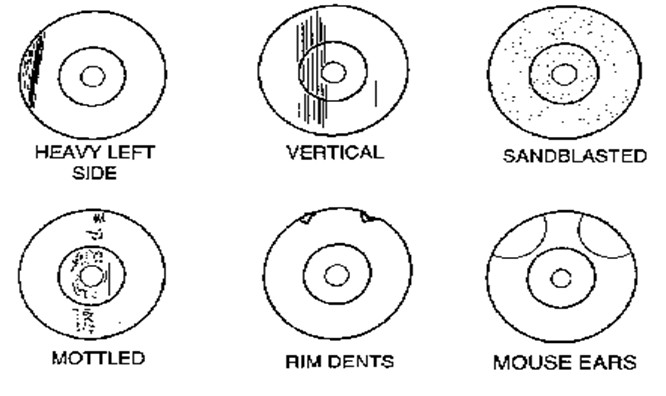
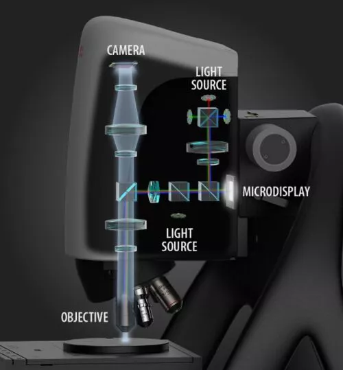
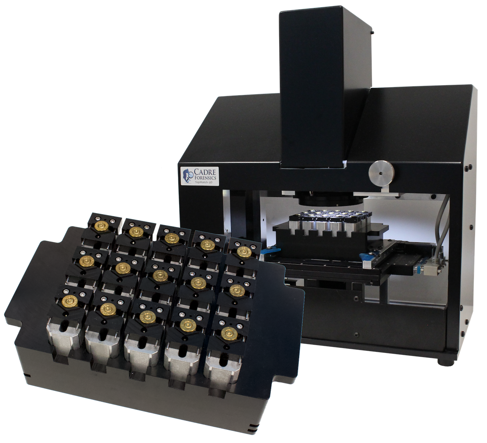
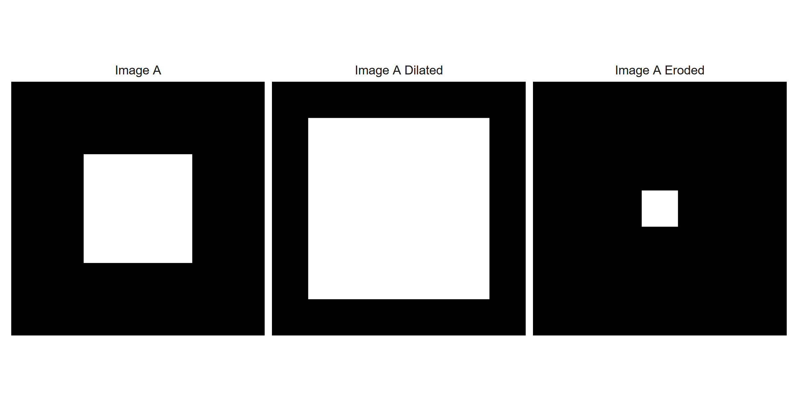
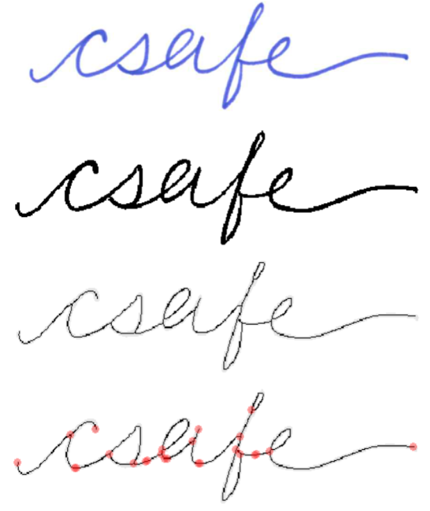

```{r setup, include=FALSE}
options(
  dplyr.print_min = 6, dplyr.print_max = 6, width = 70,
  digits = 3, htmltools.dir.version = FALSE
)
knitr::opts_chunk$set(
  comment = "#>",
  echo = FALSE,
  collapse = TRUE,
  warning = FALSE,
  message = FALSE,
  cache = TRUE,
  fig.align = "center",
  fig.pos = "!htbp"
)
```

<!-- \hypertarget{literature-review}{% -->
<!-- \chapter{LITERATURE REVIEW}\label{literature-review}} -->
# LITERATURE REVIEW

<!-- \hypertarget{preliminaries-forensic-examinations}{% -->
<!-- \section{Preliminaries: Forensic Examinations}\label{preliminaries-forensic-examinations}} -->
## Preliminaries: Forensic Examinations

A bullet casing is found at the scene of a murder.
The bullet is recovered from the victim during autopsy.
A handwritten letter threatening the victim is found in their pocket.
The assailant's shoeprints are discovered fleeing the area.
Who left this evidence?
Investigators obtain the gun, shoes, and handwriting samples of a suspect.
This evidence, along with the crime scene evidence, is sent to a forensic laboratory for analysis.
Forensic examiners compare the evidence to establish whether they share a common source. 
The suspect is charged after the examiners conclude that there is sufficient agreement between the crime scene and suspect's evidence.

The procedure described above, in which evidence is compared to determine their origin, is called the *source identification* problem \citep{Ommen2018}.
Historically, forensic examiners have relied on tools (e.g., microscopes), case facts, and experience to develop an opinion on the similarity of two pieces of evidence.
More recently, algorithms to automatically compare evidence and provide an objective measure of similarity have been introduced.
These algorithms are used in a forensic examination to supplement and inform the examiner's conclusion.
We propose an automatic, objective solution to the source identification problem; specifically in the context of comparing fired *cartridge cases.*
Cartridge case comparison is a sub-discipline of Firearms and Toolmarks Identification, which is reviewed in the next section.

<!-- \hypertarget{firearms-and-toolmarks-identification}{% -->
<!-- \subsection{Firearms and Toolmarks Identification}\label{firearms-and-toolmarks-identification}} -->
### Firearms and Toolmarks Identification

Firearms and toolmarks (F \& T) identification involves studying markings or impressions left by a hard surface, such as the metal of a firearm or other tool (e.g., screwdriver), on a softer surface \citep{Thompson2017}.
For example, a barrel's rifling leaves toolmarks on a bullet as it travels out of the gun.

<!-- \hypertarget{the-firing-process}{% -->
<!-- \subsubsection{The Firing Process}\label{the-firing-process}} -->
#### The Firing Process

In this section, we describe the basic process of firing a handgun or rifle using a cartridge.
A *cartridge* consists of a metal casing containing primer, gunpowder, and a bullet.
Figure \@ref(fig:cartridgeDiagram) shows a cross-section of a cartridge featuring these components \citep{calibersExplained}.

<!-- \begin{figure}[!htbp] -->

<!-- {\centering \includegraphics[width=.5\textwidth]{images/bulletdiagram1}  -->

<!-- } -->

<!-- \caption{\label{fig:cartridgeDiagram} A cartridge containing primer, powder, and a bullet. The firing process is initiated by loading a cartridge into the barrel of a firearm.}\label{fig:unnamed-chunk-1} -->
<!-- \end{figure} -->

```{r,echo=FALSE,fig.cap="\\label{fig:cartridgeDiagram} A cartridge containing primer, powder, and a bullet. The firing process is initiated by loading a cartridge into the barrel of a firearm.",out.width=".5\\textwidth"}
knitr::include_graphics("images/bulletdiagram1.png")
```


The first step of the firing process is to load a cartridge into the area in the back of the barrel known as the *chamber*.
Figure \@ref(fig:pistolParts) shows an example of a cartridge loaded into the chamber of a pistol \citep{rattenbury}.
In this example, the hammer of the pistol is pulled back such that the firing pin is held back under spring tension.
Upon squeezing the trigger, the firing pin is released and travels forwards at a high velocity.
The firing pin strikes the primer of the cartridge case, causing it to explode.

<!-- \begin{figure}[!htbp] -->

<!-- {\centering \includegraphics[width=.5\textwidth]{images/Parts-pistol}  -->

<!-- } -->

<!-- \caption{\label{fig:pistolParts} Cross-section of a pistol with a chambered cartridge and drawn-back hammer. Pulling the trigger releases the firing pin which strikes the cartridge case primer.}\label{fig:unnamed-chunk-2} -->
<!-- \end{figure} -->

```{r,echo=FALSE,fig.cap="\\label{fig:pistolParts} Cross-section of a pistol with a chambered cartridge and drawn-back hammer. Pulling the trigger releases the firing pin which strikes the cartridge case primer.",out.width=".5\\textwidth"}
knitr::include_graphics("images/Parts-pistol.png")
```

As shown in Figure \@ref(fig:firingCartridge), the explosion of the primer ignites the powder in the cartridge \citep{hampton}.
Gas rapidly expands in the cartridge causing the bullet to travel down the barrel.
At the same time, the rest of the cartridge is sent towards the back of the barrel.

<!-- \begin{figure}[!htbp] -->

<!-- {\centering \includegraphics[width=.5\textwidth]{images/firingCartridgeDiagram}  -->

<!-- } -->

<!-- \caption{\label{fig:firingCartridge} A cartridge after a firing pin has struck the primer. The explosion of the primer ignites the powder within the cartridge, causing gas to rapidly expand and force the bullet down the barrel.}\label{fig:unnamed-chunk-3} -->
<!-- \end{figure} -->

```{r,echo=FALSE,fig.cap="\\label{fig:firingCartridge} A cartridge after a firing pin has struck the primer. The explosion of the primer ignites the powder within the cartridge, causing gas to rapidly expand and force the bullet down the barrel.",out.width=".5\\textwidth"}
knitr::include_graphics("images/firingCartridgeDiagram.jpg")
```

As the bullet leaves the barrel, the cartridge case strikes the back wall of the barrel, known as the *breech face*, with considerable force.
Any markings on the breech face are imprinted onto the cartridge case, creating the so-called *breech face impressions*.
These impressions are analogous to a barrel's "fingerprint" left on the cartridge case.
Figure \@ref(fig:impressionDiagram) shows cartoon examples of breech face markings that appear on cartridge cases \citep{hampton}.

<!-- \begin{figure}[!htbp] -->

<!-- {\centering \includegraphics[width=.6\textwidth]{images/breechFaceImpressionDiagram}  -->

<!-- } -->

<!-- \caption{\label{fig:impressionDiagram} Examples of common breech face impression patterns. These are considered analogous to a breech face fingerprint left on the cartridge surface.}\label{fig:unnamed-chunk-4} -->
<!-- \end{figure} -->

```{r,echo=FALSE,fig.cap="\\label{fig:impressionDiagram} Examples of common breech face impression patterns. These are considered analogous to a breech face fingerprint left on the cartridge surface.",out.width=".6\\textwidth"}

```

Figure \@ref(fig:realCartridgeCase) shows the base of a fired cartridge \citep{hampton}.
The hole to the south-east of the center of the primer is the impression left by the firing pin.
Note the horizontal striated breech face markings on the primer to the left of the firing pin impression.

<!-- \begin{figure}[!htbp] -->

<!-- {\centering \includegraphics[width=.7\textwidth]{images/realCartridgeCaseImage}  -->

<!-- } -->

<!-- \caption{\label{fig:realCartridgeCase} A fired 9mm Luger cartridge case with visible firing pin and breech face impressions.}\label{fig:unnamed-chunk-5} -->
<!-- \end{figure} -->

```{r,echo=FALSE,fig.cap="\\label{fig:realCartridgeCase} A fired 9mm Luger cartridge case with visible firing pin and breech face impressions.",out.width=".7\\textwidth"}
knitr::include_graphics("images/realCartridgeCaseImage.jpg")
```

After the bullet has left the barrel, the extractor pin and ejector push the cartridge case out of the chamber.
As shown in Figure \@ref(fig:extractorMarkings), these can leave additional markings on the cartridge \citep{hampton}.
Firing pin, breech face, extractor pin and ejector, and other possible markings are all used in a forensic examination to determine whether two cartridge cases were fired from the same firearm.
This work focuses on the comparison of breech face impressions specifically.

<!-- \begin{figure}[!htbp] -->

<!-- {\centering \includegraphics[width=.6\textwidth]{images/extractorPinDiagram}  -->

<!-- } -->

<!-- \caption{\label{fig:extractorMarkings} Examples of common extractor pin and ejector markings. These, impressions on the cartridge, are used in a forensic examination to determine the source of the fired cartridge.}\label{fig:unnamed-chunk-6} -->
<!-- \end{figure} -->

```{r,echo=FALSE,fig.cap="\\label{fig:extractorMarkings} Examples of common extractor pin and ejector markings. These, impressions on the cartridge, are used in a forensic examination to determine the source of the fired cartridge.",out.width=".6\\textwidth"}
knitr::include_graphics("images/extractorPinDiagram.png")
```

<!-- \hypertarget{an-overview-of-firearms-and-toolmarks-examinations}{% -->
<!-- \subsubsection{An Overview of Firearms and Toolmarks Examinations}\label{an-overview-of-firearms-and-toolmarks-examinations}} -->

#### An Overview of Firearms and Toolmarks Examinations

Trained F \& T examiners use a *comparison microscope*, such as the one shown in Figure \@ref(fig:comparisonMicroscope), to examine two pieces of evidence \citep{Zheng2014}.
A comparison microscope consists of two compound microscopes that are joined via an *optical bridge* which allows for viewing of the stages below each microscope simultaneously under the same eyepiece.
The right image of Figure \@ref(fig:comparisonMicroscope) shows an example of the view under a comparison microscope of two bullets with the white dotted line separating the two fields of view.

<!-- \begin{figure}[!htbp] -->

<!-- {\centering \includegraphics[width=.6\textwidth]{images/comparisonMicroscope}  -->

<!-- } -->

<!-- \caption{\label{fig:comparisonMicroscope} A comparison microscope consists of two stages upon which evidence is placed. These stages are placed under two compound microscopes that are joined together via an optical bridge and allow for viewing of both stages simultaneously under a single eyepiece. The image on the right shows an example of a bullet viewed under a comparison microscope.}\label{fig:unnamed-chunk-7} -->
<!-- \end{figure} -->

```{r,echo=FALSE,fig.cap="\\label{fig:comparisonMicroscope} A comparison microscope consists of two stages upon which evidence is placed. These stages are placed under two compound microscopes that are joined together via an optical bridge and allow for viewing of both stages simultaneously under a single eyepiece. The image on the right shows an example of a bullet viewed under a comparison microscope.",out.width=".6\\textwidth"}

```

Firearm examiners distinguish between three broad categories when characterizing a fired bullet or cartridge case: class, subclass, and individual characteristics.
*Class characteristics* are associated with the manufacturer of the firearm that fired the bullet or cartridge case.
These include, but are not limited to, the size of ammunition chambered by the firearm, the orientation of the extractor and ejector, or the width and twist direction of the barrel rifling.
Class characteristics are often the first to be examined because they can narrow the relevant population of potential firearm sources \citep{Thompson2017}.
For example, a 9mm cartridge case must have been fired by a firearm that can chamber 9mm ammunition.

If the discernible class characteristics match between two pieces of evidence, for example a cartridge case found at a crime scene and a different cartridge case fired by a suspect's gun, then the examiner uses a comparison microscope to compare the *individual characteristics* of the evidence.
Individual characteristics are markings attributed to imperfections on the firearm surface due to the manufacturing process, use, and wear of the tool.
For example, markings on the breech face of a barrel may form after repeated fires of the firearm.
Individual characteristics are assumed to occur randomly across different firearms.
In an examination, the examiner independently rotates and translates the stages of a comparison microscope to find the optimal matching position of the markings on the two pieces of evidence \citep{Zheng2014}.
If the individual characteristics on two pieces of evidence are determined to agree "sufficiently," then the examiner can conclude that they originated from the same firearm \citep{AFTE1992}.

*Subclass characteristics* exist between the macro-level class and micro-level individual characteristics.
These characteristics relate to markings that are reproduced across a subgroup of firearms.
For example, breech faces using the same milling machine may include markings that are unique to the milling machine \citep{firearmManufacturing}.
As it can be difficult to distinguish between individual and subclass characteristics during an examination, an examiner's decision process may be affected if the existence of subclass characteristics is suspected.

Many F \& T examiners in the United States adhere to the Association of Firearms and Toolmarks Examiners (AFTE) Range of Conclusions when making their evidentiary conclusions \citep{AFTE1992}.
According to these guidelines, six possible conclusions can be made in a F \& T examination:

1. **Identification**: Agreement of a combination of individual characteristics and all discernible class characteristics where the extent of agreement exceeds that which can occur in the comparison of toolmarks made by different tools and is consistent with the agreement demonstrated by toolmarks known to have been produced by the same tool.

2. **Inconclusive**:

2.1 Some agreement of individual characteristics and all discernible class characteristics, but insufficient for an identification.

2.2 Agreement of all discernible class characteristics without agreement or disagreement of individual characteristics due to an absence, insufficiency, or lack of reproducibility.

2.3 Agreement of all discernible class characteristics and disagreement of individual characteristics, but insufficient for an elimination.

3. **Elimination**: Significant disagreement of discernible class characteristics and/or individual characteristics.

4. **Unsuitable**: Unsuitable for examination.

Forensic examinations first involve an examination of a "questioned" bullet or cartridge case for identifiable toolmarks \citep{Thompson2017}.
Markings including breech face, firing pin, chamber marks, extractor pin, and ejector impressions are categorized by their class, individual, or subclass characteristics.
If available, this information is compared to "known source" fires obtained from a suspect's firearm.
If known source evidence is unavailable, class characteristics from the questioned bullet can be used to narrow the relevant population and provide potential leads.
An examiner's decision may be used as part of an ongoing investigation or presented at trial as expert testimony.

Standard operating procedures for assessing and comparing evidence differ between forensic laboratories.
For example, some labs collapse the three possible inconclusive decisions into a single decision \citep{Neuman2022} or prohibit examiners from making an elimination based on differences in individual characteristics \citep{Duez2017}.

<!-- \hypertarget{why-should-firearm-and-toolmark-identification-change}{% -->
<!-- \subsection{Why Should Firearms and Toolmarks Identification Change?}\label{why-should-firearm-and-toolmark-identification-change}} -->
### Why Should Firearms and Toolmarks Identification Change?

In 2009, the National Research Council released a report assessing a number of forensic disciplines including Firearms and Toolmarks analysis.
The report pointed out that F \& T analysis lacked a precisely defined process and that little research had been done to determine the reliability or repeatability of the methods.
Two of the recommendations from this study were to establish rigorously-validated laboratory procedures and "develop automated techniques capable of enhancing forensic technologies \citep{council_strengthening_2009}."

A number of studies assess the reliability and repeatability of a firearms and toolmarks examination (non-exhaustively: \citet{DeFrance2003,Hamby2009,fadulempirical2011,Stroman2014,Baldwin2014,Smith2016,MATTIJSSEN2020}).
These studies indicate that examiners have a low error rate when comparing evidence obtained under controlled conditions (i.e., for which ground-truth is known).
However, as pointed out in a 2016 report from the President's Council of Advisors on Science and Technology, many of these studies, save \citet{Baldwin2014}, were not "appropriately designed to test the foundational validity and estimate reliability \citep{pcast2016}."
The report asserts that additional, properly-designed studies should be performed to more rigorously establish the scientific validity of the discipline.

Due to the opacity in the decision-making process, examiners are referred to as "black boxes" in a similar sense to black-box algorithms \citep{HumanFactorsCommittee2020}.
Their evidentiary conclusions are fundamentally subjective, and empirical evidence suggests that conclusions differ when examiners are presented with the same evidence on different occasions \citep{Ulery2011,Ulery2012}.
Examiners rarely need to provide quantitative justification for their conclusion.
Even for qualitative justifications, it can be difficult to determine what the examiner is actually "looking at" to arrive at their conclusion \citep{Ulery2014}.
This suggests the need to supplement these black box decisions with transparent, objective techniques that quantitatively measure the similarity between pieces of evidence.
As stated in \citet{pcast2016}, efforts should be made to "convert firearms analysis from a subjective method to an objective method" including "developing and testing image-analysis algorithms for comparing the similarity of tool marks."
This work focuses on the development of an algorithm for comparing breech face impressions on cartridge cases.

<!-- \hypertarget{forensic-comparison-pipelines}{% -->
<!-- \section{Forensic Comparison Pipelines}\label{forensic-comparison-pipelines}} -->
## Forensic Comparison Pipelines

Recent work in many forensic disciplines has focused on the development of algorithms to measure the similarity between pieces of evidence including glass \citep{Curran2000-hp,Park2019,openForSciR}, handwriting \citep{crawford_handwriting_2020}, shoe prints \citep{park_algorithm_2020}, ballistics \citep{hare_automatic_2016,tai_fully_2018}, and toolmarks \citep{Hadler2017,Krishnan2018}.
These algorithms often result in a numerical, non-binary (dis)similarity score for two pieces of evidence.
A non-binary score adds more nuance to an evidentiary conclusion beyond simply stating whether the evidence originated from the same source as would be the case in binary classification.
For example, the larger the similarity score, the "more similar" the evidence.
However, a binary (or ternary, if admitting inconclusives) conclusion must ultimately be reached by an examiner.
Whether a decision should be reached based solely on results of a comparison algorithm (e.g., defining a score-based decision boundary) or if an examiner should incorporate the similarity score into their own decision-making process is still up for debate \citep{Swofford2021}.
We view forensic comparison algorithms as a supplement to, rather than a replacement of, the forensic examination.

Forensic comparison algorithms are treated as evidence-to-classification "pipelines."
Broadly, the steps of the pipeline include:

1. capturing a digital representation of the evidence,

2. preprocessing this representation to isolate or emphasize a region of interest of the evidence,

3. comparing regions of interest from two different pieces of evidence to obtain a (perhaps high-dimensional) set of similarity features,

4. combining these features into a low-dimensional set of similarity scores, and

5. defining a classification rule based on these similarity features.

This is similar to the structure discussed in \citet{Rice2020}.
We add to this structure the emphasis that each step of the pipeline can be further broken-down into modularized pieces.
For example, the preprocessing step may include multiple sub-procedures to isolate a region of interest of the evidence.
Figure \@ref(fig:pipelineDiagram) shows three possible variations of the cartridge case comparison pipeline as well as the parameters requiring manual specification and alternative modules.
The benefits of this modularization include easing the process of experimenting with different parameters/sub-procedures and improving the comprehensibility of the pipeline.

[Update the pipeline diagram]

<!-- \begin{figure}[!htbp] -->

<!-- {\centering \includegraphics[width=\textwidth]{images/pipelineDiagram_9-9-21}  -->

<!-- } -->

<!-- \caption{\label{fig:pipelineDiagram} Variations upon the cartridge case comparison pipeline. The first three columns detail the pipeline with different sub-procedures. The fourth columns shows the parameters that require manual specification at each step. The fifth column shows  alternative processing steps that could replace steps in the existing pipeline.}\label{fig:unnamed-chunk-8} -->
<!-- \end{figure} -->

```{r,echo=FALSE,echo=FALSE,fig.cap="\\label{fig:pipelineDiagram} Variations upon the cartridge case comparison pipeline. The first three columns detail the pipeline with different sub-procedures. The fourth columns shows the parameters that require manual specification at each step. The fifth column shows  alternative processing steps that could replace steps in the existing pipeline.",out.width="\\textwidth"}
knitr::include_graphics("images/pipelineDiagram_9-9-21.jpg")
```

In the following sections, we detail recent advances to each of the five steps in the pipeline outlined above.
We narrow our focus to advances made in comparing firearms evidence.

<!-- \hypertarget{digital-representations-of-evidence}{% -->
<!-- \subsection{Digital Representations of Evidence}\label{digital-representations-of-evidence}} -->
### Digital Representations of Evidence

Digital representations of cartridge case evidence commonly come in one of two modes: 2D optical images or 3D topographic scans.
A common way to take 2D optical images is to take a picture of the cartridge case under a microscope.
This implies that the digital representation of the cartridge case surface is dependent on the lighting conditions under which the picture was taken.
Some recent work has focused on comparing 2D optical images \citep{tai_fully_2018,tong_fired_2014}, although the use of 3D microscopes has become more prevalent to capture the surface of ballistics evidence.

Using a 3D microscope, scans are taken at the micron (or micrometer) level that are more light-agnostic than a 2D image \citep{weller_2012}.
One common 3D scanning procedure is disc scanning confocal microscopy.
This procedure works by shining a focused beam of light on the cartridge case surface.
This light is reflected back onto a pinhole allowing a limited height range to pass through.
The microscope scans through different height range "slices" and compiles all these slices into a single 3D topography of the cartridge case primer surface.
The Microdisplay Scan Confocal Microscope from Sensofar\texttrademark~Metrology is shown in Figure \@ref(fig:sensofarScanner) \citep{bermudez2017confocal}.

<!-- \begin{figure}[!htbp] -->

<!-- {\centering \includegraphics[width=.5\textwidth]{images/sensofarScanner}  -->

<!-- } -->

<!-- \caption{\label{fig:sensofarScanner} The Microdisplay Scan Confocal Microscope from Sensofar\texttrademark\ Metrology. The cartridge case surface is captured by scanning through a range of vertical slices and compiling these slices into a single 3D topography.}\label{fig:unnamed-chunk-9} -->
<!-- \end{figure} -->

```{r,echo=FALSE,fig.cap="\\label{fig:sensofarScanner} The Microdisplay Scan Confocal Microscope from Sensofar\\texttrademark\\ Metrology. The cartridge case surface is captured by scanning through a range of vertical slices and compiling these slices into a single 3D topography.",out.width=".5\\textwidth"}

```

Figure \@ref(fig:cartridgeCaseImages) shows a 2D image and 3D topography of the same cartridge case primer from \citet{fadulempirical2011}.

<!-- \begin{figure}[!htbp] -->

<!-- {\centering \includegraphics[width=\textwidth]{images/fadul1-1_sidebyside}  -->

<!-- } -->

<!-- \caption{\label{fig:cartridgeCaseImages} A cartridge case captured using 2D confocal reflectance microscopy (left) and 3D disc scanning confocal microscopy (right).}\label{fig:unnamed-chunk-10} -->
<!-- \end{figure} -->

```{r,echo=FALSE,fig.cap="\\label{fig:cartridgeCaseImages} A cartridge case captured using 2D confocal reflectance microscopy (left) and 3D disc scanning confocal microscopy (right).",out.width="\\textwidth"}
knitr::include_graphics("images/fadul1-1_sidebyside.PNG")
```

More recently, Cadre Forensics\texttrademark~introduced the TopMatch-3D High-Capacity Scanner \citep{topmatch}.
A tray of 15 fired cartridge cases and the scanner are shown in Figure \@ref(fig:topMatchScanner) \citep{topmatchFlyer}.
This scanner collects images under various lighting conditions of a gel pad into which the cartridge case surface is impressed and combines these images into a regular 2D array called a *surface matrix*.
The physical dimensions of these objects are about 5.5 $mm^2$ captured at a resolution of 1.84 microns per pixel (1000 microns equals 1 mm).

<!-- \begin{figure}[!htbp] -->

<!-- {\centering \includegraphics[width=.7\textwidth]{images/TopMatchSystem7}  -->

<!-- } -->

<!-- \caption{\label{fig:topMatchScanner} The TopMatch-3D High-Capacity Scanner from Cadre Forensics\texttrademark\ . The scanner captures topographic scans of a gel pad into which a cartridge case surface is impressed.}\label{fig:unnamed-chunk-11} -->
<!-- \end{figure} -->

```{r,echo=FALSE,fig.cap="\\label{fig:topMatchScanner} The TopMatch-3D High-Capacity Scanner from Cadre Forensics\\texttrademark\\ . The scanner captures topographic scans of a gel pad into which a cartridge case surface is impressed.",out.width=".7\\textwidth"}

```

When applied to ballistics evidence, these 3D scans are commonly stored in the ISO standard x3p file format \citep{ISO25178-72}.
x3p is a container consisting of a single surface matrix representing the height value of the surface and metadata concerning the parameters under which the scan was taken as shown in Figure \@ref(fig:x3pFlowchart) \citep{Zheng2020}.
It has been empirically demonstrated that comparing 3D topographic scans of cartridge case evidence leads to more accurate conclusions compared to comparing 2D optical images of the same evidence \citep{Tai2019,tong_fired_2014,song_3d_2014}.

<!-- \begin{figure}[!htbp] -->

<!-- {\centering \includegraphics[width=.7\textwidth]{images/x3pFlowchart}  -->

<!-- } -->

<!-- \caption{\label{fig:x3pFlowchart} The hierarchy of information stored in the x3p file format for both bullet and cartridge case evidence.}\label{fig:unnamed-chunk-12} -->
<!-- \end{figure} -->

```{r,echo=FALSE,fig.cap="\\label{fig:x3pFlowchart} The hierarchy of information stored in the x3p file format for both bullet and cartridge case evidence.",out.width=".7\\textwidth"}
knitr::include_graphics("images/x3pFlowchart.jpg")
```

<!-- \hypertarget{preprocessing-procedures-for-forensic-data}{% -->
<!-- \subsection{Preprocessing Procedures for Forensic Data}\label{preprocessing-procedures-for-forensic-data}} -->
### Preprocessing Procedures for Forensic Data

When capturing the surface of a cartridge case, the result is bound to contain extraneous regions due to the incongruity between the circular primer and the rectangular array in which the surface data are stored.
Figure \@ref(fig:cartridgeCaseImages) shows an example of a 2D image and 3D scan of the same cartridge case.
The corners of these arrays include non-primer regions of the cartridge case surface.
Additionally, the center of the cartridge case primer features an impression left by the firing pin during the firing process.
In most applications, impressions left by the firing pin are compared separately from the breech face impressions \citep{Zhang2016}.
Because we are interested in the comparison of breech face impressions between two cartridge cases, only the annular region surrounding the firing pin impression is of interest.
The annular breech face impression region must be segmented away from the rest of the captured surface.

Both the 2D optical and 3D topographic representations of cartridge case surfaces are fundamentally pictorial in nature.
As such, many image processing and computer vision techniques are used to automatically isolate the breech face impression region.
\citet{tai_fully_2018} uses a combination of histogram equalization, Canny edge detection, and morphological operations to isolate the breech face impressions in 2D images.
Various types of Gaussian filters are commonly employed to remove unwanted structure.
\citet{tong_fired_2014} uses a low-pass Gaussian filter that removes noise via a Gaussian-weighted moving average operation.
\citet{chu_validation_2013,song_estimating_2018} use a bandpass Gaussian filter, which simultaneously performs the function of a low-pass filter along with a high-pass filter to remove global structure from the scan.
Other versions of the bandpass filter are used in \citet{song_3d_2014,chen_convergence_2017,ott_applying_2017} that accomplish tasks such as omitting outlier surface values or addressing boundary effects \citep{ISO16610-71,brinkman_bodschwinna_2003}.

Instead of using automatic procedures, others have used subjective human intervention to isolate the breech face impressions.
For example, \citep{song_estimating_2018} indicate that cartridge cases are "manually trimming to extract the breech face impression of interest."
In \citet{Roth2015}, examiners manually identify the borders of the breech face impression region by placing points around an image of the cartridge case primer.

<!-- \hypertarget{forensic-data-feature-extraction}{% -->
<!-- \subsection{Forensic Data Feature Extraction}\label{forensic-data-feature-extraction}} -->
### Forensic Data Feature Extraction

After applying the preprocessing procedures to two cartridge case scans, their breech face impressions are compared and similarity features are extracted.
Given that the cartridge cases at this point are represented as high-dimensional matrices, this can be thought of as a dimensionality reduction of the high-dimensional surface arrays to a set of similarity statistics.

A variety of features have been proposed to quantify the similarity between two cartridge case surface arrays.
\citet{tai_fully_2018} propose calculating the cross-correlation function (CCF) value between two cartridge cases across a grid of rotations.
It is assumed that the CCF will to be larger around the "true" rotation for matching cartridge case pairs than for non-matching pairs.
\citet{Riva2014} proposed combining the CCF between the two aligned scans with the element-wise median Euclidean distance and median difference between the normal vectors at each point of the surface.
Later, \citet{Riva2016,Riva2020} applied Principal Component Analysis to reduce these three features down to two principal components onto which a 2D Kernel Density Estimator could be fit.

Pertinent to this work is the cell-based comparison procedure originally outlined in \citet{song_proposed_2013}.
The underlying assumption of \citet{song_proposed_2013} is similar to that of \citet{tai_fully_2018}: that two matching cartridge cases will exhibit higher similarity when they are "close" to being correctly aligned.
While \citet{tai_fully_2018} measured similarity using the CCF between the two full scans, \citet{song_proposed_2013} proposes partitioning the scans into a grid of "correlation cells" and counting the number of similar cells between the two scans.
The rationale behind this procedure is that many cartridge case scans have only a few regions with discriminatory markings.
As such, comparing full scans may result in a lower correlation than if one were to focus on the highly-discriminatory regions.
In theory, dividing the scans into cells allows for the identification of these regions.

After breaking a scan into a grid of cells, each cell is compared to the other scan to identify the rotation and translation, known together as the *registration*, at which the cross-correlation is maximized.
\citet{song_proposed_2013} assume that the cells from a truly matching pair of cartridge cases will "agree" on their registration in the other scan.
Details of this procedure are provided in Chapter 2.

<!-- \hypertarget{similarity-scores-for-forensic-data}{% -->
<!-- \subsection{Similarity Scores for Forensic Data}\label{similarity-scores-for-forensic-data}} -->
### Similarity Scores for Forensic Data

Following feature extraction, the dimensionality of these features is further reduced to a low-dimensional, usually univariate, similarity score.

After calculating the CCF across various possible registrations, \citet{tai_fully_2018} propose using the maximum observed CCF value as the univariate similarity score.
In this case, a binary classification can be achieved by setting a CCF threshold above which pairs are classified as "matches" and below which as "non-matches."
\citet{Tai2019} proposes setting a CCF cut-off that maximizes the precision and recall in a training set of pairwise comparisons.

\citet{Riva2016,Riva2020} use a training set to fit two 2D kernel density estimates to a set of features from matching and non-matching comparisons.
Using these estimates, they are able to estimate the score-based likelihood ratio (SLR) for a new set of features.
This SLR can be viewed as a similarity score \citep{Garton2021}.

In the case of the cell-based comparison procedure discussed above, the total number of cells that are deemed "congruent matching" is used as a similarity score.
The criteria used to define "congruent matching" has changed across papers \citep{song_3d_2014,tong_fired_2014,tong_improved_2015,chen_convergence_2017} and will be discussed in greater detail in [Chapter].
The authors of these papers have consistently used a decision boundary of six "Congruent Matching Cells" to distinguish matches from non-matches.

\citet{Zhang2020} applies the Density-Based Spatial Clustering of Applications with Noise (DBSCAN) algorithm \citep{Ester1996} to the features from the cell-based comparison procedure to determine if any clusters form amongst the per-cell estimated registration values.
This is based on the assumption that any cells that come to a consensus on their registration should form a cluster in translation $(x,y)$ and rotation $\theta$ space.
\citet{Zhang2020} proposes a binary classifier based on whether any clusters are identified by the DBSCAN algorithm \citep{Ester1996}.
If a cluster is found for a particular pairwise comparison, then that pair is classified as a "match" and otherwise as a "non-match."

<!-- \hypertarget{reproducibility-of-comparison-pipelines}{% -->
<!-- \subsection{Reproducibility of Comparison Pipelines}\label{reproducibility-of-comparison-pipelines}} -->
### Reproducibility of Comparison Pipelines

\citet{nasem_2019} defines reproducibility as "obtaining consistent computational results using the same input data, computational steps, methods, code, and conditions of analysis."
While not exact in their definition of "consistent," the authors assert that, barring a few exceptions, it is reasonable to expect that the results obtained by a second researcher, after applying the exact same processing steps to the exact same data, be the exact same as the original results.
Among the exceptions given is if the original researcher had made a mistake in writing the original source code.
In either case, they assert that "a study's data and code have to be available in order for others to reproduce and confirm results."
Researchers can easily verify the results given data and code and incorporate the materials into their own research and thus improve or accelerate discovery \citep{Stodden2018b}.

A number of studies indicate that computationally reproducible research is sparse across various disciplines.
\citet{Stodden2018a} and \citet{Stodden2018b} studied the reproducibility of articles sampled from the journals *Science* and the *Journal of Computational Physics*, respectively.
In the former, \citet{Stodden2018a} found that only 3 of 204 randomly selected articles from *Science* were "straightforward to reproduce with minimal effort;" despite a journal policy requiring that all code and data used in the paper be made available to any reader.
In the latter, \citet{Stodden2018b} found that zero of 306 randomly selected articles from the *Journal of Computaional Physics* were "straightforward to reproduce with minimal effort" and, at best, that five articles were "reproducible after some tweaking."
Similar findings were found in \citet{CChang2022} (29 of 59 economic papers reproducible), \citet{Iqbal2016} (zero of 268 biomedical papers provided raw data and 1 in 268 linked to a full study protocol), \citet{Duvendack2015} (50\% or more published articles include data or code in only 27 of 333 economics journals), and \citet{Gundersen2018} (24 of 400 AI conference papers included code).
A common recommendation amongst these authors is the establishment of rigorous tools and standards to promote reproducibility.
This includes making code and data used in a paper easily-accessible to readers.

Infrastructure already exists to ease the processing of developing, maintaining, and sharing open-source code and data.
Data repositories such as the NIST Ballistics Toolmark Research Database \citep{Zheng2020} provide open access to raw data.
\citet{Grning2018} discuss the use of package managers such as Conda \citep{anaconda}, container software such as Docker ([https://www.docker.com/](https://www.docker.com/)), and virtual machine software to preserve the entire data analysis environment in-perpetuity.
For situations in which VMs or containers aren't available, software such as the `manager` R package allows users to "compare package inventories across machines, users, and time to identify changes in functions and objects \citep{Rice2020}."
\citet{Piccolo2016} reference repositories like Bioconductor \citep{Huber2015} that make it easy to document and distribute code.
Further, software such as the `knitr` R package \citep{Xie2014} enable "literate programming" in which prose and executed code can be interwoven to make it easier to understand the code's function.
These tools make data, code, and derivative research findings more accessible, in terms of both acquisition and comprehensibility, to consumers and fellow researchers. 

<!-- \hypertarget{diagnostic-tools}{% -->
<!-- \section{Diagnostic Tools}\label{diagnostic-tools}} -->
## Diagnostic Tools

Forensic examiners often provide expert testimony in court cases.
As part of this testimony, an examiner is allowed to provide facts about the outcome of a forensic examination and their opinion about what the results mean.
A party to a court may challenge the examiner on the validity of the underlying scientific method or whether they interpreted the results correctly \citep{aafsArticle}.
In these situations, examiners need to explain the process by which they reached an evidentiary conclusion to the fact finders of the case; namely, the judge or jury.
As algorithms are more often used in forensic examinations, the technical knowledge required to understand and explain an algorithm to lay-people has increased.
While in some cases the authors of the algorithm have been willing to provide testimony to establish the validity of the algorithm \citep{trueAlleleTestimony}, this will become less viable as algorithms become more prevalent.
Indeed, even the most elegant improvements to an algorithm may be moot if an examiner can't explain the improvements in their testimony.

The resources required to educate examiners on the use of highly technical algorithms makes additional training seem currently implausible.
An alternative is to develop algorithms from the ground-up to be intuitive for examiners to understand and explain to others.
*Explainability* refers to the ability to identify the factors that contributed to the results of an algorithm \citep{Belle2021PrinciplesAP}.
For example, understanding "why" a classifier predicted one class over another.
Diagnostic tools improve the explainability of a model.

Myriad diagnostic tools exist to explain the results of an algorithm.
These range from identifying instances of the training set that illuminate how the model operates \citep{Deng2018} to fitting more transparent models that approximate the complex model accurately \citep{Puiutta2020} to explaining the behavior of the algorithm in a small region of interest \citep{LIME,Goode2021}.
Many of these methods require additional technical knowledge to interpret these explanations.

### Visual Diagnostics

A less technical approach is to use visualizations that facilitate understanding of model behavior.
Properly constructed visuals enable both exploratory data analysis and diagnostics \citep{Buja2009}, which are critical steps in the data analysis process for anticipating and assessing model fit.
Given that many of the procedures by which cartridge case evidence is captured, processed, and compared are based on image processing techniques, a visual diagnostic is an intuitive mode of explanation for researchers and lay-people alike.
As stated in \citet{cleveland1994elements}, "graphical methods tend to show data sets as a whole, allowing us to summarize the behavior and to study detail. This leads to much more thorough data analyses."

Numerical statistics summarize the behavior of data, but miss the detail referenced in Cleveland's quote \citep{telea2014data}.
To illustrate this, consider the famous data sets from \citep{Anscombe1973} known as Anscombe's quartet.
The two variables in each data set are plotted against one another in Figure \@ref(fig:anscombeQuartet).
There are clear differences in the relationship between `x` and `y` across these four data sets.

```{r, fig.cap="\\label{fig:anscombeQuartet} A visualization of Anscombe's quartet. Despite there being obvious differences between these four data sets, their summary statistics are nearly identical",fig.height = 3,fig.width=5}
library(magrittr)
library(dplyr)
anscombeLong <- data.frame(
    group  = rep(1:4, each = 11),
    x = unlist(datasets::anscombe[,c(1:4)]),
    y = unlist(datasets::anscombe[,c(5:8)])
    )
rownames(anscombeLong) <- NULL

anscombeLong %>%
  ggplot(aes(x=x,y=y)) +
  geom_point() +
  facet_wrap(~ group,nrow = 2,labeller = labeller(group = c("1" = "Data Set 1","2" = "Data Set 2","3" = "Data Set 3","4" = "Data Set 4"))) +
  theme_bw() +
  labs(title = "Anscombe's Quartet")
```

Despite these differences, Table \@ref(tab:anscombeStats) demonstrates that summary statistics, namely the first two moments, are identical.
This demonstrates that relying on summary statistics (at least low-order moments) can lead to incorrect assumptions about a data set's behavior.

\begin{table}[!htbp]
\centering
\begin{tabular}{| r | r | r | r | r |}
\hline
Data Set & $\bar{x}$ & S.D. $x$ & $\bar{y}$ & S.D. $y$ \\
\hline
1 & 9 & 3.32 & 7.5 & 2.03 \\
\hline
3 & 9 & 3.32 & 7.5 & 2.03 \\
\hline
3 & 9 & 3.32 & 7.5 & 2.03 \\
\hline
4 & 9 & 3.32 & 7.5 & 2.03 \\
\hline
\end{tabular}
\caption{Moments of the two variables in Anscombe's quartet.}
\label{tab:anscombeStats}
\end{table}

Given the pivotal role that visual diagnostics play in the data analysis pipeline, we now consider best practices in creating data visualizations.
Human brains are wired for seeing patterns and differences, and for understanding spatial relationships from this \citep{telea2014data}.
As such, an effective visual diagnostic, or data visualization in general, is one that conveys patterns quickly and easily, and with minimal scope for understanding.
Arising originally from a pyschological theory of perception, the Gestalt Laws of Perceptual Organization \citep{Goldstein2016-un} are relevant to the construction of statistical graphics.
The Gestalt laws are as follows:

- **Pragnanz - the law of simplicity:** Every stimulus pattern is seen in such a away that the resulting structure is as simple as possible.

- **Proximity:** Things that are near each other appear to be grouped together.

- **Good Continuation:** Points that, when connected, result in straight or smoothly curving lines are seen as belonging together, and the lines tend to be seen in such a way as to follow the smoothest path.

- **Similarity:** Similar things appear to be grouped together.

- **Common Region:** Elements that are within the same region of space appear to be grouped together.

- **Uniform Connectedness:** A connected region of visual properties, such as the lightness, color, texture, or motion, is perceived as a single unit.

- **Synchrony:** Visual events that occur at the same time are perceived as belonging together.

- **Common Fate:** Things that are moving in the same direction appear to be grouped together.

- **Familiarity:** Things that form patterns that are familiar or meaningful are likely to become grouped together.

These laws provide guidance on how to construct a visual that concisely conveys a pattern or difference in data.
For data visualization, additional laws include \citep{Midway2020}:

- **Use and Effective Geometry:** Choose a geometry (shape and features of a statistical graphic) that is appropriate to the data.

- **Colors Always Mean Something:** Colors in visuals can convey groupings or a range of values.

As an example of these principles in-action is shown in Figure \@ref(fig:chickweightExample).
The plot shows the weight over time of chicks fed one of two experimental diets (from the `ChickWeight` base R data set) \citep{crowder1990analysis}.
Individual points represent the weight of a single chick on a particular day.
Each set of collected points represents the weight for a single chick over time.
This is an example of using an effective geometry (point & line graph to represent time series) along with the Gestalt law of Good Continuation.
We further apply the Gestalt law of Common Region by faceting the plot by diet\footnote{Note that the encoding for Diet 1 and Diet 2 in the original data set was "1" and "3"}.
This implicitly communicates to the audience that the weights of two diet groups of chicks is expected to differ.
Indeed, appealing to the Gestalt law of Uniform Connectedness, the "motion" of the grouped time series suggests that chicks given Diet 2 tend to gain weight more rapidly than those given Diet 1.
This may suggest a particular modeling structure for these time series (e.g., diet fixed effect) or the need to assess the experimental design to ensure that the assumption that the chicks were randomly sampled from the same population is appropriate.
We see how such a plot can be used for both exploratory data analysis or as a post-hoc diagnostic tool.
Alternative to faceting, the time series from these two diet groups could be combined into a single plot and distinguished by color.

```{r,fig.cap="\\label{fig:chickweightExample} An example of using the ggplot2 package to construct a residual plot from a simple linear regression. The features of the statistical graphic are combined layer-by-layer using the + operator.",fig.height = 3,fig.width=5}
library(dplyr)

datasets::ChickWeight %>%
  as.data.frame() %>%
  filter(Diet %in% c(1,3)) %>%
  ggplot(aes(x = Time,y = weight,group = Chick
             )) +
  geom_point() +
  geom_line() +
  theme_bw() +
  ylim(c(0,NA)) +
  theme(legend.position = "bottom") +
  facet_wrap(~ Diet,labeller = labeller(Diet = c("1" = "Diet 1","3" = "Diet 2"))) +
  labs(y = "Weight (gm)",
       x = "Time (Days)",
       title = "Chick weights over time for two experimental diets")
```

The R programming language \citep{r} provides a variety of tools to create visual diagnostics.
Among the most robust of these tools is the ggplot2 package \citep{ggplot2}.
This package extends the "Grammar of Graphics" introduced in \citet{Wilkinson2005} that provides a user-friendly structure by which graphics can be created.
Features of a statistical graphic (e.g., elements, transformations, guides, labels) are individually "layered" on a blank canvas using the `+` operator.
An example of constructing a residual plot from the `attitude` base R data set is shown in \@ref(fig:ggplot2Example) \citep{Chatterjee2006}.
Such a diagnostic allows the analyst or audience to determine whether the homoscedasticity or linear form assumptions underlying simple linear regression are met.
For those willing to learn the "grammar," the code used to create these statistical graphics can easily be re-used and tweaked to fit a specific application.

```{r,echo=TRUE,fig.cap="\\label{fig:ggplot2Example} An example of using the ggplot2 package to construct a residual plot from a simple linear regression. The features of the statistical graphic are combined layer-by-layer using the + operator.",fig.height = 3,fig.width=5}
lmFit <- lm(formula = rating ~ complaints,data = datasets::attitude)

library(ggplot2)

ggplot(data = data.frame(Complaints = datasets::attitude$complaints,
                         Residuals = lmFit$residuals)) +
  geom_point(aes(x = Complaints,y = Residuals)) +
  geom_hline(yintercept = 0,linetype = "dashed") +
  labs(x = "% in-favor of handling of employee complaints")
```

### Interactive Diagnostics

While the `ggplot2` package eases the process of constructing visual diagnostics, software such as the `shiny` R package \citep{shiny} enables the consumer of the diagnostic to interact with the visualizations and underlying data.
The `shiny` package provides tools for using R to build web applications run on HTML, CSS, JavaScript.
Among other functionality, these applications allow users to upload or create their own data, set parameters for an analysis, interact with visualizations or data sets (e.g., by hovering to display a tooltip), and export their analyses in various file formats \citep{Beeley2018-ci}.
This can be extremely helpful for encouraging non-experts to engage with an analysis pipeline that otherwise may be technically or conceptually inaccessible.
Rather than answering a question posed by the author of a plot as a static plot does, such interactive diagnostic tools enable the audience to formulate and answer their own questions.
This leads to deeper engagement with the data \citep{telea2014data}.

Figure \@ref(fig:IPDmada) \citep{wang2021ipdmada} shows a screenshot of the IPDmada shiny application that enables users to perform a meta-analysis of diagnostic test accuracy studies at the individual patient level (an individual patient data meta-analysis or IPD-MA) using a variety of statistical techniques.
As seen in \@ref(fig:IPDmada), the user can upload their own data csv file and select parameters that will enable the importing of the data.
The other tabs at the top of the application provide statistical tools to analyze the uploaded data.
This application is useful for researchers who are interested in analyzing diagnostic test accuracy data, yet do not necessarily have the coding skills to perform such an analysis in R themselves.

```{r,fig.cap="\\label{fig:IPDmada} The IPDmada shiny application allows users to analyze individual patient data from a diagnostic test accuracy study using a variety of statistical techniques.",fig.height = 3,out.width=".7\\textwidth"}
knitr::include_graphics("images/IPDmadaShinyExample.png")
```

We develop a suite of diagnostic tools that can be used to explain the behavior of the cartridge case comparison pipeline.
These diagnostic tools are created using flexible, open-source tools such as `ggplot2` and `shiny` so that future development and improvement is easy.

<!-- \hypertarget{automating-and-improving-the-cartridge-case-identification-pipeline}{% -->
<!-- \section{Automating and Improving the Cartridge Case Identification Pipeline}\label{automating-and-improving-the-cartridge-case-identification-pipeline}} -->
## Automating and Improving the Cartridge Case Identification Pipeline

In this section, we review preliminaries needed to understand various sub-routines of the cartridge case comparison pipeline.

<!-- \hypertarget{image-processing-techniques}{% -->
<!-- \subsection{Image Processing Techniques}\label{image-processing-techniques}} -->
### Image Processing Techniques

We first review image processing and computer vision algorithms that are commonly used in cartridge case comparison algorithms.
Throughout this section, let $A$ and $B$ denote two images.
Define these images to be 2D arrays of a given size where $A[m,n]$ and $B[m,n]$ each map to a spatially-ordered measurement value.
For example, the measurement may be the height $h$ value of a cartridge case surface at a particular $[m,n]$ location.

<!-- \hypertarget{image-registration}{% -->
<!-- \subsubsection{Image Registration}\label{image-registration}} -->
#### Image Registration

Image registration involves transforming one image to align with another image \citep{Brown1992}.
For example, in the case of object or facial recognition, one may be interested in finding a template image in another image.
For images $A$ and $B$, image registration can be defined as a mapping between two images:
\begin{align*}
B[m,n] = f(A[m,n])
\end{align*}
where $f$ is a 2D spatial-coordinate transformation.

In our application, $f$ will represent an affine transformation of the Cartesian coordinate space composed of a translation and rotation.\footnote{We assume that the coordinate spaces do not require scaling.}
This transformation commonly has three parameters: $\Delta x, \Delta y, \theta$ which map a point $(x_1, y_1)$ of the first image to a point $(x_2,y_2)$ of the second image:
\begin{align*}
\begin{pmatrix}
x_2 \\
y_2
\end{pmatrix} = 
\begin{pmatrix}
\Delta x \\
\Delta y
\end{pmatrix} + 
\begin{pmatrix}
\cos(\theta) & -\sin(\theta) \\
\sin(\theta) & \cos(\theta)
\end{pmatrix}
\begin{pmatrix}
x_1 \\
y_1
\end{pmatrix}.
\end{align*}

A transformation $f(\cdot,\cdot;\pmb{t}^*)$, equivalently a parameter vector $\pmb{t}^* \in \pmb{T}$, is selected such that it optimizes similarity metric $s(\cdot,\cdot)$ between the two images:
\begin{align*}
\pmb{t}^* \equiv \arg \max_{\pmb{t} \in \pmb{T}} s(A[m,n],f(B[m,n];\pmb{t})).
\end{align*}

In our application, the set of possible parameters is $\pmb{T} = \mathbb{Z} \times \mathbb{Z} \times [0,2\pi)$ representing discrete-index horizontal and vertical translations (positive meaning up/right and negative meaning down/left) and a rotation.
Commonly, the *cross-correlation function* (CCF) is used as the similarity metric.
For a $P \times Q$ "reference" image $A$ and $M \times N$ "template" image $B$, the cross-correlation function, denoted $A \star B$, is used as a similarity metric.
The cross-correlation function measures the similarity between $A$ and $B$ for each translation:
\begin{align*}
(A \star B)[m,n] = \sum_{i=1}^M \sum_{j=1}^N A[i,j]B[(i + m),(j + n)]
\end{align*}
where $1 \leq m \leq M + P - 1$ and $1 \leq n \leq N + Q - 1$.
By this definition, $A \star B$ is a 2D array of dimension $M + P - 1 \times N + Q - 1$ in which the $[m,n]$-th element quantifies the similarity between $A$ and $B$ when $B$ is translated $m$ elements horizontally and $n$ elements vertically.
For interpretability, the CCF is commonly normalized between -1 and 1.

Using the CCF as a similarity metric, the translations $[m^*, n^*]$ at which images $A$ and $B$ attain the maximum CCF value can be calculated:
\begin{align*}
[m^{\dagger},n^{\dagger}] \equiv \arg \max_{[m,n]} (A \star B)[m,n].
\end{align*}
To determine the optimal rotation, the maximum CCF value is calculated across a range of rotations of image $B$.
If $B_\theta$ denotes image $B$ rotated by an angle $\theta \in [0,2\pi)$, then the estimated registration $[m^*,n^*,\theta^*]$ is given by:
\begin{align*}
[m^*,n^*,\theta^*] \equiv \arg \max_{[m,n,\theta]} (A \star B_{\theta})[m,n].
\end{align*}
In implementation we consider a discrete grid of rotations $\pmb{\Theta} \subset [0,2 \pi)$.
The overall registration procedure is given by:

1. For each $\theta \in \pmb{\Theta}$:

2.1 Rotate image $B$ by $\theta$ to obtain $B_\theta$.

2.2 Calculate the CCF between $A$ and $B_\theta$.

2.3 Determine the translation $[m^*,n^*]_{\theta}$ at which the CCF is maximized. Also, record the CCF value associated with this translation.

2. Across all $\theta \in \Theta$, determine the rotation $\theta^*$ at which the largest CCF value is achieved.

3. The estimated registration consists of rotation $\theta^*$ and translation $[m^*,n^*]_{\theta^*}$.

Based on the definition given above, the CCF is computationally taxing.
In image processing, it is common to use an implementation based on the Fast Fourier Transform \citep{Brown1992}.
This implementation leverages the Cross-Correlation Theorem, which states that for images $A$ and $B$ the CCF can be expressed in terms of a frequency-domain pointwise product:
$$
(A \star B)[m,n] = \mathcal{F}^{-1}\left(\overline{\mathcal{F}(A)} \odot \mathcal{F}(B)\right)[m,n]
$$
where $\mathcal{F}$ and $\mathcal{F}^{-1}$ denote the discrete Fourier and inverse discrete Fourier transforms, respectively, and $\overline{\mathcal{F}(A)}$ denotes the complex conjugate \citep{fft_brigham}.
Because the product on the right-hand side is calculated pointwise, this result allows us to trade the moving sum computations from the definition of the CCF for two forward Fourier transformations, a pointwise product, and an inverse Fourier transformation.
The Fast Fourier Transform (FFT) algorithm can be used to reduce the computational load considerably.

Figure \@ref(fig:ccfTranslationExample) shows an example of two images $A$ and $B$ of dimension $100 \times 100$ and $21 \times 21$, respectively.
The white boxes in both of the images are of dimension $10 \times 10$.
The box in image A is centered on index [30,50] while the box in image B is centered on index [11,11].
The right image shows the result of calculating the CCF using image $A$ as reference and $B$ as template.
The CCF achieves a maximum of 1, indicating a perfect match, at the translation value of $[m^\dagger,n^\dagger] = [22,-2]$.
This represents that if image B were overlaid onto image A such that their center indices coincided, then image B would need to be shifted 22 units "up" and 2 units "left" to match perfectly with image A.


<!-- \begin{figure}[!htbp] -->

<!-- {\centering \includegraphics[width=\textwidth]{figures/unnamed-chunk-13-1}  -->

<!-- } -->

<!-- \caption{\label{fig:ccfTranslationExample} (Left) A reference image $A$ and template image $B$ both featuring a white box of dimension $10 \times 10$. (Right) The cross-correlation function (CCF) between $A$ and $B$. The index at which the CCF is maximized represents the translation at which $A$ and $B$ are most similar.}\label{fig:unnamed-chunk-13} -->
<!-- \end{figure} -->

```{r,echo=FALSE,fig.cap="\\label{fig:ccfTranslationExample} (Left) A reference image $A$ and template image $B$ both featuring a white box of dimension $10 \\times 10$. (Right) The cross-correlation function (CCF) between $A$ and $B$. The index at which the CCF is maximized represents the translation at which $A$ and $B$ are most similar.",out.width="\\textwidth"}
knitr::include_graphics("figures/unnamed-chunk-13-1.png")
```

<!-- \hypertarget{gaussian-filters}{% -->
<!-- \subsubsection{Gaussian Filters}\label{gaussian-filters}} -->
#### Gaussian Filters

In image processing, a Gaussian filter (equivalently, blur or smoother) is mathematical operator that imputes the values in an image using a locally-weighted sum of surrounding values.
In our application, a Gaussian filter, specifically a *lowpass* Gaussian filter, is used to smooth the surface values of a cartridge case scan.
The weights are dictated according to the Gaussian function of a chosen standard deviation $\sigma$ given by:
$$
f(x,y;\sigma) = \frac{1}{2\pi\sigma^2} \exp\left(-\frac{1}{2\sigma^2}(x^2 + y^2)\right).
$$
It is common to populate a 2D array with the values of the Gaussian function treating the center index as the origin.
Such an array is called a *kernel*.
An example of a $3 \times 3$ Gaussian kernel with standard deviation $\sigma = 1$ is given below.
$$
K = 
\begin{pmatrix}
0.075 & 0.124 & 0.075 \\
0.124 & 0.204 & 0.124 \\
0.075 & 0.124 & 0.075
\end{pmatrix}.
$$

For an image $A$ and Gaussian kernel $K$ with standard deviation $\sigma$, the lowpass filtered version of $A$, denoted $A_{lp,\sigma}$ is given by:
$$
A_{lp,\sigma}[m,n] = \mathcal{F}^{-1}\left(\mathcal{F}(A) \odot \mathcal{F}(K)\right)[m,n].
$$
This operation, known as *convolution*, is extremely similar to the calculation of the CCF given above \citep{ISO1661021}.

Figure \@ref(fig:gaussianFilterExample) shows an image $A$ of a box undergoing the injection of Gaussian noise (noise standard deviation $\sigma_n = 0.3$) followed by the application of various filters.
While the box is obscured due to noise in the middle image, the lowpass filter (kernel standard deviation $\sigma_k = 2$) recovers some of the definition of the box seen in the original image $A$.

If a lowpass filter "smooths" the values of an image, then a *highpass* filter performs a "sharpening" operation.
More specifically, for image $A$ and kernel standard deviation $\sigma$, the highpass filtered version $A_{hp}$ can be defined as:
\begin{align*}
A_{hp,\sigma} = A - A_{lp,\sigma}.
\end{align*}
The highpass filter therefore removes larger-scale (smooth) structure from an image and retains high-frequency structure such as noise or edges.
An example of a highpass-filtered image $A$ is shown in Figure \@ref(fig:gaussianFilterExample).
The smooth interior of the box is effectively removed from the image while the edges are preserved.

Finally, the bandpass filter performs the highpass sharpening followed by the lowpass smoothing operations.
Generally, the highpass kernel's standard deviation will be considerably larger than that of the lowpass kernel.
This leads to retaining sharp edges while also reducing noise.
An example of a bandpass filtered image $A$ is shown in Figure \@ref(fig:gaussianFilterExample).
The edges of the box are better-preserved compared to the lowpass filter figure while the interior of the box is better-preserved compared to the highpass filter figure.

<!-- \begin{figure}[!htbp] -->

<!-- {\centering \includegraphics[width=\textwidth]{figures/unnamed-chunk-14-1}  -->

<!-- } -->

<!-- \caption{\label{fig:gaussianFilterExample} An image $A$ of a box undergoing various filtering operations.}\label{fig:unnamed-chunk-14} -->
<!-- \end{figure} -->

```{r,echo=FALSE,fig.cap="\\label{fig:gaussianFilterExample} An image $A$ of a box undergoing various filtering operations.",out.width="\\textwidth"}
knitr::include_graphics("figures/unnamed-chunk-14-1.png")
```

Variations on the standard Gaussian filter include the "robust" Gaussian regression filter.
This filter fluctuates between a filter step, which applies a Gaussian filter, and outlier step, which identifies and omits outlier observations from the next filter step \citep{robustFilter}.
Another alternative, the "edge preserving" filter, adapts the kernel weights when approaching the boundary of an image to mitigate so-called *boundary effects* \citep{Aurich1995}.

<!-- \hypertarget{morphological-operations}{% -->
<!-- \subsubsection{Morphological Operations}\label{morphological-operations}} -->
#### Morphological Operations

Mathematical morphology refers to a theory and collection of image processing techniques for geometrical structures \citep{Haralick1987}.
In our application, these geometrical structures are cartridge case scans; specifically, binarized versions of these scans representing whether a particular pixel contains part of the cartridge case surface.

Two fundamental operations in mathematical morphology are *dilation* and *erosion* \citep{Haralick1987}.
For our purposes, these are both set operations on binary (black and white) images.
We classify the set of black and white pixels as the background and foreground of the image, respectively.
For an image $A$, let $W = \{[m,n] : A[m,n] = 1\}$ denote the foreground of $A$, meaning $W^c$ represents the background.
An example of a $7 \times 7$ binary image $A$ with $W = \{[3,3],[3,4],[3,5],[4,3],[4,4],[4,5],[5,3],[5,4],[5,5]\}$ is given below.
$$
A = 
\begin{pmatrix}
0 & 0 & 0 & 0 & 0 & 0 & 0 \\
0 & 0 & 0 & 0 & 0 & 0 & 0 \\
0 & 0 & 1 & 1 & 1 & 0 & 0 \\
0 & 0 & 1 & 1 & 1 & 0 & 0 \\
0 & 0 & 1 & 1 & 1 & 0 & 0 \\
0 & 0 & 0 & 0 & 0 & 0 & 0 \\
0 & 0 & 0 & 0 & 0 & 0 & 0
\end{pmatrix}
$$

A *structuring element* is a second, typically small, array $B$ of ones that affects the amount of dilation or erosion applied to $W$ within $A$.
For simplicity, the indexing of the structuring element uses the center index as the origin.
For example, a $3 \times 3$ structuring element is given by $B = \{(-1,-1),(-1,0),(-1,1),(-1,0),(0,0),(0,1),(1,-1),(1,0),(1,1)\}$ or visually:
$$
B = 
\begin{pmatrix}
1 & 1 & 1 \\
1 & 1 & 1 \\
1 & 1 & 1 
\end{pmatrix}
$$

The dilation of $W$ by $B$, denoted $W \oplus B$, is defined by
$$
W \oplus B = \{[m,n] \in A : [m,n] = [i,j] + [k,l] \text{ for } [i,j] \in W \text{ and } [k,l] \in B\}
$$
where the index arithmetic is performed element-wise.
Alternatively, if $W_{[k,l]}$ represents the translation of region $W$ within $A$ by $k$ units row-wise and $l$ units column-wise for $[k,l] \in B$

In this example,
$$W \oplus B = \{[3,2],[3,3],[3,4],[3,5],[3,6],[4,2],[4,3],[4,4],[4,5],[4,6],[5,2],[5,3],[5,4],[5,5],[5,6]\}$$
or visually:
$$
W \oplus B = 
\begin{pmatrix}
0 & 0 & 0 & 0 & 0 & 0 & 0 \\
0 & 1 & 1 & 1 & 1 & 1 & 0 \\
0 & 1 & 1 & 1 & 1 & 1 & 0 \\
0 & 1 & 1 & 1 & 1 & 1 & 0 \\
0 & 1 & 1 & 1 & 1 & 1 & 0 \\
0 & 1 & 1 & 1 & 1 & 1 & 0 \\
0 & 0 & 0 & 0 & 0 & 0 & 0
\end{pmatrix}.
$$
The dilation operation by $B$ has the effect of growing the region $W$ inside of $A$ by one index in each direction.

In contrast, erosion has the effect of shrinking a selected region.
More precisely, the erosion of $W$ by $B$ is defined by
$$
A \ominus B = \{[m,n] \in A: [m,n] + [k,l] \in A \text{ for every } [k,l] \in B\}.
$$

Using the same example as above, $W \ominus B = \{[3,3]\}$ or visually:
$$
W \ominus B =
\begin{pmatrix}
0 & 0 & 0 & 0 & 0 & 0 & 0 \\
0 & 0 & 0 & 0 & 0 & 0 & 0 \\
0 & 0 & 0 & 0 & 0 & 0 & 0 \\
0 & 0 & 0 & 1 & 0 & 0 & 0 \\
0 & 0 & 0 & 0 & 0 & 0 & 0 \\
0 & 0 & 0 & 0 & 0 & 0 & 0 \\
0 & 0 & 0 & 0 & 0 & 0 & 0
\end{pmatrix}.
$$
Erosion by $B$ therefore shrinks the region $W$ in $A$ by one index in each direction.

Figure \@ref(fig:dilationErosionExample) shows the example considered here in terms of black and white representations of $A$ undergoing dilation and erosion by $B$.
In practice, there may be two or more disconnected foreground regions in $A$ to which dilation or erosion can be independently applied.

<!-- \begin{figure}[!htbp] -->

<!-- {\centering \includegraphics[width=\textwidth]{figures/unnamed-chunk-15-1}  -->

<!-- } -->

<!-- \caption{\label{fig:dilationErosionExample} A $7 \times 7$ image $A$ featuring a $3 \times 3$ box undergoing dilation and erosion by a $3 \times 3$ structuring element $B$.}\label{fig:unnamed-chunk-15} -->
<!-- \end{figure} -->

```{r,echo=FALSE,fig.cap="\\label{fig:dilationErosionExample} A $7 \\times 7$ image $A$ featuring a $3 \\times 3$ box undergoing dilation and erosion by a $3 \\times 3$ structuring element $B$.",out.width="\\textwidth"}

```

<!-- \hypertarget{density-based-spatial-clustering-of-applications-with-noise}{% -->
<!-- \subsection{Density-Based Spatial Clustering of Applications with Noise}\label{density-based-spatial-clustering-of-applications-with-noise}} -->
### Density-Based Spatial Clustering of Applications with Noise

The Density-Based Spatial Clustering of Applications with Noise (DBSCAN) algorithm is a clustering procedure that assigns observations to clusters if they are in a region of high observation density \citep{Ester1996}.
Otherwise they are classified as "noise" points.

Let $D$ represent a $n \times p$ data set ($n$ observations, each of dimension $p$) and consider observations $x,y,z \in D$.
The DBSCAN algorithm relies on the notion of $\epsilon$-neighborhoods.
Given some neighborhood radius $\epsilon \in \mathbb{R}$ and distance metric $d$, $y$ is in the $\epsilon$-neighborhood of $x$ if $d(x,y) \leq \epsilon$.
The *$\epsilon$-neighborhood* of $x$ is defined as the set $N_{\epsilon}(x) = \{y \in D : d(x,y) \leq \epsilon\}$.
Given a minimum number of points $Minpts \in \mathbb{N}$, observation $x$ is called a *core point* with respect to $\epsilon$ and $Minpts$ if $|N_{\epsilon}(x)| \geq Minpts$.
Both $\epsilon$ and $Minpts$ are selected by the user.

Figure \@ref(fig:epsNeighborhoodExample) shows an example of 10 points on the Cartesian plane.
An $\epsilon$-neighborhood using the Euclidean distance metric and $\epsilon = 3$ is drawn around an observation $x$ located at $(3,2)$.
Points inside the circle are neighbors of $x$.
If, for example, $Minpts = 2$, then $x$ would be considered a core point.

<!-- \begin{figure}[!htbp] -->

<!-- {\centering \includegraphics[width=\textwidth]{figures/unnamed-chunk-16-1}  -->

<!-- } -->

<!-- \caption{\label{fig:epsNeighborhoodExample} An $\epsilon$-neighborhood around a observation located at $(3,2)$ for $\epsilon = 3$. Points are labeled based on whether they are neighbors to this observation or not}\label{fig:unnamed-chunk-16} -->
<!-- \end{figure} -->

```{r,echo=FALSE,fig.cap="\\label{fig:epsNeighborhoodExample} An $\\epsilon$-neighborhood around a observation located at $(3,2)$ for $\\epsilon = 3$. Points are labeled based on whether they are neighbors to this observation.",out.width=".8\\textwidth"}
knitr::include_graphics("figures/unnamed-chunk-16-1.png")
```

To identify regions of high observation density, two relational notions, *density-reachability* and *density-connectivity*, are used.
A point $y$ is *directly density-reachable* to a point $x$ if $x$ is a core point and $y \in N_{\epsilon}(x)$.
In the example in Figure \@ref(fig:epsNeighborhoodExample), the observation located at $(1,0)$ is directly density-reachable to the observation located at $(3,2)$.
More broadly, a point $x_m$ is *density-reachable* to a point $x_1$ if there exists a chain of observations $x_1,x_2,...,x_{m-1},x_m$ such that $x_{i+1}$ is directly density-reachable from $x_i$, $i = 1,...,n$.
Figure \@ref(fig:densityReachableExample) shows an example of three density-reachable points located at $(1,0), (3,2)$, and $(4,4)$ using $\epsilon = 3$ and $Minpts = 2$.
All three points are core points and although the points located at $(4,4)$ and $(1,3)$ are not neighbors, they share a neighbor in the point located at $(3,2)$ and are thus density-reachable.

<!-- \begin{figure}[!htbp] -->

<!-- {\centering \includegraphics[width=\textwidth]{figures/unnamed-chunk-17-1}  -->

<!-- } -->

<!-- \caption{\label{fig:densityReachableExample} An example of three points that are density-reachable with respect to $\epsilon = 3$ and $Minpts = 2$.}\label{fig:unnamed-chunk-17} -->
<!-- \end{figure} -->

```{r,echo=FALSE,fig.cap="\\label{fig:densityReachableExample} An example of three points that are density-reachable with respect to $\\epsilon = 3$ and $Minpts = 2$.",out.width=".8\\textwidth"}
knitr::include_graphics("figures/unnamed-chunk-17-1.png")
```

Finally, a point $y$ is *density-connected* to a point $x$ with respect to $\epsilon$ and $Minpts$ if there exists a point $z$ such that both $x$ and $y$ are density-reachable to $z$ (with respect to $\epsilon$ and $Minpts$).
While density-reachability requires that all points in-between two points be core points, density-connectivity extends the notion of "neighbors of neighbors" to include points that are merely within the neighborhood of density-reachable points.
Figure \@ref(fig:densityConnectedExample) illustrates how the points located at $(4,7)$ and $(0,-2)$ are density-connected but not density-reachable.

<!-- \begin{figure}[!htbp] -->

<!-- {\centering \includegraphics[width=\textwidth]{figures/unnamed-chunk-18-1}  -->

<!-- } -->

<!-- \caption{\label{fig:densityConnectedExample} An example of two points that are density-connected, but not density-reachable, with respect to $\epsilon = 3$ and $Minpts = 2$.}\label{fig:unnamed-chunk-18} -->
<!-- \end{figure} -->

```{r,echo=FALSE,fig.cap="\\label{fig:densityConnectedExample} An example of two points that are density-connected, but not density-reachable, with respect to $\\epsilon = 3$ and $Minpts = 2$.",out.width=".8\\textwidth"}
knitr::include_graphics("figures/unnamed-chunk-18-1.png")
```

A *cluster* $C \subset D$ with respect to $\epsilon$ and $Minpts$ satisfies the following conditions:

1. $\forall x,y$: if $x \in C$ and $y$ is density-reachable from $x$ with respect to $\epsilon$ and $Minpts$, then $y \in C$.

2. $\forall x,y \in C$: $x$ is density-connected to $y$ with respect to $\epsilon$ and $Minpts$.

Points not assigned to a cluster are classified as *noise*.

For a data set $D$, the DBSCAN algorithm determines clusters based on the above definition.
Figure \@ref(fig:dbscanResultExample) shows the labels return by DBSCAN for the example considered above with respect to $\epsilon = 3$ and $Minpts = 2$..
Seven points are classified in a single cluster and three points are classified as noise.

<!-- \begin{figure}[!htbp] -->

<!-- {\centering \includegraphics[width=\textwidth]{figures/unnamed-chunk-19-1}  -->

<!-- } -->

<!-- \caption{\label{fig:dbscanResultExample} Cluster labeling for 10 data points using the DBSCAN algorithm with parameters $\epsilon = 3$ and $Minpts = 2$. Seven points are assigned to a single cluster and the remaining three are classified as noise.}\label{fig:unnamed-chunk-19} -->
<!-- \end{figure} -->

```{r,echo=FALSE,fig.cap="\\label{fig:dbscanResultExample} Cluster labeling for 10 data points using the DBSCAN algorithm with parameters $\\epsilon = 3$ and $Minpts = 2$. Seven points are assigned to a single cluster and the remaining three are classified as noise.",out.width=".8\\textwidth"}
knitr::include_graphics("figures/unnamed-chunk-19-1.png")
```

<!-- \hypertarget{features-based-on-visual-diagnostics}{% -->
<!-- \subsection{Features Based on Visual Diagnostics}\label{features-based-on-visual-diagnostics}} -->
### Features Based on Visual Diagnostics

Much of the "explainable" algorithms literature focuses on black-box machine learning algorithms such as Random Forests or Multi-layer Neural Networks.
[More to say here?]
Less focused is placed on constructing explainable features.
Feature selection and engineering is a critical, often time-intensive step in the data analysis process that isn't often

The visual diagnostic tools discussed in Chapter [5] are used to develop a set of features.
By definition, these features are human-interpretable unlike, for example, features that are calculated in the convolution layer of a convolutional neural network.
The interpretability of these features imply that they can be explained to forensic examiners or lay-people.
This will make it easier to introduce such methods into forensic labs and court rooms.

<!-- \hypertarget{implementation-considerations}{% -->
<!-- \subsection{Implementation Considerations}\label{implementation-considerations}} -->
### Implementation Considerations

This cartridge case comparison pipeline is similar to other data analysis pipelines.
Much like other data analysis pipelines, the procedural details can be obscured as the goals of the analysis become more sophisticated.
This is helpful neither for the individual performing the analysis nor for any consumer of the results.
As such, it is worthwhile to design tools that make the data analysis procedure easier to implement and understand \citep{tidy-data}.

Beyond conceptualizing the cartridge case comparison procedure as a pipeline, we also implement the procedure in the R statistical programming as a sequence of algorithms that can programatically be connected together \citep{r}.
In particular, we utilize the pipe operator \texttt{\%\textgreater{}\%} available from the \texttt{magrittr} R package \citep{magrittr}.
This operator allows the output of one function to be passed as input to another without assigning a new variable.
Data can be incrementally transformed as they move from one function to another.

Implementing a data analysis procedure using the pipe operator allows the user to think intuitively in terms of verbs applied to the data.
Table \@ref(tab:pipelineTable) illustrates two examples of pipelines that utilize the pipe operator.
The left-hand example shows how an R data frame can be manipulated using functions from the \texttt{dplyr} package.
Functions like \texttt{group\_by}, \texttt{summarize}, and \texttt{filter} are simple building blocks that can be strung together to create complicated workflows.
The right-hand example similarly illustrates a cartridge case object passing through the comparison pipeline.
While the full comparison procedure is complex, the modularization to the \texttt{preProcess\_}, \texttt{comparison\_}, and \texttt{decision\_} steps, which can further be broken-down into simple building blocks, renders the process more understandable to, and flexible for, the user.

\begin{table}[!htbp]
\centering
\begin{tabular}{l|l}
Data Frame Manipulation Example & Cartridge Case Comparison Example\\
\hline
\texttt{dataFrame \%>\%} & \texttt{cartridgeCase1 \%>\%} \\
\ \ \texttt{group\_by(category) \%>\%} & \ \ \texttt{preProcess\_func(params1) \%>\%}\\
\ \ \texttt{summarize(x = summary(var)) \%>\%} &\ \ \texttt{comparison\_func(cartridgeCase2,} \\
\ \ \texttt{filter(x > 0) ...} & \hspace{21ex}\texttt{params2) \%>\%} \\
& \ \ \texttt{decision\_func(params3) ...} \\
\end{tabular}
\caption{Two examples of data analysis workflows that utilize the pipe operator. The left side shows a data frame manipulation while the right side shows a comparison of two cartridge cases.}
\label{tab:pipelineTable}
\end{table}

Figure \@ref(fig:taiEddyPreprocess), Figure \@ref(fig:ricePreprocess), Figure \@ref(fig:handwriterPreprocess), and Figure \@ref(fig:cmcRPreprocess) illustrate how various forensic comparison algorithms use a modularized structure in their preprocessing procedures.
In each figure, a sequence of modular procedures are applied to a piece of evidence.
Figure \@ref(fig:taiEddyPreprocess) shows the morphological and image processing preprocessing procedures used to remove the firing pin region from a 2D image of a cartridge case \citep{tai_fully_2018}.
Figure \@ref(fig:ricePreprocess) shows the procedure by which a 2D "signature" of a bullet scan is extracted from a 3D topographical scan \citep{Rice2020}.
Figure \@ref(fig:handwriterPreprocess) shows how an image of the written word "csafe" is processed using the handwriter R package to break the word into individual *graphemes* that can be further processed \citep{handwriter}.
Finally, Figure \@ref(fig:cmcRPreprocess) shows a 3D topographical cartridge case scan undergoing various procedures to isolate and highlight the breech face impressions.
These procedures are discussed in greater detail in Chapter 2.

By breaking the broader preprocessing step into modularized pieces, we can devise other arrangements of these preprocessing procedures that may improve the segmenting or emphasizing of the region of interest.
The modularity of the pipeline makes it easier to understand what the algorithm is doing "under the hood" while a modularized implementation enables others to experiment with alternative versions of the pipeline.

<!-- \begin{figure}[!htbp] -->

<!-- {\centering \includegraphics[width=.7\textwidth]{images/taiEddyPreprocess}  -->

<!-- } -->

<!-- \caption{\label{fig:taiEddyPreprocess} A preprocessing procedure applied to a 2D image of a cartridge case to identify the firing pin impression. The procedure results in a 2D image of a cartridge case without the firing pin impression region.}\label{fig:unnamed-chunk-21} -->
<!-- \end{figure} -->

```{r,echo=FALSE,fig.cap="\\label{fig:taiEddyPreprocess} A preprocessing procedure applied to a 2D image of a cartridge case to identify the firing pin impression. The procedure results in a 2D image of a cartridge case without the firing pin impression region.",out.width=".7\\textwidth"}
knitr::include_graphics("images/taiEddyPreprocess.png")
```

<!-- \begin{figure}[!htbp] -->

<!-- {\centering \includegraphics[width=.8\textwidth]{images/riceBulletPreprocessDiagram}  -->

<!-- } -->

<!-- \caption{\label{fig:ricePreprocess} A preprocessing procedure for extracting 2D bullet "signatures" from a 3D topographic bullet scan. The procedure results in an ordered sequence of values representing the local variations in the surface of the bullet.}\label{fig:unnamed-chunk-22} -->
<!-- \end{figure} -->

```{r,echo=FALSE,fig.cap='\\label{fig:ricePreprocess} A preprocessing procedure for extracting 2D bullet \\`\\`signatures" from a 3D topographic bullet scan. The procedure results in an ordered sequence of values representing the local variations in the surface of the bullet.',out.width=".8\\textwidth"}
knitr::include_graphics("images/riceBulletPreprocessDiagram.png")
```

<!-- \begin{figure}[!htbp] -->

<!-- {\centering \includegraphics[width=.35\textwidth]{images/handwriterPreprocessDiagram}  -->

<!-- } -->

<!-- \caption{\label{fig:handwriterPreprocess} A preprocessing procedure applied to a handwriting image of the word "csafe." The procedure results in a skeletonized version of the word that has been separated into graphemes as represented by orange nodes.}\label{fig:unnamed-chunk-23} -->
<!-- \end{figure} -->

```{r,echo=FALSE,fig.cap='\\label{fig:handwriterPreprocess} A preprocessing procedure applied to a handwriting image of the word "csafe." The procedure results in a skeletonized version of the word that has been separated into graphemes as represented by orange nodes.',out.width=".35\\textwidth"}

```

<!-- \begin{figure}[!htbp] -->

<!-- {\centering \includegraphics[width=\textwidth]{figures/preProcessPlots}  -->

<!-- } -->

<!-- \caption{\label{fig:cmcRPreprocess} A cartridge case undergoing various preprocessing steps. The procedure results in a cartridge case scan in which the breech face impressions have been segmented and highlighted.}\label{fig:unnamed-chunk-24} -->
<!-- \end{figure} -->

```{r,echo=FALSE,fig.cap='\\label{fig:cmcRPreprocess} A cartridge case undergoing various preprocessing steps. The procedure results in a cartridge case scan in which the breech face impressions have been segmented and highlighted.',out.width="\\textwidth"}
knitr::include_graphics("figures/preProcessPlots.png")
```

Our implementation is structured to adhere to the "tidy" principles of design \citep{tidyverse}.
The \texttt{tidyverse} is a collection of R packages that share an underlying design philosophy and structure.
The four principles of a tidy API are:

1. Reuse existing data structures.

2. Compose simple functions with the pipe.

3. Embrace functional programming.

4. Design for humans.

Adherence to these principles makes it easier to engage with and understand the overall data analysis pipeline.
In our application it also enables experimentation by making it easy to change one step of the pipeline and measure the downstream effects \citep{reproducibleScience}.
Each step of the cartridge case comparison pipeline requires the user to define parameters.
These can range from minor, such as the standard deviation used in a Gaussian filter, to substantial, such as choosing the algorithm used to calculate the similarity score.
So far, no consensus exists for the "best" parameter settings.
A large amount of experimentation is yet required to establish these parameters.
A tidy implementation of the cartridge case comparison pipeline allows more people to engage in the validation and improvement of the procedure.