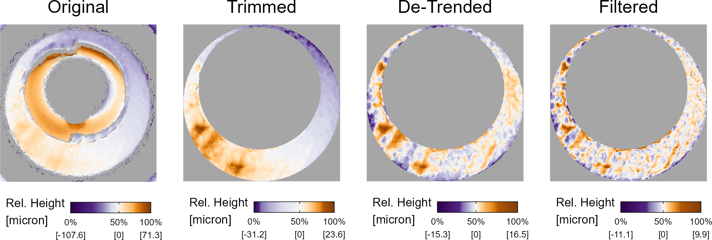

```{=tex}
\defcitealias{daubert}{Daubert}
```

```{r setup, include = FALSE}
knitr::opts_chunk$set(echo = F, dpi = 300, fig.width = 8, fig.height = 4, out.width = "\\textwidth", dpi = 300)
library(x3ptools)
library(cmcR)
library(tidyverse)
library(patchwork)
source("code/supplementaryFunctions.R")
```


As the need for computationally-intensive methods to analyze forensic data has grown, so too has the need for user-friendly tools to experiment with and improve upon these methods.
In this work, we discuss developments to a particular class of algorithms used to compare cartridge case evidence known as the Congruent Matching Cells (CMC) method.
Chapter [\#] discusses a modularization of the algorithm into a "pipeline" that enables reproducibility, experimentation, and comprehension.
Chapter [\#] introduces novel pieces of this pipeline that we demonstrate provide improvements to the current state-of-the-art.
Chapter [\#] details a suite of diagnostic tools that illuminate the inner-workings of the algorithm and help determine when and why the algorithm does or does not "work" correctly.

## Forensic Examinations

A primary goal of a forensic examination is to determine the source of a piece of evidence.
This is commonly referred to as the \emph{source identification} problem  \citep{Ommen2018}.
A common setting for source identification problems involves obtaining evidence of unknown source from a crime scene and either evidence from a known source or other evidence of unknown source.
For example, a bullet found at a crime scene may be compared to a suspect's firearm.
Such evidence is sent to a forensic lab where a trained Firearms and Toolmarks examiner compares the "questioned" bullet to bullets fired from the suspect's firearm to determine whether the suspect's firearm was the original source.
In this work, we develop a method to supplement such an examination by providing an objective measure of similarity between the two pieces of evidence.

### Firearms and Toolmarks Examination

Firearms and toolmarks (F&T) examination involves studying markings or impressions left by a firearm or other tool (e.g., a screwdriver) on a surface \citep{Thompson2017}.
The focus of this work is on a subset of F&T problems that deal with the comparison of cartridge case evidence.
A \emph{cartridge case} is the portion of firearm ammunition that encases a projectile (e.g., bullet, shots, or slug) along with the explosive used to propel the projectile through the firearm. 
When a firearm is discharged, the projectile is propelled down the barrel of the firearm, while the cartridge case is forced towards the back of the barrel. 
It strikes the back wall, known as the \emph{breech face}, of the barrel with considerable force, thereby imprinting any markings on the breech face onto the cartridge case, creating the so-called \emph{breech face impressions}. 
These markings have been suggested to be unique to a firearm and are used in forensic examinations to determine whether two cartridge cases have been fired by the same firearm.

During a forensic examination, two pieces of ballistic evidence are placed under a comparison microscope. 
Comparison microscopes allow for a side-by-side comparison of two objects within the same viewfinder, as seen in \autoref{fig:ccPair_combined}. 
A pair of breech face images is aligned along the thin black line in the middle of the images. 
The degree to which these breech face markings can be aligned is used to determine whether the two cartridge cases came from the same source; i.e., were fired from the same firearm. 
These breech face impressions are considered to be a firearm’s unique “fingerprint” left on a cartridge case \citep{Thompson2017}.

```{r ,echo=FALSE,fig.cap='\\label{fig:ccPair_combined} A cartridge case pair with visible breech face impressions under a microscrope.  A thin line can be seen separating the two views. The degree to which the markings coincide is used to conclude whether the pair comes from the same source.',fig.pos='htbp',out.width="\\textwidth"}
knitr::include_graphics("images/cartridgeCasePair_comparison_with_line.PNG")
```


A F&T examination typically ends in one of three conclusions: identification, meaning the evidence originated from the same source, exclusion, meaning the evidence did not originate from the same source, or inconclusive, meaning there is insufficient information to conclude identification or exclusion \citep{AFTE1992}.
Examiners rarely need to provide quantitative justification for their conclusion. 
Even for qualitative justifications, it can be difficult to determine what the examiner is actually "looking at" to arrive to their conclusion \citep{Ulery2014}.
For cartridge case comparisons, similarity between the breech face impressions of two cartridge cases, among other factors, is used by the examiner to make their determination.

Due to the opacity in the decision-making process, examiners have been referred to as "black boxes" in a similar sense to black box algorithms \citep{HumanFactorsCommittee2020}.
Their evidentiary conclusions are fundamentally subjective, and there is empirical evidence to suggest that conclusions differ across examiners when presented with the same evidence and even within a single examiner when presented with the same evidence on two different occasions \citep{Ulery2011,Ulery2012}.
This suggests the need to supplement these black box decisions with transparent, objective techniques that quantitatively measure the similarity between pieces of evidence \citep{council_strengthening_2009,pcast2016}.
In this work, we focus on a specific set of techniques used to compare cartridge case evidence.

## Forensic Comparison Pipelines

Recent work in many forensic disciplines has focused on the development of algorithms to measure the similarity between pieces of evidence including glass \citep{Curran2000-hp,Park2019,openForSciR}, handwriting \citep{crawford_handwriting_2020}, shoe prints \citep{park_algorithm_2020}, ballistics \citep{hare_automatic_2016,tai_fully_2018}, and toolmarks \citep{Hadler2017,Krishnan2018}.
These algorithms often result in a numerical, non-binary (dis)similarity score for two pieces of evidence.
A non-binary score adds additional nuance to an evidentiary conclusion beyond simply stating whether the evidence did or did not originate from the same source as would be the case in binary classification.
For example, the larger the similarity score, the "more similar" the evidence.
However, a binary (or ternary, if admitting inconclusives) conclusion must ultimately be reached by an examiner.
Whether a decision should be reached based solely on results of a comparison algorithm (e.g., defining a score-based decision boundary) or if an examiner should incorporate the similarity score into their own decision-making process is still up for debate \citep{Swofford2021}.
In this work, we view forensic comparison algorithms as a supplement to, rather than a replacement of, the forensic examination.

We conceptualize forensic comparison algorithms as evidence-to-classification "pipelines."
Broadly, the steps of the pipeline include:
\begin{enumerate}
\item capturing a digital representation of the evidence,

\item pre-processing this representation to isolate or emphasize a region of interest of the evidence,

\item comparing regions of interest from two different pieces of evidence to obtain a (perhaps high-dimensional) set of similarity features,

\item combining these features into a low-dimensional set of similarity scores, and

\item defining a classification rule based on these similarity features.
\end{enumerate}

This is similar to the structure discussed in \citet{Rice2020}.
We add to this structure the emphasis that each step of the pipeline can be further broken-down into modularized pieces.
For example, the pre-processing step may include multiple sub-procedures to isolate a region of interest of the evidence.
\autoref{fig:pipelineDiagram} shows three possible variations of the cartridge case comparison pipeline as well as the parameters requiring manual specification and alternative modules.
The benefits of this modularization include easing the process of experimenting with different parameters/sub-procedures and improving the comprehensibility of the overall pipeline.

```{r,echo=FALSE,fig.cap='\\label{fig:pipelineDiagram} Variations upon the cartridge case comparison pipeline. The first three columns detail the pipeline with different sub-procedures. The fourth columns shows the parameters that require manual specification at each step. The fifth column shows  alternative processing steps that could replace steps in the existing pipeline.',fig.pos='htbp',out.width="\\textwidth"}
knitr::include_graphics("images/pipelineDiagram_9-9-21.jpg")
```


In the following sections, we detail recent advances to each of the five steps in the pipeline outlined above.
We narrow our focus to advances made in comparing F&T evidence. 

### Digital Representations of Cartridge Case Evidence

Digital representations of cartridge case evidence commonly come in one of two modes: 2D optical images or 3D topographic scans.
A common way to take 2D optical images is to take a picture of the cartridge case under a microscope.
This implies that the digital representation of the cartridge case surface is dependent on the lighting conditions under which the picture was taken. 
Some recent work has focused on comparing 2D optical images \citep{tai_fully_2018,tong_fired_2014}, although the use of 3D microscopes has become more prevalent to capture the surface of ballistics evidence.

Using a 3D microscope, we can obtain scan at the micron (or micrometer) level that is more light-agnostic than a 2D image \citep{weller_2012}.
One common 3D scanning procedure is disc scanning confocal microscopy.
This procedure works by shining a focused beam of light on the cartridge case surface.
This light is reflected back onto a pinhole allowing a limited height range to pass through.
The microscope scans through different height range "slices" and compiles all of these slices into a single 3D topography of the cartridge case primer surface.
\autoref{fig:cartridgeCaseImages} shows a 2D image and 3D topography of the same cartridge case primer.

```{r ,echo=FALSE,fig.cap='\\label{fig:cartridgeCaseImages} A cartridge case from \\citet{fadul_empirical_2011} captured using 2D confocal reflectance microscopy (left) and 3D disc scanning confocal microscopy (right).',fig.pos='htbp',fig.align='center'}
knitr::include_graphics("images/fadul1-1_sidebyside.PNG")
```

More recently, Cadre Forensics\texttrademark\ introduced the TopMatch-3D High-Capacity Scanner \citep{topmatch}.
This scanner collects images under various lighting conditions of a gel pad into which the cartridge case surface is impressed and combines these images into a regular 2D array called a \emph{surface matrix}.
The physical dimensions of these objects are about 5.5 $mm^2$ captured at a resolution of 1.84 microns per pixel (1000 microns equals 1 mm).

When applied to ballistics evidence, these 3D scans are commonly stored in the ISO standard x3p file format \citep{ISO25178-72}.
x3p is a container consisting of a single surface matrix representing the height value of the surface and metadata concerning the parameters under which the scan was taken (including size, resolution, creator, etc.).
It has been empirically demonstrated that comparing 3D topographic scans of cartridge case evidence leads to more accurate conclusions compared to comparing 2D optical images of the same evidence  \citep{Tai2019,tong_fired_2014,song_3d_2014}.

### Pre-processing Procedures for Cartridge Case Data

When capturing the surface of a cartridge case, the result is bound to contain extraneous regions due to the incongruity between the circular primer and the rectangular array in which the surface data are stored.
\autoref{fig:cartridgeCaseImages} shows an example of a 2D image and 3D scan of the same cartridge case.
We can see, for example, that the corners of these arrays include non-primer regions of the cartridge case surface.
Additionally, the center of the cartridge case primer features an impression left by the firing pin during the firing process.
In most applications, impressions left by the firing pin are compared separately from the breech face impressions \citep{Zhang2016} [cite others?].
As the focus of this work is on the comparison of breech face impressions between two cartridge cases, only the annular region surrounding the firing pin impression is of interest.
The annular breech face impression region must be segmented away from the rest of the captured surface.

Both the 2D optical and 3D topographic representations of cartridge case surfaces are fundamentally pictorial in nature.
As such, many image processing and computer vision techniques are used to automatically isolate the breech face impression region.
\citet{tai_fully_2018} uses a combination of histogram equalization, Canny edge detection, and morphological operations to isolate the breech face impressions in 2D images.
Various types of Gaussian filters are commonly employed to remove unwanted structure.
\citet{tong_fired_2014} uses a low-pass Gaussian filter that removes noise via a Gaussian-weighted moving average operation.
\citet{chu_validation_2013,song_estimating_2018} use a bandpass Gaussian filter, which simultaneously performs the function of a low-pass filter along with a high-pass filter to remove global structure from the scan.
Other versions of the bandpass filter are used in \citet{song_3d_2014,chen_convergence_2017,ott_applying_2017} that accomplish tasks such as omitting outlier surface values or addressing boundary effects \citep{ISO16610-71,brinkman_bodschwinna_2003}.

Instead of using automatic procedures, others have used subjective human intervention to isolate the breech face impressions.
For example, \citep{song_estimating_2018} indicate that cartridge cases are "manually trimming to extract the breech face impression of interest." 
In \citet{Roth2015}, examiners manually identify the borders of the breech face impression region by placing points around an image of the cartridge case primer.

\autoref{fig:preProcessPlots} illustrates a sequence of pre-processing procedures applied to a cartridge case surface.
By breaking the broader pre-processing step into modularized pieces, we can easily devise other arrangements of these pre-processing procedures that may improve the segmenting or emphasizing of the breech face impressions.
Experimentation is enabled by the modularity of the pipeline.

```{r,include=FALSE,cache=FALSE}
fadul11 <- x3ptools::x3p_read("data/Fadul 1-1.x3p") %>%
  x3p_sample()

fadul11$surface.matrix <- fadul11$surface.matrix*1e6

fadul11$mask <- NULL

fadul11_crop <- fadul11 %>%
  cmcR::preProcess_crop(region = "exterior",offset = -15) %>%
  cmcR::preProcess_crop(region = "interior",offset = 100)

fadul11_detrend <- fadul11_crop %>%
  preProcess_removeTrend(statistic = "quantile",method ="fn",tau = .5)

fadul11_filter <- fadul11_detrend %>%
  preProcess_gaussFilter()

plts <- x3pListPlot_vert(list("Original" = fadul11,
                         "Trimmed" = fadul11_crop,
                         "De-Trended" = fadul11_detrend,
                         "Filtered" = fadul11_filter),
                    type = "list",legend.quantiles = c(0,.5,1))

plt <- (((plts[[1]][[1]] +
               theme(plot.title = element_text(size = 12),
                     legend.text = element_text(size = 8)))/
              plts[[1]][[2]]) | 
    ((plts[[2]][[1]] +
               theme(plot.title = element_text(size = 12),
                     legend.text = element_text(size = 8)))/
              plts[[2]][[2]]) | 
    ((plts[[3]][[1]] +
               theme(plot.title = element_text(size = 12),
                     legend.text = element_text(size = 8)))/
              plts[[3]][[2]]) | 
    ((plts[[4]][[1]] +
               theme(plot.title = element_text(size = 12),
                     legend.text = element_text(size = 8)))/
              plts[[4]][[2]]))

ggsave("figures/preProcessPlots.png",plot = plt,width = 7,height = 3.5)
knitr::plot_crop("figures/preProcessPlots.png")
```

```{r,echo=FALSE,fig.cap='\\label{fig:preProcessPlots} A cartridge case undergoing various pre-processing steps. Note that the distribution of height values changes from left to right as more extraneous noise is removed from the scan.',fig.pos='htbp',fig.align='center'}

```


### Cartridge Case Evidence Feature Extraction

After applying the pre-processing procedures to two cartridge case scans, their breech face impressions are compared and similarity features are extracted.
Given that the cartridge cases at this point are represented as high-dimensional matrices, this can be thought of as a dimensionality reduction of the high-dimensional surface arrays to a set of similarity statistics.

A variety of features have been proposed to quantify the similarity between two cartridge case surface arrays.
\citet{tai_fully_2018} propose calculating the cross-correlation function (CCF) value between two cartridge cases across a grid of rotations.
It is assumed that the CCF will to be larger around the "true" rotation for matching cartridge case pairs than for non-matching pairs.
\citet{Riva2014} proposed combining the CCF between the two aligned scans with the element-wise median Euclidean distance and median difference between the normal vectors at each point of the surface.
Later, \citet{Riva2016,Riva2020} applied Principal Component Analysis to reduce these three features down to two principal components onto which a 2D Kernel Density Estimator could be fit.

Pertinent to this work is the cell-based comparison procedure originally outlined in \citet{song_proposed_2013}.
The underlying assumption of \citet{song_proposed_2013} is similar to that of \citet{tai_fully_2018}: that two matching cartridge cases will exhibit higher similarity when they are "close" to being correctly aligned.
While \citet{tai_fully_2018} measured similarity using the CCF between the two full scans, \citet{song_proposed_2013} proposes partitioning the scans into a grid of "correlation cells" and counting the number of similar cells between the two scans.
The rationale behind this procedure is that many cartridge case scans have regions that do not contain discriminatory markings.
As such, comparing full scans may result in a lower correlation than if one were to focus on the highly-discriminatory regions.
Dividing the scans into cells allows for the identification of these regions.

After breaking a scan into a grid of cells, each cell is compared to the other scan to identify the rotation and translation, known together as the \emph{registration}, at which the cross-correlation is maximized.
\citet{song_proposed_2013} assume that the cells from a truly matching pair of cartridge cases will "agree" on their registration in the other scan.
Details of this procedure are provided in [Chapter].

### Similarity Scores for Cartridge Case Evidence

Following feature extraction, the dimensionality of these features is further reduced to a low-dimensional, usually univariate, similarity score.

After calculating the CCF across various possible registrations, \citet{tai_fully_2018} propose using the maximum observed CCF value as the univariate similarity score.
In this case, a binary classification can be achieved by setting a CCF threshold above which pairs are classified as "matches" and below which as "non-matches."
\citet{Tai2019} proposes setting a CCF cut-off that maximizes the precision and recall in a training set of pairwise comparisons.

\citet{Riva2016,Riva2020} use a training set to fit two 2D kernel density estimates to a set of features from matching and non-matching comparisons.
Using these estimates, they are able to estimate the score-based likelihood ratio (SLR) for a new set of features.
This SLR can be viewed as a similarity score \citep{Garton2021}.

In the case of the cell-based comparison procedure discussed above, the total number of cells that are deemed "congruent matching" is used as a similarity score.
The criteria used to define "congruent matching" has changed across papers \citep{song_3d_2014,tong_fired_2014,tong_improved_2015,chen_convergence_2017} and will be discussed in greater detail in [Chapter].
The authors of these papers have consistently used a decision boundary of six "Congruent Matching Cells" to distinguish matches from non-matches.

\citet{Zhang2020} applies the Density-Based Spatial Clustering of Applications with Noise (DBSCAN) algorithm \citep{ester1996density} to the features from the cell-based comparison procedure to determine if any clusters form amongst the per-cell estimated registration values.
This is based on the assumption that any cells that come to a consensus on their registration should form a cluster in translation $(x,y)$ and rotation $\theta$ space.
\citet{Zhang2020} proposes a binary classifier based on whether any clusters are identified by the DBSCAN algorithm.
If a cluster is found for a particular pairwise comparison, then that pair is classified as a "match" and otherwise as a "non-match."

### Implementation Considerations

This cartridge case comparison pipeline is similar to other data analysis pipelines.
Much like other data analysis pipelines, the procedural details can be obscured as the goals of the analysis become more sophisticated.
This is helpful neither for the individual performing the analysis nor for any consumer of the results.
As such, it is worthwhile to design tools that make the data analysis procedure easier to implement and understand \citep{tidy-data}.

Beyond simply conceptualizing the cartridge case comparison procedure as a pipeline, we also implement the procedure as a sequence of algorithms that can programatically be connected together.
In particular, we utilize the pipe operator `%>%` available from the `magrittr` R package \citep{magrittr}.
This operator allows the output of one function to be passed as input to another without assigning a new variable. 
Data can be incrementally transformed as they move from one function to another.

Implementing a data analysis procedure using the pipe operator allows the user to think intuitively in terms of verbs applied to the data.
\autoref{tab:pipelineTable} illustrates two examples of pipelines that utilize the pipe operator.
The left-hand example shows how an R data frame can be manipulated using functions from the `dplyr` package.
Functions like `group_by`, `summarize`, and `filter` are simple building blocks that can be strung together to create complicated workflows.
The right-hand example similarly illustrates a cartridge case object passing through the comparison pipeline.
While the full comparison procedure is complex, the modularization to the `preProcess_`, `comparison_`, and `decision_` steps, which can further be broken-down into simple building blocks, renders the process more understandable to, and flexible for, the user.

\begin{table}[htbp]
    \centering
    \begin{tabular}{l|l}
      Data Frame Manipulation Example & Cartridge Case Comparison Example\\
      \hline
        \texttt{dataFrame \%>\%} & \texttt{cartridgeCase1 \%>\%} \\
        \ \ \texttt{group\_by(category) \%>\%} & \ \ \texttt{preProcess\_func(params1) \%>\%}\\
        \ \ \texttt{summarize(x = summary(var)) \%>\%} &\ \ \texttt{comparison\_func(cartridgeCase2,} \\
        \ \ \texttt{filter(x > 0) ...} & \hspace{21ex}\texttt{params2) \%>\%} \\
         & \ \ \texttt{decision\_func(params3) ...} \\
    \end{tabular}
    \caption{Two examples of data analysis worksflows that utilize the pipe operator. The left side shows a data frame manipulation while the right side shows a comparison of two cartridge cases.}
    \label{tab:pipelineTable}
\end{table}

Our implementation is structured to adhere to the "tidy" principles of design \citep{tidyverse}.
The `tidyverse` is a collection of R packages that share an underlying design philosophy and structure.
The four principles of a tidy API are:
\begin{enumerate}
\item Reuse existing data structures.

\item Compose simple functions with the pipe.

\item Embrace functional programming.

\item Design for humans.
\end{enumerate}

Adherence to these principles makes it easier to engage with and understand the overall data analysis pipeline.
In our application it also enables experimentation by making it easy to change one step of the pipeline and measure the downstream effects \citep{reproducibleScience}.
Each step of the cartridge case comparison pipeline requires the user to define parameters.
These can range from minor, such as the standard deviation used in a Gaussian filter, to substantial, such as choosing the algorithm used to calculate the similarity score.
So far, there is no consensus on the "best" parameter settings.
A large amount of experimentation is yet required to establish these parameters.
A tidy implementation of the cartridge case comparison pipeline allows more people to engage in the validation and improvement of the procedure.

## Visual Diagnostics

Forensic examiners often provide expert testimony in court cases.
As part of this testimony, an examiner is allowed to not only provide facts about the outcome of a forensic examination, but also their opinion about what the results mean.
A party to a court may challenge the examiner on the validity of the underlying scientific method or whether they interpreted the results correctly \citep{aafsArticle}.
In these situations, examiners need to be able to explain the process by which they reached an evidentiary conclusion to the fact finders of the case; namely, the judge or jury.
As algorithms are more often used in forensic examinations, the technical knowledge required to understand and explain an algorithm to lay-people has increased.
While in some cases the authors of the algorithm have been willing to provide testimony to establish the validity of the algorithm \citep{trueAlleleTestimony}, this will become less viable as algorithms become more prevalent.
Indeed, even the most elegant improvements to an algorithm may be moot if an examiner can't explain the improvements in their testimony.

<!-- The first is to educate examiners on the technical details of the algorithm. -->
<!-- This, however, requires resources to create and disseminate the educational materials and examiners' willingness to learn these details. -->
<!-- Even if examiners were willing to learn about the algorithm, many algorithms require technical knowledge that may be out of the scope of an examiner's standard training. -->
<!-- Even if examiners were to be educated to have the technical know-how needed to understand the algorithm, many algorithms, specifically commonly-used machine learning algorithms, are currently "unexplainable" in the sense that they rely on derived features that are not human-interpretable [cite unexplainable machine learning algorithms].] -->

The resources required to educate examiners on the use of highly technical algorithms makes additional training seem currently implausible.
An alternative is to develop algorithms from the ground-up to be intuitive for examiners to understand and explain to others.
\emph{Explainability} refers to the ability to identify the factors that contributed to the results of an algorithm \citep{Belle2021PrinciplesAP}.
For example, understanding "why" a classifier predicted one class over another.

Myriad techniques exist to explain the results of an algorithm.
These range from identifying instances of the training set that illuminate how the model operates \citep{Deng2018} to fitting more transparent models that approximate the complex model accurately \citep{Puiutta2020} to explaining the behavior of the algorithm in a small region of interest \citep{LIME,Goode2021}.
Many of these methods require additional technical knowledge to interpret these explanations.

A less technical approach is to use visualizations that facilitate understanding of model behavior.
Properly constructed visuals enable both exploratory data analysis and diagnostics \citep{Buja2009}.
Given that many of the procedures by which cartridge case evidence is captured, processed, and compared are based on image processing techniques, visual diagnostics seem like an intuitive mode of explanation for experts and lay-people alike. 
In this work, we develop a suite of visual diagnostic tools that can be used to explain the behavior of the cartridge case comparison pipeline.

### Visual Diagnostic Features

Much of the literature on "explainable" algorithms are focused on black-box machine learning algorithms such as Random Forests or Multi-layer Neural Networks.
[More to say here?]
Less focused is placed on constructing explainable features.
Feature selection and engineering is a critical, often time-intensive step in the data analysis process that isn't often 

We use the visual diagnostic tools discussed in Chapter [5] to develop a set of features.
By definition, these features are human-interpretable unlike, for example, features that are calculated in the convolution layer of a convolutional neural network.
The interpretability of these features imply that they can be explained to forensic examiners or lay-people.
This will make it easier to introduce such methods into forensic labs and court rooms.

<!-- ## Reproducibility, Comprehensibility, and Approachability of Algorithms -->

<!-- [Note that in the case of human intervention in the pipeline, it is difficult to quantify what we mean by "parameters."  -->
<!-- For example, how would we measure the consistency, attentiveness, or skill of an individual performing manual pre-processing on a piece of evidence? -->
<!-- This directly impacts the reproducibility of the pipeline as it is highly unlikely that the conditions under which a manual intervention occurred can be exactly reproduced. -->
<!-- As we will see in [Chapter], ensuring reproducibility of the pipeline in this case all but requires providing a copy of the manually-processed data.] -->

<!-- When evidence derived from a scientific method is presented to a judge or jury during court proceedings, there is an ethical imperative that the underlying scientific method be proven effective in its intended usage. -->
<!-- Established in \cite{daubert}, the Daubert standard legally codifies this notion by requiring a scientific method to satisfy a set of criteria before being considered admissible. -->
<!-- These criteria include that the method be generally accepted in the scientific community, that it can be and has been tested, and that it has a known error rate. -->

<!-- An impediment to achieving general acceptance of a scientific method is if the method is difficult to test by the wider scientific community, and therefore difficult to estimate its error rate [cite a paper on difficult to reproduce studies]. -->
<!-- This prompts the question: how can we make scientific methods easier to test? -->
<!-- Generally, "easier" implies that the method requires few resources or resources that the scientific community has access to.  -->
<!-- In the case of computational algorithms, virtually everyone has access to a computer and therefore has the means to run (reasonably-sized) algorithms. -->
<!-- Additional requirements include code and input data which, if not available, must be produced before an algorithm can be executed. -->
<!-- This can be expensive and time-consuming [citation here]. -->

<!-- Comprehensibility = understanding what the algorithm is doing. Approachability = being able to use or change the algorithm yourself. -->

<!-- Baggerly and Coombes (2009) *Deriving Chemosensitivity from Cell Lines: Forensic Bioinformatics and Reproducible Research in High-Throughput Biology* -->

<!-- Donoho (2017) *50 Years of Data Science* -->

<!-- tidyverse functionality -->

<!-- National Academies of Sciences, Engineering, and Medicine (2019) *Reproducibility and Replicability in Science* -->

<!-- In cartridge case evidence, the Congruent Matching Cells (CMC) methods are one class of algorithms used to measure the similarity between two cartridge cases. -->
<!-- Numerous authors have demonstrated the ability of the CMC methods to effectively distinguish between matching and non-matching pairs of cartridge cases. -->
<!-- However, to-date only conceptual descriptions of the CMC methods, along with results derived from an internal implementation of the described algorithm, have been published for the wider scientific community. -->
<!-- These published descriptions and results demonstrate that the authors' implementation of the CMC methods work as intended, yet fail to ensure others can reproduce or develop upon the published work without having to create their own implementation. -->
<!-- By "reproduce," we mean \emph{computational reproducibility} as defined by the National Academy of Science, Engineering, and Medicine: -->

<!-- > Definition here -->

<!-- For a method to be widely accepted by the scientific community, results must be reproducible (by others). -->

<!-- By definition, algorithms are repeatable assuming the same data are provided as input and a seed is set for any internal random number generation. -->
<!-- That is to say, if the exact same procedure is performed on the same data on two separate occasions, then the results will be the same. -->
<!-- However, reproducibility is still in-question for many forensic comparison algorithms. -->
<!-- By reproducibility, we mean \emph{computational reproducibility} as defined by the [National Academy of Sciences, Engineering, and Medicine]: "obtaining consistent computational results using the same input data, computational steps, methods, code, and conditions of analysis." -->
<!-- As we argue in [Chapter], many published forensic comparison algorithms fail to provide sufficient detail or resources to satisfy one or more of these criteria and, therefore, are not reproducible. -->
<!-- In-short: if the code and data exist, then you should share it. -->
<!-- Using a specific cartridge case comparison algorithm as an example, we detail a development process by which algorithms can not only satisfy reproducibility, but can also be more easily understood and accessed by the wider scientific community.  -->

<!-- In Chapter 6, we introduce a taxonomy to classify various levels of computational reproducibility. -->
<!-- We argue that currently-published versions of the CMC method are provided in the form of \emph{conceptual descriptions} while our implementation, paired with data that are open-source on the National Ballistics Toolmark Database [cite NBTRD], satisfies the definition of computational reproducibility provided by the NASEM [cite NASEM]. -->

<!-- Beyond considerations of reproducibility, which is a core tenet of science, are considerations of comprehensibility and approachability of an algorithm. -->
<!-- [Discuss how pipeline aids in comprehension, experimentation]. -->

<!-- For data discussion: cite Vorberger et al. (2007), NBTRD, and TopMatch -->

<!-- [Carpentry R package, gapminder reproducibility seminar] https://swcarpentry.github.io/r-novice-gapminder/ -->

<!-- ### Congruent Matching Cells Methodology -->

<!-- A particular class of algorithms used to compare ballistics evidence is known as the Congruent Matching Cells (CMC) algorithms. -->
<!-- Major developments for these algorithms have largely originated from a group of researchers at the National Institute of Standards and Technology (NIST). -->
<!-- As these algorithms are of particular import to this work, we present a "timeline" of CMC-related publications here. -->

<!-- [Vorberger et al. (2008)] summarize a study to determine the efficacy a national ballistics identification system. -->
<!-- As part of this study, the authors explored automatic methods for comparing various types of ballistics evidence including using the cross correlation function (CCF) to determine the translation and rotation at which two cartridge cases \emph{register} (i.e., are most similar). -->
<!-- The authors lay out a cartridge case pair comparison procedure that involves rotating one of the two cartridge cases and determining the rotation and translation at which the CCF is maximized. -->
<!-- An assumption underlying this technique is that a truly matching pair of cartridge cases will have a larger CCF value than a non-matching pair. -->
<!-- This procedure is equivalent to the Congruent Matching Cells method described in [Song et al. (2013)] for a cell count of 1. -->
<!-- [Weller et al. (2012)] demonstrate the effectiveness of this method on a set of cartridge cases fired from 10 consecutively manufactured pistol slides in which they conclude [xyz]. -->

<!-- Building upon this work, [Song (2013)] proposes partitioning the scan into a grid of \emph{correlation cells} that are individually compared. -->
<!-- The assumption underlying this method is that some of these cells will capture areas of the cartridge case surface that contain identifying markings while other cells will not. -->
<!-- By narrowing the focus to only those cells that capture identifying markings, we can more accurately assess the similarity between the regions of the cartridge cases that "matter." -->
<!-- The total number of cells that are deemed sufficiently "congruent" between the two cartridge case scans is referred to as the CMC count similarity score. -->
<!-- This method was referred to originally as the "Contiguous Matching Cells" algorithm in [Song (2013)] and [Chu et al. (2013)] -->
<!-- The authors provide a few details of an actual implementation that was tested on the data set of 3D topographical scans from [Fadul et al. (2011)], but these results are presented instead in [Chu et al. (2013)]. -->
<!-- They note that their implementation "show[s] a significant separation between the KM [known match] and KNM [known non-match] distributions without any false positive or false negative identification," although the actual results are shared in [Chu et al. (2013)]. -->
<!-- Follow-up papers [Song et al. (2014)] and [Tong et al. (2014)] validate this "Congruent Matching Cells" algorithm on 3D topographical and 2D optical images of the [Fadul et al. (2011)] cartridge cases, respectively. -->
<!-- Both of these papers demonstrate that the NIST implementation of the CMC method can distinguish between the matching and non-matching comparisons from the [Fadul et al. (2011)] data set, although applying the method to 3D topographies appears to be more effective than 2D optical images. -->
<!-- It's unclear what [Song et al. (2014)] develops past what was discussed in [Chu et al. (2013)] as they both use the [Fadul et al. (2011)] 3D topographical scans. -->
<!-- In fact, the results discussed in [Song et al. (2014)] appear to be same same as a subset of the results discussed in [Chu et al. (2013)] (compare Figure 6 to Figure 4b). -->
<!-- Finally, [Ott et al. (2017)] validate the original CMC method on 3D topographical scans of cartridge cases and firing pin impressions from two firearm proficiency studies [citation needed]. -->

<!-- [Tong et al. (2015), Chen et al. (2017), Chen et al. (2018), Tong et al. (2018)] introduce "improvements" to the CMC method. -->
<!-- Of particular note is the "High CMC" method presented in [Tong et al. (2015)] and the "Convergence CMC" method presented in [Chen et al. (2017)]. -->
<!-- [Chen et al. (2017)] provided a modest sensitivity analysis by comparing the performance of the various CMC methods on four data sets [Fadul et al. (2011), Weller et al. (2012), other two] using the same parameter settings and conclude that the Convergence CMC method performs best. -->
<!-- To address the fact that some cells capture very little of the breech face impression region, [Chen et al. (2018)] consider using the proportion of a scan that is classified as "congruent matching" as opposed to considering the total number of Congruent Matching Cells. -->
<!-- Their results indicate that using the proportion results in similar performance compared to using the number of CMCs. -->
<!-- [Tong et al. (2018)] introduce a novel \emph{Valid Data Based Normalized Cross-Correlation} function to address the fact that many cells contain a large proportion of structurally missing (non-breech face) values and demonstrate a slight improvement compared to the original and High CMC methods on the [Fadul et al. (2011)] and [Weller et al. (2012)] cartridge case data sets. -->

<!-- Recently, NIST-authored CMC papers have shifted focus to estimating population error rates and calculating score-based likelihood ratios based on the CMC count similarity score. -->
<!-- Rather than using an empirical distribution of CMC scores, these authors define and fit probability models to the distributions of matching and non-matching CMC count similarity scores. -->
<!-- More specifically, because the "congruent matching" classification is binary, many authors propose some flavor a binomial model for describing the CMC count distributions. -->
<!-- [Song et al. (2018), Song et al. (2020)] fit a binomial model to the distribution of non-match CMC scores and, after observing an overdispersion, a beta-binomial model to the match CMC scores from the [Fadul et al. (2011)] data set. -->
<!-- [Song et al. (2018)] use the fitted models to calculate false positive and negative error rates using a CMC score classification boundary of 6 CMCs while [Song et al. (2020)] use the fitted models to calculate score-based likelihood ratios. -->

<!-- Noting that the same cartridge case is used in multiple comparisons, and therefore is represented in more than one CMC score, [Zhang (2018, 2021)] explore "correlated-binomial" models as a way to relax the independence assumption implied by the simpler binomial and beta-binomial models. -->
<!-- Fitting a correlated beta-binomial model (effectively two types of overdispersion correction) to the CMC scores from the Weller et al. (2012) cartridge case data set results in an improved fit to matching and little improved to the non-matching CMC scores compared to the independent binomial model. -->

<!-- [Zhang et al. (2016)] introduce the "Congruent Matching Cross-Sections" (CMX) method as a way to compare 3D topographical scans of firing pin impressions. -->
<!-- Clearly inspired heavily by the CMC method, the method involves comparing multiple 1D circular cross sections of two firing pin impression surfaces. -->
<!-- The authors demonstrate that the CMX method can separate matches and non-matches amongst the [Fadul et al. (2011)] firing pin impressions.  -->
<!-- [Thompson et al. (YEAR)] similarly take inspiration from the CMC method in the creation of the "Congruent Matching Profile Segments" used to compare surface profiles extracted from topographical scans of bullets. -->

<!-- Of particular note to the contents of this paper is the usage of the Density-Based Spatial Clustering of Applications with Noise (DBSCAN) algorithm used to compare firing pin impression scans in [Zhang et al. (2021)]. -->
<!-- The authors use the DBSCAN algorithm to map the registration information collected from a firing pin comparison to a binary, match/non-match classification. -->
<!-- This method will be discussed in greater detail in [Chapter]. -->

<!-- [What's missing from current CMC methodology] -->

<!-- - a well-defined process to validate or experiment with the method -->

<!-- - clarity in how anything is actually implemented -->

<!-- - an indicator of when and why the CMC method "fails" at its intended usage. -->

<!-- While the CMC methodology has been shown to work well in classifying matching and non-matching cartridge case comparisons for a handful of data sets, it is far from being usable in-practice in a forensic or legal setting. -->
<!-- This is partially due to  -->


\bibliography{mybib.bib}