```{r setup, include=FALSE}
options(
  dplyr.print_min = 6, dplyr.print_max = 6, width = 70,
  digits = 3, htmltools.dir.version = FALSE
)
knitr::opts_chunk$set(
  comment = "#>",
  echo = FALSE,
  collapse = TRUE,
  warning = FALSE,
  message = FALSE,
  cache = TRUE,
  fig.align = "center",
  fig.pos = "!htbp"
)

library(ggplot2)
library(cmcR) # remotes::install_github("CSAFE-ISU/cmcR")
library(tidyverse)
library(x3ptools) # remotes::install_github("heike/x3ptools")
library(rgl)
library(magrittr)
```

# Literature Review

## Preliminaries: Forensic Examinations

A bullet casing is found at the scene of a murder.
The bullet is recovered from the victim during autopsy.
A handwritten letter threatening the victim is found in their pocket.
The assailant's shoeprints are discovered fleeing the area.
Who left this evidence?
Investigators obtain the gun, shoes, and handwriting samples of a suspect.
This evidence, along with the crime scene evidence, is sent to a forensic laboratory for analysis.
Forensic examiners compare the evidence to establish whether they share a common source. 
The suspect is charged after the examiners conclude that there is sufficient agreement between the crime scene and suspect's samples.

The procedure described above, in which evidence is analyzed to determine its origin, is called the *source identification* problem [@Ommen2018].
Historically, forensic examiners have relied on tools (e.g., microscopes), case facts, and experience to develop an opinion on the similarity of two pieces of evidence.
More recently, algorithms to automatically compare evidence and provide an objective measure of similarity have been introduced.
These algorithms can be used in a forensic examination to supplement and inform the examiner's conclusion.
We propose an automatic, objective solution to the source identification problem; specifically in the context of comparing fired *cartridge cases.*
Cartridge case comparison is a sub-discipline of Firearm and Toolmark Identification, which is reviewed in the next section.

### Firearm and Toolmark Identification

Firearm and toolmark identification involves studying markings or impressions left by a hard surface such as a firearm or screwdriver on a softer surface [@Thompson2017].
For example, a barrel's rifling leaves toolmarks on a bullet as it travels out of the gun.

#### The Firing Process

In this section, we describe the basic process of firing a cartridge out of a handgun or rifle.
A *cartridge* consists of a metal casing containing primer, gunpowder, and a bullet.
Figure \@ref(fig:cartridgeDiagram) shows a cross-section of a cartridge featuring these components [@calibersExplained].


```{r cartridgeDiagram,echo=FALSE,fig.cap="A cartridge containing primer, powder, and a bullet. The firing process is initiated by loading a cartridge into the barrel of a firearm.",out.width=".5\\textwidth"}
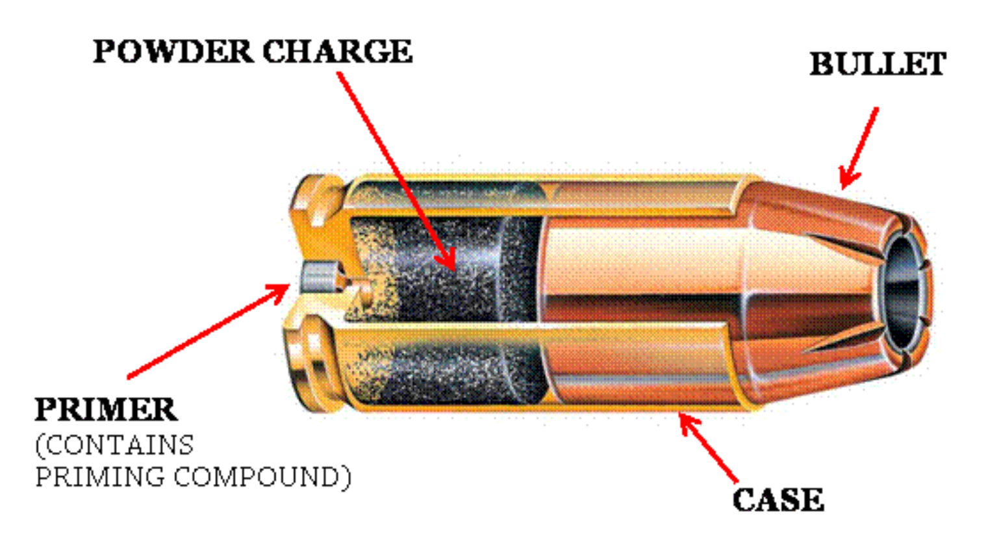
```


First, a cartridge is loaded into the back of the barrel in an area called the *chamber*.
Figure \@ref(fig:pistolParts) shows an example of a cartridge loaded into the chamber of a pistol [@rattenbury].
Note that the hammer of the pistol in Figure \@ref(fig:pistolParts) is pulled to hold the firing pin under spring tension.
Upon squeezing the trigger, the firing pin releases and travels forwards at a high velocity.
The firing pin strikes the primer of the cartridge case, causing it to explode.

```{r pistolParts,echo=FALSE,fig.cap="Cross-section of a pistol with a chambered cartridge and drawn-back hammer. Pulling the trigger releases the firing pin which strikes the cartridge case primer.",out.width=".5\\textwidth"}
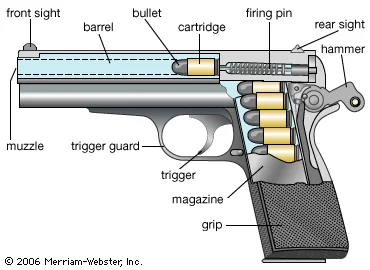
```

The explosion of the primer ignites the powder in the cartridge [@hampton].
As shown in \@ref(fig:firingCartridge), gas rapidly expands in the cartridge that pushes the bullet down the barrel.
Simultaneously, the rest of the cartridge moves towards the back of the barrel and presses against the back wall of the barrel, known as the *breech face*, with considerable force.

```{r firingCartridge,echo=FALSE,fig.cap="A cartridge after a firing pin has struck the primer. The explosion of the primer ignites the powder within the cartridge, causing gas to rapidly expand and force the bullet down the barrel.",out.width=".5\\textwidth"}
knitr::include_graphics("images/firingCartridgeDiagram.jpg")
```

Any markings on the breech face are imprinted onto the cartridge case, creating the so-called *breech face impressions*.
These impressions are analogous to a barrel's "fingerprint" left on the cartridge case.
Figure \@ref(fig:impressionDiagram) shows cartoon examples of breech face markings that appear on cartridge cases [@hampton].

```{r impressionDiagram,echo=FALSE,fig.cap="Examples of common breech face impression patterns. These are considered analogous to a breech face fingerprint left on the cartridge surface.",out.width=".5\\textwidth"}
knitr::include_graphics("images/breechFaceImpressionDiagram.jpg")
```

Figure \@ref(fig:realCartridgeCase) shows the base of a fired cartridge [@hampton].
The hole to the south-east of the center of the primer is the impression left by the firing pin.
Note the horizontal striated breech face markings on the primer to the left of the firing pin impression.
We focus on the comparison of such markings.

```{r realCartridgeCase,echo=FALSE,fig.cap="A fired 9mm Luger cartridge case with visible firing pin and breech face impressions.",out.width=".7\\textwidth"}
knitr::include_graphics("images/realCartridgeCaseImage.jpg")
```

<!-- The extractor pin and ejector pushes the cartridge case out of the chamber. -->
<!-- As shown in Figure \@ref(fig:extractorMarkings), this may leave additional markings on the cartridge surface \citep{hampton}. -->
<!-- Firing pin, breech face, and extractor pin and ejector markings are all used in a forensic examination to determine whether two cartridge cases were fired from the same firearm. -->
<!-- We focus on the comparison of breech face impressions specifically. -->

<!-- ```{r,echo=FALSE,fig.cap="\\label{fig:extractorMarkings} Examples of common extractor pin and ejector markings. Forensic examiners study impressions on the cartridge to identify the source of the fired cartridge.",out.width=".5\\textwidth"} -->
<!-- knitr::include_graphics("images/extractorPinDiagram.png") -->
<!-- ``` -->

#### An Overview of Firearm and Toolmark Examinations

Trained firearm and toolmark examiners use a *comparison microscope* like the one in Figure \@ref(fig:comparisonMicroscope) to examine two pieces of evidence [@Zheng2014].
A comparison microscope combines the view of two compound microscopes into a single view via an *optical bridge*.
This allows an examiner to view two microscope stages simultaneously under the same eyepiece.
The right Figure \@ref(fig:comparisonMicroscope) shows the view of two bullets under a comparison microscope.
The white dotted line represents the split in the two fields of view.
The goal of using a comparison microscope is to assess the "agreement" of the features on two pieces of evidence.

```{r comparisonMicroscope,echo=FALSE,fig.cap="A comparison microscope consists of two stages upon which evidence is placed. These stages are placed under two compound microscopes that are joined together via an optical bridge and allow for viewing of both stages simultaneously under a single eyepiece. The image on the right shows an example of a bullet viewed under a comparison microscope.",out.width=".6\\textwidth"}
knitr::include_graphics("images/comparisonMicroscope.png")
```

Firearm examiners distinguish between three broad categories when characterizing the features of a fired bullet or cartridge case: class, subclass, and individual characteristics.
*Class characteristics* are features associated with the manufacturing of the firearm such as the size of ammunition chambered by the firearm, the orientation of the extractor and ejector, or the width and twist direction of the barrel rifling.
An early step in a forensic examination is to determine the class characteristics of the firearm of origin as they can narrow the relevant population of potential firearm sources [@Thompson2017].
For example, a 9mm cartridge case must have been fired by a firearm that can chamber 9mm ammunition.


If the discernible class characteristics match between two pieces of evidence, then the examiner uses a comparison microscope to compare the *individual characteristics* of the evidence.
Individual characteristics are markings attributed to imperfections on the firearm surface due to the manufacturing process, use, and wear of the tool.
For example, markings on the breech face of a barrel often form after repeated fires of the firearm.
Individual characteristics are assumed to occur randomly across different firearms and therefore can be used to distinguish between two firearms.
The examiner independently rotates and translates the stages of a comparison microscope to find the position where the markings on the two pieces of evidence match [@Zheng2014].
An examiner concludes that the evidence originated from the same firearm if the individual characteristics are in "sufficient agreement" [@AFTE1992].

*Subclass characteristics* exist between the macro-level class and micro-level individual characteristics.
These characteristics relate to markings reproduced across a subgroup of firearms.
For example, breech faces manufactured by the same milling machine may share similar markings [@firearmManufacturing].
It can be difficult to distinguish between individual and subclass characteristics during an examination.
An examiner's decision process may be affected if the existence of subclass characteristics is suspected.

Many firearm and toolmark examiners in the United States adhere to the Association of Firearm and Toolmark Examiners (AFTE) Range of Conclusions when making their evidentiary conclusions [@AFTE1992].
According to these guidelines, six possible conclusions can be made in a firearm and toolmark examination:

1. **Identification**: Agreement of a combination of individual characteristics and all discernible class characteristics where the extent of agreement exceeds that which can occur in the comparison of toolmarks made by different tools and is consistent with the agreement demonstrated by toolmarks known to have been produced by the same tool.

2. **Inconclusive**: there are three possible inconclusive decisions

> 2.1 Some agreement of individual characteristics and all discernible class characteristics, but insufficient for an identification.

> 2.2 Agreement of all discernible class characteristics without agreement or disagreement of individual characteristics due to an absence, insufficiency, or lack of reproducibility.

> 2.3 Agreement of all discernible class characteristics and disagreement of individual characteristics, but insufficient for an elimination.

3. **Elimination**: Significant disagreement of discernible class characteristics and/or individual characteristics.

4. **Unsuitable**: Unsuitable for examination.

Forensic examinations first involve an examination of a "questioned" bullet or cartridge case for identifiable toolmarks [@Thompson2017].
The examiner classifies markings by their class, individual, and subclass characteristics.
The examiner compares these characteristics to "known source" fires obtained from a suspect's firearm if one is available.
Otherwise, class characteristics from the questioned bullet can be used to narrow the relevant population and provide potential leads.
An examiner's decision may be used as part of an ongoing investigation or presented at trial as expert testimony.

Standard operating procedures for assessing and comparing evidence differ between forensic laboratories.
For example, some labs collapse the three possible inconclusive decisions into a single decision [@Neuman2022] or prohibit examiners from making an elimination based on differences in individual characteristics [@Duez2017].

### Why Should Firearm and Toolmark Identification Change?

In 2009, the National Research Council released a report assessing a number of forensic disciplines including Firearm and Toolmark analysis.
The report pointed out that firearm and toolmark analysis lacked a precisely defined process and that little research had been done to determine the reliability or repeatability of the methods.
*Reliability* refers to the ability to correctly classify evidence as originating from the same source or not.
*Repeatability* refers to the consistency of conclusions; for example, whether an examiner makes the same conclusion if presented with the same evidence on different occasions.
Two of the recommendations from this study were to establish rigorously-validated laboratory procedures and "develop automated techniques capable of enhancing forensic technologies [@council_strengthening_2009]."

A number of studies assess the reliability and repeatability of a firearm and toolmark examination (non-exhaustively: @DeFrance2003, @Hamby2009, @fadulempirical2011, @Stroman2014, @Baldwin2014, @Smith2016, @MATTIJSSEN2020).
These studies indicate that examiners have a low error rate when comparing evidence obtained under controlled conditions (i.e., for which ground-truth is known).
However, as pointed out in a 2016 report from the President's Council of Advisors on Science and Technology, many of these studies, save @Baldwin2014, were not "appropriately designed to test the foundational validity and estimate reliability [@pcast2016]."
The report called for more properly-designed studies to establish the scientific validity of the discipline.

Due to the opacity in the decision-making process, examiners are referred to as "black boxes" in a similar sense to black-box algorithms [@HumanFactorsCommittee2020].
Their evidentiary conclusions are fundamentally subjective and empirical evidence suggests that conclusions may differ if examiners are presented with the same evidence on different occasions [@Ulery2011; @Ulery2012].
Examiners rarely need to provide quantitative justification for their conclusion.
Even for qualitative justifications, it can be difficult to determine what the examiner is actually "looking at" to arrive at their conclusion [@Ulery2014].
This suggests the need to supplement these black box decisions with transparent, objective techniques that quantitatively measure the similarity between pieces of evidence.
As stated in @pcast2016, efforts should be made to "convert firearms analysis from a subjective method to an objective method" including "developing and testing image-analysis algorithms for comparing the similarity of tool marks."
This work focuses on the development of an algorithm for comparing breech face impressions on cartridge cases.

## Forensic Comparison Pipelines

Recent work in many forensic disciplines has focused on the development of algorithms to measure the similarity between pieces of evidence including glass [@Curran2000-hp; @Park2019; @openForSciR], handwriting [@crawford_handwriting_2020], shoe prints [@park_algorithm_2020], ballistics [@hare_automatic_2016; @tai_fully_2018], and toolmarks [@Hadler2017; @Krishnan2018].
These algorithms often result in a numerical score for two pieces of evidence.
A numerical score can add more nuance to an evidentiary conclusion beyond simply stating whether the evidence originated from the same source as would be the case in binary classification.
For example, a larger similarity scores implies the evidence is more similar.
However, an examiner must ultimately reach one of two conclusions (or three, if admitting inconclusives).
Whether a conclusion should be based solely on an algorithm's similarity score or if an examiner should incorporate the similarity score into their own decision-making process is still up for debate [@Swofford2021].
In this work we view forensic comparison algorithms as a supplement to, rather than a replacement of, the traditional forensic examination.

We treat forensic comparison algorithms as evidence-to-classification "pipelines."
Broadly, the steps of the pipeline include @Rice2020:

1. capturing a digital representation of the evidence,

2. pre-processing this representation to isolate or emphasize a region of interest of the evidence,

3. comparing regions of interest from two different pieces of evidence to obtain a (perhaps high-dimensional) set of similarity features,

4. combining these features into a low-dimensional set of similarity scores, and

5. defining a classification rule based on these similarity features.

We add to this structure the emphasis that each step of the pipeline can be further broken-down into modularized pieces.
For example, the pre-processing step may include multiple sub-procedures to isolate a region of interest of the evidence.
Figure \@ref(fig:pipelineDiagram) shows two possible variations of the cartridge case comparison pipeline as well as the parameters requiring manual specification and alternative modules.
The benefits of this modularization include easing the process of experimenting with different parameters/sub-procedures and improving the comprehensibility of the pipeline.

```{r pipelineDiagram,echo=FALSE,echo=FALSE,fig.cap="Variations upon the cartridge case comparison pipeline. The first two columns detail the pipeline with different sub-procedures. The third columns shows the parameters that require manual specification at each step. The fourth column shows  alternative processing steps that could replace steps in the existing pipeline.",out.width="\\textwidth"}
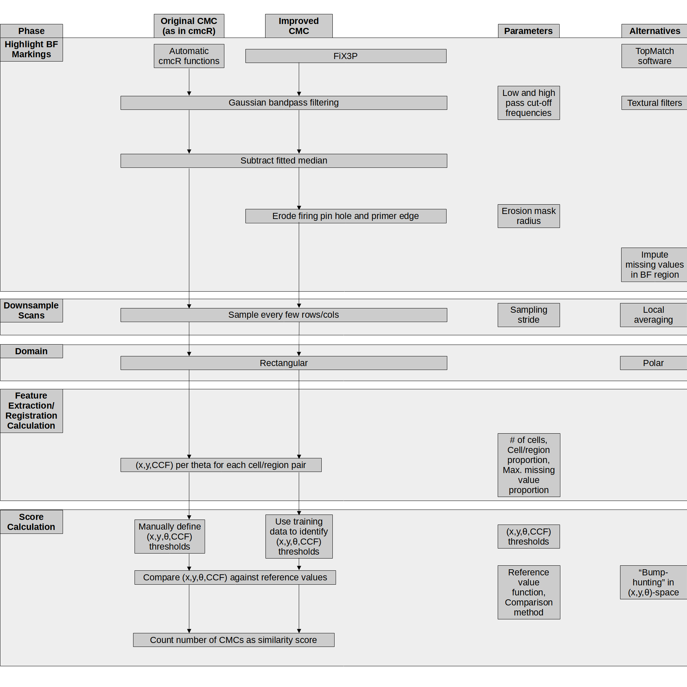
```

In the following sections, we detail recent advances to each of the five steps in the pipeline outlined above.
We narrow our focus to advances made in comparing firearms evidence.

### Digital Representations of Evidence

Digital representations of cartridge case evidence commonly come in two forms: 2D optical images or 3D topographic scans.
A common way to take 2D optical images is to take a picture of the cartridge case surface lit up under a microscope, implying a dependence on the lighting conditions under which the picture was taken.
Some recent work has focused on comparing 2D optical images [@tai_fully_2018; @tong_fired_2014], although the use of 3D microscopes has recently become more prevalent to capture the surface of ballistics evidence.

Using a 3D microscope allows for the scanning of surfaces at the micron (or micrometer) level under light-agnostic conditions [@weller_2012].
Figure \@ref(fig:cartridgeCaseImages) shows a 2D image and 3D topography of the same cartridge case primer from @fadulempirical2011.
<!-- One common 3D scanning procedure is "disc scanning confocal microscopy." -->
<!-- This procedure works by shining a focused beam of light on the cartridge case surface. -->
<!-- This light is reflected back onto a pinhole allowing a limited height range to pass through. -->
<!-- The microscope scans through different height range "slices" and compiles all these slices into a single 3D topography of the cartridge case primer surface. -->
<!-- The Microdisplay Scan Confocal Microscope from Sensofar\texttrademark Metrology is shown in Figure \@ref(fig:sensofarScanner) \citep{bermudez2017confocal}. -->

<!-- ```{r,echo=FALSE,fig.cap="\\label{fig:sensofarScanner} The Microdisplay Scan Confocal Microscope from Sensofar\\texttrademark\\ Metrology. The cartridge case surface is captured by scanning through a range of vertical slices and compiling these slices into a single 3D topography.",out.width=".5\\textwidth"} -->
<!-- knitr::include_graphics("images/sensofarScanner.png") -->
<!-- ``` -->

<!-- Figure \@ref(fig:cartridgeCaseImages) shows a 2D image and 3D topography of the same cartridge case primer from \citet{fadulempirical2011}. -->

```{r cartridgeCaseImages,echo=FALSE,fig.cap="A cartridge case captured using 2D confocal reflectance microscopy (left) and 3D disc scanning confocal microscopy (right).",out.width="\\textwidth"}
knitr::include_graphics("images/fadul1-1_sidebyside.PNG")
```

Recently, Cadre Forensics\texttrademark introduced the TopMatch-3D High-Capacity Scanner [@topmatch].
Figure \@ref(fig:topMatchScanner) shows a TopMatch scanner with a tray of 15 fired cartridge cases [@topmatchFlyer].
This scanner collects images of a gel pad under various lighting conditions into which the cartridge case surface is impressed. Proprietary algorithms combine these images into a regular 2D array called a *surface matrix*.
Elements of the surface matrix represent the relative height value of the associated surface.  
The physical dimensions of these scans are about 5.5 $mm^2$ captured at a resolution of 1.84 microns per pixel (1000 microns equals 1 mm).

```{r topMatchScanner,echo=FALSE,fig.cap="The TopMatch-3D High-Capacity Scanner from Cadre Forensics\\texttrademark\\ . The scanner captures topographic scans of a gel pad into which a cartridge case surface is impressed.",out.width=".7\\textwidth"}
knitr::include_graphics("images/TopMatchSystem7.png")
```

The ISO standard x3p file format is commonly used to save 3D scans  [@ISO25178-72].
An x3p is a container consisting of a single surface matrix representing the height values of the surface and metadata concerning the parameters under which the scan was taken as shown in Figure \@ref(fig:x3pFlowchart) [@Zheng2020].
A number of studies suggest that 3D topographic scans of cartridge case surfaces lead to more accurate classifications than 2D optical images of the same evidence [@Tai2019; @tong_fired_2014; @song_3d_2014].

```{r x3pFlowchart,echo=FALSE,fig.cap="The hierarchy of information stored in the x3p file format for both bullet and cartridge case evidence.",out.width=".7\\textwidth"}
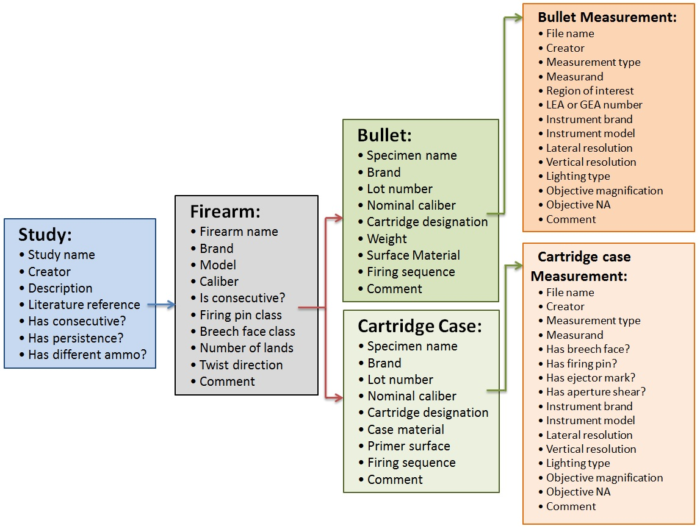
```

### Pre-processing Procedures for Forensic Data

After obtaining a surface's digital representation, we next want to isolate regions of the surface containing distinguishable markings.
Figure \@ref(fig:cartridgeCaseImages) shows an example of a 2D image and 3D scan of the same cartridge case.
In both representations, the corners of these arrays include regions of the cartridge case surface outside of the primer.
The center of the cartridge case primer contains an impression left by the firing pin during the firing process.
<!-- In most applications, impressions left by the firing pin are compared separately from the breech face impressions \citep{Zhang2016}. -->
<!-- Because we are interested in the comparison of breech face impressions between two cartridge cases, only the annular region surrounding the firing pin impression is of interest. -->
We wish to isolate the annular breech face region around the firing pin impression from the rest of the captured surface.

Both the 2D optical and 3D topographic representations of cartridge case surfaces are fundamentally pictorial in nature.
As such, breech face impression isolation commonly relies on image processing and computer vision techniques.
@tai_fully_2018 uses a combination of histogram equalization, Canny edge detection, and morphological operations to isolate breech face impressions in 2D images.
A Gaussian filter is another common tool to emphasize breech face impressions.
@tong_fired_2014 apply a low-pass Gaussian filter to remove noise via a Gaussian-weighted moving average operation.
@chu_validation_2013 and @song_estimating_2018 use a bandpass Gaussian filter to simultaneously remove noise and unwanted global structure from the scan.
@song_3d_2014 and @chen_convergence_2017 use a "robust" variant of the Gaussian filter to omit outliers from the scan [@ISO16610-71].

Instead of automatic procedures, others have used subjective human intervention to isolate the breech face impressions.
For example, @song_estimating_2018 performed "manually trimming to extract the breech face impression of interest" on a set of cartridge case scans.
In @Roth2015, examiners manually identify the borders of the breech face impression region by placing points around an image of the cartridge case primer.

### Forensic Data Feature Extraction

After isolating the breech face impressions, we compare two pre-processed cartridge case scans and compute a set of similarity features.
Because the cartridge cases at this point are represented as high-dimensional matrices, this process can be thought of as a dimensionality reduction of the high-dimensional surface arrays to a set of similarity statistics.

A variety of features have been proposed to quantify the similarity between two cartridge case surface arrays.
@tai_fully_2018 propose calculating the cross-correlation function (CCF) value between two cartridge cases across a grid of rotations.
The cross-correlation function measures the similarity between two matrices for every translation of one matrix against the other.
For two matching cartridge cases, we assume that the CCF will be largest after aligning the cartridge cases surfaces by their shared breech face impressions.
Conversely, we expect the CCF to be relatively small for two non-matching cartridge cases no matter the alignment.
@Riva2014 propose combining the CCF between two aligned scans with the element-wise median Euclidean distance and median difference between the normal vectors at each point of the surface.
@Riva2016 and @Riva2020 applied Principal Component Analysis to reduce these three features down to two principal components for the sake of fitting a 2D kernel density estimator.

Pertinent to this work is the cell-based comparison procedure originally outlined in @song_proposed_2013.
The underlying assumption of @song_proposed_2013 is similar to that of @tai_fully_2018: that two matching cartridge cases will exhibit higher similarity when they are close to being correctly aligned.
While @tai_fully_2018 measured similarity using the CCF between the two full scans, @song_proposed_2013 proposes partitioning the scans into a grid of "correlation cells" and counting the number of similar cells between the two scans.
The rationale behind this procedure is that many cartridge case scans have only a few regions with discriminatory markings.
As such, comparing full scans may result in a lower correlation than if one were to focus on the highly-discriminatory regions.
In theory, dividing the scans into cells allows for the identification of these regions.
After breaking a scan into a grid of cells, each cell is compared to the other scan to identify the rotation and translation, known together as the *registration*, at which the cross-correlation is maximized.
@song_proposed_2013 assumes that the cells from a truly matching pair of cartridge cases will "agree" on their registration in the other scan.
@song_proposed_2013 referred to the procedure of counting the number of similar cells the "Congruent Matching Cells" method.
Chapter 2 contains more details of this procedure.

### Similarity Scores & Classification Rules for Forensic Data

Following feature extraction, the dimensionality of these features is further reduced to a low-dimensional, usually univariate, similarity score.
We can define a decision boundary based on the value of the similarity score to classify cartridge case pairs as matching or non-matching.

After calculating the CCF across various possible registrations, @tai_fully_2018 propose using the maximum observed CCF value as the univariate similarity score.
They perform binary classifications by setting a CCF threshold above which pairs are classified as "matches" and below which as "non-matches."
@Tai2019 proposes setting a CCF cut-off that maximizes the precision and recall in a training set of pairwise comparisons.

@Riva2016 and @Riva2020 use a training set to fit two 2D kernel density estimates to a set of features from matching and non-matching comparisons.
Using these estimates, they compute a score-based likelihood ratio (SLR), which can be interpreted as a similarity score [@Garton2021].

For the Congruent Matching cells method, @song_proposed_2013 proposes using the number of cells that agree on a registration, the "congruent matching" cells, as a similarity score.
The criteria used to define "congruent matching" cells has changed across papers [@song_3d_2014; @tong_fired_2014; @tong_improved_2015; @chen_convergence_2017] and will be discussed in greater detail in Chapter 2.
The authors of these papers have consistently used six congruent matching cells as a decision boundary to distinguish matching and non-matching cartridge case pairs.

@zhang_convergence_2021 applies the Density-Based Spatial Clustering of Applications with Noise (DBSCAN) algorithm [@Ester1996] to the features from the cell-based comparison procedure to determine if any clusters form amongst the per-cell estimated registration values.
This is based on the assumption that any cells that come to a consensus on their registration should form a cluster in translation $(x,y)$ and rotation $\theta$ space.
@zhang_convergence_2021 proposes a binary classifier based on whether any clusters are identified by the DBSCAN algorithm [@Ester1996].
If a cluster is found for a particular pairwise comparison, then that pair is classified as a "match" and otherwise as a "non-match."

Apart from the algorithms described in @tai_fully_2018 and @Tai2019, the authors of these comparison algorithms have not provided publicly available code or data.
As such, although the results reported in associated papers are promising, it is difficult or impossible for other researchers to verify or reproduce the findings.
Results must be reproducible to be accepted by others in any scientific domain.
In the next section, we discuss recent challenges and opportunities in computationally reproducible research.

### Reproducibility of Comparison Pipelines

@nasem_2019 defines *reproducibility* as "obtaining consistent computational results using the same input data, computational steps, methods, code, and conditions of analysis."
While not exact in their definition of "consistent," the authors assert that, barring a few exceptions, it is reasonable to expect that the results obtained by a second researcher, after applying the exact same processing steps to the exact same data, be the exact same as the original results.
<!-- Among the exceptions given is if the original researcher had made a mistake in writing the original source code. -->
In either case, they assert that "a study's data and code have to be available in order for others to reproduce and confirm results."
Given data and code, researchers are able to verify the results, incorporate the materials into their own research, and improve or accelerate discovery [@Stodden2018b].

A number of studies indicate that computationally reproducible research is sparse across various disciplines.
@Stodden2018b and @Stodden2018a studied the reproducibility of articles sampled from the *Journal of Computational Physics* and the journal *Science*, respectively.
In the former, @Stodden2018b found that zero of 306 randomly selected articles from the *Journal of Computaional Physics* were "straightforward to reproduce with minimal effort" and, at best, that five articles were "reproducible after some tweaking."
In the latter, @Stodden2018a found that only 3 of 204 randomly selected articles from *Science* were "straightforward to reproduce with minimal effort;" despite a journal policy requiring that all code and data used in the paper be made available to any reader.
Similar findings were found in @CChang2022 (29 of 59 economic papers reproducible), @Iqbal2016 (zero of 268 biomedical papers provided raw data and 1 in 268 linked to a full study protocol), @Duvendack2015 (50\% or more published articles include data or code in only 27 of 333 economics journals), and @Gundersen2018 (24 of 400 AI conference papers included code).
A common recommendation amongst these authors is to establish of rigorous tools and standards to promote reproducibility.
This includes making code and data used in a paper easily-accessible to readers.

Infrastructure already exists to ease the process of developing, maintaining, and sharing open-source code and data.
Data repositories such as the NIST Ballistics Toolmark Research Database [@Zheng2020] provide open access to raw data.
@Grning2018 discuss the use of package managers such as Conda ([https://anaconda.org/anaconda/conda](https://anaconda.org/anaconda/conda)), container software such as Docker ([https://www.docker.com/](https://www.docker.com/)), and virtual machine software to preserve the entire data analysis environment in-perpetuity.
For situations in which VMs or containers aren't available, software such as the `manager` R package allows users to "compare package inventories across machines, users, and time to identify changes in functions and objects [@Rice2020]."
@Piccolo2016 reference repositories like Bioconductor [@Huber2015] that make it easy to document and distribute code.
Further, software such as the `knitr` R package [@Xie2014] enable "literate programming" in which prose and executed code can be interwoven to make it easier to understand the code's function.
These tools make data, code, and derivative research findings more accessible, in terms of both acquisition and comprehensibility, to consumers and fellow researchers. 

## Diagnostic Tools

Forensic examiners often provide expert testimony in court cases.
As part of this testimony, an examiner is allowed to provide facts about the outcome of a forensic examination and their opinion about what the results mean.
A party to a court may challenge the examiner on the validity of the underlying scientific method or whether they interpreted the results correctly [@aafsArticle].
In these situations, examiners need to explain the process by which they reached an evidentiary conclusion to the fact finders of the case; namely, the judge or jury.
As algorithms are more often used in forensic examinations, the technical knowledge required to understand and explain an algorithm to lay-people has increased.
Indeed, even the most effective algorithms may be moot if an examiner can't explain the algorithm in their testimony.
While in some cases the authors of the algorithm have been willing to provide testimony to establish the validity of the algorithm [@trueAlleleTestimony], this will become less viable as algorithms become more prevalent.

The resources required to educate examiners on the theory and implementation of highly technical algorithms makes additional training seem currently implausible.
An alternative is to develop algorithms from the ground-up to be intuitive for examiners to understand and explain to others.
*Explainability* refers to the ability to identify the factors that contributed to the results of an algorithm [@Belle2021PrinciplesAP].
For example, understanding why a classifier predicted one class over another.
*Diagnostics* are tools to explain or justify the behavior of a model or algorithm in specific instances.
Myriad diagnostic tools exist to explain the results of an algorithm.
These range from identifying instances of the training set that illuminate how the model operates [@Deng2018] to fitting more transparent models that accurately approximate the complex model [@Puiutta2020] to explaining the behavior of the algorithm in a small region of interest of the prediction space [@LIME; @Goode2021].
Many of these methods require additional technical knowledge to interpret these explanations.

### Visual Diagnostics

A less technical approach is to use visualizations that facilitate understanding of model behavior.
Properly constructed visuals enable both exploratory data analysis and diagnostics [@Buja2009], which are critical steps in the data analysis process for anticipating and assessing model fit.
Given that many of the procedures by which cartridge case evidence is captured, processed, and compared are based on image processing techniques, a visual diagnostic is an intuitive mode of explanation for researchers and lay-people alike.
As stated in @cleveland1994elements, "graphical methods tend to show data sets as a whole, allowing us to summarize the behavior and to study detail. This leads to much more thorough data analyses."

Numerical statistics summarize the behavior of data, but miss the detail referenced in Cleveland's quote [@telea2014data].
To illustrate this, consider the famous data sets from [@Anscombe1973] known as Anscombe's quartet.
The two variables in each data set are plotted against one another in Figure \@ref(fig:anscombeQuartet).
There are clear differences in the relationship between `x` and `y` across these four data sets.

```{r anscombeQuartet, fig.cap="A visualization of Anscombe's quartet. Despite there being obvious differences between these four data sets, their summary statistics are nearly identical",fig.height = 3,fig.width=5}
library(magrittr)
library(dplyr)
anscombeLong <- data.frame(
  group  = rep(1:4, each = 11),
  x = unlist(datasets::anscombe[,c(1:4)]),
  y = unlist(datasets::anscombe[,c(5:8)])
)
rownames(anscombeLong) <- NULL

anscombeLong %>%
  ggplot(aes(x=x,y=y)) +
  geom_point() +
  facet_wrap(~ group,nrow = 2,labeller = labeller(group = c("1" = "Data Set 1","2" = "Data Set 2","3" = "Data Set 3","4" = "Data Set 4"))) +
  theme_bw() +
  labs(title = "Anscombe's Quartet")
```

Despite these differences, Table `r knitr::asis_output(ifelse(knitr::is_html_output(), '\\@ref(tab:anscombeStats-html)', '\\@ref(tab:anscombeStats-latex)'))` shows that summary statistics, namely the first two moments, are identical.
This demonstrates that visual diagnostics can be more effective at uncovering data behavior than summary statistics (at least low-order moments).

```{r anscombeStats-latex, echo=FALSE,warning=F,message=F,eval=knitr::is_latex_output(),cache = F,fig.align='center'}
data.frame("Data Set" = c(1,2,3,4),
           "xBar" = c(9,9,9,9),
           "xsd" = c(3.32,3.32,3.32,3.32),
           "ybar" = c(7.5,7.5,7.5,7.5),
           "ysd" = c(2.03,2.03,2.03,2.03)) %>%
  knitr::kable(format = "latex",escape = FALSE,
               col.names = c("Data Set",
                             "$\\bar{x}$",
                             "S.D. $x$",
                             "$\\bar{y}$",
                             "S.D. $y$"),
               caption = "Moments of the two variables in Anscombe's quartet.",
               linesep = "",booktabs = TRUE) %>%
  kableExtra::kable_styling(full_width = TRUE) 
```

```{r anscombeStats-html,echo=FALSE,warning=F,message=F,eval=knitr::is_html_output(),cache = F,fig.align='center'}
data.frame("Data Set" = c(1,2,3,4),
           "xBar" = c(9,9,9,9),
           "xsd" = c(3.32,3.32,3.32,3.32),
           "ybar" = c(7.5,7.5,7.5,7.5),
           "ysd" = c(2.03,2.03,2.03,2.03)) %>%
  knitr::kable(
    caption = "Moments of the two variables in Anscombe's quartet.",
    align = c("r","r","r","r","r"),
    col.names = c("Data Set",
                  "$\\bar{x}$",
                  "$S.D. $x$",
                  "$\\bar{y}$",
                  "S.D. $y$"),
    format = "html",escape = FALSE)
```

Given the pivotal role that visual diagnostics play in the data analysis pipeline, we now consider best practices in creating data visualizations.
Human brains are wired for seeing patterns and differences, and for understanding spatial relationships from this [@telea2014data].
As such, an effective visual diagnostic or data visualization is one that conveys patterns quickly and easily, and with minimal scope for understanding.
Arising originally from a psychological theory of perception, the Gestalt Laws of Perceptual Organization [@Goldstein2016-un] summarize important considerations when constructing statistical graphics.
The Gestalt laws are as follows:

- **Pragnanz - the law of simplicity:** Every stimulus pattern is seen in such a away that the resulting structure is as simple as possible.

- **Proximity:** Things that are near each other appear to be grouped together.

- **Good Continuation:** Points that, when connected, result in straight or smoothly curving lines are seen as belonging together, and the lines tend to be seen in such a way as to follow the smoothest path.

- **Similarity:** Similar things appear to be grouped together.

- **Common Region:** Elements that are within the same region of space appear to be grouped together.

- **Uniform Connectedness:** A connected region of visual properties, such as the lightness, color, texture, or motion, is perceived as a single unit.

- **Synchrony:** Visual events that occur at the same time are perceived as belonging together.

- **Common Fate:** Things that are moving in the same direction appear to be grouped together.

- **Familiarity:** Things that form patterns that are familiar or meaningful are likely to become grouped together.

These laws provide guidance on how to construct a visual that concisely conveys a pattern or difference in data.
For data visualization, additional laws include [@Midway2020]:

- **Use and Effective Geometry:** Choose a geometry (shape and features of a statistical graphic) that is appropriate to the data.

- **Colors Always Mean Something:** Colors in visuals can convey groupings or a range of values.

Figure \@ref(fig:chickweightExample) depicts a case study of the Gestalt principles in practice.
The plot shows the weight over time of chicks fed one of two experimental diets [@crowder1990analysis].
Individual points represent the weight of a single chick on a particular day.
Connected points represent the weight for a single chick over time.
This is an example of using an effective geometry (point & line graph to represent time series) along with the Gestalt law of Good Continuation.
We further apply the Gestalt law of Common Region to facet the data set into plots based on diet.
This implicitly communicates to the audience that the weights of two diet groups of chicks is expected to differ.
Indeed, appealing to the Gestalt law of Uniform Connectedness, the "motion" of the grouped time series suggests that chicks given Diet 2 tend to gain weight more rapidly than those given Diet 1.
This may suggest a particular modeling structure for these time series (e.g., diet fixed effect) or the need to assess the experimental design to ensure that the assumption that the chicks were randomly sampled from the same population is appropriate.
We see how such a plot can be used for both exploratory data analysis or as a post-hoc diagnostic tool.
Alternative to faceting, the time series from these two diet groups could be combined into a single plot and distinguished by color.

```{r chickweightExample,fig.cap="An example of a statistical graphic that uses the Gestalt Laws of Perceptual Organization to communicate data findings.",fig.height = 3,fig.width=5}
library(dplyr)

datasets::ChickWeight %>%
  as.data.frame() %>%
  filter(Diet %in% c(1,3)) %>%
  ggplot(aes(x = Time,y = weight,group = Chick
  )) +
  geom_point() +
  geom_line() +
  theme_bw() +
  ylim(c(0,NA)) +
  theme(legend.position = "bottom") +
  facet_wrap(~ Diet,labeller = labeller(Diet = c("1" = "Diet 1","3" = "Diet 2"))) +
  labs(y = "Weight (gm)",
       x = "Time (Days)",
       subtitle = "Chick weights over time for two experimental diets")
```

The R programming language [@Rlanguage] provides a variety of tools to create visual diagnostics.
Among the most robust of these tools is the ggplot2 package [@ggplot2].
This package extends the "Grammar of Graphics" introduced in @Wilkinson2005 to provide a user-friendly structure to create statistical graphics.
We use the `+` operator to "layer" features of a statistical graphic (e.g., elements, transformations, guides, labels) on a blank canvas.
Figure \@ref(fig:ggplot2Example) along with the accompanying code chunk demonstrates how to create a residual plot from a simple linear regression using the ggplot2 package.
This visual diagnostic allows the analyst or audience to determine whether the homoscedasticity or linear form assumptions underlying simple linear regression are met.
For those willing to learn the "grammar," the code used to create these statistical graphics can easily be re-used and tweaked to fit a specific application.

```{r ggplot2Example,echo=TRUE,fig.cap="An example of using the ggplot2 package to construct a residual plot from a simple linear regression. The features of the statistical graphic are combined layer-by-layer using the + operator as we see in the accompanying code chunk.",fig.height = 3,fig.width=5}
lmFit <- lm(formula = rating ~ complaints,data = datasets::attitude)

library(ggplot2)

ggplot(data = data.frame(Complaints = datasets::attitude$complaints,
                         Residuals = lmFit$residuals)) +
  geom_point(aes(x = Complaints,y = Residuals)) +
  geom_hline(yintercept = 0,linetype = "dashed") +
  labs(x = "% in-favor of handling of employee complaints")
```

Properly constructed visual diagnostics provide the audience with a nuanced yet intuitive explanation of the behavior of a model or algorithm that summary diagnostic statistics may not convey.
Tools like the ggplot2 package provide a coherent, thorough infrastructure for creating such visual diagnostics.
However, the tools discussed thus far are useful for creating *static* visualizations.
In the next section, we discuss the benefits of making a visual diagnostic interactive to user input.

### Interactive Diagnostics

Interactive diagnostic tools encourage both expert and lay users to engage with an analysis pipeline that otherwise may be technically or conceptually inaccessible.
Rather than answering a question posed by the author of a plot as a static plot does, such interactive diagnostic tools enable the audience to formulate and answer their own questions.
This leads to deeper engagement with the data [@telea2014data].
While the ggplot2 package eases the process of constructing visual diagnostics, software such as the shiny R package [@shiny] enables the consumer of the diagnostic to interact with the visualizations and underlying data.
The shiny package provides tools for using R to build web applications run on HTML, CSS, and JavaScript.
Among other functionality, these applications allow users to upload or create their own data, set parameters for an analysis, interact with visualizations or data sets (e.g., by hovering to display a tooltip), and export their analyses in various file formats [@Beeley2018-ci].

<!-- Figure \@ref(fig:IPDmada) \citep{wang2021ipdmada} shows a screenshot of the IPDmada shiny application that enables users to perform a meta-analysis of diagnostic test accuracy studies at the individual patient level (an individual patient data meta-analysis or IPD-MA) using a variety of statistical techniques. -->
<!-- As seen in \@ref(fig:IPDmada), the user can upload their own data csv file and select parameters that will enable the importing of the data. -->
<!-- The other tabs at the top of the application provide statistical tools to analyze the uploaded data. -->
<!-- This application is useful for researchers who are interested in analyzing diagnostic test accuracy data, yet do not necessarily have the coding skills to perform such an analysis in R themselves. -->

<!-- ```{r,fig.cap="\\label{fig:IPDmada} The IPDmada shiny application allows users to analyze individual patient data from a diagnostic test accuracy study using a variety of statistical techniques.",fig.height = 3,out.width=".7\\textwidth"} -->
<!-- 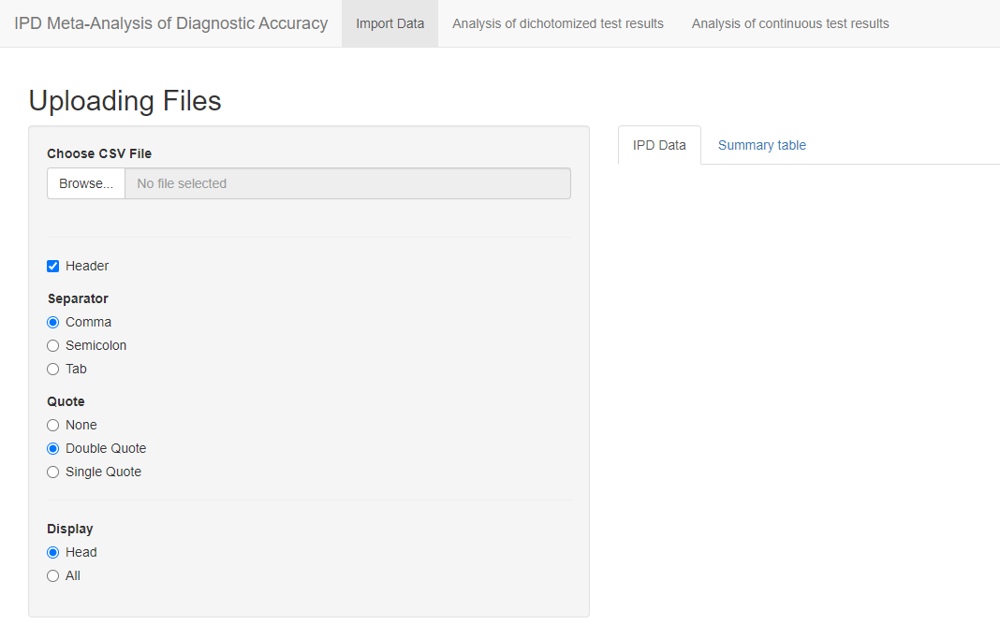 -->
<!-- ``` -->

Several recently-released software provide interactive diagnostic applications for firarms and toolmarks evidence.
Most notable of these software is the Virtual Comparison Microscopy application from Cadre Forensics\texttrademark.
In contrast to traditional Light Comparison Microscopy (LCM) that uses a comparison microscope, this software displays digital representations of the cartridge case surface on a computer screen.
Figure \@ref(fig:topMatchAnnotationExample) shows a screenshot of comparing two cartridge case surfaces [@Chapnick2020].
The functionality shown allows the user to manually annotate the surfaces of the two cartridge cases to identify similar and different markings.
For example, the user has selected a shade of blue to represent similarities between the two surfaces.
Conversely, shades of yellow and red represent differences between the two surfaces.
This sort of interactivity allows the user to customize their analysis more effectively than they could with a static visualization.
Further, we can save a history of the annotations for further analysis.
These annotations are a visual diagnostic tool that allows others to understand the specific patterns that the examiner looks at during an examination.
Another major benefit of using VCM over LCM is the ability to share scans over the internet rather than sending the physical specimen to another lab, which takes time and may damage the specimen.
@Duez2017, @Chapnick2020, and @Knowles2021 all demonstrate that performing forensic examinations using such VCM technology yields equally, if not more, accurate conclusions compared to traditional LCM methods.

```{r topMatchAnnotationExample,fig.cap="A screenshot of the TopMatch-3D\\texttrademark\\ Virtual Comparison Microscopy software. In this example, similar and different markings on the cartridge case scans are manually annotated by the user using shades of blue and yellow/red, respectively.",out.width = "\\textwidth"}
knitr::include_graphics("images/topMatchSoftwareAnnotation.jpg")
```


In Chapter 3, we introduce a suite of static and interactive visual diagnostic tools.
We discuss how these visual diagnostic tools can be used by both researchers and practitioners to understand the behavior of automatic cartridge case comparison algorithms.

## Automating and Improving the Cartridge Case Comparison Pipeline

In this section, we review preliminaries needed to understand various sub-routines of the cartridge case comparison pipeline.

### Image Processing Techniques

We first review image processing and computer vision algorithms used in cartridge case comparison algorithms.
Throughout this section, let $A, B \in \mathbb{R}^{k \times k}$ denote two images for $k > 0$.
We use lowercase letters and subscripts to denote a particular value of a matrix: $a_{ij}$ is the value in the $i$-th row and $j$-th column, starting in the top-left corner, of matrix $A$.
In our application, $A$ and $B$ represent the surface matrices of two cartridge cases.

#### Image Registration

*Image registration* involves transforming image $B$ to align best with image $A$ (or vice versa) [@Brown1992].
In our application, this transformation is composed of a discrete translation $(m^*,n^*) \in \mathbb{Z}^2$ and rotation by $\theta^* \in [-180^\circ, 180^\circ]$.
Together, we refer to $(m^*,n^*,\theta^*)$ as the "registration" of image $B$ to $A$.
To determine the optimal registration, we calculate the *cross-correlation function* between $A$ and $B$, denoted $(A \star B)$, which measures the similarity between $A$ and $B$ for every possible translation of $B$.
The CCF between $A$ and $B$ is a 2D array of dimension $2k - 1 \times 2k - 1$ where the value of the $m,n$-th element is given by:

$$
(a \star b)_{mn} = \sum_{i=1}^k \sum_{j=1}^k a_{mn} \cdot b_{i + m,j + n}
$$

where $1 \leq m,n \leq 2k -1$.
The value $(a \star b)_{mn}$ quantifies the similarity between $A$ and $B$ after $B$ is translated $m$ elements horizontally and $n$ elements vertically.

A natural choice for aligning $A$ and $B$ is the translation that maximizes the CCF.
However, we must also consider that $B$ may also need to be rotated to align optimally with $A$.
We therefore compute the maximum CCF value across a range of rotations of $B$.
Let $B_\theta$ denote $B$ rotated by an angle $\theta$ and $b_{\theta_{mn}}$ the $m,n$-th element of $B_\theta$. Then the estimated registration $(m^*, n^*, \theta^*)$ is:

$$
(m^*, n^*, \theta^*) = \arg \max_{m,n,\theta} (a \star b_{\theta})_{mn}.
$$

In practice, we consider a discrete range of rotations $\Theta \subset [-180^\circ, 180^\circ]$.
The registration procedure is given by:

1. For each $\theta \in \pmb{\Theta}$:

> 1.1 Rotate image $B$ by $\theta$ to obtain $B_\theta$.

> 1.2 Calculate the CCF between $A$ and $B_\theta$.

> 1.3 Determine the translation $[m_{\theta}^*,n_{\theta}^*]$ at which the CCF is maximized. Also, record the CCF value associated with this translation.

2. Across all $\theta \in \Theta$, determine the rotation $\theta^*$ at which the largest CCF value is achieved.

3. The estimated registration consists of rotation $\theta^*$ and translation $[m^*,n^*] \equiv [m_{\theta^*}^*,n_{\theta^*}^*]$.

In this instance, we refer to image $A$ as the "reference" and $B$, the image aligned to the reference, as the "target."
We represent the transformation to register $B$ to $A$ element-wise where the index $i,j$ maps to $i^*,j^*$ by:

$$
\begin{pmatrix} j^* \\ i^* \end{pmatrix} = \begin{pmatrix} n^* \\ m^* \end{pmatrix} + \begin{pmatrix} \cos(\theta^*) & -\sin(\theta^*) \\ \sin(\theta^*) & \cos(\theta^*) \end{pmatrix} \begin{pmatrix} j \\ i \end{pmatrix}.
$$

Under this transformation, the value $b_{ij}$ now occupies the the $i^*,j^*$-th element.
In practice, we use *nearest-neighbor interpolation* meaning $i^*$ and $j^*$ are rounded to the nearest integer.

Based on the definition given above, the CCF is computationally taxing.
In image processing, it is common to use an implementation based on the Fast Fourier Transform [@Brown1992].
This implementation leverages the Cross-Correlation Theorem, which states that for images $A$ and $B$ the CCF can be expressed in terms of a frequency-domain pointwise product:

$$
(A \star B)[m,n] = \mathcal{F}^{-1}\left(\overline{\mathcal{F}(A)} \odot \mathcal{F}(B)\right)[m,n]
$$

where $\mathcal{F}$ and $\mathcal{F}^{-1}$ denote the discrete Fourier and inverse discrete Fourier transforms, respectively, and $\overline{\mathcal{F}(A)}$ denotes the complex conjugate [@fft_brigham].
Because the product on the right-hand side is calculated pointwise, this result allows us to trade the moving sum computations from the definition of the CCF for two forward Fourier transformations, a pointwise product, and an inverse Fourier transformation.
The Fast Fourier Transform (FFT) algorithm can be used to reduce the computational load considerably.

Figure \@ref(fig:ccfTranslationExample) shows an example of two images $A$ and $B$ of dimension $100 \times 100$ and $21 \times 21$, respectively.
The white boxes in both of the images are of dimension $10 \times 10$.
The box in image A is centered on index [30,50] while the box in image B is centered on index [11,11].
The right image shows the result of calculating the CCF using image $A$ as reference and $B$ as template.
The CCF achieves a maximum of 1, indicating a perfect match, at the translation value of $[m^*,n^*] = [22,-2]$.
This means that if image B were overlaid onto image A such that their center indices coincided, then image B would need to be shifted 22 units "up" and 2 units "left" to match perfectly with image A.

```{r ccfTranslationExample,echo=FALSE,fig.cap="(Left) A reference image $A$ and template image $B$ both featuring a white box of dimension $10 \\times 10$. (Right) The cross-correlation function (CCF) between $A$ and $B$. The index at which the CCF is maximized represents the translation at which $A$ and $B$ are most similar.",out.width="\\textwidth"}
knitr::include_graphics("figures/unnamed-chunk-13-1.png")
```

#### Gaussian Filters

In image processing, a Gaussian filter (equivalently, blur or smoother) is a mathematical operator that imputes the values in an image using a locally-weighted sum of surrounding values.
We use a *lowpass* Gaussian filter to smooth the surface values of a cartridge case scan.
The weights are dictated according to the Gaussian function of a chosen standard deviation $\sigma$ given by:

$$
f(n,m;\sigma) = \frac{1}{2\pi\sigma^2} \exp\left(-\frac{1}{2\sigma^2}(n^2 + m^2)\right).
$$

It is common to populate a 2D array with the values of the Gaussian function treating the center index as the origin.
Such an array is called a *kernel*.
An example of a $3 \times 3$ Gaussian kernel $K$ with standard deviation $\sigma = 1$ is given below.

$$
K = 
\begin{pmatrix}
0.075 & 0.124 & 0.075 \\
0.124 & 0.204 & 0.124 \\
0.075 & 0.124 & 0.075
\end{pmatrix}.
$$

For an image $A$ and Gaussian kernel $K$ with standard deviation $\sigma$, the lowpass filtered version of $A$, denoted $A_{lp,\sigma}$ is given by:
$$
A_{lp,\sigma}[m,n] = \mathcal{F}^{-1}\left(\mathcal{F}(A) \odot \mathcal{F}(K)\right)[m,n].
$$
This operation, known as *convolution*, is extremely similar to the calculation of the CCF defined in the Image Registration section [@ISO1661021].

From left to right, Figure \@ref(fig:gaussianFilterExample) shows an image $A$ of a box injected with Gaussian noise (noise standard deviation $\sigma_n = 0.3$) followed by the application of various Gaussian filters.
In the middle of Figure \@ref(fig:gaussianFilterExample), we see that the lowpass filter (kernel standard deviation $\sigma_k = 2$) recovers some of the definition of the box by "smoothing" some of the Gaussian noise.

If a lowpass filter smooths values in an image, then a *highpass* filter performs a "sharpening" operation.
For an image $A$ and kernel standard deviation $\sigma$, the highpass filtered version $A_{hp}$ can be defined as:

$$
A_{hp,\sigma} = A - A_{lp,\sigma}.
$$

The highpass filter therefore removes larger-scale (smooth) structure from an image and retains high-frequency structure such as noise or edges.
The fourth facet of Figure \@ref(fig:gaussianFilterExample) shows a highpass-filtered image $A$ .
The smooth interior of the box is effectively removed from the image while the edges are preserved.

Finally, a *bandpass* Gaussian filter simultaneously performs highpass sharpening and lowpass smoothing operations.
Generally, the standard deviation of the highpass kernel will be considerably larger than that of the lowpass kernel.
This leads to retaining sharp edges while also reducing noise.
An example of a bandpass filtered image $A$ is shown in Figure \@ref(fig:gaussianFilterExample).
The edges of the box are better-preserved compared to the lowpass filter figure while the interior of the box is better-preserved compared to the highpass filter figure.

```{r gaussianFilterExample,echo=FALSE,fig.cap="An image $A$ of a box with Gaussian noise undergoing a lowpass, highpass, and bandpass filter operation.",out.width="\\textwidth"}
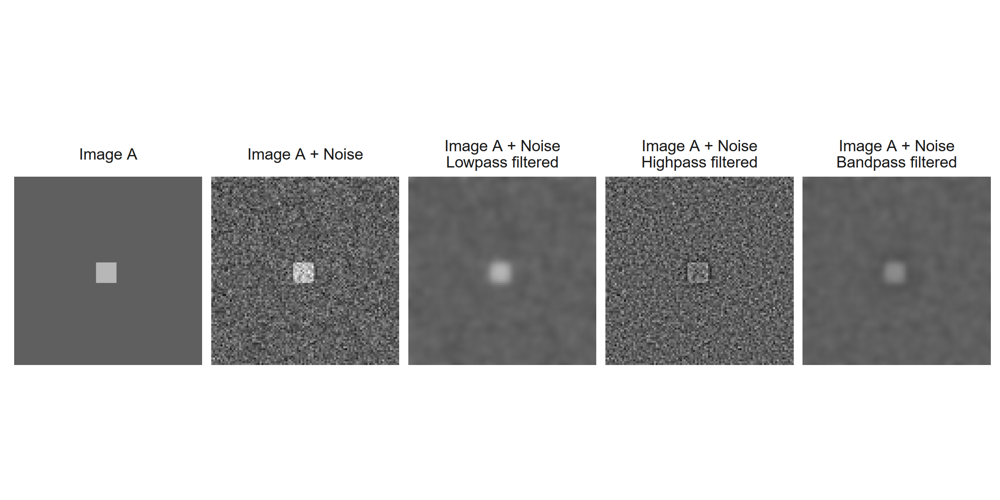
```

Variations on the standard Gaussian filter include the "robust" Gaussian regression filter.
This filter fluctuates between a filter step, which applies a Gaussian filter, and outlier step, which identifies and omits outlier observations from the next filter step [@robustFilter].
Another alternative, the "edge preserving" filter, adapts the kernel weights when approaching the boundary of an image to mitigate so-called *boundary effects* [@Aurich1995].

We use Gaussian filters to change the values on the interior of a cartridge case surface to better emphasize breech face impressions.
In the next section, we discuss applying morphological operations to change the values on the edges of a cartridge case surface.


#### Morphological Operations

Mathematical morphology refers to a theory and collection of image processing techniques for geometrical structures [@Haralick1987].
In our application, these geometrical structures are cartridge case scans; specifically, binarized versions of these scans representing whether a particular pixel contains part of the cartridge case surface.
We discuss this in greater detail in Chapter 2.

Two fundamental operations in mathematical morphology are *dilation* and *erosion* [@Haralick1987].
For our purposes, these are both set operations on black and white, encoded as 0 and 1 respectively, images.
We call the set of black and white pixels the "background" and "foreground" of the image, respectively.
For an image $A$, let $W = \{(m,n) : A_{mn} = 1\}$ denote the foreground of $A$.
An example of a $7 \times 7$ binary image $A$ with $W = \{(3,3),(3,4),(3,5),(4,3),(4,4),(4,5),(5,3),(5,4),(5,5)\}$ is given below.

$$
A = 
\begin{pmatrix}
0 & 0 & 0 & 0 & 0 & 0 & 0 \\
0 & 0 & 0 & 0 & 0 & 0 & 0 \\
0 & 0 & 1 & 1 & 1 & 0 & 0 \\
0 & 0 & 1 & 1 & 1 & 0 & 0 \\
0 & 0 & 1 & 1 & 1 & 0 & 0 \\
0 & 0 & 0 & 0 & 0 & 0 & 0 \\
0 & 0 & 0 & 0 & 0 & 0 & 0
\end{pmatrix}
$$

A *structuring element* is a second, typically small, array $B$ of ones that affects the amount of dilation or erosion applied to $W$ within $A$.
For simplicity, the indexing of the structuring element uses the center element as the index origin.
For example, a $3 \times 3$ structuring element is given by $B = \{(-1,-1),(-1,0),(-1,1),(-1,0),(0,0),(0,1),(1,-1),(1,0),(1,1)\}$ or visually:

$$
B = 
\begin{pmatrix}
1 & 1 & 1 \\
1 & 1 & 1 \\
1 & 1 & 1 
\end{pmatrix}
$$

As the name suggests, a *dilation* grows the region $W$ within image $A$ by replacing 0-valued pixels that border $W$ with 1.
The structuring element $B$ dictates which pixels are replaced with 1.
We define the dilation of $W$ by $B$, denoted $W \oplus B$, element-wise:

$$
W \oplus B = \{[m,n] \in A : [m,n] = [i + k,j + l] \text{ for } [i,j] \in W \text{ and } [k,l] \in B\}
$$

In our example,
$$W \oplus B = \{[3,2],[3,3],[3,4],[3,5],[3,6],[4,2],[4,3],[4,4],[4,5],[4,6],[5,2],[5,3],[5,4],[5,5],[5,6]\}$$
or visually:

$$
W \oplus B = 
\begin{pmatrix}
0 & 0 & 0 & 0 & 0 & 0 & 0 \\
0 & 1 & 1 & 1 & 1 & 1 & 0 \\
0 & 1 & 1 & 1 & 1 & 1 & 0 \\
0 & 1 & 1 & 1 & 1 & 1 & 0 \\
0 & 1 & 1 & 1 & 1 & 1 & 0 \\
0 & 1 & 1 & 1 & 1 & 1 & 0 \\
0 & 0 & 0 & 0 & 0 & 0 & 0
\end{pmatrix}.
$$

The dilation operation by this $B$ has the effect of growing the region $W$ inside of $A$ by one index in each direction.

In contrast, *erosion* has the effect of shrinking $W$.
The erosion of $W$ by $B$ is:

$$
A \ominus B = \{[m,n] \in A: [m,n] + [k,l] \in A \text{ for every } [k,l] \in B\}.
$$

Using the same example as above, $W \ominus B = \{[3,3]\}$ or visually:

$$
W \ominus B =
\begin{pmatrix}
0 & 0 & 0 & 0 & 0 & 0 & 0 \\
0 & 0 & 0 & 0 & 0 & 0 & 0 \\
0 & 0 & 0 & 0 & 0 & 0 & 0 \\
0 & 0 & 0 & 1 & 0 & 0 & 0 \\
0 & 0 & 0 & 0 & 0 & 0 & 0 \\
0 & 0 & 0 & 0 & 0 & 0 & 0 \\
0 & 0 & 0 & 0 & 0 & 0 & 0
\end{pmatrix}.
$$

Erosion by this $B$ shrinks the region $W$ in $A$ by one index in each direction.

Figure \@ref(fig:dilationErosionExample) shows our example represented using black and white pixels.
In practice, the foreground set $W$ may contain disconnected regions to which dilation or erosion can be independently applied.

```{r dilationErosionExample,echo=FALSE,fig.cap="A $7 \\times 7$ image $A$ featuring a $3 \\times 3$ box undergoing dilation and erosion by a $3 \\times 3$ structuring element $B$.",out.width="\\textwidth"}
knitr::include_graphics("figures/unnamed-chunk-15-1.png")
```

This concludes our review of image processing techniques we use in subsequent chapters.
Next, we discuss a clustering procedure used in Chapter 4 to calculate similarity features.

### Density-Based Spatial Clustering of Applications with Noise

The Density-Based Spatial Clustering of Applications with Noise (DBSCAN) algorithm is a clustering procedure that assigns observations to clusters if they are in a region of high observation density [@Ester1996].
As we will see, the DBSCAN algorithm does not require the user to pre-specify the number of expected clusters as is required in common clustering algorithms like K-means.
Further, the algorithm does not require that all points be assigned to a cluster.
<!-- Points not assigned to a cluster at the end of the algorithm are called "noise points." -->

Let $D$ represent a $n \times p$ data set ($n$ observations, each of dimension $p$) and let $x,y,z \in D$ denote three observations.
The DBSCAN algorithm relies on the notion of $\epsilon$-neighborhoods.
Given some neighborhood radius $\epsilon \in \mathbb{R}$ and distance metric $d$, $y$ is in the $\epsilon$-neighborhood of $x$ if $d(x,y) \leq \epsilon$.
The *$\epsilon$-neighborhood* of $x$ is defined as the set $N_{\epsilon}(x) = \{y \in D : d(x,y) \leq \epsilon\}$.
Given a minimum number of points $Minpts \in \mathbb{N}$ (notation used in [@Ester1996]), observation $x$ is called a *core point* with respect to $\epsilon$ and $Minpts$ if $|N_{\epsilon}(x)| \geq Minpts$.
Core points are treated as the "seeds" of clusters in the DBSCAN algorithm.
The user must select values of $\epsilon$ and $Minpts$.

Figure \@ref(fig:epsNeighborhoodExample) shows an example of a data set $D \in \mathbb{R}^{10 \times 2}$.
We represent the 10 observations in $D$ on the Cartesian plane.
An $\epsilon$-neighborhood using the Euclidean distance metric and $\epsilon = 3$ is drawn around an observation $x$ located at $(3,2)$.
Points inside the circle are neighbors of $x$.
If, for example, $Minpts = 2$, then $x$ would be considered a core point.

```{r}
library(ggplot2)
library(magrittr)
plt <- data.frame(x = c(-5,0,1,1,3,4,4,4,7),
                  y = c(-6,-2,0,3,4,-5,4,7,-3),
                  color = c("red","red","blue","blue","blue","red","blue","red","red")) %>%
  ggplot() +
  geom_point(aes(x = x,y = y,colour = color),
             size = 2) +
  scale_colour_identity() +
  theme_bw() +
  coord_fixed(xlim = c(-8,8),ylim = c(-8,8)) +
  theme(axis.title = element_blank()) +
  geom_point(x = 3,y = 2,size = 3) +
  geom_point(x = 3,y = 2,pch = 21,fill = NA,stroke = 2,size = 48,
             inherit.aes = FALSE) +
  geom_segment(aes(x = 3,y = 2,xend = 6,yend = 2)) +
  geom_text(x = 4.5,y = 2.5,label = "eps = 3",check_overlap = TRUE) +
  scale_x_continuous(breaks = c(-8,-6,-4,-2,0,2,4,6,8)) +
  scale_y_continuous(breaks = c(-8,-6,-4,-2,0,2,4,6,8))

ggsave(filename = "figures/dbscanExample_corePoint.png",plot = plt)
```


```{r epsNeighborhoodExample,echo=FALSE,fig.cap="An $\\epsilon$-neighborhood around a observation located at $(3,2)$ for $\\epsilon = 3$. Points are colored blue if they are neighbors to this observation and red otherwise.",out.width=".8\\textwidth"}
knitr::include_graphics("figures/dbscanExample_corePoint.png")
```

@Ester1996 introduces two relational notions, *density-reachability* and *density-connectivity*, to identify regions of high observation density.
A point $y$ is *directly density-reachable* to a point $x$ if $x$ is a core point and $y \in N_{\epsilon}(x)$.
In Figure \@ref(fig:epsNeighborhoodExample), the observation located at $(1,0)$ is directly density-reachable to the observation located at $(3,2)$.
More broadly, a point $x_m$ is *density-reachable* to a point $x_1$ if there exists a chain of observations $x_1,x_2,...,x_{m-1},x_m$ such that $x_{i+1}$ is directly density-reachable from $x_i$, $i = 1,...,n$.
Density reachability captures the notion of "neighbors of neighbors" for core points.
The DBSCAN algorithm agglomerates density-reachable points into single clusters.

Figure \@ref(fig:densityReachableExample) highlights three points $(1,0), (3,2)$, and $(4,4)$.
Using $\epsilon = 3$ and $Minpts = 2$, we see that all three of these points are core points.
Further, the points at $(1,0)$ and $(4,4)$ are density-reachable by way of the point $(3,2)$.

```{r}
plt <-  data.frame(x = c(-5,0,1,3,4,4,7),
                   y = c(-6,-2,3,4,-5,7,-3)) %>%
  ggplot() +
  geom_point(x = 3,y = 2,size = 3,colour = "#7fc97f") +
  geom_point(x = 3,y = 2,pch = 21,fill = NA,stroke = 2,size = 48,
             inherit.aes = FALSE,colour = "#7fc97f") +
  
  geom_point(x = 1,y = 0,size = 3,colour = "#beaed4") +
  geom_point(x = 1,y = 0,pch = 21,fill = NA,stroke = 2,size = 48,
             inherit.aes = FALSE,colour = "#beaed4") +
  geom_point(x = 4,y = 4,size = 3,colour = "#fdc086") +
  geom_point(x = 4,y = 4,pch = 21,fill = NA,stroke = 2,size = 48,
             inherit.aes = FALSE,colour = "#fdc086") +
  geom_text(x = 2.35,y = 1.55,label = "(3, 2)",colour = "#7fc97f",check_overlap = TRUE) +
  geom_text(x = .4,y = -.5,label = "(1, 0)",colour = "#beaed4",check_overlap = TRUE) +
  geom_text(x = 4.5,y = 3.6,label = "(4, 4)",colour = "#fdc086",check_overlap = TRUE) +
  geom_point(aes(x = x,y = y),
             size = 2) +
  scale_colour_identity() +
  theme_bw() +
  coord_fixed(xlim = c(-8,8),ylim = c(-8,8)) +
  theme(axis.title = element_blank()) +
  scale_x_continuous(breaks = c(-8,-6,-4,-2,0,2,4,6,8)) +
  scale_y_continuous(breaks = c(-8,-6,-4,-2,0,2,4,6,8))

ggsave(filename = "figures/dbscanExample_densityReachable.png",plot = plt)
```


```{r densityReachableExample,echo=FALSE,fig.cap="An example of three points that are density-reachable with respect to $\\epsilon = 3$ and $Minpts = 2$.",out.width=".8\\textwidth"}
knitr::include_graphics("figures/dbscanExample_densityReachable.png")
```

Finally, a point $y$ is *density-connected* to a point $x$ with respect to $\epsilon$ and $Minpts$ if there exists a point $z$ such that both $x$ and $y$ are density-reachable to $z$ (with respect to $\epsilon$ and $Minpts$).
While density-reachability requires that all points in-between two points also be core points, density-connectivity extends the notion of "neighbors of neighbors" to include points that are merely within the neighborhood of density-reachable points.
Figure \@ref(fig:densityConnectedExample) illustrates how the points located at $(4,7)$ and $(0,-2)$ are density-connected but not density-reachable.

```{r}
plt <-   data.frame(x = c(-5,0,1,1,3,4,4,4,7,3),
                    y = c(-6,-2,0,3,4,-5,4,7,-3,2)) %>%
  ggplot() +
  geom_point(x = 3,y = 2,pch = 21,fill = NA,stroke = 2,size = 48) +
  geom_point(x = 1,y = 0,pch = 21,fill = NA,stroke = 2,size = 48) +
  geom_point(x = 4,y = 4,pch = 21,fill = NA,stroke = 2,size = 48) +
  geom_text(x = 0,y = -1.5,label = "(0, -2)",check_overlap = TRUE) +
  geom_text(x = 4,y = 6.5,label = "(4, 7)",check_overlap = TRUE) +
  geom_point(aes(x = x,y = y),
             size = 2) +
  geom_point(data = data.frame(x = c(0,4),y = c(-2,7)),
             aes(x=x,y=y),size = 3) +
  scale_colour_identity() +
  theme_bw() +
  coord_fixed(xlim = c(-8,8),ylim = c(-8,8)) +
  theme(axis.title = element_blank()) +
  scale_x_continuous(breaks = c(-8,-6,-4,-2,0,2,4,6,8)) +
  scale_y_continuous(breaks = c(-8,-6,-4,-2,0,2,4,6,8))

ggsave(filename = "figures/dbscanExample_densityConnected.png",plot = plt)
```

```{r densityConnectedExample,echo=FALSE,fig.cap="An example of two points that are density-connected, but not density-reachable, with respect to $\\epsilon = 3$ and $Minpts = 2$.",out.width=".8\\textwidth"}
knitr::include_graphics("figures/dbscanExample_densityConnected.png")
```

A *cluster* $C \subset D$ with respect to $\epsilon$ and $Minpts$ satisfies the following conditions:

1. $\forall x,y$: if $x \in C$ and $y$ is density-reachable from $x$ with respect to $\epsilon$ and $Minpts$, then $y \in C$.

2. $\forall x,y \in C$: $x$ is density-connected to $y$ with respect to $\epsilon$ and $Minpts$.

For a data set $D$, the DBSCAN algorithm determines clusters based on the above definition.
Points not assigned to a cluster are classified as *noise points*.
The algorithm halts once all points are assigned to a cluster or classified as noise.

Figure \@ref(fig:dbscanResultExample) shows the labels return by DBSCAN for the example considered above with respect to $\epsilon = 3$ and $Minpts = 2$.
The algorithm finds a cluster of seven points, colored blue, and classifies three points as noise, colored red.

```{r}
plt <- data.frame(x = c(-5,0,1,1,3,3,4,4,4,7),
                  y = c(-6,-2,0,3,4,2,-5,4,7,-3),
                  label = c("Noise","Cluster","Cluster","Cluster","Cluster","Cluster","Noise","Cluster","Cluster","Noise")) %>%
  ggplot() +
  geom_point(aes(x = x,y = y,colour = label),
             size = 2) +
  scale_color_manual(values = c("blue","red")) +
  theme_bw() +
  coord_fixed(xlim = c(-8,8),ylim = c(-8,8)) +
  theme(axis.title = element_blank(),
        legend.position = "bottom") +
  scale_x_continuous(breaks = c(-8,-6,-4,-2,0,2,4,6,8)) +
  scale_y_continuous(breaks = c(-8,-6,-4,-2,0,2,4,6,8)) +
  labs(color = "DBSCAN Clustering")

ggsave(filename = "figures/dbscanExample_clusters.png")
```


```{r dbscanResultExample,echo=FALSE,fig.cap="Cluster labeling for 10 data points using the DBSCAN algorithm with parameters $\\epsilon = 3$ and $Minpts = 2$. Seven points are assigned to a single cluster and the remaining three are classified as noise.",out.width=".8\\textwidth"}
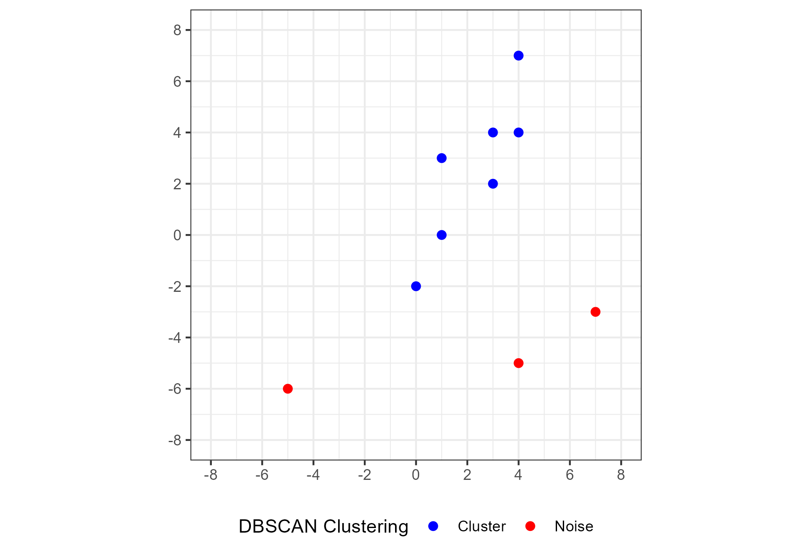
```

<!-- ### Features Based on Visual Diagnostics -->

<!-- Much of the "explainable" algorithms literature focuses on black-box machine learning algorithms such as Random Forests or Multi-layer Neural Networks. -->
<!-- Less focus is placed on constructing explainable features. -->
<!-- Feature selection and engineering is a critical, often time-intensive step in the data analysis process that isn't often -->

<!-- The visual diagnostic tools discussed in Chapter 4 are used to develop a set of features. -->
<!-- By definition, these features are human-interpretable unlike, for example, features that are calculated in the convolution layer of a convolutional neural network. -->
<!-- The interpretability of these features imply that they can be explained to forensic examiners or lay-people. -->
<!-- This will make it easier to introduce such methods into forensic labs and court rooms. -->

### Implementation Considerations

In the computational sciences, it is one thing to publish code along with research findings.
Publicly-available code and data make results accessible in terms of acquisition.
It is much more challenging to make code *conceptually* accessible to others.
The former allows others to obtain the same results under the same programming conditions while the latter empowers others to actually engage with and potentially improve upon individual pieces of the algorithm.
In any data analysis pipeline, the procedural details may be obscured as the goals of the analysis become more sophisticated.
<!-- This is helpful neither for the individual performing the analysis nor for any consumer of the results. -->
It is therefore worthwhile to design tools that make the data analysis process both easier to implement and understand [@tidy-data].

Our implementation of the cartridge case comparison pipeline adheres to the "tidy" principles of design [@tidyverse].
The "tidyverse" is a collection of R packages that share an underlying design philosophy and structure.
Knowledge and skills learned while using one tidy package can be applied to others.
The four principles of a tidy API are:

1. *Reuse existing data structures.*

> For example, users do not need to learn new data attributes or compatible functions if a package reuses existing data structures.

2. *Compose simple functions with the pipe.*

>  The pipe operator allows the output of one function to be passed as input to another without assigning a new variable. We incrementally transform data as they move from one function to another rather than drastically transforming the data in a single call.

3. *Embrace functional programming.*

> The functional programming paradigm encourages immutability of objects, meaning data passed as input to a function are not changed.
Rather, the function makes a copy of the input data, manipulates the copy, and returns the transformed copy as output.
This differs from an "object-oriented" paradigm where functions have the ability to implicitly rewrite or change the state of the original data.
It is easier to reason about a function that actually returns an object as output than one that changes the input object as a "side effect."

4. *Design for humans.*

> Designing a package for humans largely comes down to using consistent, explicit, and descriptive naming schemes for objects and functions.

Conceptualizing the cartridge case comparison procedure as a pipeline makes it easier to understand.
We go one step further by actually implementing the procedure as a sequence of algorithms that are programatically connected together in the R statistical programming language [@Rlanguage].
In particular, we utilize the pipe operator \texttt{\%\textgreater{}\%} available from the magrittr R package [@magrittr].
The pipe operator allows the user to think intuitively in terms of verbs applied to the data.
Table `r knitr::asis_output(ifelse(knitr::is_html_output(), '\\@ref(tab:pipelineTable-html)', '\\@ref(tab:pipelineTable-latex)'))` illustrates two pipelines that utilize the pipe operator.
The left-hand example shows how an R data frame is manipulated by piping it between functions from the dplyr package.
Functions like `group_by`, `summarize`, and `filter` are simple building blocks strung together to create complicated workflows.
The right-hand example similarly illustrates a cartridge case object passing through a comparison pipeline.
While the full comparison procedure is complex, the modularization to the `preProcess_`, `comparison_`, and `decision_` steps, which can further be broken-down into simpler functions, renders the process more understandable and flexible for the user.

```{r pipelineTable-latex, echo=FALSE,warning=F,message=F,eval=knitr::is_latex_output(),cache = F,fig.align='center'}
data.frame("Data Frame Manipulation Example" = c("$\\texttt{dataFrame \\%>\\%}$",
                                                 "$\\ \\ \\texttt{group\\_by(category) \\%>\\%}$",
                                                 "$\\ \\ \\texttt{summarize(x = summary(var)) \\%>\\%}$",
                                                 "$\\ \\ \\texttt{filter(x > 0) ...}$"),
           "Cartridge Case Comparison Example" = c("$\\texttt{cartridgeCase1 \\%>\\%}$",
                                                   "$\\ \\ \\texttt{preProcess\\_func(params1) \\%>\\%}$",
                                                   "$\\ \\ \\texttt{comparison\\_func(cartridgeCase2,params2) \\%>\\%}$",
                                                   "$\\ \\ \\texttt{decision\\_func(params3) ...}$")
           ) %>%
  knitr::kable(format = "latex",escape = FALSE,
               col.names = c("Data Frame Manipulation Example",
                  "Cartridge Case Comparison Example"),
               caption = "Two examples of data analysis workflows that utilize the pipe operator. The left side shows a data frame manipulation while the right side shows a comparison of two cartridge cases.",
               linesep = "",booktabs = TRUE) %>%
  kableExtra::kable_styling(full_width = TRUE)
```

```{r pipelineTable-html,echo=FALSE,warning=F,message=F,eval=knitr::is_html_output(),cache = F,fig.align='center'}
data.frame("Data Frame Manipulation Example" = c("$\\texttt{dataFrame %>%}$",
                                                 "$\\ \\ \\texttt{group_by(category) %>%}$",
                                                 "$\\ \\ \\texttt{summarize(x = summary(var)) %>%}$",
                                                 "$\\ \\ \\texttt{filter(x > 0) ...}$"),
           "Cartridge Case Comparison Example" = c("$\\texttt{cartridgeCase1 %>%}$",
                                                   "$\\ \\ \\texttt{preProcess_func(params1) %>%}$",
                                                   "$\\ \\ \\texttt{comparison_func(cartridgeCase2,params2) %>%}$",
                                                   "$\\ \\ \\texttt{decision_func(params3) ...}$")
           ) %>%
  knitr::kable(
    caption = "Two examples of data analysis workflows that utilize the pipe operator. The left side shows a data frame manipulation while the right side shows a comparison of two cartridge cases.",
    col.names = c("Data Frame Manipulation Example",
                  "Cartridge Case Comparison Example"),
    format = "html",escape = FALSE)
```


Adherence to tidy principles makes it easier to engage with and understand the overall data analysis pipeline.
In our application it also enables experimentation by making it easy to change one step of the pipeline and measure the downstream effects [@reproducibleScience].
Each step of the cartridge case comparison pipeline requires the user to define parameters.
These can range from minor to substantial, such as choosing the standard deviation used in a Gaussian filter to choosing the algorithm used to calculate a similarity score.
So far, no consensus exists for the "best" parameter settings.
A large amount of experimentation is yet required to establish these parameters.
A tidy implementation of the cartridge case comparison pipeline allows more people to engage in the validation and improvement of the procedure.

Figure \@ref(fig:taiEddyPreprocess), Figure \@ref(fig:ricePreprocess), Figure \@ref(fig:handwriterPreprocess), and Figure \@ref(fig:cmcRPreprocess) illustrate how various forensic comparison algorithms use a modularized structure to conceptualize their pre-processing procedures.
In each figure, a sequence of modular procedures are applied to a piece of evidence.
Figure \@ref(fig:taiEddyPreprocess) shows morphological and image processing procedures applied to a 2D image of a cartridge case to remove the firing pin region [@tai_fully_2018].

```{r taiEddyPreprocess,echo=FALSE,fig.cap="A pre-processing procedure applied to a 2D image of a cartridge case to identify the firing pin impression. The procedure results in a 2D image of a cartridge case without the firing pin impression region.",out.width=".7\\textwidth"}
knitr::include_graphics("images/taiEddyPreprocess.png")
```

Figure \@ref(fig:ricePreprocess) shows the procedure by which a 2D "signature" of a bullet scan is extracted from a 3D topographical scan [@Rice2020].

```{r ricePreprocess,echo=FALSE,fig.cap='A pre-processing procedure for extracting 2D bullet \\`\\`signatures" from a 3D topographic bullet scan. The procedure results in an ordered sequence of values representing the local variations in the surface of the bullet.',out.width=".8\\textwidth"}
knitr::include_graphics("images/riceBulletPreprocessDiagram.png")
```

Figure \@ref(fig:handwriterPreprocess) shows how an image of the written word "csafe" is processed using the handwriter R package to break the word into individual *graphemes* that can be further processed [@handwriter].

```{r handwriterPreprocess,echo=FALSE,fig.cap='A pre-processing procedure applied to an image of the handwritten word "csafe." The procedure results in a skeletonized version of the word that has been separated into graphemes as represented by orange nodes.',out.width=".35\\textwidth"}
knitr::include_graphics("images/handwriterPreprocessDiagram.png")
```

Finally, Figure \@ref(fig:cmcRPreprocess) shows a 3D topographical cartridge case scan undergoing various procedures to isolate and highlight the breech face impressions.
These procedures are discussed in greater detail in Chapter 2.

```{r cmcRPreprocess,echo=FALSE,fig.cap='A cartridge case undergoing various pre-processing steps. The procedure results in a cartridge case scan in which the breech face impressions have been segmented and highlighted.',out.width="\\textwidth"}
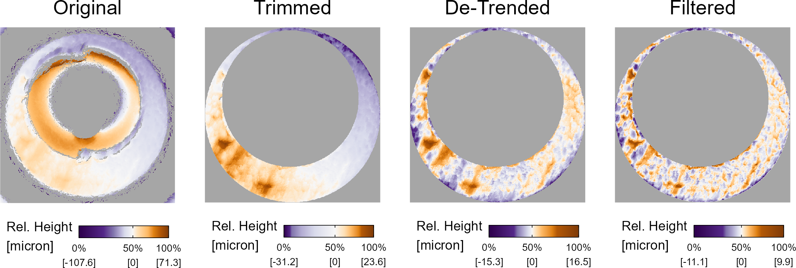
```

By breaking the broader pre-processing step into modularized pieces, we can devise other arrangements of these pre-processing procedures that may improve the segmenting or emphasizing of the region of interest.
The modularity of the pipeline makes it easier to understand what the algorithm is doing "under the hood."
A genuine modular implementation enables others to experiment with alternative versions of the pipeline, thus accelerating discovery and improvement.

<!--chapter:end:index.Rmd-->

# A Study in Reproducibility: The Congruent Matching Cells Algorithm and cmcR package

```{block, type='paperinfo_'}
Published in the *R Journal* [https://doi.org/10.32614/RJ-2023-014](https://doi.org/10.32614/RJ-2023-014)
```

```{block, type='paperauthor_'}
Joseph Zemmels, Susan VanderPlas, and Heike Hofmann
```

## Abstract {-}

Scientific research is driven by our ability to use methods, procedures, and materials from previous studies and further research by adding to it. 
As the need for computationally-intensive methods to analyze large amounts of data grows, the criteria needed to achieve reproducibility, specifically computational reproducibility, have become more sophisticated.
In general, prosaic descriptions of algorithms are not detailed or precise enough to ensure complete reproducibility of a method. 
Results may be sensitive to conditions not commonly specified in written-word descriptions such as implicit parameter settings or the programming language used. 
To achieve true computational reproducibility, it is necessary to provide all intermediate data and code used to produce published results. 
In this paper, we consider a class of algorithms developed to perform firearm evidence identification on cartridge case evidence known as the *Congruent Matching Cells* (CMC) methods. 
To date, these algorithms have been published as textual descriptions only. 
We introduce the first open-source implementation of the Congruent Matching Cells methods in the R package cmcR. 
We have structured the cmcR package as a set of sequential, modularized functions intended to ease the process of parameter experimentation. 
We use cmcR and a novel variance ratio statistic to explore the CMC methodology and demonstrate how to fill in the gaps when provided with computationally ambiguous descriptions of algorithms.

## Introduction {#intro}

```{r ,localDataDir, include=FALSE}
if (!dir.exists("data")){
  dir.create("data")
}
if (!dir.exists("figures")){
  dir.create("figures")
}
if (!file.exists("data/fadul1-1.x3p")){
  library(dplyr) # pipe not defined yet
  download.file("https://tsapps.nist.gov/NRBTD/Studies/CartridgeMeasurement/DownloadMeasurement/2d9cc51f-6f66-40a0-973a-a9292dbee36d", destfile = "data/fadul1-1.x3p", mode = "wb")
}
if (!file.exists("data/fadul1-2.x3p")){
  download.file("https://tsapps.nist.gov/NRBTD/Studies/CartridgeMeasurement/DownloadMeasurement/cb296c98-39f5-46eb-abff-320a2f5568e8", destfile = "data/fadul1-2.x3p", mode = "wb")
}
if (!file.exists("data/fadul2-1.x3p")){
  download.file("https://tsapps.nist.gov/NRBTD/Studies/CartridgeMeasurement/DownloadMeasurement/8ae0b86d-210a-41fd-ad75-8212f9522f96", destfile = "data/fadul2-1.x3p", mode = "wb")
}
```

```{r,echo=FALSE,message=FALSE,warning=FALSE}
knitr::opts_chunk$set(cache = T, dpi = 300, fig.width = 8, fig.height = 4, out.width = "\\textwidth", dpi = 300, fig.path = 'figures/cmcr-',fig.align = "center")
library(cmcR) # remotes::install_github("CSAFE-ISU/cmcR")
library(tidyverse)
library(x3ptools) # remotes::install_github("heike/x3ptools")
library(rgl)
```

Forensic examinations are intended to provide an objective assessment of the probative value of a piece of evidence.
Typically, this assessment of probative value is performed by a forensic examiner who visually inspects the evidence to determine whether it matches evidence found on a suspect.
The process by which an examiner arrives at their evidentiary conclusion is largely opaque and has been criticized [@pcast2016] because its subjectivity does not allow for an estimation of error rates.
In response, @council_strengthening_2009 pushed to augment subjective decisions made by forensic examiners with automatic algorithms that objectively assess evidence and can be explained during court testimony.
In addition to the objectivity of these algorithms, there is an additional benefit: we expect that an algorithm with the same random seed run on the same data multiple times will produce the same answer; that is, that the results are repeatable.
This is extremely beneficial because it allows the prosecution and defense to come to the same conclusion given objective evidence or data.

### Repeatability and reproducibility

Repeatability in forensic labs is enforced primarily using standard operating procedures (SOPs), which specify the steps taken for any given evaluation, along with the concentrations of any chemicals used, the range of acceptable machine settings, and any calibration procedures required to be completed before the evidence is evaluated.
When labs use computational procedures, this SOP is augmented with specific algorithms, which are themselves SOPs intended for use by man and machine.
Algorithms are generally described on two levels: we need both the conceptual description (intended for the human using the algorithm) and the procedural definition (which provides the computer hardware with a precise set of instructions).
For scientific and forensic repeatability and reproducibility, it is essential to have both pieces: the algorithm description is critical for establishing human understanding and justifying the method's use in court, but no less important is the computer code which provides the higher degree of precision necessary to ensure the results obtained are similar no matter who evaluates the evidence.
As with SOPs in lab settings, the code parameters function like specific chemical concentrations; without those details, the SOP would be incomplete and the results produced would be too variable to be accepted in court.

The @nasem_2019 defines *reproducibility* as "obtaining consistent computational results using the same input data, computational steps, methods, code, and conditions of analysis." This form of reproducibility requires that the input data, code, method, and computational environment are all described and made available to the community.
In many situations, this level of reproducibility is not provided -- not just in forensics but in many other applied disciplines.
In forensics in particular, it is easier to list the exceptions: reproducible algorithms have been proposed in sub-disciplines including DNA [@Tvedebrink2020; @osiris; @openForSciR], glass [@Curran2000; @Park2019], handwriting [@crawford_handwriting_2020], shoe prints [@park_algorithm_2020], and ballistic evidence [@hare_automatic_2016; @tai_fully_2018].

We find it useful to instead consider a more inclusive hierarchy of reproducibility.
Algorithms at higher tiers of the hierarchy are more easily reproducible in the sense that fewer resources are required to (re)-implement the algorithm.

**Definition 1** *Hierarchy of Reproducibility*

> **Conceptual description** *The algorithm is described and demonstrated in a scientific publication.*

> **Pseudocode** *The algorithm is described at a high level of detail with pseudocode implementation provided, and results are demonstrated in a scientific publication.*

> **Reproducible data** *The algorithm is described and demonstrated in a scientific publication, and input data are available in supplementary material.*

> **Comparable results** *The algorithm is described and demonstrated in a scientific publication, and input data and numerical results are provided in supplementary material.*

> **Full reproducibility** *The algorithm is described and demonstrated in a scientific publication, and the input data, source code, parameter settings, and numerical results are provided in supplementary material.*

To aid in comprehension of an algorithm, it is useful to supplement conceptual descriptions with pseudocode.
However, a conceptual description and pseudocode alone do not contain sufficient detail (e.g., parameter settings) to ensure computational reproducibility.
Implementing algorithms based on conceptual descriptions or pseudocode requires enumerating and testing possible parameter choices which, depending on their complexity, can be a lengthy and expensive process.
In contrast, implementing fully reproducible algorithms requires only as much time as it takes to emulate the original development environment.
Commonly identified reasons for unreproducible results include (1) ambiguity in how procedures were implemented, (2) missing or incomplete data, and (3) missing or incomplete computer code to replicate all statistical analyses [@leek_is_2017].
In particular, for statistical algorithms which depend on input data, we find that full reproducibility depends on the provision of both original data and any manual pre-processing applied to said data, as this manual process is not reproducible by itself.
In combination with the code, the algorithm description, and the numerical results presented in the paper, it should be possible to fully reproduce the results of a paper.

In this paper, we demonstrate the importance of higher levels of reproducibility by examining the Congruent Matching Cells (CMC) algorithm for cartridge case comparisons and developing an open-source, fully reproducible version for general use in the forensics community.

### The Congruent Matching Cells algorithm

A *cartridge case* is the portion of firearm ammunition that encases a projectile (e.g., bullet, shots, or slug) along with the explosive used to propel the projectile through the firearm.
When a firearm is discharged, the projectile is propelled down the barrel of the firearm, while the cartridge case is forced towards the back of the barrel.
It strikes the back wall, known as the *breech face*, of the barrel with considerable force, thereby imprinting any markings on the breech face onto the cartridge case and creating the so-called *breech face impressions*.
These markings are used in forensic examinations to determine whether two cartridge cases have been fired by the same firearm.
During a forensic examination, two pieces of ballistic evidence are placed under a *comparison microscope*.
Comparison microscopes allow for a side-by-side comparison of two objects within the same viewfinder, as seen in Figure \@ref(fig:ccPair).
A pair of breech face images is aligned along the thin black line in the middle of the images.
The degree to which these breech face markings can be aligned is used to determine whether the two cartridge cases came from the same source; i.e., were fired from the same firearm.
These breech face impressions are considered analogous to a firearm's "fingerprint" left on a cartridge case [@Thompson2017].

```{r ccPair,echo=FALSE,fig.cap='A cartridge case pair with visible breech face impressions under a microscope.  A thin line can be seen separating the two views. The degree to which the markings coincide is used to conclude whether the pair comes from the same source.',fig.pos='htbp',fig.fullwidth=TRUE, fig.alt="Photos of the bottoms of two matching cartridge cases separated by a vertical line. The cartridge case photos have been aligned such that it appears as if the markings from cartridge case continue across the vertical line onto the other cartridge case. This emphasizes the similar markings on the two cases.",out.width = "\\textwidth"}
knitr::include_graphics("images/cartridgeCasePair_comparison_with_line.PNG")
```

The Congruent Matching Cells (CMC) pipeline is a collection of algorithms to process and compare cartridge case evidence [@song_proposed_2013].
Since its introduction, the pipeline and its extensions [@tong_improved_2015; @chen_convergence_2017; @song_estimating_2018] have shown promise in being able to differentiate between matching and non-matching cartridge cases.
However, so far the CMC pipelines have only been introduced in the form of conceptual descriptions.
Further, the cartridge case scans used to validate the pipelines are only available in their raw, unprocessed forms on the NIST Ballistics Toolmark Research Database [@nbtrd].
While it is clear that the creators of the CMC pipeline have a working implementation, the wider forensic science community only has access to conceptual descriptions of the pipeline and summary statistics describing its performance.
In our hierarchy of reproducibility, this puts the CMC algorithm somewhere between the conceptual description and reproducible data stage: the steps are described but no code is available, and the raw data are available but manual pre-processing steps make this raw data insufficient to replicate the pipeline even with newly written code.

The development of the CMC algorithm seems to be representative of how many forensic algorithms are developed: after an algorithm is introduced, researchers build upon the foundation laid by the original algorithm in subsequent papers.
These changes are often incremental in nature and reflect a growing understanding of the algorithm's behavior.
While this cycle of scientific progress certainly is not unique to forensic algorithms, given the gravity of the application it is imperative that these incremental improvements not be unnecessarily delayed.
As such, we believe that the forensic community at-large would benefit greatly by establishing an open-source foundation for their algorithms upon which additional improvements can be developed.
Using open-source algorithms are cheaper to use than writing one's own code, enables the process of peer review by providing an accessible benchmark, and helps other research groups or companies stay on the leading edge of technology development [@linux].

Here, we describe the process of implementing the CMC pipeline for the comparison of marks on spent cartridge cases, using the descriptions from two published papers, @song_3d_2014 and @tong_improved_2015.
Our R package, cmcR, provides an open-source implementation of the CMC pipeline.
We use cmcR to illustrate how ambiguities in the textual description of an algorithm can lead to highly divergent results.
In particular, our implementation highlights an extreme sensitivity to processing and parameter decisions that has not been discussed previously.
Additionally, we argue that our implementation can be used as a template for future implementations of forensic pattern-matching algorithms to not only ensure transparency and auditability, but also to facilitate incremental improvements in forensic algorithms.

In the remainder of this paper, we describe a general, reproducible, and open-source CMC pipeline which encompasses those discussed in @song_proposed_2013, @song_3d_2014, and @tong_improved_2015.
@song_proposed_2013 lays out the conceptual framework for the original CMC pipeline later implemented in @song_3d_2014 and @tong_fired_2014.
An improvement of the pipeline presented in @tong_improved_2015 and used in subsequent papers is referred to as the "High CMC" method [@chen_convergence_2017]. However, it should be noted that what the authors refer to as the original and High CMC decision rules are variations of one step of a larger CMC pipeline.

The cmcR package contains implementations designed for use with 3D topographical scans of the original decision rule described in @song_proposed_2013 and @song_3d_2014 and the High CMC decision rule described in @tong_improved_2015.
The source code to the full cmcR package is accessible at <https://github.com/CSAFE-ISU/cmcR>.

## The CMC pipeline {#cmcMethod}

In this section, we examine the process of implementing the CMC pipeline for automatic comparisons of 3D cartridge case scans.
At each step, we will discuss how we filled in the gaps of the original description during the creation of cmcR.

All of the CMC pipelines can be broken down into three broad stages: (1) pre-processing, (2) cell-based similarity feature extraction, and (3) application of a decision rule as illustrated in \@ref(fig:overview-flow).
In the following sections we break each of these stages further into a set of modular steps.
One advantage of modularizing these algorithms is that we can implement an algorithm as a set of sequential procedures.
This allows us to test new variations against the old implementation in a coherent, unified framework.

```{r overview-flow,echo=FALSE,fig.cap='The stages of CMC pipelines. In the pre-processing stage, each scan is prepared for analysis, removing extraneous information and noise. Then, each scan is broken up into cells, which are numerically compared to cells in the other scan to determine an optimal alignment. Finally, each of the scores arising from the cells in the second stage are compared to a reference distribution to determine whether the scans originate from the same source or from different sources.',fig.pos='htbp',fig.fullwidth=TRUE, fig.alt="A diagram of three puzzle pieces arranged horizontally that represent the three stages of the CMC pipeline. The pre-processing puzzle piece shows a raw cartridge case scan with regions highlighted to be removed. The cell-based comparisons piece shows two cartridge case scans with blue and red cells overlaid. The decision rule piece shows a histogram plot of CMC counts for non-matching and matching cartridge case pairs in red and blue, respectively. The matching CMC count distribution is located at higher CMC values than the non-match distribution. "}

```

The primary difference between the two pipelines presented here, using the original and High CMC decision rules, lies in how the decision rules are utilized to separate matching vs. non-matching cartridge case pairs.
In addition, there are also several small differences in the parameters used in the pre-processing and comparison procedures.

### Initial data {#initialData}

Digital microscopy is capable of precision measurements of surface topology at high resolutions.
Using a 3D microscope, we can obtain scans of breech face impressions at the micron level ($1 \mu m = 10^{-3} mm = 10^{-6} m$).
These 3D topological scans are used as input to automated comparison algorithms, such as the CMC pipeline originally proposed in @song_proposed_2013.
We will use the same data set referenced in @song_3d_2014 and @tong_improved_2015 to illustrate usage of the cmcR package.
These 3D scans of cartridge cases are available from the NIST Ballistics Toolmark Research Database [@nbtrd].
The strings defined below refer to three cartridge case scans available on the NBTRD from @fadul_empirical_2011 and will be used throughout the remainder of this paper.

```{r eval=FALSE,echo=FALSE}
# SVP comment: Should do this in a tidy way with less code if possible...
library(cmcR)

fadul1.1_id <- "DownloadMeasurement/2d9cc51f-6f66-40a0-973a-a9292dbee36d"
# Same source comparison
fadul1.2_id <- "DownloadMeasurement/cb296c98-39f5-46eb-abff-320a2f5568e8"
# Different source comparison
fadul2.1_id <- "DownloadMeasurement/8ae0b86d-210a-41fd-ad75-8212f9522f96"

#Code to download breech face impressions:

# Aside: while the URL says "NRBTD", it's
#actually the NIST Ballistics Toolmark Research Database (so their URL
#is mistaken)

nbtrd_url <- "https://tsapps.nist.gov/NRBTD/Studies/CartridgeMeasurement"
download.file(
  file.path(nbtrd_url , fadul1.1_id), destfile = "data/fadul1-1.x3p", mode = "wb")
download.file(
  file.path(nbtrd_url , fadul1.2_id), destfile = "data/fadul1-2.x3p", mode = "wb")
download.file(
  file.path(nbtrd_url, fadul2.1_id), destfile = "data/fadul2-1.x3p", mode = "wb")
```

```{r eval=FALSE,echo=TRUE}
library(cmcR)

nbtrd_url <- "https://tsapps.nist.gov/NRBTD/Studies/CartridgeMeasurement"

x3p_ids <- c("DownloadMeasurement/2d9cc51f-6f66-40a0-973a-a9292dbee36d",
             "DownloadMeasurement/cb296c98-39f5-46eb-abff-320a2f5568e8",
             "DownloadMeasurement/8ae0b86d-210a-41fd-ad75-8212f9522f96")

file_names <- c("fadul1-1.x3p","fadul1-2.x3p","fadul2-1.x3p")

purrr::walk2(.x = x3p_ids,
             .y = file_names,
             .f = function(x3p_id,file_name){
               download.file(url = file.path(nbtrd_url, x3p_id),
                             destfile = paste0("data/",file_name),mode = "wb")
             })
```

Cartridge case scans are commonly stored in the ISO standard x3p file format [@ISO25178-72].
x3p is a container format which consists of a single surface matrix representing the height value of the breech face surface and metadata concerning the parameters under which the scan was taken (size, resolution, creator, microscope, microscopy software versions, etc.).
The x3ptools package provides functionality to work with the format in R [@x3ptools].

Figure `r knitr::asis_output(ifelse(knitr::is_html_output(), '\\@ref(fig:cartridgeCasePair-html)', '\\@ref(fig:cartridgeCasePair-latex)'))` shows the surface matrices of a known match (KM) pair of cartridge cases from a study by @fadul_empirical_2011.
In this study, a total of 40 cartridge cases were scanned with a lateral resolution of 6.25 microns (micrometers) per pixel.
The surface matrices are approximately $1200 \times 1200$ pixels in size corresponding to an area of about $3.8 \times 3.8$ mm$^2$.

```{r, fadul1-1Screenshot,include=FALSE,cache=TRUE}
fadul1.1 <- x3ptools::x3p_read("data/fadul1-1.x3p")

#apply low-pass filter to reduce noise in scan:
surface1 <- fadul1.1 %>%
  cmcR::preProcess_gaussFilter(wavelength = 16,filtertype = "lp")

surface1 <- surface1$surface.matrix

params <- rgl::r3dDefaults

zoom <- .7
size <- c(300,300)

params$windowRect <- c(40, 125, 40 + size[1], 125 + size[2])
params$userMatrix <- diag(c(1, 1, 1, 1))
params$zoom <- zoom

#for some reason the first rgl device opened doesn't plot anything, but
#subsequent devices do...
open3d(params = params)
close3d()

#opens blank "canvas" upon which we can add lights, surfaces, etc.
open3d(params = params)

#removes any previously declared lights in scene
rgl.pop("lights")

#set-up two lights for scene -- a lot of experimentation possible here
light3d(x = -1,y = 1,z = 2,viewpoint.rel = TRUE,ambient = "white",diffuse = "white",specular = "white")
light3d(x = 0,y = 0,z = 10,ambient = "grey60",diffuse = "grey50",specular = "grey60",viewpoint.rel = TRUE)

#setup surface visualization
multiply <- 1 #x3ptools::image_x3p default to exaggerate relief
z <- multiply * surface1 # Exaggerate the relief
yidx <- ncol(z):1
y <- fadul1.1$header.info$incrementY * yidx
x <- fadul1.1$header.info$incrementX * (1:nrow(z))

# emission, specular, ambient affect how the surface interacts with lights --
# again, a lot of possible experimentation
surface3d(x, y, z, back = "filled",emission = "grey30",specular = "grey50",ambient = "grey10")

x3ptools::x3p_snapshot(file = "figures/fadul1-1.png")

close3d()
```

```{r ,fadul1-2Screenshot,include=FALSE,cache=TRUE}
fadul1.2 <- x3ptools::x3p_read("data/fadul1-2.x3p")

surface2 <- fadul1.2 %>%
  cmcR::preProcess_gaussFilter(wavelength = 16,filtertype = "lp")
#opens blank "canvas" upon which we can add lights, surfaces, etc.
open3d(params = params)

surface2 <- surface2$surface.matrix

#removes any previously declared lights in scene
rgl.pop("lights")

#set-up two lights for scene -- a lot of experimentation possible here
light3d(x = -1,y = 1,z = 2,viewpoint.rel = TRUE,ambient = "white",diffuse = "white",specular = "white")
light3d(x = 0,y = 0,z = 10,ambient = "grey60",diffuse = "grey50",specular = "grey60",viewpoint.rel = TRUE)

#setup surface visualization
multiply <- 1 #x3ptools::image_x3p default to exaggerate relief
z <- multiply * surface2 # Exaggerate the relief
yidx <- ncol(z):1
y <- fadul1.2$header.info$incrementY * yidx
x <- fadul1.2$header.info$incrementX * (1:nrow(z))

# emission, specular, ambient affect how the surface interacts with lights --
# again, a lot of possible experimentation
surface3d(x, y, z, back = "filled",emission = "grey30",specular = "grey50",ambient = "grey10")

x3ptools::x3p_snapshot(file = "figures/fadul1-2.png")

close3d()
```

```{r cartridgeCasePair-html,eval=knitr::is_html_output(),echo=FALSE,fig.cap='Unprocessed surface matrices of the known-match Fadul 1-1 and Fadul 1-2 Fadul et al. \\(2011\\). The observations in the corners of these surface matrices are artifacts of the staging area in which these scans were taken. The holes on the interior of the primer surfaces are caused by the firing pin striking the primer during the firing process. The region of the primer around this hole does not come into uniform contact with the breech face of the firearm.', fig.subcap=c('',''),fig.align='center',fig.pos='htbp',out.width=".49\\linewidth",out.height=".49\\linewidth",fig.alt="A visualization of two unprocessed cartridge case scans where the surface height values are mapped to a gray color gradient. It is difficult to assess the similarity between the unprocessed scans, which motivates the need for the pre-processing stage of the CMC pipeline."}
knitr::include_graphics(c("figures/fadul1-1.png","figures/fadul1-2.png"))
```

```{r cartridgeCasePair-latex,eval=knitr::is_latex_output(),echo=FALSE,fig.cap='Unprocessed surface matrices of the known-match Fadul 1-1 and Fadul 1-2 Fadul et al. \\(2011\\). The observations in the corners of these surface matrices are artifacts of the staging area in which these scans were taken. The holes on the interior of the primer surfaces are caused by the firing pin striking the primer during the firing process. The region of the primer around this hole does not come into uniform contact with the breech face of the firearm.',fig.alt="A visualization of two unprocessed cartridge case scans where the surface height values are mapped to a gray color gradient. It is difficult to assess the similarity between the unprocessed scans, which motivates the need for the pre-processing stage of the CMC pipeline.", fig.subcap=c('',''),fig.align='center',fig.pos='htbp',out.width=".49\\linewidth",out.height=".49\\linewidth"}
knitr::include_graphics(c("figures/fadul1-1.png","figures/fadul1-2.png"))
```

Only certain regions of a cartridge case contain identifying breech face impression markings.
@song_proposed_2013 defines "valid correlation regions" as regions where "the individual characteristics of the ballistics signature are found that can be used effectively for ballistics identification." 
Prior to applying the CMC comparison procedure, cartridge scans must undergo some pre-processing to isolate the valid correlation regions.

```{r load-data, include = F, cache = T}

fadul1.1 <- x3ptools::x3p_read("data/fadul1-1.x3p") %>%
  cmcR::preProcess_crop(region = "exterior",
                        offset = -30) %>%
  cmcR::preProcess_crop(region = "interior",
                        offset = 200) %>%
  cmcR::preProcess_removeTrend(statistic = "quantile",
                               tau = .5,
                               method = "fn") %>%
  cmcR::preProcess_gaussFilter() %>%
  x3ptools::sample_x3p()

fadul1.2 <- x3ptools::x3p_read("data/fadul1-2.x3p") %>%
  cmcR::preProcess_crop(region = "exterior",
                        offset = -30) %>%
  cmcR::preProcess_crop(region = "interior",
                        offset = 200) %>%
  cmcR::preProcess_removeTrend(statistic = "quantile",
                               tau = .5,
                               method = "fn") %>%
  cmcR::preProcess_gaussFilter() %>%
  x3ptools::sample_x3p()
```

```{r cmc-ccf, include = F, cache = T}
reference_11 <- purrr::partial(.f = comparison_allTogether,
                               reference = fadul1.1, target = fadul1.2,
                               numCells = c(8,8), maxMissingProp = .85,returnX3Ps = TRUE)
reference_12 <- purrr::partial(.f = comparison_allTogether,
                               reference = fadul1.2, target = fadul1.1,
                               numCells = c(8,8), maxMissingProp = .85,returnX3Ps = TRUE)

kmComparisonFeatures <- purrr::map_dfr(seq(-30,30,by = 3),
                                       ~reference_11(theta = .)) %>%
  mutate(originalMethodClassif = decision_CMC(cellIndex = cellIndex,
                                              x = x,
                                              y = y,
                                              theta = theta,
                                              corr = pairwiseCompCor,
                                              xThresh = 20,
                                              thetaThresh = 6,
                                              corrThresh = .5),
         highCMCClassif = decision_CMC(cellIndex = cellIndex,
                                       x = x,
                                       y = y,
                                       theta = theta,
                                       corr = pairwiseCompCor,
                                       xThresh = 20,
                                       thetaThresh = 6,
                                       corrThresh = .5,
                                       tau = 1))

kmComparisonFeatures_rev <- purrr::map_dfr(seq(-30,30,by = 3),
                                           ~reference_12(theta = .)) %>%
  mutate(originalMethodClassif = decision_CMC(cellIndex = cellIndex,
                                              x = x,
                                              y = y,
                                              theta = theta,
                                              corr = pairwiseCompCor,
                                              xThresh = 20,
                                              thetaThresh = 6,
                                              corrThresh = .5),
         highCMCClassif = decision_CMC(cellIndex = cellIndex,
                                       x = x,
                                       y = y,
                                       theta = theta,
                                       corr = pairwiseCompCor,
                                       xThresh = 20,
                                       thetaThresh = 6,
                                       corrThresh = .5,
                                       tau = 1))
```

### Pre-processing procedures {#preProcessing}

During the pre-processing stage, we apply sequential steps to prepare each cartridge case for analysis.
The goal of this process is to remove the edges and center of the scan which did not come into contact with the breech face, as well as any artifacts of the scan and microscope staging which do not accurately represent the breech face surface.
The various iterations of the CMC algorithm describe different variations of these steps.
A summary of these steps is shown in Figure \@ref(fig:pre-processing-schematic).

```{r pre-processing-schematic,echo=FALSE,fig.cap="Overview of the set of pre-processing steps used in the CMC algorithms. Where a procedure step is not discussed or explicitly not applied in the paper, the path traverses empty space.",fig.align="center",fig.fullwidth=TRUE,fig.alt="A flow diagram showing the various pre-processing procedures used across CMC papers. These steps are shown as horizontally-arranged puzzle pieces and include type of input, the amount of downsampling performed on the scans, any resizing performed after downsampling, whether the breech face impression regions were isolated manually or automatically, and the type of Gaussian filter applied. Traversing these puzzle pieces is a curve for each CMC paper. The diagram is intended to show how different the pre-processing procedures are across papers, which makes it difficult to compare results if the underlying data/code aren't avaiable.",out.width="\\textwidth"}

```

Translating the pre-processing steps in Figure \@ref(fig:pre-processing-schematic) into an implementation requires the implementer to decide between potentially many implicit parameter choices.
For example, Table `r knitr::asis_output(ifelse(knitr::is_html_output(), '\\@ref(tab:pre-processTable-html)', '\\@ref(tab:pre-processTable-latex)'))` compares the pre-processing procedures as described in @song_3d_2014 to considerations that need to be made when implementing the procedures.
Depending on one's interpretation of the description, there are many possible implementations that satisfy the described procedure - in contrast, there was only one implementation that led to the original results.
While not explicitly mentioned in @song_3d_2014, @song_estimating_2018 indicates that the "trimming" of the unwanted regions of the scan is performed manually.
It is difficult to replicate manual steps as part of a reproducible pipeline; the best solution is for the authors to provide intermediate data after the manual steps have been completed.

```{r pre-processTable-latex,echo=FALSE,eval=knitr::is_latex_output()}
data.frame("Description from Song et al. (2014)" = 
             c('"Trim off the inside firing pin surface and other areas outside the breech face mark, so that only breech face impression data remain for correlation."',
               '"Identify and remove dropouts or outliers."',
               '"Apply a band-pass Gaussian regression filter with 40 $\\mu$m short cut-off length and 400 $\\mu$m long cut-off length to remove low frequency components, including surface curvature, form error, waviness and high frequency components which mainly arise from the instrument noise."'),
           "Implementation Considerations" = 
             c("Removal of firing pin hole, primer exterior, global trend, and primer roll-off",
               'Definition of outliers, what "removal" of dropouts or outliers means',
               "Wavelength cut-off parameters, specific implementation of the filter")) %>%
  knitr::kable(format = "latex",escape = FALSE,
               col.names = c("Description from Song et al. (2014)",
                             "Implementation Considerations"),
               caption = "Description of pre-processing procedures from Song et al. \\(2014\\) vs. considerations that need to be made when implementing these procedures. Each of these considerations requires the implementer to decide between potentially many choices.",
               linesep = "",booktabs = TRUE) %>%
  kableExtra::kable_styling(full_width = TRUE) %>%
  kableExtra::row_spec(row = 0,bold = TRUE)
```


```{r pre-processTable-html,echo=FALSE,eval=knitr::is_html_output()}
data.frame("Description from Song et al. (2014)" = 
             c('"Trim off the inside firing pin surface and other areas outside the breech face mark, so that only breech face impression data remain for correlation."',
               '"Identify and remove dropouts or outliers."',
               '"Apply a band-pass Gaussian regression filter with 40 $\\mu$m short cut-off length and 400 $\\mu$m long cut-off length to remove low frequency components, including surface curvature, form error, waviness and high frequency components which mainly arise from the instrument noise."'),
           "Implementation Considerations" = 
             c("Removal of firing pin hole and primer exterior<br>Removal of global trend<br>Removal of primer roll-off",
               'Definition of outliers<br>What "removal" of dropouts or outliers means',
               "Wavelength cut-off parameters<br>Specific implementation of the filter")) %>%
  knitr::kable(col.names = c("Description from Song et al. (2014)",
                             "Implementation Considerations"),
               caption = "Description of pre-processing procedures from Song et al. \\(2014\\) vs. considerations that need to be made when implementing these procedures. Each of these considerations requires the implementer to decide between potentially many choices.",
               format = "html",escape = FALSE)
```

The pre-processing procedures are implemented via modularized functions of the form `preProcess_*`.
Modularizing the steps of the pre-processing procedures makes the overall process easier to understand and allows for experimentation.
Figure \@ref(fig:processingPipeline) shows an overview of the pre-processing framework for the Fadul 1-1 breech face from reading the scan (left) to an analysis-ready region (right).
For each scan in Figure  \@ref(fig:processingPipeline), eleven height value percentiles: the Minimum (0th), 1st, 2.5th, 10th, 25th, Median (50th), 75th, 90th, 97.5th, 99th, and Maximum (100th) are mapped to a purple-to-orange color gradient.
This mapping is chosen to highlight the extreme values in each scan.

```{r cache=FALSE, include=F}
fadul1.1_original <- x3ptools::x3p_read("data/fadul1-1.x3p")

fadul1.1_croppedExt <- cmcR::preProcess_crop(fadul1.1_original,
                                             region = "exterior",
                                             offset = -30)

fadul1.1_croppedInt <- cmcR::preProcess_crop(fadul1.1_croppedExt,
                                             region = "interior",
                                             offset = 200)

fadul1.1_medRemoved <-   cmcR::preProcess_removeTrend(fadul1.1_croppedInt,
                                                      statistic = "quantile",
                                                      tau = .5,
                                                      method = "fn")


fadul1.1_downsampled <- x3ptools::sample_x3p(fadul1.1_medRemoved,
                                             m = 2)

fadul1.1_bpFiltered <- cmcR::preProcess_gaussFilter(x3p = fadul1.1_downsampled,
                                                    wavelength = c(16,500),
                                                    filtertype = "bp")
```

```{r processingPipeline_code, echo = F,warning = F,message = F,cache = F,include=FALSE}
# bookdown has difficulty with loading the pipe from magrittr
`%>%` <- magrittr::`%>%`

fadul1.1_original$surface.matrix <- fadul1.1_original$surface.matrix*1e6
fadul1.1_croppedInt$surface.matrix <- fadul1.1_croppedInt$surface.matrix*1e6
fadul1.1_medRemoved$surface.matrix <- fadul1.1_medRemoved$surface.matrix*1e6
fadul1.1_bpFiltered$surface.matrix <- fadul1.1_bpFiltered$surface.matrix*1e6

preProcessingPlot <- cmcR::x3pListPlot(list(fadul1.1_original,
                                            fadul1.1_croppedInt,
                                            fadul1.1_medRemoved,
                                            fadul1.1_bpFiltered) %>%
                                         set_names(c("(1) Original \n x3p_read()",
                                                     "(2) Crop exterior/interior \n preProcess_crop()",
                                                     "(3) Level surface \n preProcess_removeTrend()",
                                                     "(4) Band-pass filter \n preProcess_gaussFilter()")),
                                       type = "list",
                                       legend.quantiles = c(0,.5,1)) %>%
  map2(.x = .,
       .y = list(element_text(),element_blank(),element_blank(),element_blank()),
       .f = ~ .x + theme(legend.position = "bottom",
                         legend.title = .y) +
         ggplot2::guides(fill = ggplot2::guide_colourbar(barheight = grid::unit(.3,"in"),
                                                         barwidth = grid::unit(1.5,"in"),
                                                         label.theme = ggplot2::element_text(size = 7),
                                                         title.theme = ggplot2::element_text(size = 10),
                                                         title.position = "top",
                                                         frame.colour = "black",
                                                         ticks.colour = "black"),
                         colour = FALSE) +
         scale_fill_gradientn(colours = rev(c('#7f3b08','#b35806','#e08214','#fdb863','#fee0b6','#f7f7f7','#d8daeb','#b2abd2','#8073ac','#542788','#2d004b')),
                              values = scales::rescale(quantile(.x[[1]]$value,c(0,.01,.025,.1,.25,.5,.75,0.9,.975,.99,1),na.rm = TRUE)),
                              breaks = c(round(min(.x[[1]]$value,na.rm = TRUE),2),
                                         0,
                                         round(max(.x[[1]]$value,na.rm=TRUE),2)),
                              limits = c(1.01*min(.x[[1]]$value,na.rm = TRUE),
                                         1.01*max(.x[[1]]$value,na.rm=TRUE)),
                              na.value = "gray80") +
         ggplot2::labs(fill = expression("Height ["*mu*"m]")))

plt <- gridExtra::grid.arrange(preProcessingPlot$`(1) Original`,
                               preProcessingPlot$`(2) Crop exterior/interior`,
                               preProcessingPlot$`(3) Level surface`,
                               preProcessingPlot$`(4) Band-pass filter`,
                               widths = unit(c(1,1,1,1),units = "null"))

ggsave(plt,file = "figures/preProcessPipeline.png")
```

```{r processingPipeline, echo = F,warning = F,message = F,cache = T,fig.cap='Illustration of the sequential application of pre-processing steps implemented in cmcR. We map the cartridge case surface height values to a divergent purple-white-orange color scale to emphasize deviations from the median height value (represented here as 0 micrometers). At each stage, the variability in height across the scan decreases as we emphasize the regions containing breech face impressions.',fig.align='center',fig.pos='htbp',fig.fullwidth = TRUE,fig.alt="A diagram of a cartridge case scan undergoing four pre-processing steps: reading, cropping, de-trending, and filtering. The final result is a cartridge case scan with emphasized breech face impressions.",out.width="\\textwidth"}

knitr::include_graphics("figures/preProcessPipeline.png")

```


We demonstrate usage of the `preProcess_*` functions on the Fadul 1-1 scan.
Each code chunk is followed up with an explanation of the functions used.

```{r, echo=TRUE,eval=FALSE}
# Step (1)
fadul1.1 <- x3ptools::x3p_read("data/fadul1-1.x3p")
```

We begin with a 3D scan.
Typically, we downsample scans to about 25% of their size by only retaining every other row and column in the surface matrix.
The breech faces in @fadul_empirical_2011 were initially scanned at a resolution of 3.125 $\mu$m per pixel.
Downsampling reduces the resolution to 6.25 $\mu$m per pixel.
Step (1) in Figure \@ref(fig:processingPipeline) shows an unprocessed breech face scan.

```{r, echo=TRUE,eval=FALSE}
# Step (2)
fadul1.1_cropped <- fadul1.1 %>%
  cmcR::preProcess_crop(region = "exterior") %>%
  cmcR::preProcess_crop(region = "interior")
```

We then use a labeling algorithm to identify three major regions of the scan: the exterior of the cartridge case primer, the breech face impression region of interest, and the firing pin impression region in the center of the scan [@hesselink_concurrent_2001; @imager].
We remove observations outside of the breech face impression region (i.e., replaced with `NA`).
The resulting breech face scan, like the one shown in step (2) of Figure  \@ref(fig:processingPipeline), is reproducible assuming the same parameters are used.
The `preProcess_crop` function removes the exterior and firing pin impression region on the interior based on the `region` argument.

```{r, echo=TRUE,eval=FALSE}
# Step (3)
fadul1.1_deTrended <- fadul1.1_cropped %>%
  preProcess_removeTrend(statistic = "quantile", tau = .5, method = "fn")
```

In step (3), we remove the southwest-to-northeast trend observable in steps (1) and (2) of Figure \@ref(fig:processingPipeline) by subtracting the estimated conditional median height value.
The result of the `preProcess_removeTrend` function the median-leveled breech face scan in step (3) of Figure  \@ref(fig:processingPipeline).

```{r, echo=TRUE,eval=FALSE}
# Step (4)
fadul1.1_processed <- fadul1.1_deTrended %>%
  preProcess_gaussFilter(filtertype = "bp", wavelength = c(16,500)) %>%
  x3ptools::x3p_sample(m = 2)
```

Finally, we apply a band-pass Gaussian filter to the surface values to attenuate noise and unwanted large-scale structure.
Step (4) of Figure  \@ref(fig:processingPipeline) shows the effect of the `preProcess_gaussFilter` function.
There is currently no determination or removal of outliers in the cmcR package's pre-processing procedures.
Instead, we rely on the low-pass portion of the Gaussian filter to reduce the effects of any high-frequency noise.

Figure \@ref(fig:processedScans) displays the processed Fadul 1-1 and Fadul 1-2 scans; the second matrix is processed using the same parameters.
Next, similarity features are extracted from a processed cartridge case pair in the cell-based comparison procedure.

```{r processedScans,echo=FALSE,cache = T,fig.cap='Fadul 1-1 and Fadul 1-2 after pre-processing. Similar striated markings are now easier to visually identify on both surfaces. It is now clearer that one of the scans needs to be rotated to align better with the other.',fig.align='center',fig.pos='htbp',fig.fullwidth=TRUE, message = F, warning = F,fig.alt="A visualization of two pre-processed, matching cartridge case scans. The height values are mapped to a divergent purple to orange color scale to emphasize values lower or higher than the median height value, respectively. Compared to the raw cartridge case scan visualization, it is easier to see the similar markings on the pre-processed cartridge case surfaces."}

fadul1.1_scaled <- fadul1.1
fadul1.1_scaled$surface.matrix <- fadul1.1_scaled$surface.matrix*1e6
fadul1.2_scaled <- fadul1.2
fadul1.2_scaled$surface.matrix <- fadul1.2_scaled$surface.matrix*1e6

cmcR::x3pListPlot(x3pList = list("Fadul 1-1" = fadul1.1_scaled,
                                 "Fadul 1-2" = fadul1.2_scaled),
                  # x3pList = list("Fadul 1-1" = fadul1.1$x3p,
                  #"Fadul 1-2" = fadul1.2$x3p),
                  type = "faceted",
                  legend.quantiles = c(0,.01,.2,.5,.8,.99,1)) +
  guides(fill = guide_colourbar(barheight = grid::unit(2.6,"inches"),
                                label.theme = element_text(size = 7),
                                title.theme = ggplot2::element_text(size = 9),
                                frame.colour = "black",
                                ticks.colour = "black")) +
  theme(legend.position = c(1.11,.551),plot.margin = ggplot2::margin(c(0,3,.2,0),unit = "cm"))
```

### "Correlation cell" comparison procedure {#comparisonProcedure}

As described in @song_proposed_2013, breech face markings are not uniformly impressed upon a cartridge case during the firing process.
As such, only certain sections of the cartridge case are used in a comparison.
In the CMC pipeline as proposed by @song_proposed_2013 two scans are compared by partitioning one breech face scan into a grid of so-called "correlation cells".
These cells are compared individually to their best-matching counterpart on the other scan.
If a large proportion of these correlation cells are highly similar to their counterparts on the other breech face scan, this is considered as evidence that the markings on the two cartridge cases were made by the same source.
The number of highly similar cells is defined as the *CMC count* $C$ [@song_proposed_2013] of the breech-face comparison.
The CMC count is considered to be a more robust measure of similarity than the correlation calculated between two full scans.

```{r cmc-illustration, echo=FALSE,fig.cap='Illustration of comparing a cell in the reference cartridge case scan (left) to a larger region in a questioned cartridge case scan (right). Every one of the cells in the reference cartridge case is similarly paired with a region in the questioned cartridge case.  To determine the rotation at which the two cartridge cases align, the cell-region pairs are compared for various rotations of the questioned cartridge case.',fig.align='center',fig.pos='htbp',out.width='.75\\textwidth',fig.alt="A diagram of two cartridge cases scans undergoing the cell-based comparison procedure. One scan, called the 'reference,' is shown partitioned into a grid of cells. One of the cells is highlighted with an arrow connecting it to a square region in the other cartridge case scan, referred to as the 'target.' This is to illustrate how each cell in the reference scan finds its translational and rotational alignment in the target scan."}

knitr::include_graphics("images/cmc_illustration.PNG")
```

Figure \@ref(fig:cmc-illustration) illustrates the cell-based comparison procedure between two cartridge case scans.
The scan on the left serves as the reference; it is divided into a grid of $8 \times 8$ cells.

```{r cmc-schematic,echo=FALSE,fig.cap="Each CMC implementation uses a slightly different procedure to obtain a similarity score between two cartridge cases. Steps which are implemented with additional user-specified parameters are shaded purple; steps which are described but without sufficient detail are shaded grey.",fig.fullwidth=TRUE,fig.alt="A flow diagram that is similar in structure to the pre-processing flow diagram, yet shows the various steps in the cell-based comparison procedure. Each step is represented as a puzzle piece while the procedures used in individual CMC papers are represented as curves that traverse these puzzle pieces. This is again intended to show the variability in the comparison procedures used across CMC papers. Most notable in the comparison stage are the large number of implicit parameter choices that need to be made by an implementer.",out.width = "\\textwidth"}

```

Figure \@ref(fig:cmc-schematic) shows the steps of the correlation cell comparison process in each of the papers as well as the cmcR implementation.
Each cell is paired with an associated larger region in the other scan.
The absolute location of each cell and region in their respective surface matrices remain constant.
However, the scan on the right is rotated to determine the rotation at which the two scans are the most "similar," as quantified by the *cross-correlation function* (CCF).

For real-valued matrices $A$ and $B$ of dimension $M \times N$ and $P \times Q$, respectively, the cross-correlation function, denoted $(A \star B)$ is defined as 
$$
(A \star B)[m,n] = \sum_{i=1}^M \sum_{j=1}^N A[i,j] B[(i + m), (j + n)],
$$ where $1 \leq m \leq M + P - 1$ and $1 \leq n \leq N + Q - 1$.
By this definition, the $[m,n]$th element of the resulting $M + P - 1 \times N + Q - 1$ CCF matrix quantifies the similarity between matrices $A$ and $B$ for a translation of matrix $B$ by $m$ pixels horizontally and $n$ pixel vertically.
The index at which the CCF attains a maximum represents the optimal translation needed to align $B$ with $A$.
The CCF as defined need not be bounded between $-1$ and $1$.
However, it is common to normalize the CCF for interpretability, and this is the convention adopted in the cmcR package.

Prior to calculating the CCF, the matrices $A$ and $B$ are standardized through subtraction of their respective means and division by their respective standard deviations.
This is referred to as the *Areal Cross-Correlation Function* (ACCF) in some CMC papers [@ott_applying_2017].
A direct calculation of the CCF for breech face scans based on the definition above is prohibitively slow.
While computationally feasible alternatives exist, @song_proposed_2013 and other CMC papers do not specify the algorithm used to calculate the CCF.

Published descriptions of the CMC algorithm do not detail how the CCF is calculated.
In image processing, it is common to use an implementation based on the Fast Fourier Transform [@Brown1992].
This implementation leverages the Cross-Correlation Theorem, which states that for matrices $A$ and $B$, the CCF can be expressed in terms of a frequency-domain pointwise product: 
$$
(A \star B )[m,n]= \mathcal{F}^{-1}\left(\overline{\mathcal{F}(A)} \odot \mathcal{F}(B)\right)[m,n],
$$ 
where $\mathcal{F}$ and $\mathcal{F}^{-1}$ denote the discrete Fourier and inverse discrete Fourier transforms, respectively, and $\overline{\mathcal{F}(A)}$ denotes the complex conjugate [@fft_brigham].
Because the product on the right-hand side is calculated pointwise, we trade the moving sum computations from the definition of the CCF for two forward Fourier transformations, a pointwise product, and an inverse Fourier transformation.
The Fast Fourier Transform (FFT) algorithm can be used to reduce the computational load considerably.
Our implementation of this FFT-based CCF calculation is adapted from the cartridges3D package [@cartridges3D].

No computational shortcut comes without some trade-offs, though, and this FFT-based CCF calculation is no different.
The FFT does not tolerate missing values, and breech faces are not continuous surfaces -- all of the white regions in Figure \@ref(fig:cmc-illustration) correspond to missing values.
While it is unclear how the CCF is implemented in the CMC papers, the cmcR package adopts the following conventions:

- Only cells with a minimum proportion of non-missing pixels are assessed. This minimum threshold differs across CMC papers (15% in @chen_convergence_2017 vs. 10% in @song_estimating_2018, as shown in Figure \@ref(fig:cmc-schematic)), and is referenced but not specified in several other papers [@tong_fired_2014; @song_3d_2014; @chu_validation_2013]. The `comparison_calcPropMissing` function computes the proportion of a matrix that is missing (`NA`-valued).

- Missing values are replaced with the overall mean value when the FFT-based CCF is computed (using function `comparison_replaceMissing`).

- The optimal translation is determined using the FFT-based CCF (using `comparison_fft_ccf`).

- Based on the optimal translation determined from the FFT-based CCF, we compute the pairwise complete CCF directly, avoiding any distortion of the CCF computation based on compensation for missing values (using function `comparison_cor`).

All of the steps dealing with cell-based comparisons are implemented as functions of the form `comparison_*`.
Similar to the `preProcess_*` functions, the `comparison_*` functions can be chained together through a sequence of pipes.
Below, we use the `comparison_allTogether` function to perform the entire cell-based comparison procedure in one call.
The comparison procedure is performed twice: once with Fadul 1-1 considered the "reference" scan divided into cells that are compared to the "target" scan Fadul 1-2 and again with the roles reversed.

```{r echo=TRUE,eval=FALSE}
# Fill in most of the arguments first
comp_w_pars <- purrr::partial(.f = comparison_allTogether,
                              numCells = c(8,8), maxMissingProp = .85)

# Then, map the remaining values to theta
kmComparisonFeatures <- purrr::map_dfr(
  seq(-30,30,by = 3),
  ~comp_w_pars(reference = fadul1.1, target = fadul1.2, theta = .))

kmComparisonFeatures_rev <- purrr::map_dfr(
  seq(-30,30,by = 3),
  ~comp_w_pars(reference = fadul1.2, target = fadul1.1, theta = .))
```

The `comparison_allTogether` function consists of the following steps wrapped into a single convenience function:

- `comparison_cellDivision`: Divide the reference scan into cells
- `comparison_getTargetRegions`: Extract regions associated with each reference cell from the target scan
- `comparison_calcPropMissing`: Compute missing proportions and filter out cells with a proportion of missing values above the threshold.
- `comparison_standardizeHeights`: Standardize height values
- `comparison_replaceMissing`: Replace missing values
- `comparison_fft_ccf`: Compute CCF and estimated translations using FFT
- `comparison_alignedTargetCell`: Extract a matrix from the target scan corresponding to the region of the target scan to which the reference cell aligns
- `cor`: Calculate the pairwise-complete correlation between each cell pair

The `comparison_allTogether` is called repeatedly while rotating the target scan by a set of rotation angles.
When implementing the High CMC decision rule [@tong_improved_2015], both combinations of reference and target scan are examined (e.g. A-B and B-A).

Table `r knitr::asis_output(ifelse(knitr::is_html_output(), '\\@ref(tab:cellCCF-html)', '\\@ref(tab:cellCCF-latex)'))` shows several rows of the data frame output of the `comparison_allTogether` function for the comparison of Fadul 1-1 vs. Fadul 1-2 considering Fadul 1-1 as the reference scan.
Although we used a grid of $8 \times 8$ cells, there were only 26 cell-region pairs that contained a sufficient proportion of non-missing values (15% in this example).
The features derived from the correlation cell procedure (CCF$_{max}$, $\Delta x$, $\Delta y$, $\theta$) are then used to measure the similarity between scans.

```{r cellCCF-latex, echo=FALSE,warning=F,message=F,eval=knitr::is_latex_output(),cache = F,fig.align='center'}
kmComparisonFeatures %>%
  mutate(`Cell index` = cellIndex,
         `Pairwise-complete corr.` = round(pairwiseCompCor,3),
         `FFT-based corr.` = round(fft_ccf,3)) %>%
  dplyr::select(c(`Cell index`,`Pairwise-complete corr.`,`FFT-based corr.`,x,y,theta)) %>%
  filter(theta == -24) %>%
  arrange(`Cell index`) %>%
  head(5) %>%
  knitr::kable(format = "latex",escape = FALSE,
               col.names = c("Cell Index",
                             "Pairwise-comp. corr.",
                             "FFT-based corr.",
                             "$\\Delta$x",
                             "$\\Delta$y",
                             "$\\theta$"),
               caption = "Example of output from correlation cell comparison procedure between Fadul 1-1 and Fadul 1-2 rotated by -24 degrees. Due to the large proportion of missing values that are replaced to compute the FFT-based correlation, the pairwise-complete correlation is most often greater than the FFT-based correlation.",
               linesep = "",booktabs = TRUE) %>%
  kableExtra::kable_styling(full_width = TRUE) %>%
  kableExtra::row_spec(row = 0,bold = TRUE)
```

```{r cellCCF-html,echo=FALSE,warning=F,message=F,eval=knitr::is_html_output(),cache = F,fig.align='center'}
kmComparisonFeatures %>%
  mutate(`Cell index` = cellIndex,
         `Pairwise-complete corr.` = round(pairwiseCompCor,3),
         `FFT-based corr.` = round(fft_ccf,3)) %>%
  dplyr::select(c(`Cell index`,`Pairwise-complete corr.`,`FFT-based corr.`,x,y,theta)) %>%
  filter(theta == -24) %>%
  arrange(`Cell index`) %>%
  head(5) %>%
  knitr::kable(
    caption = "Example of output from correlation cell comparison procedure between Fadul 1-1 and Fadul 1-2 rotated by -24 degrees. Due to the large proportion of missing values that are replaced to compute the FFT-based correlation, the pairwise-complete correlation is most often greater than the FFT-based correlation.",
    col.names = c("Cell Index",
              "Pairwise-comp. corr.",
              "FFT-based corr.",
              "$\\Delta$x",
              "$\\Delta$y",
              "$\\theta$"),
    format = "html",escape = FALSE)
```

### Decision rule

For each cell on the reference scan, we calculate the translation $(\Delta x, \Delta y)$ and cross-correlation across rotations by a set of angles $\theta$ of the target scan.
The task is to determine whether multiple cells come to a "consensus" on a particular translation and rotation.
If such a consensus is reached, then there is evidence that a true aligning translation and rotation exists and the cartridge cases match.
The CMC decision rules principally differ in how they identify consensus among the $\Delta x, \Delta y, \theta$ values.
Here, we describe the two pipelines implemented in the cmcR package: using the original decision rule described in @song_3d_2014 and the High CMC decision rule proposed in @tong_improved_2015.

#### The Original CMC decision rule {#originalMethod}

This section briefly describes the decision rule used in the first CMC paper [@song_proposed_2013].
For a thorough explanation of the procedure, refer to the [CMC Decision Rule Description](https://csafe-isu.github.io/cmcR/articles/decisionRuleDescription.html) vignette of the cmcR package.

Let $x_i, y_i, \theta_i$ denote the translation and rotation parameters which produce the highest CCF for the alignment of cell-region pair $i$, $i = 1,...,n$ where $n$ is the total number of cell-region pairs containing a sufficient proportion of non-missing values.
@song_proposed_2013 propose the median as a consensus $(x_{\text{ref}}, y_{\text{ref}}, \theta_{\text{ref}})$ across the cell-region pairs.
Then, the distance between each $(x_i, y_i, \theta_i)$ and $(x_{\text{ref}}, y_{\text{ref}}, \theta_{\text{ref}})$ is compared to thresholds $T_{x}, T_{y}, T_\theta, T_{\text{CCF}}$.
A cell-region pair $i$ is declared a "match" if all of the following conditions hold:

\begin{eqnarray}
|x_i - x_{\text{ref}}| &\leq& T_{x}, \\ \nonumber
|y_i - y_{\text{ref}}| &\leq& T_{y}, \\ \nonumber
|\theta_i - \theta_{\text{ref}}| &\leq& T_{\theta}, \\ \nonumber
\text{CCF}_{\max,i} &\geq& T_{\text{CCF}}.
(\#eq:original)
\end{eqnarray}

The number of matching cell-region pairs, the "CMC count," is used as a measure of similarity between the two cartridge cases.
@song_3d_2014 indicate that the thresholds $T_{x}, T_{y}, T_\theta, T_{\text{CCF}}$ need to be determined experimentally.
Table `r knitr::asis_output(ifelse(knitr::is_html_output(), '\\@ref(tab:thresholdTable-html)', '\\@ref(tab:thresholdTable-latex)'))` summarizes the thresholds used in various CMC papers.

```{r thresholdTable-latex,echo=FALSE,eval=knitr::is_latex_output(),fig.align='center'}
data.frame("Paper" = 
             c("Song et al. (2014)","Tong et al. (2014)","Tong et al. (2015)",
               "Chen et al. (2017)","Song et al. (2018)"),
           "Translation $T_x, T_y$ (in pixels)" = c(20,30,15,20,20),
           "Rotation $\\theta$ (in degrees)" = c(6,3,3,3,6),
           "$CCF_{\\max}$" = c(.60,.25,.55,.40,.50)) %>%
  knitr::kable(format = "latex",escape = FALSE,
               col.names = c("Paper","Translation $T_x, T_y$ (in pixels)",
                             "Rotation $\\theta$ (in degrees)","$CCF_{\\max}$"),
               caption = "Different thresholds for translation, rotation, and CCF$_{\\max}$ are used across different papers. The range in CCF$_{\\max}$ is particularly notable.",
               linesep = "",booktabs = TRUE) %>%
  kableExtra::kable_styling(full_width = TRUE) %>%
  kableExtra::row_spec(row = 0,bold = TRUE)
```


```{r thresholdTable-html,echo=FALSE,eval=knitr::is_html_output(),fig.align='center'}
data.frame("Paper" = 
             c("Song et al. (2014)","Tong et al. (2014)","Tong et al. (2015)",
               "Chen et al. (2017)","Song et al. (2018)"),
           "Translation $T_x, T_y$ (in pixels)" = c(20,30,15,20,20),
           "Rotation $\\theta$ (in degrees)" = c(6,3,3,3,6),
           "$CCF_{\\max}$" = c(.60,.25,.55,.40,.50)) %>%
  knitr::kable(col.names = c("Paper","Translation $T_x, T_y$ (in pixels)",
                             "Rotation $\\theta$ (in degrees)","$CCF_{\\max}$"),
               caption = "Different thresholds for translation, rotation, and CCF$_{\\max}$ are used across different papers. The range in CCF$_{\\max}$ is particularly notable.",
               format = "html",escape = FALSE)
```

Unlike the original CMC pipeline, the High CMC decision rule considers multiple rotations for each cell-region pair.

#### The High CMC decision rule {#highCMCMethod}

For the High CMC decision rule, two scans are compared in both directions - i.e., each scan takes on the role of the reference scan that is partitioned into a grid of cells.
@tong_improved_2015 claim that some matching cell-region pairs "may be mistakenly excluded from the CMC count" under the original decision rule because they attain the largest CCF at a rotation outside the range allowed by $T_\theta$ "by chance."

@tong_improved_2015 introduce consensus values across all cell-region pairs for each rotation angle $\theta$ and calculate a $\theta$-dependent CMC count as the sum of matches observed.
Under the High CMC rule, a cell-region pair $i$ is defined as a match conditional on a particular rotation $\theta$ if it satisfies the following three conditions:

\begin{eqnarray}
|x_{i,\theta} - x_{ref,\theta}| &\leq& T_x \\ \nonumber
|y_{i,\theta} - y_{ref,\theta}| &\leq& T_y \\ \nonumber
\text{CCF}_{i,\theta} &\geq& T_{\text{CCF}}.
(\#eq:highCMC)
\end{eqnarray}

The $\theta$-dependent CMC count, CMC$_\theta$, is defined as the sum of matching cell-region pairs.

@tong_improved_2015 assert that for a truly matching cartridge case pair, the relationship between $\theta$ and CMC$_\theta$ should exhibit a "prominent peak" near the true rotation value.
That is, CMC$_{\theta}$ should be largest when the scans are close to being correctly aligned.
Further, non-matching pairs should exhibit a "relatively flat and random [...] pattern" across the CMC$_{\theta}$ values.

To determine whether a "prominent peak" exists in the relationship between $\theta$ and CMC$_\theta$, @tong_improved_2015 consider an interval of rotation angles with large associated CMC$_\theta$ values.
Let $CMC_{\text{max}} = \max_{\theta} CMC_{\theta}$ be the maximum CMC$_\theta$ count across all rotation angles.
For $\tau > 0$, define $S(\tau) = \{\theta : CMC_\theta > (CMC_{\max} - \tau)\}$ as the set of rotations with "large" CMC$_\theta$ values.
@tong_improved_2015 consider the "angular range" as $R(\tau) = |\max_{\theta} S(\tau) - \min_\theta S(\tau)|$.
If $R(\tau)$ is small, then there is evidence that many cells agree on a single rotation and that the scans match.
To arrive at a CMC count similarity score, @tong_improved_2015 suggest a value for $\tau$ of 1 and determine:

> If the angular range of the "high CMCs" is within the range $T_\theta$, identify the CMCs for each rotation angle in this range and combine them to give the number of CMCs for this comparison in place of the original CMC number.

If the angular range is larger than $T_\theta$, we say that the cartridge case pair "fails" the High CMC criteria and the original CMC number is used.
The High CMC decision rule returns a CMC count at least as large as the original decision rule.

#### Implementation of decision rules {#decisionRuleImplementation}

In this section, we implement the decision rules in cmcR for both the original and High CMC decision rules.
For illustrative purposes, we consider a set of thresholds: $T_x = T_y = 20$, $T_{\theta} = 6$, and $T_{\text{CCF}} = 0.5$.

Decision rules in cmcR are implemented as functions of the form `decision_*`.
In particular, the `decision_CMC` function applies both the original and High CMC decision rules depending on if the parameter $\tau$ is set.
The code below demonstrates the use of `decision_CMC` on the features `kmComparisonFeatures`, extracted from the comparison of scans Fadul 1-1 vs. Fadul 1-2.
Conversely, `kmComparisonFeatures_rev` contains the features from a comparison of Fadul 1-2 vs. Fadul 1-1.
For comparison, we also compute the CMCs under both decision rules for the comparison between the non-match pair Fadul 1-1 and Fadul 2-1 (not shown to avoid redundancy).

```{r,echo=FALSE,cache = TRUE}
fadul2.1 <- x3ptools::x3p_read("data/fadul2-1.x3p") %>%
  cmcR::preProcess_crop(region = "exterior",
                        offset = -30) %>%
  cmcR::preProcess_crop(region = "interior",
                        offset = 200) %>%
  preProcess_removeTrend(statistic = "quantile",
                         tau = .5,
                         method = "fn") %>%
  cmcR::preProcess_gaussFilter() %>%
  x3ptools::sample_x3p()

knmComparisonFeatures <- purrr::map_dfr(seq(-30,30,by = 3),
                                        ~ comparison_allTogether(reference = fadul1.1,
                                                                 target = fadul2.1,
                                                                 numCells = c(8,8),
                                                                 maxMissingProp = .85,
                                                                 returnX3Ps = TRUE,
                                                                 theta = .)) %>%
  mutate(originalMethodClassif = decision_CMC(cellIndex = cellIndex,
                                              x = x,
                                              y = y,
                                              theta = theta,
                                              corr = pairwiseCompCor,
                                              xThresh = 20,
                                              thetaThresh = 6,
                                              corrThresh = .5),
         highCMCClassif = decision_CMC(cellIndex = cellIndex,
                                       x = x,
                                       y = y,
                                       theta = theta,
                                       corr = pairwiseCompCor,
                                       xThresh = 20,
                                       thetaThresh = 6,
                                       corrThresh = .5,
                                       tau = 1))

knmComparisonFeatures_rev <- purrr::map_dfr(seq(-30,30,by = 3),
                                            ~ comparison_allTogether(reference = fadul2.1,
                                                                     target = fadul1.1,
                                                                     numCells = c(8,8),
                                                                     maxMissingProp = .85,
                                                                     returnX3Ps = TRUE,
                                                                     theta = .)) %>%
  mutate(originalMethodClassif = decision_CMC(cellIndex = cellIndex,
                                              x = x,
                                              y = y,
                                              theta = theta,
                                              corr = pairwiseCompCor,
                                              xThresh = 20,
                                              thetaThresh = 6,
                                              corrThresh = .5),
         highCMCClassif = decision_CMC(cellIndex = cellIndex,
                                       x = x,
                                       y = y,
                                       theta = theta,
                                       corr = pairwiseCompCor,
                                       xThresh = 20,
                                       thetaThresh = 6,
                                       corrThresh = .5,
                                       tau = 1))
```

```{r echo=TRUE,eval=FALSE}
kmComparison_cmcs <- kmComparisonFeatures %>% mutate(
  originalMethodClassif =
    decision_CMC(cellIndex = cellIndex, x = x, y = y, theta = theta,
                 corr = pairwiseCompCor, xThresh = 20, thetaThresh = 6,
                 corrThresh = .5),
  highCMCClassif =
    decision_CMC(cellIndex = cellIndex, x = x, y = y, theta = theta,
                 corr = pairwiseCompCor, xThresh = 20, thetaThresh = 6,
                 corrThresh = .5, tau = 1))
```

We use the `cmcPlot` function to visualize congruent matching cells (CMCs) and non-congruent matching cells (non-CMCs).
Figure \@ref(fig:topVoteCMCPlot) shows the CMCs and non-CMCs in blue and red, respectively, based on the original decision rule.
The (red) non-CMC patches are shown in the position where the maximum CCF value in the target scan is attained.
The top row shows 18 CMCs in blue and 8 non-CMCs in red when Fadul 1-1 is treated as the reference and Fadul 1-2 the target.
The bottom row shows the 17 CMCs and 13 non-CMCs when the roles are reversed.
There is no discussion in @song_proposed_2013 about combining the results from these two comparison directions, but @tong_improved_2015 propose using the minimum of the two CMC counts (17 in this example).

```{r topVoteCMCPlot-code,echo=FALSE,warning=FALSE,message=FALSE,cache = TRUE}

library(patchwork)

kmCMCPlot <- cmcR::cmcPlot(reference = fadul1.1,
                           target = fadul1.2,
                           cmcClassifs = kmComparisonFeatures %>%
                             group_by(cellIndex) %>%
                             filter(pairwiseCompCor == max(pairwiseCompCor)) %>%
                             ungroup(),
                           type = "list",
                           cmcCol = "originalMethodClassif",
                           corrCol = "pairwiseCompCor")

kmCMCPlot2 <- cmcR::cmcPlot(reference = fadul1.2,
                           target = fadul1.1,
                           cmcClassifs = kmComparisonFeatures_rev %>%
                             group_by(cellIndex) %>%
                             filter(pairwiseCompCor == max(pairwiseCompCor)) %>%
                             ungroup(),
                           type = "list",
                           cmcCol = "originalMethodClassif",
                           corrCol = "pairwiseCompCor")


topLeft <- kmCMCPlot[[1]] +
  theme(strip.text = element_blank(),
        plot.title = element_text(hjust = .5,vjust = -35)) +
  labs(title = "Fadul 1-1\n(Reference)")

topRight <- kmCMCPlot[[2]] +
  theme(strip.text = element_blank(),
        plot.title = element_text(hjust = .5,vjust = -35)) +
  labs(title = "Fadul 1-2\n(Target)")

bottomLeft <- kmCMCPlot2[[2]] +
  theme(strip.text = element_blank(),
        plot.title = element_text(hjust = .5,vjust = -35)) +
  labs(title = "Fadul 1-1\n(Target)")

bottomRight <- kmCMCPlot2[[1]] +
  theme(strip.text = element_blank(),
        plot.title = element_text(hjust = .5,vjust = -35)) +
  labs(title = "Fadul 1-2\n(Reference)")

plt <- (((topLeft + topRight) / (bottomLeft + bottomRight)) / kmCMCPlot[[3]]) +
  patchwork::plot_layout(heights = c(1,1,.05))

ggsave(filename = "figures/kmOriginalMethod.png",plot = plt,width = 7,height = 7)

invisible(knitr::plot_crop("figures/kmOriginalMethod.png",quiet = TRUE))
```

```{r topVoteCMCPlot,echo=FALSE,warning=FALSE,message=FALSE,cache = F,fig.align='center',fig.pos='htbp',fig.fullwidth=TRUE,fig.cap='CMC results for the comparison between Fadul 1-1 and Fadul 1-2 using the original decision rule. The two plots in the top row show the 18 CMCs when Fadul 1-1 is treated as the "reference" cartridge case to which Fadul 1-2 (the "target") is compared. The second row shows the 17 CMCs when the roles are reversed. Red cells indicate where cells not identified as congruent achieve the maximum pairwise-complete correlation across all rotations of the target scan.',fig.alt="Visualization of two matching cartridge case scans with overlaid Congruent Matching cells shown in blue and Non-Congruent Matching cells shown in red as determined using the original decision rule from Song et al. (2013).",out.width = "\\textwidth"}
knitr::include_graphics(path = "figures/kmOriginalMethod.png")
```


Similarly, CMCs and non-CMCs determined under the High CMC decision rule are shown in Figure \@ref(fig:highCMCPlot).
Treating Fadul 1-1 and Fadul 1-2 as the reference scan yields 20 and 18 CMCs, respectively.
Combining the results as described above, the final High CMC count is 24.

```{r highCMCPlot,echo=FALSE,warning=FALSE,message=FALSE,cache = F, fig.align='center', fig.pos='htbp', fig.fullwidth=TRUE, fig.cap='Applying the High CMC decision rule to the comparison of Fadul 1-1 and Fadul 1-2 results in 20 CMCs when Fadul 1-1 is treated as the reference (top) and 18 CMCs when Fadul 1-2 is treated as the reference (bottom). Although the individual comparisons do not yield considerably more CMCs than under the original CMC pipeline, Tong et al. (2015) indicate that the High CMCs from both comparisons are combined as the final High CMC count (each cell is counted at most once). Combining the results means that the High CMC decision rule tends to produce higher CMC counts than the original CMC pipeline. In this example, the combined High CMC count is 24 CMCs.' ,fig.alt="Visualization of two matching cartridge case scans with overlaid Congruent Matching cells shown in blue and Non-Congruent Matching cells shown in red as determined using the High CMC decision rule from Tong et al. (2015).",out.width = "\\textwidth"}

highCMCs <- kmComparisonFeatures %>%
  filter(highCMCClassif == "CMC")

nonHighCMCs <- kmComparisonFeatures %>%
  filter(!(cellIndex %in% highCMCs$cellIndex)) %>%
  group_by(cellIndex) %>%
  filter(pairwiseCompCor == max(pairwiseCompCor)) %>%
  ungroup()

kmCMCPlot <- cmcR::cmcPlot(reference = fadul1.1,
                           target = fadul1.2,
                           cmcClassifs = bind_rows(highCMCs,nonHighCMCs),
                           type = "list",
                           cmcCol = "highCMCClassif",
                           corrCol = "pairwiseCompCor")

highCMCs_rev <- kmComparisonFeatures_rev %>%
  filter(highCMCClassif == "CMC")

nonHighCMCs_rev <- kmComparisonFeatures_rev %>%
  filter(!(cellIndex %in% highCMCs_rev$cellIndex)) %>%
  group_by(cellIndex) %>%
  filter(pairwiseCompCor == max(pairwiseCompCor)) %>%
  ungroup()

kmCMCPlot2 <- cmcR::cmcPlot(reference = fadul1.2,
                           target = fadul1.1,
                           cmcClassifs = bind_rows(highCMCs_rev,nonHighCMCs_rev),
                           type = "list",
                           cmcCol = "highCMCClassif",
                           corrCol = "pairwiseCompCor")


topLeft <- kmCMCPlot[[1]] +
  theme(strip.text = element_blank(),
        plot.title = element_text(hjust = .5,vjust = -35)) +
  labs(title = "Fadul 1-1\n(Reference)")

topRight <- kmCMCPlot[[2]] +
  theme(strip.text = element_blank(),
        plot.title = element_text(hjust = .5,vjust = -35)) +
  labs(title = "Fadul 1-2\n(Target)")

bottomLeft <- kmCMCPlot2[[2]] +
  theme(strip.text = element_blank(),
        plot.title = element_text(hjust = .5,vjust = -35)) +
  labs(title = "Fadul 1-1\n(Target)")

bottomRight <- kmCMCPlot2[[1]] +
  theme(strip.text = element_blank(),
        plot.title = element_text(hjust = .5,vjust = -35)) +
  labs(title = "Fadul 1-2\n(Reference)")

plt <- (((topLeft + topRight) / (bottomLeft + bottomRight)) / kmCMCPlot[[3]]) +
  patchwork::plot_layout(heights = c(1,1,.05))

ggsave(filename = "figures/kmHighCMC.png",plot = plt,width = 7,height = 7)

ggsave(filename = "figures/kmHighCMC.png",plot = plt,width = 7,height = 7)

invisible(knitr::plot_crop("figures/kmHighCMC.png"))

knitr::include_graphics(path = "figures/kmHighCMC.png")
```

In contrast, Figure \@ref(fig:knmCMCPlot) shows the CMC results for a comparison between Fadul 1-1 and a known non-match scan, Fadul 2-1, under the exact same processing conditions.
Only two cells are classified as congruent matching cells under the original decision rule when Fadul 1-1 is the reference scan.
No cells are classified as CMCs in the other direction.
While not shown, this pair fails the High CMC criteria and thus was assigned 0 CMCs under the High CMC decision rule.

```{r knmCMCPlot,echo=FALSE,warning=FALSE,message=FALSE,cache = F, fig.align='center',fig.pos='htbp',fig.fullwidth=TRUE, fig.cap='Applying both decision rules to the comparison between the non-match pair Fadul 1-1 and Fadul 2-1 results in 2 CMCs under the original decision rule (shown above) and 0 CMCs under the High CMC decision rule (not shown). The seemingly random behavior of the red cells exemplifies the assumption that cells in a non-match comparison do not exhibit an observable pattern. Random chance should be the prevailing factor in classifying non-match cells as CMCs.',fig.alt="Visualization of two non-matching cartridge case scans with overlaid Congruent Matching cells shown in blue and Non-Congruent Matching cells shown in red as determined using the original decision rule from Song et al. (2013).",out.width = "\\textwidth"}

knmCMCPlot <- cmcR::cmcPlot(reference = fadul1.1,
                           target = fadul2.1,
                           cmcClassifs = knmComparisonFeatures %>%
                             group_by(cellIndex) %>%
                             filter(pairwiseCompCor == max(pairwiseCompCor)) %>%
                             ungroup(),
                           type = "list",
                           cmcCol = "originalMethodClassif",
                           corrCol = "pairwiseCompCor")

knmCMCPlot2 <- cmcR::cmcPlot(reference = fadul2.1,
                           target = fadul1.1,
                           cmcClassifs = knmComparisonFeatures_rev %>%
                             group_by(cellIndex) %>%
                             filter(pairwiseCompCor == max(pairwiseCompCor)) %>%
                             ungroup(),
                           type = "list",
                           cmcCol = "originalMethodClassif",
                           corrCol = "pairwiseCompCor")


topLeft <- knmCMCPlot[[1]] +
  theme(strip.text = element_blank(),
        plot.title = element_text(hjust = .5,vjust = -35)) +
  labs(title = "Fadul 1-1\n(Reference)")

topRight <- knmCMCPlot[[2]] +
  theme(strip.text = element_blank(),
        plot.title = element_text(hjust = .5,vjust = -35)) +
  labs(title = "Fadul 2-1\n(Target)")

bottomLeft <- knmCMCPlot2[[2]] +
  theme(strip.text = element_blank(),
        plot.title = element_text(hjust = .5,vjust = -35)) +
  labs(title = "Fadul 1-1\n(Target)") +
  scale_fill_manual(values = c("#a50026"))

bottomRight <- knmCMCPlot2[[1]] +
  theme(strip.text = element_blank(),
        plot.title = element_text(hjust = .5,vjust = -35)) +
  labs(title = "Fadul 2-1\n(Reference)") +
  scale_fill_manual(values = c("#a50026"))

plt <- (((topLeft + topRight) / (bottomLeft + bottomRight)) / kmCMCPlot[[3]]) +
  patchwork::plot_layout(heights = c(1,1,.05))

ggsave(filename = "figures/knmOriginalMethod.png",plot = plt,width = 7,height = 7)

ggsave(filename = "figures/knmOriginalMethod.png",plot = plt,width = 7,height = 7)

invisible(knitr::plot_crop("figures/knmOriginalMethod.png",quiet = TRUE))

knitr::include_graphics(path = "figures/knmOriginalMethod.png")
```

## Discussion

### Ambiguity in algorithmic descriptions {#ambiguities}

During the implementation process we encountered ambiguous descriptions of the various CMC pipelines.
We include the pre-processing and cell-based comparison procedures in the description of CMC methodology to emphasize how sensitive the final results are to decisions made in these first two steps.
The pre-processing and cell-based comparison procedures are discussed only briefly, if at all, in @song_3d_2014, @tong_fired_2014, @tong_improved_2015, or @chen_convergence_2017.
However, the results reported often indicate a sensitivity to these procedures.
Ambiguities range from minor implicit parameter choices (e.g., the convergence criteria for the robust Gaussian regression filter [@brinkman_bodschwinna_2003]) to procedures that are fundamental to feature calculation (e.g., how the cross-correlation is calculated).
We bring up these ambiguities to demonstrate the difficulties that we faced when translating the conceptual description of the CMC pipeline into an actual pipeline.
While many of these choices are unlikely to affect the results dramatically, we believe that any amount of variability that exists solely because of uncertainty in how the method was intended to be implemented is both unnecessary and dangerous in this application.

The only solution to such ambiguity is to enumerate, implement, and pare-down the possible choices that could have been made to arrive to published results.
Unsurprisingly, this process takes a considerable amount of time and resources that would be better spent furthering the state of the field.
During the creation of the cmcR package, the process of re-implementing the comparison and decision steps of the pipeline was fairly straightforward.
Emulating the pre-processing procedures used, on the other hand, took months of trial and error.
Even after this effort, we still have no assurances that our implementation would match the results of the original implementation if applied to other data sets.

In the next section, we describe the process of resolving these ambiguities in the CMC pipeline descriptions.
In doing so, we abstract a set of principles by which pipelines and results can be rendered both computationally reproducible and more thoroughly understood.

### CMC pattern matching pipeline {#investigation}

As described in the [initial data](#initialData) section, the set of cartridge case scans from @fadul_empirical_2011 is commonly used to compare the performance of various classification methods [@song_3d_2014; @tong_improved_2015; @chen_convergence_2017].
This set consists of 40 cartridge cases and 780 total comparisons: 63 known match comparisons and 717 known non-match comparisons.
Scans of each breech face impression were taken with a Nanofocus Confocal Light Microscope at 10 fold magnification for a nominal lateral resolution of 3.125 microns per pixel and published to the NBTRD [@nbtrd].
We also use the @weller_2012 data set of 95 cartridge cases for comparison.
For the @weller_2012 dataset, we manually isolated the breech face impression regions using the FiX3P software (accessible here: <https://github.com/talenfisher/fix3p>).
We compare results from the cmcR package to published results using processed scans available through the Iowa State University DataShare repository [@cartridgeCaseDataSet].
Our goal is to show that results obtained from cmcR are similar, at least qualitatively, to previously published results.
However, justification for any differences will ultimately involve educated guesses due to the closed-source nature of the original implementations.


For each cartridge case pair, we calculate CMC counts under both the original and High CMC decision rules.
In practice, we classify a cartridge case pair as "matching" if its CMC count surpasses some threshold; 6 CMCs being the generally accepted threshold in many papers [@tong_improved_2015; @song_estimating_2018; @song_proposed_2013].
However, this threshold has been shown to not generalize well to all proposed methods and cartridge case data sets [@chen_convergence_2017].
We instead use an optimization criterion to select parameters.
In doing so, we will demonstrate the sensitivity of the pipeline to parameter choice.
Additionally, we introduce a set of principles designed to reduce the need for brute-force searches across parameter settings when re-implementing algorithms without accompanying code.
Adherence to these principles yields not only computationally reproducible results, but also improves a reader's understanding of a proposed pipeline.

### Processing condition sensitivity

Choosing threshold values $T_x, T_y, T_\theta, T_{\text{CCF}}$ for translation, rotation, and maximum cross-correlation is crucial in declaring a particular cell-region pair "congruent."
However, many combinations of these thresholds yield perfect separation between the matching and non-matching CMC count distributions.
Therefore, choosing parameters based on maximizing classification accuracy does not lead to an obvious, single set of parameters.
We instead consider the ratio of between- and within-group variability to measure separation between match and non-match CMC counts.

Let C$_{ij}$ denote the CMC count assigned to the $j$th cartridge case pair, $j = 1,...,n_i$ from the $i$th group, $i = 1,2$ representing matches and non-matches, respectively.
For each set of thresholds we calculate the **Variance Ratio** $r$ as:
$$
r = r\left(T_x, T_y, T_\theta, T_{\text{CCF}}\right) = \frac{\sum_{i=1}^2 \left(\overline{C}_{i.} - \overline{C}_{..}\right)^2}{\sum_{i=1}^2 \frac{1}{n_i - 1}\sum_{j=1}^{n_i} \left(C_{ij} - \overline{C}_{i.}\right)^2},
$$
where $\overline{C}_{i.}$ denotes the within-group CMC count average and $\overline{C}_{..}$ denotes the grand CMC count average.
Greater separation between and less variability within the match and non-match CMC count distributions yields larger $r$ values.

For example, Figure \@ref(fig:decisionRuleSensitivity-comparison) shows results for the original decision rule and the High CMC decision rule for parameters $T_x = 20 = T_y$ pixels, $T_{\text{CCF}} = 0.5$, and $T_{\theta} = 6$.
Despite both decision rules resulting in separation between the matching and non-matching CMC count distributions, the High CMC decision rule yields greater separation as evidenced by the larger $r$ value.

```{r decisionRuleSensitivity-comparison, echo=FALSE,fig.cap='CMC count relative frequencies under the original decision rule and the High CMC decision rule for $T_{\\Delta x} = 20 = T_{\\Delta y}$ pixels, $T_{\\text{CCF}} = 0.5$, and $T_{\\theta} = 6$ degrees. An AUC $= 1$ corresponds to perfect separation of the match and non-match CMC count distributions. We can see that, for this set of processing parameters, the High CMC decision rule yields higher CMC counts for known matches that the original decision rule while known non-matches have the same distribution under both methods.', fig.align='center',fig.pos='htbp',fig.fullwidth=TRUE,fig.alt="A histogram visualiation of the CMC count distribution of matching and non-matching cartridge pairs from the Fadul et al. (2011) data set. There are two facets to this plot: one showing the CMC counts as determined using the original decision rule of Song et al. (2013) and another as using the High CMC method of Tong et al. (2015). There is perfect separation between the non-matching and matching distributions, indicating a perfect classification rule, although the separation between the distributions is much larger for the High CMC counts. Overlaid on each facet is text that shows the variance ratio values of these distributions: 7.75 for the original decision rule results vs. 33.57 for the High CMC results.",out.width = "\\textwidth"}

calcVarianceRatio <- function(cmcData,similarityCol = "cmcCount"){
  grand_similarityColAverage <- mean(unlist(cmcData[,similarityCol]))

  withinGroup_similarityCol <- cmcData %>%
    group_by(type) %>%
    summarise(similarityColAverage = mean(!!as.name(similarityCol)),
              similarityColVar = var(!!as.name(similarityCol)),
              .groups = "drop")

  betweenGroupVariability <- withinGroup_similarityCol %>%
    mutate(similarityColSS = (similarityColAverage - grand_similarityColAverage)^2) %>%
    pull(similarityColSS) %>%
    sum()

  withinGroupVariability <- withinGroup_similarityCol %>%
    pull(similarityColVar) %>%
    sum()

  cmcData <- cmcData %>%
    mutate(varRatio = betweenGroupVariability/withinGroupVariability)

  return(cmcData)
}

load("data/cmcCountData.RData")

plt <- cmcCountData %>%
  ungroup() %>%
  filter(thetaThresh == 6 &
           corThresh == .5 &
           transThresh == 20 &
           trendRemoved == TRUE) %>%
  group_by(thetaThresh,corThresh,transThresh,type) %>%
  mutate(n = n/sum(n),
         decisionRule = factor(decisionRule,levels = c("originalMethodCMCs","highCMCs"))) %>%
  ungroup() %>%
  rename(`Trans. Thresh` = transThresh,
         `CCF Thresh` = corThresh) %>%
  mutate(label = sprintf("AUC: %.2f\nVar. Ratio: %.2f", round(AUC), varRatio)) %>%
  ggplot() +
  geom_bar(aes(x = cmcCount,
               y = n,
               fill = type),
           stat = "identity",
           alpha = .7) +
  geom_label(aes(x = 15,
                 y = .25,
                 label = label),
             size = 4) +
  facet_grid(rows = vars(decisionRule),
             labeller = labeller(decisionRule = c("High CMC","Original") %>% set_names(c("highCMCs","originalMethodCMCs")))) +
  scale_fill_manual(values = c("#40B0A6","#E1BE6A")) +
  guides(fill = guide_legend(title = "Type",
                             override.aes = list(alpha = 1))) +
  theme_bw() +
  theme(legend.position = "bottom",
        strip.text = element_text(size = 7)) +
  xlab("CMC Count") +
  ylab("Relative Frequency")

ggsave(filename = "figures/cmcDistributionExample.png",plot = plt,width = 7,height = 3)

invisible(knitr::plot_crop("figures/cmcDistributionExample.png",quiet = TRUE))

knitr::include_graphics(path = "figures/cmcDistributionExample.png")
```

To explore the pipeline's sensitivity, we consider five dimensions that have a demonstrable impact on CMC counts:

- the decision rule (original or High CMC) used,

- whether the global trend is removed during pre-processing, and

- choice of congruency thresholds: translation $T_x, T_y$, rotation $T_\theta$, and cross-correlation $T_{\text{CCF}}$.

Choosing a single parameter setting that results in perfect identification is not enough to generally understand the algorithm.
Instead, we use the variance ratio $r$ to identify promising ranges of parameters.
Figure \@ref(fig:cmc-sensitivityScatter) shows the value of the variance ratio under different parameter settings.
We see that the High CMC decision rule yields better separation than the original decision rule under any parameter setting.
The largest variance ratio values are achieved for thresholds $T_x, T_y \in [10,20]$, $T_\theta = 6$, and $T_{\text{CCF}} \in [0.4,0.5]$.
Interestingly, considering Table `r knitr::asis_output(ifelse(knitr::is_html_output(), '\\@ref(tab:thresholdTable-html)', '\\@ref(tab:thresholdTable-latex)'))`, only the parameters used in @song_estimating_2018 fall into these ranges.

```{r cmc-sensitivityScatter,echo=FALSE, fig.cap='Variance ratio values are plotted for different parameter settings. High variance ratios are indicative of a a good separation between CMC counts for known matching pairs and known-non matching pairs. The High CMC decision rule generally performs better than the original decision rule. Removing the trend during pre-processing has a major impact on the effectiveness of the CMC pipeline. In this setting, translation thresholds $T_x, T_y \\in [15,20]$, a rotation threshold $T_\\theta = 6$, and a CCF threshold $T_{\\text{CCF}} \\in [0.4,0.5]$ lead to a separation of results. ',fig.align='center',fig.pos='htbp',fig.fullwidth=TRUE,fig.alt="A scatterplot visualization of variance ratio values under various parameter settings of the CMC method. Each point represents a particular combination of parameter choices. The translation threshold used, ranging from 5 to 30 pixels, is mapped to the horizontal axis. The variance ratio value is mapped to the vertical axis. The points are colored based on the value of the cross-correlation function threshold used, ranging from 0.35 to 0.6. There are eight facets representing three binary parameter choices: whether the original or High CMC decision rules were used, whether the global trend was removed from the scans during pre-processing, and whether a rotation threshold of 3 or 6 degrees were used. Using such a plot, we can assess how sensitive the CMC algorithm is to various parameter choices and identify which combination of parameter settings yields the best results.",out.width = "\\textwidth"}
load("data/cmcCountData.RData")

plt <- cmcCountData %>%
  mutate(trendRemoved = factor(trendRemoved)) %>%
  ggplot(aes(x = transThresh,
             y = varRatio,
             colour = corThresh)) +
  geom_point() +
  scale_colour_gradient(low = "#a1d99b",
                        high = "#00441b",
                        breaks = seq(.35,.6,by = .05)) +
  facet_grid(thetaThresh ~ decisionRule + trendRemoved,
             labeller = labeller(decisionRule = c("High CMC","Original") %>% set_names(c("highCMCs","originalMethodCMCs")),
                                 thetaThresh = c("Theta Thresh.: 3","Theta Thresh.: 6") %>% setNames(c(3,6)),
                                 trendRemoved = c("Trend Removed: TRUE","Trend Removed: FALSE") %>% setNames(c(TRUE,FALSE)))) +
  xlab("Translation Threshold") +
  ylab("Variance Ratio") +
  theme_bw() +
  theme(legend.position = "bottom") +
  guides(colour = guide_colorbar(title = "CCF Threshold",
                                 barwidth =  8,
                                 title.hjust = -1,
                                 title.vjust = .825,
                                 frame.colour = "black",
                                 ticks.colour = "black"))

ggsave(filename = "figures/varianceRatioPlt.png",plot = plt,width = 8,height = 4)

invisible(knitr::plot_crop("figures/varianceRatioPlt.png",quiet = TRUE))

knitr::include_graphics(path = "figures/varianceRatioPlt.png")
```

As shown in Figure \@ref(fig:cmc-sensitivityScatter), de-trending breech-scans in the pre-processing stage emerges as a critical step to achieve good algorithmic results.
This step is not explicitly mentioned in the written-word descriptions of the algorithm in @song_proposed_2013, @tong_fired_2014, @tong_improved_2015, @chen_convergence_2017, or @song_estimating_2018, though it appears from their examples that it was used in the process.
Figure \@ref(fig:cmc-sensitivityScatter) also illustrates how breaking a pipeline up into modularized steps eases experimentation.
We will expand upon this idea in the next section.

We compare the best results from cmcR to results presented in previous papers.
In particular, we have calculated variance ratio statistics shown in Figure \@ref(fig:cmc-varRatioComparison) based on CMC counts reported in @song_proposed_2013, @tong_fired_2014, @tong_improved_2015, @chen_convergence_2017, and @song_estimating_2018.
The last row in each facet shows the variance ratio values obtained from cmcR.
We see that the implementation provided in cmcR yields comparable results to previous CMC papers.

```{r cmc-varRatioComparison,echo=FALSE, fig.cap='Variance ratios based on results reported in various CMC papers. The High CMC decision rule tends to outperform the original decision rule. However, it should be emphasized that each paper uses very different processing and parameter settings meaning the results are difficult to compare. The values labeled "cmcR" show the largest variance ratio values for the original and High CMC decision rules based on a limited grid search. These results indicate that the CMC pipeline implementation provided in cmcR yields comparable results to previous CMC papers.',fig.align='center',fig.pos='htbp',fig.fullwidth=TRUE,fig.alt="A dot plot that shows the variance ratio values associated with various CMC papers. A reference to each paper is mapped to a discretization of the vertical axis while the associated variance ratio value is mapped to the horizontal axis. The plot is faceted based on whether the original or High CMC decision rule was used in the paper. This plot allows us to compare the variance ratio values across papers and highlight that the implementation provided in the cmcR package yields similar results to other papers.",out.width = "\\textwidth"}

plt <- data.frame(study = factor(c("Tong et al. (2014)",
                            "Song et al. (2014)",
                            "Tong et al. (2015)","Tong et al. (2015)",
                            "Chen et al. (2017) Fig. 6(a)","Chen et al. (2017) Fig. 6(b)",
                            "Song et al. (2018) Fig. 6",
                            "Song et al. (2018) Fig. 11",
                            "cmcR","cmcR",
                            #Weller data results
                            "Chen et al. (2017) Fig. 7(a)","Chen et al. (2017) Fig. 7(b)",
                            "Song et al. (2018) Fig. 15",
                            "cmcR","cmcR"),
                          levels = rev(c("Tong et al. (2014)",
                                         "Song et al. (2014)","Tong et al. (2015)",
                                         "Chen et al. (2017) Fig. 6(a)","Chen et al. (2017) Fig. 6(b)",
                                         "Chen et al. (2017) Fig. 7(a)","Chen et al. (2017) Fig. 7(b)",
                                         "Song et al. (2018) Fig. 6",
                                         "Song et al. (2018) Fig. 11",
                                         "Song et al. (2018) Fig. 15",
                                         "cmcR"))),
           data = c(rep("fadul",times = 10),
                    rep("weller",times = 5)),
           decisionRule = factor(c("Original",
                                   "Original",
                                   "Original","High CMC",
                                   "Original","High CMC",
                                   "Original",
                                   "Original",
                                   "Original","High CMC",
                                   "Original","High CMC",
                                   "Original",
                                   "Original","High CMC"),
                                 levels = c("Original","High CMC")),
           varRatio = c(
             # original method results from Tong et al. (2014)
             data.frame(cmcCount = c(rep(c(0:5),times = c(341,247,88,29,9,3)),
                                     rep(c(6:7,9:21,26,28),times = c(2,4,2,2,6,5,3,4,4,5,5,7,3,5,3,2,1)))) %>%
               mutate(type = ifelse(cmcCount <= 6,"non-match","match")) %>%
               calcVarianceRatio() %>%
               pull(varRatio) %>%
               unique(),
             # original method results from Song et al. (2014)
             data.frame(cmcCount = c(rep(c(0:2),times = c(639,70,8)),
                                     rep(c(7,9:12,14:29),times = c(2,1,1,3,1,1,4,6,5,5,6,3,2,8,2,2,4,4,1,1,1)))) %>%
               mutate(type = ifelse(cmcCount <= 6,"non-match","match")) %>%
               calcVarianceRatio() %>%
               pull(varRatio) %>%
               unique(),
             # original method results from Tong et al. (2015)
             data.frame(cmcCount = c(rep(c(0:3),times = c(525,147,36,9)),
                                     rep(c(8,10:22,24:26,28),times = c(1,3,2,7,5,6,2,7,4,4,3,5,2,3,3,4,1,1)))) %>%
               mutate(type = ifelse(cmcCount <= 6,"non-match","match")) %>%
               calcVarianceRatio() %>%
               pull(varRatio) %>%
               unique(),
             # high CMC method results from Tong et al. (2015)
             data.frame(cmcCount = c(rep(c(0:2),times = c(653,54,8)),
                                     rep(c(12:16,18:29),times = c(1,2,3,3,4,4,3,11,2,8,2,1,7,5,5,1,1)))) %>%
               mutate(type = ifelse(cmcCount <= 6,"non-match","match")) %>%
               calcVarianceRatio() %>%
               pull(varRatio) %>%
               unique(),
             # original method results from Chen (2017)
             data.frame(cmcCount = c(rep(c(0:3),times = c(508,164,37,8)),
                                     rep(c(6,13:31),times = c(1,1,1,2,1,2,5,5,4,3,11,2,5,4,2,6,1,4,1,2)))) %>%
               mutate(type = ifelse(cmcCount <= 6,"non-match","match")) %>%
               calcVarianceRatio() %>%
               pull(varRatio) %>%
               unique(),
             # High CMC results from Chen (2017)
             data.frame(cmcCount = c(rep(c(0:4,6),times = c(504,169,34,7,1,2)),
                                     rep(c(15:28,30:32),times = c(2,2,1,2,3,3,6,3,4,7,8,4,3,6,3,3,3)))) %>%
               mutate(type = ifelse(cmcCount <= 6,"non-match","match")) %>%
               calcVarianceRatio() %>%
               pull(varRatio) %>%
               unique(),
             # Original method results from Song et al. (2018) Fig. 6
             data.frame(cmcCount = c(rep(c(0:2),times = c(651,61,5)),
                                     rep(c(9,11:26),times = c(1,5,2,2,1,3,1,4,2,5,8,7,6,5,4,5,1)))) %>%
               mutate(type = ifelse(cmcCount <= 6,"non-match","match")) %>%
               calcVarianceRatio() %>%
               pull(varRatio) %>%
               unique(),
             # Original method results from Song et al. (2018) Fig. 11
             data.frame(cmcCount = c(rep(c(0:2),times = c(662,52,3)),
                                     rep(c(18:32),times = c(1,1,2,3,1,4,5,3,3,2,10,5,6,7,10)))) %>%
               mutate(type = ifelse(cmcCount <= 6,"non-match","match")) %>%
               calcVarianceRatio() %>%
               pull(varRatio) %>%
               unique(),
             8.781472,
             33.567344,
             #Original method results from Chen et al. (2017) applied to Weller data
             data.frame(cmcCount = c(rep(0:3,times = c(3816,257,20,2)),
                                     rep(c(15,17:18,20:45),times = c(1,1,1,3,2,6,8,5,13,17,11,22,35,23,21,21,21,14,12,24,28,21,13,15,16,8,5,2,1)))) %>%
               mutate(type = ifelse(cmcCount <= 6,"non-match","match")) %>%
               calcVarianceRatio() %>%
               pull(varRatio) %>%
               unique(),
             #High CMC results from Chen et al. (2017) applied to Weller data
             data.frame(cmcCount = c(rep(0:5,times = c(3814,256,19,2,2,2)),
                                     rep(c(15,17:18,20,22:46),times = c(1,1,1,2,6,7,4,4,17,10,18,31,19,25,21,21,16,18,18,14,20,20,21,15,19,10,7,3,1)))) %>%
               mutate(type = ifelse(cmcCount <= 6,"non-match","match")) %>%
               calcVarianceRatio() %>%
               pull(varRatio) %>%
               unique(),
             # Original results from Song et al. (2018) applied to Weller data
             data.frame(cmcCount = c(rep(0:2,times = c(3909,181,5)),
                                     rep(c(21,23:25,27:47),times = c(1,1,2,3,7,5,2,14,5,15,15,20,33,26,38,37,29,33,34,24,16,6,2,1,1)))) %>%
               mutate(type = ifelse(cmcCount <= 6,"non-match","match")) %>%
               calcVarianceRatio() %>%
               pull(varRatio) %>%
               unique(),
             36.34387,63.50664
           )) %>%
  ggplot(aes(x = varRatio,
             y = study)) +
  geom_point(size = 2) +
  geom_segment(aes(xend = 0,yend = study),
               linewidth = .2,
               alpha = .5) +
  scale_colour_gradient(low = "#a1d99b",
                        high = "#00441b",
                        breaks = seq(.2,.6,by = .1)) +
  facet_grid(rows = vars(data,decisionRule),
             space = "free",scales = "free",
             labeller = labeller(decisionRule = c("High\nCMC","Original") %>% set_names(c("High CMC","Original")),
                                 thetaThresh = c("Theta Thresh.: 3","Theta Thresh.: 6") %>% setNames(c(3,6)),
                                 trendRemoved = c("Trend Removed: TRUE","Trend Removed: FALSE") %>% setNames(c(TRUE,FALSE)),
                                 data = c("Fadul","Weller") %>% setNames(c("fadul","weller")),.multi_line = TRUE)) +
  xlab("Variance Ratio") +
  scale_x_continuous(limits = c(0,65),
                     expand = expansion(0)) +
  theme_bw() +
  theme(legend.position = "bottom",
        axis.title.y = element_blank(),
        panel.grid.major.y = element_blank(),
        strip.text.y = element_text(size = 8)) +
  guides(colour = guide_colorbar(title = "CCF Threshold",
                                 barwidth =  8,
                                 title.hjust = -1,
                                 title.vjust = .825,
                                 frame.colour = "black",
                                 ticks.colour = "black"))

ggsave(filename = "figures/varianceRatio_paperComparisons.png",plot = plt,width = 7,height = 4)

invisible(knitr::plot_crop("figures/varianceRatio_paperComparisons.png",quiet = TRUE))

knitr::include_graphics(path = "figures/varianceRatio_paperComparisons.png")
```

## Conclusion {#conclusion}

Reproducibility is an indispensable component of scientific validity [@goodman_what_2016].
In this paper, we demonstrate at least three ways reproducibility can go awry: ambiguity in procedural implementation, missing or incomplete data, and missing or incomplete code.
In forensics, many matching algorithms are commonly presented in the form of conceptual descriptions with accompanying results.
There is sound reasoning to this; conceptual descriptions are more easily understood by humans compared to computer code.
However, using the CMC pipelines as an example we have observed the gaps that can exist when translating a conceptual description of an algorithm to a genuine implementation.
This is largely due to the fact that conceptual descriptions rarely detail implicit parameter choices required to run an algorithm.
Consequently, there are multiple choices that are compatible with the description of an algorithm in a publication.
This is dangerous in a forensics context because if many parameter settings are valid but only a narrow range lead to the same conclusion, it is entirely possible that witnesses for the prosecution and defense comef to different conclusions.
In order to prevent such misunderstandings, it is not enough to have guidelines for parameter settings and/or a sensitivity study -- it is also necessary to standardize the specific computer code.
The parameter values are only useful within the context of a single software package or pipeline.

These principles of open, accessible, interoperable code are also critical for a fair (in the legal sense) justice system: the defense has access to the code to understand the evidence against them, lawyers and examiners can assess the utility of the analysis method, and judges can determine whether a method is admissible in court.
Transparent and intuitive open-source algorithms, such as cmcR, should be considered the gold standard in allowing the forensic science community to validate a pipeline.

Our contribution to the CMC literature is the open-source implementation, which fills the gaps in the human-friendly descriptions in the original papers.
In addition, because we have structured the cmcR implementation as a modular pipeline, it is easier to improve upon the CMC method and document the effects of specific changes to the algorithm compared to previous versions.
The modularization creates an explicit framework to assess the utility and effectiveness of each piece of the algorithm, and allows us to independently manipulate each step while monitoring the downstream impact on the results.
Additionally, it allows future collaborators to improve on pieces of the pipeline, adding new options and improving the method without having to re-invent the wheel.
Indeed, re-implementing steps of the pipeline is at best a useful academic exercise and at worst a waste of time and resources that could be spent actually improving the pipeline.
Even after many months of trial and error, although we have succeeded in obtaining qualitatively similar results on two data sets, it is difficult to know whether our implementation will behave the same as previous implementations on external data sets.
Generalizability is an important assessment for any computational algorithm [@vanderplasComparisonThreeSimilarity2020].

Our application is far from unique: some journals have adopted policies encouraging or requiring that authors provide code and data sufficient to reproduce the statistical analyses, with the goal of building a "culture of reproducibility" in their respective fields [@peng_reproducible_2009; @peng_reproducible_2011; @stodden_toward_2013].
Peer-review and scientific progress in the truest sense requires that *all* pre-processed data, code, and results be made openly available [@kwongAlgorithmSaysYou2017; @desaiTrustVerifyGuide2017].
Our experience with the CMC algorithm suggests that these standards should be adopted by the forensic science community, leveraging open-source ecosystems like R and software sharing platforms such as Github.
We firmly believe that the forensic community should not go only halfway, trading a subjective, human black box for objective, proprietary algorithms that are similarly opaque and unauditable.
Open, fully reproducible packages like cmcR allow research groups to make incremental changes, compare different approaches, and accelerate the pace of research and development.

## Acknowledgement

This work was partially funded by the Center for Statistics and Applications in Forensic Evidence (CSAFE) through Cooperative Agreement 70NANB20H019 between NIST and Iowa State University, which includes activities carried out at Carnegie Mellon University, Duke University, University of California Irvine, University of Virginia, West Virginia University, University of Pennsylvania, Swarthmore College and University of Nebraska, Lincoln.

We greatly appreciate the constructive feedback from the two anonymous reviewers.
Special thanks also to all the developers and open-source contributors of R, knitr [@knitr1; @knitr2], rticles [@rticles], and the tidyverse [@tidyverse], without whom this project would not have been possible.

## Computational details

```{r}
sessionInfo()
```

<!--chapter:end:chapters/01_cmcR.Rmd-->

# Diagnostic Tools for Cartridge Case Comparison Algorithms

```{block, type='paperinfo_'}
published in the *Journal of Computational and Graphical Statistics*
```
```{block, type='paperauthor_'}
Joseph Zemmels and Susan VanderPlas and Heike Hofmann
```

## Abstract {-}

Forensic comparison algorithms are useful for measuring the probative value of a collection of evidence.
A number of algorithms pre-process, compare, and return some measure of similarity for two pieces of evidence.
Rarely, however, are there mechanisms built into the algorithm to indicate when a step goes awry.
For example, poorly-calibrated pre-processing of the evidence can have substantial impact on downstream results, which may lead to incorrect or misleading conclusions.
Even for well-calibrated algorithms, the resulting similarity measure can be difficult to justify or explain.
Diagnostics are useful as a supplementary tool for explaining the behavior of a complex model or algorithm.
In this paper, we introduce a suite of visual and interactive diagnostic tools to assess algorithms that automatically compare forensic cartridge case evidence.
These tools are useful to both forensic researchers and practitioners.
Researchers can analyze and correct the (mis)behavior of the algorithm while forensic practitioners can more easily understand and explain the algorithm.
We develop a collection of tools to diagnose each step of a cartridge case comparison algorithm and implement in in an R package called `impressions`.
We then implement these visual diagnostics in an interactive web application called `cartridgeInvestigatR` to also allow non-programmers to interact with and explore these algorithms.
We provide both the `impressions` package and `cartridgeInvestigatR` as free, open-source software.

## Introduction

```{r include = FALSE}
library(dplyr)
library(tidyr)
library(ggplot2)
library(magrittr)
library(knitr)
library(patchwork)

# install.packages("cmcR")
library(cmcR)
# remotes::install_github("jzemmels/impressions")
library(impressions)

library(x3ptools)
# install.packages("raster")
library(raster)

theme_set(theme_bw())

knitr::opts_chunk$set(
  fig.path="figures/", echo=FALSE,
  out.width = '\\linewidth',
  fig.align = "center",
  fig.pos = "htbp",
  strip.white = TRUE,
  warning=TRUE,
  cache = TRUE)

nonMatch_processed <- x3ptools::x3p_read("data/chapter3-data/K002eG1_processed.x3p")
nonMatch_processed$surface.matrix <- nonMatch_processed$surface.matrix*1e6
reference_processed <- x3ptools::x3p_read("data/chapter3-data/K013sA1_processed.x3p") %>%
  x3p_interpolate(resx = nonMatch_processed$header.info$incrementX,
                  resy = nonMatch_processed$header.info$incrementY)
reference_processed$surface.matrix <- reference_processed$surface.matrix*1e6
target_processed <- x3ptools::x3p_read("data/chapter3-data/K013sA2_processed.x3p") %>%
  x3p_interpolate(resx = nonMatch_processed$header.info$incrementX,
                  resy = nonMatch_processed$header.info$incrementY)
target_processed$surface.matrix <- target_processed$surface.matrix*1e6
if(!file.exists("figures/K013sA2_original.png")){
  ggsave(impressions::x3pPlot(target_processed),filename = "figures/K013sA2_original.png")
}
```

```{r comparisonResults-code,cache=TRUE,include=FALSE}
comparisonResults_cell <-
  map2_dfr(list(target_processed,nonMatch_processed),
           c("K013sA2","K002eG1"),
           function(scan,scanName){

             map_dfr(seq(-30,30,by = 3),
                     function(theta){

                       comparison_allTogether(reference = reference_processed,
                                              target = target_processed,
                                              theta = theta,numCells = c(8,8),
                                              maxMissingProp = .99,
                                              sideLengthMultiplier = 3,
                                              returnX3Ps = TRUE)

                     }) %>%
               dplyr::mutate(originalMethod = decision_CMC(cellIndex = cellIndex,x=x,y=y,theta=theta,corr=pairwiseCompCor),
                             comparisonName = paste0("K013sA1 vs. ",scanName))

           })  %>%
  dplyr::group_by(comparisonName,cellIndex) %>%
  dplyr::filter(pairwiseCompCor == max(pairwiseCompCor)) %>%
  dplyr::ungroup()

saveRDS(comparisonResults_cell,file = "data/chapter3-data/comparisonResults_cell.rds")

comparisonResults_fullScan <- map_dfr(seq(-30,30,by = 3),
                                      function(theta){

                                        reference_processed %>%
                                          comparison_allTogether(target = target_processed,
                                                                 theta = theta,
                                                                 numCells = c(1,1),
                                                                 maxMissingProp = .99,
                                                                 sideLengthMultiplier = 1.1,
                                                                 returnX3Ps = TRUE)

                                      }) %>%
  filter(fft_ccf == max(fft_ccf)) %>%
  mutate(comparisonName = "K013sA1 vs. K013sA2")

saveRDS(comparisonResults_fullScan,file = "data/chapter3-data/comparisonResults_fullScan.rds")
```

```{r,include=FALSE}
comparisonResults_cell <- readRDS("data/chapter3-data/comparisonResults_cell.rds")
comparisonResults_fullScan <- readRDS("data/chapter3-data/comparisonResults_fullScan.rds")
```

## Background and Introduction

Forensic examinations are intended to provide an objective assessment of the probative value of a piece of evidence.
Typically, this assessment of probative value is performed by a forensic examiner who visually inspects the evidence to determine whether it matches evidence found on a suspect.
The process by which an examiner arrives at their evidentiary conclusion is largely opaque and has been criticized [@pcast2016] because its subjectivity does not allow for an estimation of error rates.
In response, @council_strengthening_2009 pushed to augment subjective decisions made by forensic examiners with automatic, statistically-founded algorithms that objectively assess evidence and can be explained during court testimony.
These algorithms enable the quantification of an examiner's uncertainty by measuring the probative value of a piece of evidence.

A *cartridge case* (see Figure \@ref(fig:cartridgeCaseBullet)) is the portion of firearm ammunition that encases a projectile (e.g., bullet, shots, or slug) along with the explosive used to propel the projectile through the firearm.
When a firearm is discharged, the projectile is propelled down the barrel of the firearm, while the cartridge case is forced towards the back of the barrel.
The base of the cartridge case (Figure \@ref(fig:cartridgeCaseBase)) strikes the back wall, known as the *breech face*, of the barrel with considerable force, thereby imprinting any markings on the breech face onto the cartridge case and creating the so-called *breech face impressions* (see Figure \@ref(fig:breechFaceImpressions)).
These markings have been suggested to be unique to a firearm and are used in forensic examinations to determine whether two cartridge cases have been fired by the same firearm.

```{r cartridgeCaseBullet,fig.cap="(Left) Fired cartridge case and bullet, (Middle) Base of the cartridge case that comes into contact with the breech face of the firearm, (Right) Zoom into the *primer* region showing breech face impressions.",out.width = "\\textwidth"}
knitr::include_graphics(c("images/chapter3-images/cartridgeCaseZoomIn.png"))
```

We measure the surface of a cartridge case using a TopMatch-3D High-Capacity Scanner by Cadre Forensics$^{\text{TM}}$.
This scanner collects images under various lighting conditions of a gel pad into which the cartridge case surface is impressed and combines these images into a regular 2D array called a *surface matrix*. Examples of two such surface matrices are shown in Figure \@ref(fig:referenceAnnotated) and Figure \@ref(fig:targetAnnotate)}.
The physical dimensions of these objects are about 5.5 $mm^2$ captured at a resolution of 1.84 microns per pixel (1000 microns equals 1 mm).
Each element of the surface matrix corresponds to the height of the impressed gel at that location.
The nominal resolution for height measurements depends on the viscosity of the gel and is reported to be better than 1 micron.
The breech face impression regions have been manually annotated (in red).
Using this manual annotation, we isolate the breech face impression region.
Note that this introduces structurally missing values into the scan.

Figure \@ref(fig:processedSideBySide) shows the isolated breech face impression regions where the height values of the surface have been mapped to a diverging purple (low) to orange (high) color scale and missing values are shown in gray.

**Note that due to the scanning process the physical location of any measured values is relative, but the relationship of the measurements to each other is fixed. This means that we can, without affecting any structures, translate and even rotate measurements in 3d space. For the purpose of making scans comparable to each other, the scan surfaces are translated into XXXX what is being done exactly?** 

**XXX I'm not sure what step in the algorithm you're referring to here. By "translated into," do you mean a horizontal/vertical shift? **

**Yes, I used translation in a mathematical sense here, so any shift in x, y or z direction. Sometimes we do these steps implicitly rather than in an explicit ... this is a step way. e.g. by changing from a grid to matrix we lose the physical extensions in x and y. Those are replaced by integer values first, and then rescaled into micron measurements later. That is an implicit translation in x and y. shifting a scan into a mean zero is an explicit translation, just as shifting a breech face impression is. I would very much like to use a robust estimate of the 2d breech face surface as the zero plane. their mean and any tilts in xy direction are removed. While those tilts might stem from a small misalignments of the breech face, a bigger source of variability stems from a slight misalignment during the scanning. **

```{r referenceAnnotated,fig.cap="(Left) Cartridge case scan K013sA1 with breech face (BF) impressions manually annotated in red, (Middle) Processed surface matrices, (Right) Cartridge case scan K013sA2 with breech face (BF) impressions manually annotated in red. Raw scans (left and right) and processed versions of the surface matrices (in the middle) for a pair of cartridge cases fired by the same handgun (Ruger SR9, Gun A1, SerialNo 331-96383).",out.width = "\\textwidth"}
knitr::include_graphics(c("images/chapter3-images/topMatchAnnotatedReference.png",
                          "images/chapter3-images/referenceTargetSideBySide.png",
                          "images/chapter3-images/topMatchAnnotatedTarget.png"))
```

**XXX Great! It feels like we have reached the end of the introduction.**
**todo list: (1) problem statement, (2) outline what this paper is about and order in which we go about it. XXX We probably have to go back to this a couple times.**

**Problem statement (draft): Can we characterize when a cartridge case alignment fails?**

Even among matching cartridge case pairs, we have found results like those shown in Figure \@ref(fig:cmcPlot_match), where only a small number of the total cells are classified as CMCs, to be quite common.
An underlying assumption of the CMC methodology is that many source cells should find the "correct" registration in a matching target scan.
However, it can be difficult to determine why a particular cell did or did not register correctly.
In this paper, we introduce diagnostic tools that can be used to visually and numerically characterize the quality of alignment of cells.
We also demonstrate how the numerical diagnostics can be used as features to classify matching and non-matching cartridge case pairs.


### Notational Conventions

As the name implies, surface matrices are two-dimensional arrays whose elements contain relative height values of the corresponding cartridge case surface [@ISO25178-72].
For notational simplicity, we assume that the matrices are square, i.e. $A \in \mathbb{R}^{k \times k}$ for some matrix $A$ and $k > 0$.
Note, that any assumption of sizing of matrices are easily enforced by  padding with additional missing values. Due to the presence  of (structural) missing values around the breech face impression, additional padding does not interfere with the structure of the scan.
We use lowercase letters with subscripts to denote a particular value of a matrix; e.g., $a_{ij}$ is the value in the $i$th row and $j$th column, starting from the top left corner, of $A$.

For the purpose of dealing with missing values mathematically, we adapt standard matrix algebra as follows: if an element of either matrix $A$ or $B$ is missing, then any element-wise operation including this element is also missing, otherwise standard matrix algebra holds.
For example, for matrices $A$ and $B \in \mathbb{R}^{k \times k}$ we define the addition operator as:
\[
A \oplus_{\tiny{NA}} B = \left( a_{ij} \oplus_{\tiny{NA}} b_{ij} \right)_{1 \le i,j \le k} :=
\begin{cases}
a_{ij} + b_{ij} & \text{ if both } a_{ij} \text{ and } b_{ij} \text{ are numbers}\\
\text{NA } & \text{ otherwise}
\end{cases}
\]
Operations $\ominus_{\tiny{NA}}$ as well as all comparisons are defined similarly. For the purpose of readability, we will use the standard algebraic operators $+, -, >, <, ...$ and apply the extended operations as defined above.

### Registration Procedure

**[Include visual illustrating the full scan and cell-based registrations]**

A critical step in comparing $A$ and $B$ is to find a transformation of $B$ such that it aligns best to $A$ (or vice versa).
In image processing, this is called *image registration*. Noting that $A$ and $B$ are essentially grayscale images, we rely on a standard image registration technique [@Brown1992].

In our application, a registration is composed of a discrete translation by $(m,n) \in \mathbb{Z}^2$ and rotation by $\theta \in [-180^\circ,180^\circ]$.
To determine the optimal registration, we calculate the *cross-correlation function* (CCF) between $A$ and $B$, which measures the similarity between $A$ and $B$ for every possible translation of $B$, denoted $(A \star B)$.
We estimate the registration by calculating the maximum CCF value across a range of rotations of matrix $B$.
Let $B_\theta$ denote $B$ rotated by an angle $\theta \in [-180^\circ,180^\circ]$ and $b_{\theta_{mn}}$ the $m,n$-th element of $B_\theta$.
Then the estimated registration $(m^*,n^*,\theta^*)$ is:

$$
(m^*,n^*,\theta^*) = \arg \max_{m,n,\theta} (a \star b_\theta)_{mn}.
$$

In practice we consider a discrete grid of rotations $\pmb{\Theta} \subset [-180^\circ,180^\circ]$.
The registration procedure is outlined in Figure \@ref(alg:registration).
We refer to the matrix that is rotated as the "target."
The result is the estimated registration of the target matrix to the "reference" matrix.

**Image Registration Algorithm**

| **Data**: Source matrix $A$, target matrix $B$, and rotation grid $\pmb{\Theta}$

| **Result**: Estimated registration of $B$ to $A$, $(m^*, n^*, \theta^*)$, and cross-correlation function maximum $CCF_{\max}$

| **for** $\theta \in \pmb{\Theta}$ **do**

|    Rotate $B$ by $\theta$ to obtain $B_\theta$;

|    Calculate $CCF_{\max,\theta} = \max_{m,n} (a \star b)_{mn}$;

|    Calculate translation $[m_{\theta}^*, n_{\theta}^*] = \arg \max_{m,n} (a \star b_\theta)_{mn}$;

| **end**

| Calculate overall maximum correlation $CCF_{\max} = \max_{\theta} \{CCF_{\max, \theta} : \theta \in \pmb{\Theta}\}$;

| Calculate rotation $\theta^* = \arg \max_{\theta} \{CCF_{\max,\theta} : \theta \in \pmb{\Theta}\}$;

| **return** Estimated rotation $\theta^*$, translation $m^* = m_{\theta^*}^*$, and $n^* = n_{\theta^*}^*$, and $CCF_{\max}$

<!-- ```{r registration,echo=FALSE,fig.align='center',fig.pos="htbp",fig.cap=" "} -->
<!-- 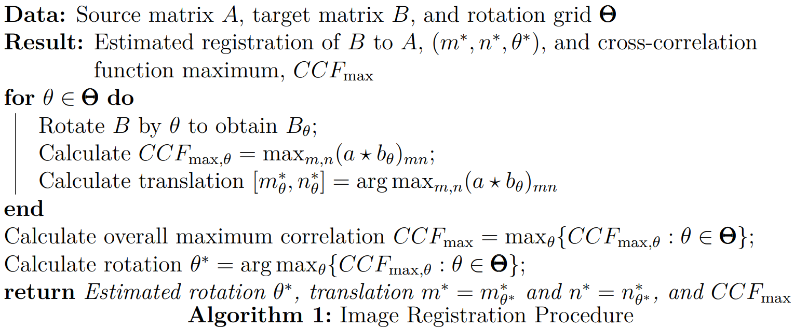 -->
<!-- ``` -->
</br>

We can apply the image registration in both directions to align not only scan $B$ to $A$, but also $A$ to $B$.
Theoretically, these two registrations should be exact opposites of each other.
However, depending on the scans this may not happen in practice because we use "nearest-neighbor" interpolation to rotate the discretely-indexed surface matrices.
To accommodate these two comparison directions, we now introduce a subscript $d = A,B$ that refers to the source scan used in the image registration.
For example, $(m_A^*, n_A^*, \theta_A^*, CCF_{\max,A})$ refers to the estimated registration and CCF from aligning scan $B$ to $A$.

@song_proposed_2013 points out that two matching cartridge cases may only have a handful of regions with distinguishable, matching impressions due to inherent variability in the firing process.
Calculating a correlation between two full scans as in image registration algorithm may not highlight their similarities.
Instead, @song_proposed_2013 proposes partitioning one of the scans into a grid of "cells" and estimating the registration between each cell and the other scan.

We now extend the surface matrix notation introduced previously to accommodate cells.
Let $A_{t}$ denote the $t$th cell of matrix $A$, $t = 1,...,T_A$ where $T_A$ is the total number of cells containing non-missing values in scan $A$ and let $(a_t)_{ij}$ denote the $i,j$-th element of $A_t$.
This procedure can be viewed as a generalization of image registration algorithm that we call the "cell-based comparison procedure" and outlined below.

**Cell-Based Comparison Algorithm**

| **Data**: Source matrix $A$, target matrix $B^*$, grid size $R \times C$, and rotation grid $\pmb{\Theta}_{A}'$

| **Result**: Estimated translations and $CCF_{\max}$ values per cell, per rotation

| Partition $A$ into a grid of $R \times C$ cells;

| Discard cells containing only missing values, leaving $T_A$ remaining cells;

| **for** $\theta \in \pmb{\Theta}_{A}'$ **do**

|    Rotate $B^*$ by $\theta$ to obtain $B_{\theta}^*$;

|    **for** $t = 1,...,T_A$ **do**

|       Calculate $CCF_{\max,A,t,\theta} = \max_{m,n} (a_t \star b_{\theta}^*)_{mn}$;

|       Calculate translation $[m_{A,t,\theta}^*, n_{A,t,\theta}^*] = \arg \max_{m,n} (a_t \star b_{\theta}^*)_{mn}$;

|    **end**

| **end**

| **return** $\pmb{F}_A = \{(m_{A,t,\theta}^*, n_{A,t,\theta}^*, CCF_{\max,A,t,\theta}, \theta) : \theta \in \pmb{\Theta}_{A}', t = 1,...,T_A\}$

The output of the cell-based comparison is a set of estimated registrations - one registration for each cell in the source scan for each $\theta$.
For a particular cell $t \in \{1,...,T_A\}$, we select the registration that maximizes the CCF across all $\theta \in \pmb{\Theta}_A'$ as its estimated registration.

Similar to image registration algorithm, we can use cell-based comparison to align not only cells from $A$ to $B^*$, but also cells from $B$ to $A^*$, which is an aligned version of scan $A$ from image registration algorithm using $B$ as source.
We again use a direction subscript $d = A,B$ to refer to the source scan in cell-based comparison.
For example, the outcome of cell-based comparison using $B$ as source and $A^*$ as target is the set $\pmb{F}_B$ of estimated registrations per cell, $t = 1,...,T_B$, per rotation, $\theta \in \pmb{\Theta}_B'$.

One challenge with using registration algorithms like image registration algorithm and cell-based comparison is understanding when and how they "work" as expected.
For example, we expect for truly matching cartridge cases that these estimated registrations should "agree" across various cells.
In other words, that $(m^*_{A,t,\theta},n^*_{A,t,\theta}, \theta)$ should be the same for all $t = 1,...T_A$.
We don't assume such agreement will occur for truly non-matching cartridge cases.
Rarely do *all* cells agree with the same registration in practice, even for truly matching cartridge cases.
Instead, depending on the quality of the impressions on two matching cartridge cases, there may be a handful of cells that have similar $(m^*_{A,t,\theta},n^*_{A,t,\theta}, \theta)$ values.
A natural question is: why do some scans/cells find the correct registration while others do not?
In the next section, we introduce a set of diagnostic tools we developed to answer such questions.

## Visual Diagnostics

### The X3P Plot

The first visual diagnostic tool we discuss is the "X3P plot" which is used to visualize the values of a scan's surface matrix.
We show an example of an X3P plot in Figure \@ref(fig:preProcessEffectExample), which will be discussed in more detail below.
The orientation of the X3P plot is the same as its underlying surface matrix, meaning the top left-most pixel represents the $[1,1]$-th element of the surface matrix followed the $[1,2]$-th element to its immediate right and so on.
To construct the X3P plot, we map 11 percentiles of the non-missing values in a surface matrix to the continuous, divergent purple-white-orange color scheme illustrated in Figure \@ref(fig:x3pPlot-colorscheme).
The darkest shades of purple and orange represent the minimum and maximum surface values, respectively.
We use a very light shade of gray to represent the median surface value to ensure symmetry in the percentile mapping.
Rather than mapping deciles to the 11 colors (minimum, 10th percentile, 20th percentile, etc.), we've found the more polarized mapping shown in Figure \@ref(fig:x3pPlot-colorscheme) to be more effective at emphasizing extreme surface values, which are commonly associated with the most prominent impressions.

```{r x3pPlot-colorscheme, fig.cap="The percentiles (top) and hexidecimal color values (bottom) used in the color mapping of the X3P plot.",out.width = "\\textwidth"}
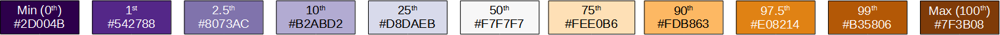
```

To visualize two or more scans using the X3P plot, we map percentiles of the pooled surface values to the same color scale.
This allows us to compare the relative sizes of impressions across multiple cartridge cases.
The registration procedure outlined in Figure \@ref(alg:registration) is highly sensitive to extreme values on either surface, so performing a visual comparison of two scans using the X3P plot is useful for identifying whether further processing of either scan is needed.

Figure \@ref(fig:preProcessEffectExample) shows two examples of the registration output for a matching pair of scans labeled K002eG2 and K227iG3.
In the top plot we see that both scans contain large, extraneous markings that may affect the registration procedure.
There is a ring of raised observations around the center of K002eG2 that is an artifact of the deformation that occurs when the firing pin strikes the cartridge case primer.
Additionally, there are large dent-like markings on both K002eG2 and K227iG3.
Registering these two scans using the image registration algorithm results in $CCF_{\max} = 0.14$ at registration $(m^*,n^*,\theta^*) = (4,19,-6^\circ)$.

The bottom plot of Figure \@ref(fig:preProcessEffectExample) shows the registrations of K002eG2 and K227iG3 after applying the additional pre-processing of removing the extraneous regions.
The output of the image registration algorithm is now $CCF_{\max} = 0.29$ at registration $(m^*,n^*,\theta^*) = (6,18,-6^\circ)$.
Although the registrations are similar for both pairs of scans, the cross-correlation value more than doubles when we remove the extraneous regions.
We also note that removal of the extreme values makes it easier to visually identify similar markings between K002eG2 and K227iG3, such as the "striped" impressions at the top of the two scans.
Highlighting such similarities is one of the strengths of the X3P plot.

```{r preProcessEffectExample,fig.cap = "Registration results from comparing two versions of a matching pair of cartridge case scans. In the first comparison (top), extraneous values are left in the scan which causes the overall $CCF_{\\max}$ value to be relatively low (0.14). When these values are removed (bottom), the CCF value more than doubles to 0.29. The X3P plot is useful for identifying scans that are in need of additional pre-processing.",out.width = "\\textwidth"}
knitr::include_graphics("images/chapter3-images/preProcessEffectExample.png")
```

### The Comparison Plot

The "comparison plot" is a visual diagnostic tool that uses the X3P plot to directly compare the surface values of two scans.
The comparison plot provides a quick, intuitive assessment by partitioning the surfaces into similarities and differences.
To construct the comparison plot we first obtain two aligned scans $A$ and $B^*$ using Figure \@ref(alg:registration).
A comparison plot like the one shown in Figure \@ref(fig:complementCompPlot-fullScan) depicts aligned versions of the two scans $A$ = K013sA1 and $B$ = K013sA2 shown in Figure \@ref(fig:processedSideBySide).
The first columns shows the scan $A$ and aligned scan $B^*$ in the top left and right, respectively.
The dark gray (gray40) elements in these two visualizations represent the non-overlapping elements from the other scan.
Next, we wish to partition these $A$ and $B^*$ into similarities and differences using a filter operation.

For a matrix $X \in \mathbb{R}^{k \times k}$ and Boolean-valued condition matrix $cond: \mathbb{R}^{k \times k} \to \{TRUE,FALSE\}^{k \times k}$, we define an element-wise filter operation $\mathcal{F}: \mathbb{R}^{k \times k} \to \mathbb{R}^{k \times k}$ as:

\begin{align*}
\mathcal{F}_{cond}(X) =
(f_{ij})_{1 \leq i,j \leq k} =
\begin{cases}
x_{ij} &\text{if $cond$ is $TRUE$ for element $i,j$} \\
NA &\text{otherwise.}
\end{cases}
\end{align*}

The resulting $\mathcal{F}_{cond}(X)$ is a copy of the matrix $X$ where elements for which $cond$ is $TRUE$ are replaced with $NA$.
The filtering operation allows us to isolate elements of a surface matrix that satisfy some criterion.
For example, we can isolate a surface matrix to only those elements that are close to the elements of another surface matrix.

Figure \@ref(fig:averageFilterExample) shows the construction of a filtered element-wise average between $A$ and $B^*$.
We compute the element-wise average $\frac{1}{2}(A + B^*)$ and absolute difference $|A - B^*|$ as shown in the left and right of Figure \@ref(fig:averageFilterExample).
We then consider values of $|A - B^*|$ that are greater than some threshold $\tau > 0$.
We construct Boolean-valued matrices $|A - B^*| \leq \tau$ and $|A - B^*| > \tau$ based on whether the element-wise absolute difference is at most or greater than $\tau$.
For example, the right side of Figure \@ref(fig:averageFilterExample) shows the elements of matrix $|A - B^*| \leq 1$ with $TRUE$ elements represented as white pixels and $FALSE$ elements as black pixels.
We then filter $\frac{1}{2}(A + B^*)$ using $|A - B^*| \leq \tau$ as the $cond$ matrix, resulting in tge filtered element-wise average $\mathcal{F}_{|A - B^*| \leq \tau}\left(\frac{1}{2}(A + B^*)\right)$, an example of which is shown at in the bottom of Figure \@ref(fig:averageFilterExample) using $\tau = 1$.

```{r,include=FALSE}
reference <- comparisonResults_fullScan %>%
  pull(cellHeightValues) %>%
  .[[1]]

reference$surface.matrix <- reference$surface.matrix*reference$cmcR.info$scaleByVal

target <- comparisonResults_fullScan %>%
  pull(alignedTargetCell) %>%
  .[[1]]

target$surface.matrix <- target$surface.matrix*target$cmcR.info$scaleByVal
```

```{r comparisonPlot-filterIllustration-code,include=FALSE,cache=TRUE}
impressions::x3pPlot(reference,target,x3pNames = c("K013sA1","K013sA2"),type = "list") %>%
  walk2(c("K013sA1","K013sA2"),~  {
    ggsave(filename = paste0("figures/",.y,"_fullScan.png"),plot = .x,bg="white")
  })

elementwiseAverage_plt <- impressions::x3pPlot(impressions::x3p_elemAverage(reference,target),
                                               x3pNames = "Element-wise Average",
                                               legendLength = 7,
                                               legend.quantiles = c(0,.01,.5,.99,1)) +
  ggplot2::guides(fill = ggplot2::guide_colourbar(barheight = 7,
                                                  label.theme = ggplot2::element_text(size = 5),
                                                  title.theme = ggplot2::element_text(size = 7),
                                                  frame.colour = "black",
                                                  ticks.colour = "black"))

ggsave(plot = elementwiseAverage_plt,
       filename = "figures/elementwiseAverage_fullScan.png",bg="white")

surfaceDistance <- reference

surfaceDistance$surface.matrix <- abs(reference$surface.matrix - target$surface.matrix)

surfaceDistance_df <- surfaceDistance %>%
  impressions::x3p_to_dataFrame()

surfaceDistance_plt <- surfaceDistance_df %>%
  mutate(x3p = "Element-wise Absolute Difference") %>%
  ggplot2::ggplot(ggplot2::aes(x = x,y = y)) +
  ggplot2::geom_raster(ggplot2::aes(fill = value))  +
  ggplot2::scale_fill_gradientn(colours = c('#f7f7f7','#fee0b6','#fdb863','#e08214','#b35806','#7f3b08'),
                                                     values = scales::rescale(quantile(surfaceDistance_df$value,
                                                                                       c(0,.1,.5,0.9,.975,.99,1),
                                                                                       na.rm = TRUE)),
                                breaks = function(lims){
                                  dat <- quantile(surfaceDistance_df$value,c(0,.8736,.99,1),na.rm = TRUE)

                                  dat <- dat %>%
                                    setNames(paste0(names(dat)," [",round(dat,3),"]"))

                                  return(dat)
                                },
                                limits = c(0,NA),
                                na.value = "grey65") +
  ggplot2::coord_fixed(expand = FALSE) +
  ggplot2::theme_minimal() +
  ggplot2::theme(
    axis.title.x = ggplot2::element_blank(),
    axis.text.x = ggplot2::element_blank(),
    axis.ticks.x = ggplot2::element_blank(),
    axis.title.y = ggplot2::element_blank(),
    axis.text.y = ggplot2::element_blank(),
    axis.ticks.y = ggplot2::element_blank(),
    panel.grid.major = ggplot2::element_blank(),
    panel.grid.minor = ggplot2::element_blank(),
    panel.background = ggplot2::element_blank()) +
  ggplot2::guides(fill = ggplot2::guide_colourbar(barheight = 20,
                                                  label.theme = ggplot2::element_text(size = 10),
                                                  title.theme = ggplot2::element_text(size = 14),
                                                  frame.colour = "black",
                                                  ticks.colour = "black"),
                  colour = 'none') +
  ggplot2::labs(fill = expression("Rel. Height ["*mu*"m]")) +
  ggplot2::facet_wrap(~ x3p)


ggsave(surfaceDistance_plt,filename = "figures/surfaceDistance.png",bg="white")

surfaceDistance_bin <- surfaceDistance

surfaceDistance_bin$surface.matrix <- {surfaceDistance_bin$surface.matrix > 1}

surfaceDistance_bin_plt <- surfaceDistance_bin %>%
  impressions::x3p_to_dataFrame() %>%
  ggplot(aes(x=x,y=y,fill=value)) +
  geom_raster() +
  coord_fixed(expand=FALSE) +
  theme_void() +
  theme(legend.position = "none") +
  scale_fill_manual(values = c("white","black"),na.value = "gray65")

ggsave(surfaceDistance_bin_plt,filename = "figures/surfaceDistance_bin.png")

library(patchwork)

plt <- ((elementwiseAverage_plt +
           labs(title = "Element-wise\nAverage") +
           theme(strip.text = element_blank(),
                 plot.title = element_text(hjust = .55,vjust = -45,size = 8))) +
          (surfaceDistance_plt +
             labs(title = "Element-wise\nAbsolute\nDifference") +
             theme(strip.text = element_blank(),
                   plot.title = element_text(hjust=.55,vjust=-45,size = 8))) +
          (surfaceDistance_bin_plt +
             labs(title = "Abs. Difference > 1") +
             theme(strip.text = element_blank(),
                   plot.title = element_text(hjust=.65,vjust=-40,size = 8)))) +
  patchwork::plot_annotation(title = "K013sA1 vs. Aligned K013sA2",
                             theme = theme(plot.title = element_text(size = 10,hjust = .5,vjust = -15)))

ggsave(plt,filename = "figures/averageFilterExample.png",bg = "white")
knitr::plot_crop("figures/averageFilterExample.png")
```

```{r averageFilterExample, fig.cap = "To construct the comparison plot after aligning the scans K013sA1 and K013sA2, we compute their element-wise average (left) and element-wise absolute difference (right). We then compute a Boolean-valued matrix based on whether the elements of the element-wise absolute difference is greater or less than 1 micron (right). We use this Boolean matrix to distinguish between similarities and differences in the scan impressions.",out.width = ".8\\textwidth"}

```

Complementary to the filtered element-wise average, the right column of the comparison plot shows differences between the two scans.
While it is visually obvious when scans share similar markings, characterizing different markings can be challenging.
For example, two markings may be different in their depth, shape, orientation, or spatial relationship to other markings.
As such, we visualize two filtered versions of the aligned scans $\mathcal{F}_{|A - B^*| > \tau}(A)$ and $\mathcal{F}_{|A - B^*| > \tau}(B^*)$ to emphasize differences.
Figure \@ref(fig:differenceFilterExample) shows an example of the results of this filtering using $\tau = 1$.

```{r differenceFilterExample, fig.cap="To construct the comparison plot, we filter two scans $K013sA1$ and $K013sA2$ based on regions where their element-wise absolute difference exceeds 1 micron, which are represented as white pixels in the black and white image. This emphasizes regions where the two surfaces differ, which complements the similarities that are emphasized in the element-wise average.",out.width = ".8\\textwidth"}
knitr::include_graphics("images/chapter3-images/filteringDifferencesIllustration.png")
```

```{r fullScanComparisonPlot-code,include = FALSE,cache=TRUE}
patchComparisonPlts_combined <-
  impressions::x3p_comparisonPlot(x3p1 = reference,x3p2 = target,
                                  threshold = 1,
                                  plotLabels = c("K013sA1","K013sA2\nAligned",
                                                 "Filtered Element-wise Average",
                                                 "K013sA1\nDifferences",
                                                 "K013sA2\nAligned Differences"),
                                  labelSize = 2.5,
                                  legendLength = grid::unit(6,"in"),
                                  legendUnit = "micron",
                                  legendQuantiles = c(0,.01,.5,.99,1))

ggsave(plot = patchComparisonPlts_combined,filename = "figures/complementCompPlot-fullScan.png",
       width = 7,height = 7,bg = "white")
knitr::plot_crop("figures/complementCompPlot-fullScan.png")
```

The comparison plot visualizes the surface values of the original scans $A$ and $B^*$, the filtered element-wise average $\mathcal{F}_{|A - B^*| \leq \tau}\left(\frac{1}{2}(A + B^*)\right)$, and filtered element-wise differences $\mathcal{F}_{|A - B^*| > \tau}(A)$ and $\mathcal{F}_{|A - B^*| > \tau}(B^*)$.
Figure \@ref(fig:complementCompPlot-fullScan) shows an example of a comparison plot using $A=$ K013sA1 and $B=$ K013sA2.

The middle column of the comparison plot shows the filtered element-wise matrix $\mathcal{F}_{|A - B^*| \leq \tau}\left(\frac{1}{2}(A + B^*)\right)$.
By isolating the element-wise average to "close" surface values between $A$ and $B^*$, the filtered element-wise average emphasizes similar markings between the two scans.
In Figure \@ref(fig:complementCompPlot-fullScan), we use a filtering threshold of $\tau = 1$ microns and represent filtered elements in light gray (gray80).
This filtered element-wise average illustrates that there are many similarities between the two surfaces.
To identify similarities using the element-wise average, we have found it most effective to scan the filtered element-wise average plot for distinctive markings, such as the deep purple and orange markings in the 5 o'clock position of the firing pin hole in Figure \@ref(fig:complementCompPlot-fullScan).
After identifying distinctive markings, it is relatively easy to identify the contributing markings from $A$ and $B^*$ by considering the same region in the two plots in the left column.
For example, we see deep purple and orange striped impressions in the 5 o'clock positions of $A$ and $B^*$ in Figure \@ref(fig:complementCompPlot-fullScan).
Cross-referencing the filtered element-wise average with the individual scans allows us to assess the degree of similarity and spatial relationship between markings on the two scans.

The right column of Figure \@ref(fig:complementCompPlot-fullScan) shows the filtered differences between scans $A$ and $B^*$ using a cutoff threshold of $\tau = 1$ microns.
Again, we've found it useful to study the two filtered plots to identify differences that can be cross-referenced against the original scans.
For example, scan $B^*$ has a dent-like marking at the 11 o'clock position of the firing pin hole that is not present in $A$.
On the other hand, we note a dark orange region in the 5 o'clock position, where we had previously noted similarities, that is treated as a difference.
Considering the original scans in the left column, we see that these orange regions are indeed part of the striped purple and orange impression region.
It can be safely assumed that these two regions should be treated as "similar" markings despite being at least 1 micron apart.
These two examples illustrate the fundamental challenge with characterizing differences - there are many ways in which two markings can be "different" from one another.

```{r complementCompPlot-fullScan, fig.cap='The comparison plot provides an intuitive visualization of the similarities and differences between two aligned surface matrices. The left column of the comparison plot shows two aligned scans. The middle column shows the element-wise average between the two aligned scans after filtering out surface values that are at least 1 micron apart. The right column shows these filtered surface values of the aligned scans. Together, the middle and right column show the "similarities" and "differences" between the two aligned scans.',out.width = "\\textwidth"}

```

By construction, the X3P and comparison plots emphasize the most extreme values in the two surface matrices.
This means that similar, yet less extreme markings are harder to visually identify using the full scan X3P and comparison plots.
To visually assess the similarity between these markings, we can "zoom in" to specific regions of the cartridge case surfaces using the cell-based comparison procedure outlined in the cell-based comparison procedure.
Recall that the cell-based comparison returns a set of estimated registrations, one for each source cell $t = 1,...,T_A$.
Using these estimated registrations, we extract a matrix from the target scan that represents the patch in the target scan that maximized the CCF with the source cell.
That is, we extract the target "mate" for each source cell.
Figure \@ref(fig:complementCompPlot-cellBased) shows the comparison plot of cell 3, 8 from scan K013sA1 and its target mate in K013sA2.
The left column again shows the two aligned surface matrices, the middle column the filtered element-wise average using $\tau = 1$ microns, and the right column the filtered differences.
Compared to the depiction of this region in Figure \@ref(fig:complementCompPlot-fullScan), it is much easier to identify similar and different markings using this zoomed-in visualization.
For example, the dark purple "dots" on the upper-left side of the two scans are more prominent in this visualization.
We note that the color scale mapping now ranges from -5 to 4.1 microns compared to -12.3 to 20.3 microns in Figure \@ref(fig:complementCompPlot-fullScan).
Small, local markings are more prominent when we use the comparison plot on the output of the cell-based comparison procedure.

```{r matchCCP-combine, cache=TRUE,include=FALSE}
refCell <- comparisonResults_cell %>%
  filter(cellIndex == "3, 8") %>%
  slice(1) %>%
  pull(cellHeightValues) %>%
  .[[1]]

refCell$surface.matrix <- refCell$surface.matrix*refCell$cmcR.info$scaleByVal

targCell <- comparisonResults_cell %>%
  filter(cellIndex == "3, 8") %>%
  slice(1) %>%
  pull(alignedTargetCell) %>%
  .[[1]]

targCell$surface.matrix <- targCell$surface.matrix*targCell$cmcR.info$scaleByVal

patchComparisonPlts_cellBased <- impressions::x3p_comparisonPlot(x3p1 = refCell,x3p2 = targCell,threshold = 1,
                                                                 plotLabels = c("K013sA1\nCell 3, 8",
                                                                                "K013sA2\nAligned Cell",
                                                                                "Filtered Element-wise Average",
                                                                                "K013sA1\nCell 3, 8\nDifferences",
                                                                                "K013sA2\nAligned Cell\nDifferences"),
                                                                 labelSize = 2.5,
                                                                 legendLength = grid::unit(6,"in"),
                                                                 legendUnit = "micron",
                                                                 legendQuantiles = c(0,.01,.5,.99,1))

ggsave(plot = patchComparisonPlts_cellBased,filename = "figures/complementCompPlot-cellBased.png",
       width = 7,height = 7,bg = "white")
knitr::plot_crop("figures/complementCompPlot-cellBased.png")
```

```{r complementCompPlot-cellBased,fig.cap="The comparison plot for cell 3, 8 of scan K013sA1 and its aligned mate in scan K013sA2. The left column shows the surface values of these two cells. Note that non-overlapping pixels are shown in dark gray in the bottom left plot. The middle column shows similarities between the surfaces in the form of the filtered element-wise average. The right column shows the surface values with the opposite filtering used in the filtered element-wise average plot. We use a gray border to emphasize the filtered vs. non-filtered regions.",out.width = "\\textwidth"}

```

```{r eval=TRUE,cache=TRUE,include=FALSE}
K013sA1 <- x3ptools::x3p_read("data/chapter3-data/K013sA1_processed.x3p")
K013sA1$surface.matrix <- K013sA1$surface.matrix*1e6
K013sA1$header.info$incrementY <- K013sA1$header.info$incrementY*1e6
K013sA1$header.info$incrementX <- K013sA1$header.info$incrementX*1e6
K002eG1 <- x3ptools::x3p_read("data/chapter3-data/K227iG3_processed.x3p")

K013sA1 <- x3ptools::x3p_interpolate(K013sA1,resx = K002eG1$header.info$incrementX)

cellBased_nonMatch <-
  scored::comparison_cellBased(K013sA1,K002eG1,
                               numCells = c(8,8),
                               direction = "one",
                               returnX3Ps = TRUE) %>%
  dplyr::group_by(direction,cellIndex) %>%
  dplyr::mutate(cellHeightValues = ifelse(fft_ccf == max(fft_ccf),cellHeightValues,NA),
         alignedTargetCell = ifelse(fft_ccf == max(fft_ccf),alignedTargetCell,NA)) %>%
  dplyr::ungroup()

similarNonMatchCells <- cellBased_nonMatch %>%
  dplyr::filter(!is.na(cellHeightValues))

nonMatch_similarCell_plt <- similarNonMatchCells %>%
  dplyr::filter(cellIndex == "6, 1") %>%
  dplyr::select(cellIndex,cellHeightValues,alignedTargetCell) %>%
  purrr::pmap(~ {

    ref <- ..2
    ref$surface.matrix <- ref$surface.matrix*ref$cmcR.info$scaleByVal

    targ <- ..3
    targ$surface.matrix <- targ$surface.matrix*targ$cmcR.info$scaleByVal

    impressions::x3p_comparisonPlot(ref,targ,plotLabels = c(paste0("K013sA1 Cell",..1),
                                                            "K002eG1 Aligned Cell",
                                                            "Element-wise Average",
                                                            paste0("K013sA1 Cell",..1,"\nDifferences"),
                                                            "K002eG1 Aligned Cell\nDifferences"))

  })

ggsave(plot=nonMatch_similarCell_plt[[1]],filename="images/chapter3-images/nonMatch-similarCell.png",width = 10,height = 6,bg = "white")
```

```{r eval=FALSE}
cmcR::cmcPlot(K013sA1,K002eG1,
              cmcClassifs =  similarNonMatchCells %>%
                filter(direction == "reference_vs_target") %>%
                mutate(originalMethod = ifelse(cellIndex == "6, 1",
                                               "CMC","non-CMC")))

pltLegend <- cowplot::get_legend(x3pPlot(reference,target,legend.quantiles = c(0,.01,.5,.99,1),legendLength = 10))

similarNonMatchCells_pltLabeled <-
  ((similarNonMatchCells_plt$reference +
    theme(strip.text = element_blank(),
          legend.position = "none") +
    annotate(geom = "text",x = 230,y = 200,label = "K013sA1")) +
  (similarNonMatchCells_plt$target +
     theme(strip.text = element_blank()) +
     annotate(geom = "text",x = 230,y = 200,label = "K002eG1")) +
    (pltLegend)) +
  patchwork::plot_layout(nrow = 1,widths = c(.4,.4,.1))

ggsave(plot = similarNonMatchCells_pltLabeled,
       filename = "images/nonMatchCell-comparisonPlot.png",
       bg = "white",width = 10,height = 5)
knitr::plot_crop("images/nonMatchCell-comparisonPlot.png")
```

The comparison plot is particularly useful for understanding the results of the cell-based registration procedure outlined in the cell-based comparison.
For example, the top of Figure \@ref(fig:nonMatchCell-comparisonPlot) shows an aligned cell 6, 1 between two non-match scans K013sA1 and K002eG1.
It's difficult to visually identify many similarities between the two scans, which is expected given that the cartridge cases originate from different firearms.
However, the bottom of Figure \@ref(fig:nonMatchCell-comparisonPlot) depicting the comparison plot between the aligned cell 6, 1 pair demonstrates that there are actually local similarities.
From the element-wise average we see that there are similar purple and orange regions shared between these two cells.

This example underscores the need to analyze both similarities *and* differences when comparing two scans.
We're bound to find similarities if this is all we look for, so we also need to describe the differences between the surfaces.
In the next section, we discuss a set of summary statistics computed from the Comparison Plot that quantify both the similarities and differences between two scans.

```{r nonMatchCell-comparisonPlot,fig.cap = "(Top) We consider a non-match pair of cartridge cases K013sA1 and K002eG1 that don't appear to share many similar markings at first glance. (Bottom) After registering cell 6, 1 from K013sA1 in K002eG1 using the cell-based comparison, we then consider the Comparison Plot between the aligned pair of cells. Using this zoomed-in view, we can clearly see that there are actually local similarities between the two cartridge cases despite being fired from different firearms. This demonstrates how the comparison plot is useful for understanding registration results from cell-based comparison.",out.width = "\\textwidth"}
knitr::include_graphics("images/chapter3-images/nonMatchCell-comparisonPlot.png")
```

### Visual Diagnostic Statistics

In the last section, we used the comparison plot to make a number of qualitative observations about the similarities and differences between the impressions of two pairs of cartridge cases.
These observations aligned with what our intuition says should be true for two matching/non-matching cartridge cases.
For example, we would expect there to be many more similarities than differences for a matching pair compared to a non-matching pair.
In this section, we translate these sorts of qualitative observations into a set of numerical features that can be used to determine whether two cartridge case scans were fired from the same firearm.

```{r neghborhoodLabeling-code,include=FALSE,eval=FALSE}
knownMatch_fullScan <- readRDS("data/chapter3-data/comparisonResults_fullScan.rds")

reference <- knownMatch_fullScan$cellHeightValues[[1]]
reference$surface.matrix <- reference$surface.matrix*reference$cmcR.info$scaleByVal
target <- knownMatch_fullScan$alignedTargetCell[[1]]
target$surface.matrix <- target$surface.matrix*target$cmcR.info$scaleByVal

scanFilterBinarized <- reference %>%
  impressions::x3p_elemAverage(target) %>%
  impressions::x3p_to_dataFrame() %>%
  mutate(value = (abs(c({reference$surface.matrix - target$surface.matrix})) > 1))

scanFilterBinarized_similarities <- scanFilterBinarized %>%
  ggplot(aes(x=x,y=y,fill=value)) +
  geom_raster() +
  coord_fixed(expand=FALSE) +
  theme_void() +
  theme(legend.position = "none") +
  scale_fill_manual(values = c("white","black"),na.value = "gray65") +
  annotate(geom = "text",x = 230,y = 200,label = "Abs. Difference \u2264 1 micron")

scanFilterBinarized_differences <- scanFilterBinarized %>%
  mutate(value = !value) %>%
  ggplot(aes(x=x,y=y,fill=value)) +
  geom_raster() +
  coord_fixed(expand=FALSE) +
  theme_void() +
  theme(legend.position = "none") +
  scale_fill_manual(values = c("white","black"),na.value = "gray65") +
  annotate(geom = "text",x = 230,y = 200,label = "Abs. Difference > 1 micron")

scanFilterLabeled <- scanFilterBinarized %>%
  mutate(x = x + 1,y = y + 1,
         value = ifelse(!value | is.na(value),0,1)) %>%
  imager::as.cimg() %>%
  imager::label() %>%
  as.data.frame() %>%
  mutate(value = factor(value))

plt3 <- scanFilterLabeled %>%
  ggplot(aes(x=x,y=y,fill=value)) +
  geom_raster() +
  coord_fixed(expand = FALSE) +
  theme_void() +
  theme(legend.position = "none") +
  scale_fill_manual(values = c("gray65",sample(RColorBrewer::brewer.pal(12,"Paired"),size = length(unique(scanFilterLabeled$value)) - 1,replace = TRUE)))

matchRegionSizeHist <- scanFilterLabeled %>%
  mutate(value = as.numeric(value)) %>%
  filter(value > 1) %>%
  group_by(value) %>%
  tally() %>%
  mutate(n = n*reference$header.info$incrementX*1e6) %>%
  ggplot(aes(x = n)) +
  geom_histogram(binwidth = 100) +
  theme_bw() +
  coord_cartesian(expand=FALSE,ylim = c(-5,300),xlim = c(-150,5500)) +
  scale_x_continuous(labels = scales::comma) +
  labs(x = expression(Region~Size~'('~micron^2~')'),
       y = "Number of Regions") +
  theme(axis.text = element_text(size = 5),
        axis.title = element_text(size = 6))

scanFilterBinarized_differences <- scanFilterBinarized %>%
  mutate(value = !value) %>%
  ggplot(aes(x=x,y=y,fill=value)) +
  geom_raster() +
  coord_fixed(expand=FALSE) +
  theme_void() +
  theme(legend.position = "none") +
  scale_fill_manual(values = c("white","black"),na.value = "gray65") +
  annotate(geom = "text",x = 230,y = 200,label = "Abs. Difference > 1 micron",size = 2.5)

plt <- ((scanFilterBinarized_differences +
           theme(plot.margin = unit(c(0,.1,0,.1),"in"))) |
          (plt3 +
             theme(plot.margin = unit(c(0,0,0,.1),"in")) +
             annotate(geom = "text",x = 230,y = 200,label = "Labeled Regions",size = 2.5)) |
          matchRegionSizeHist) &
  theme(panel.border = element_rect(colour = "black",fill = NA))

ggsave(plt,filename = "figures/filterLabeling.png",bg = "white")
knitr::plot_crop("figures/filterLabeling.png")

comparisonResults_cell <- readRDS("data/chapter3-data/comparisonResults_cell.rds")

refCell <- comparisonResults_cell %>%
  filter(cellIndex == "3, 8") %>%
  slice(1) %>%
  pull(cellHeightValues) %>%
  .[[1]]

refCell$surface.matrix <- refCell$surface.matrix*refCell$cmcR.info$scaleByVal

targCell <- comparisonResults_cell %>%
  filter(cellIndex == "3, 8") %>%
  slice(1) %>%
  pull(alignedTargetCell) %>%
  .[[1]]

targCell$surface.matrix <- targCell$surface.matrix*targCell$cmcR.info$scaleByVal

patchComparisonPlts_cellBased <- impressions::x3p_comparisonPlot(x3p1 = refCell,x3p2 = targCell,threshold = 1,
                                                                 plotLabels = c("K013sA1\nCell 3, 8",
                                                                                "K013sA2\nAligned Cell",
                                                                                "Filtered Element-wise Average",
                                                                                "K013sA1\nCell 3, 8\nDifferences",
                                                                                "K013sA2\nAligned Cell\nDifferences"),
                                                                 # labelSize = 2.5,
                                                                 labelSize = 8,
                                                                 legendLength = grid::unit(6,"in"),
                                                                 legendUnit = "micron",type = "list",
                                                                 legendQuantiles = c(0,.01,.5,.99,1))
library(patchwork)
plt <- (patchComparisonPlts_cellBased[[4]] + patchComparisonPlts_cellBased[[5]])

cor(x = c(refCell$surface.matrix),y = c(targCell$surface.matrix),use = "pairwise.complete.obs")

ggsave(plot = plt,filename = "images/cellBasedDifferences.png",width = 10,height = 7,bg="white")
knitr::plot_crop("images/cellBasedDifferences.png")
```

```{r similaritiesDifferencesRatio, fig.cap="We compute the ratio between the number of similar and different elements of two aligned scans, which are defined to be elements for which the two surfaces are at most or greater than 1 micron, respectively. These are represented above as white pixels in the two images on the left. We then count the number of white pixels in each image and compute their ratio, resulting in this example in a value of 2.84. We expect this ratio to be larger for matching comparisons, on average, than non-matching comparisons.",out.width = "\\textwidth"}

```

The first statistic is the ratio between the number of similarities and differences for a pair of scans.
To compute this, we consider the number of $TRUE$ elements the $cond$ matrices $|A - B^*| \leq \tau$ and $|A - B^*| > \tau$.
Figure \@ref(fig:similaritiesDifferencesRatio) shows an example of this ratio computed for the matching pair K013sA1 and K013sA2, which results in a value of 2.84 meaning there are almost three times as many similarities as there are differences between the two scans.

Mathematically, the similarities vs. differences ratio is given by
\begin{align*}
r_{d} = \frac{\pmb{1}^T I(|A - B^*| \leq \tau) \pmb{1}}{\pmb{1}^T I(|A - B^*| > \tau) \pmb{1}}
\end{align*}
where $\pmb{1} \in \mathbb{R}^k$ is a column vector of ones and $I(\cdot)$ is the element-wise, matrix-valued indicator function.
The inner products in the numerator and denominator act to count the number of TRUE elements in the two complementary $cond$ matrices.

We also compute similarities vs. differences ratios for the results of the cell-based comparison procedure outlined in cell-based comparison.
Specifically, we compute the ratio for a cell from the source matrix and its aligned mate in the target matrix, resulting in the ratio value $r_{d,t}$.
We expect that the similarities vs. differences ratio will be larger for matching comparisons compared to non-matching comparisons.

```{r filterLabeling-figure, fig.cap='(Left) After aligning two scans, we filter regions that are "different" from each other, meaning the absolute difference between surface values is larger than some threshold. We binarize the scan into different vs. similar regions - shown in white and black, respectively. (Middle) Using a connected components labeling algorithm, we identify connected "neighborhoods" of filtered elements, which are distinguished here by fill color. (Right) Considering the distribution of the region sizes, we see that the vast majority of the regions are relatively small, under 1000 square microns, although there are some outliers. We assume that the average region size will be relatively small for truly matching comparisons.',out.width = "\\textwidth"}

```

We assume markings on the surfaces of two aligned, matching cartridge cases will line up with each other.
This implies that regions that we define as "different" should be relatively small in area.
We translate this into a numerical feature by considering the $TRUE$ elements of the $cond$ matrix $|A - B^*| > \tau$, which are elements where the surfaces differ by at least $\tau$.
For example, the left side of Figure \@ref(fig:filterLabeling) shows the matrix $|A - B^*| > 1$ for $A$ = K013sA1 and $B$ = K013sA2 with $TRUE$ elements represented in white.
We then use a connected components labeling algorithm detailed in @hesselink_concurrent_2001 and implemented in @imager to identify connected "neighborhoods" of $TRUE$ elements.
Specifically, the algorithm returns a set of sets $\pmb{S}_d = \{S_{d,1},S_{d,2},...,S_{d,L_d}\}$ where each $S_{d,l}$ is a set of indices of the $cond$ matrix that have a value of $TRUE$ and are connected by a chained-together sequence of 4 (Rook's) neighborhoods.
The middle of Figure \@ref(fig:filterLabeling) shows each $S_{d,l}$ distinguished by different fill colors, $l = 1,...,L_d$.

The right side of Figure \@ref(fig:filterLabeling) shows a histogram of the region sizes, denoted $|S_{d,l}|$ for $l = 1,...,L_d$.
We see that most of the sizes are relatively small, which agrees with our initial assumption.
There are a handful of larger regions that, when cross-referenced with the surface values in the original scans (see Figure \@ref(fig:complementCompPlot-fullScan), for example), are clearly different from each other, meaning the visual diagnostic works as intended.
We assume that the distribution of region sizes for a matching pair will have far fewer extreme values compared to a non-matching pair.
Again, we extend our notation to accommodate individual cells.
Let $\pmb{S}_{d,t} = \{S_{d,t,1},...,S_{d,t,L_{d,t}}\}$ denote the set of labeled neighborhoods for a cell $t = 1,...,T_d$, $d = A,B$.

```{r matchingCellDifferenceCorrelation, fig.cap = 'The plots show regions of two aligned cells from a matching comparison. Specifically, we filter these cells to only elements for which the surfaces are at least 1 micron apart. We note here that even among these "different" regions, the trends in the surface values are similar, which may occur because of inconsistent contact with markings on the breech face of a firearm across repeated fires. The relatively high correlation between these two cells of 0.84 reflects this similarity.',out.width = "\\textwidth"}

```

The final statistic we compute is based on the observation that, even among regions that we define as "different," the surface values of two matching cartridge cases should follow similar trends.
There may be variability in the depth of markings impressed by a firearm's breech face across repeated fires, but the overall shape/trend of the markings should remain consistent.
For example, Figure \@ref(fig:matchingCellDifferenceCorrelation) shows regions of two cells from a comparison between matching scans $A$ = K013sA1 and $B$ = K013sA2.
We filter these two cells to elements where their surfaces are at least one micron apart.
The surface values of these "differences" vary in a similar manner despite being far from each other.
This observation is represented in the correlation value 0.84, which is relatively high for cartridge case comparisons.
We calculate the correlation by vectorizing the two filtered surface matrices and treating missing values by case-wise deletion.

To measure the similarity in the surface value trends, we calculate the correlation $cor_{d,\text{full},\text{diff}}$ between the filtered matrices $\mathcal{F}_{|A - B^*| > \tau}(A)$ and $\mathcal{F}_{|A - B^*| > \tau}(B^*)$ for $d = A$ and $\mathcal{F}_{|A^* - B| > \tau}(A^*)$ and $\mathcal{F}_{|A^* - B| > \tau}(B)$ for $d = B$.
We assume that $cor_{d,\text{full},\text{diff}}$ will be large for matching cartridge case pairs relative to non-matching pairs.
Said another way, we assume that regions of matching cartridge cases that are different will still follow similar trends.
This can occur due to variability in the amount of contact between a cartridge case and breech face across multiple fires of a single firearm.

We extend our notation to accommodate cell comparisons $t = 1,...,T_d$ for $d = A,B$ using subscripts: $cor_{d,t,\text{diff}}$.
For example, $cor_{A,t,\text{diff}}$ is the correlation between cell filtered surface matrices $\mathcal{F}_{|A_t - B_{t,\theta_t^*}^*| > \tau}(A_t)$ and $\mathcal{F}_{|A_t - B_{t,\theta_t^*}^*| > \tau}(B_{t,\theta_t^*}^*)$ where $B_{t,\theta_t^*}^*$ is the matrix extracted from $B^*$ that maximizes the CCF with $A_t$.
Figure \@ref(fig:matchingCellDifferenceCorrelation) shows an example of computing the correlation between cell 2, 8 from scan K013sA1 and its mate in K013sA2.

These visual diagnostic statistics provide a quantitative complement to the qualitative observations we draw from the Comparison Plot.
They are useful by themselves to understand or justify why a source scan or cell aligned to a specific region in the target.
In the next section, we explore their use as numerical features to distinguish between matching and non-matching comparisons.

## Statistical Learning from Visual Diagnostics

In this section, we explore using the visual diagnostic statistics discussed above as features in a statistical classifier model to differentiate between matching and non-matching comparisons.
We consider a data set of 210 cartridge cases scanned at the Roy J. Carver High Resolution Microscopy Facility at Iowa State University that were collected as part of a study by [@Baldwin2014].
The researchers fired the Remington 9mm centerfire cartridge cases from 10 Ruger SR9 pistols.
We scanned these cartridge cartridge cases using the Cadre$^{\text{TM}}$ 3D-TopMatch High Capacity Scanner.
See Chapter 4 for more information on these cartridge case data.

### Visual Diagnostic Statistics as Features

Let $A$ and $B$ denote cartridge case scans.
We first perform the registration procedure of image registration algorithm in both comparison directions using a rotation grid of $\pmb{\Theta} = \{-30^{\circ} , -27^{\circ}, ..., 27^{\circ}, 30^{\circ}\}$, resulting in estimated full scan registrations $(m_{A}^*, n_{A}^*, \theta_A^*, CCF_{\max,A})$ and $(m_{B}^*, n_{B}^*, \theta_B^*, CCF_{\max,B})$.
Using these registrations, we obtain the aligned versions of the target scans; $B^*$ for $d = A$ and $A^*$ for $d = B$.

Next, we perform the cell-based comparison procedure of cell-based comparison using rotation grids $\pmb{\Theta}_d' = \{\theta_d^* - 2^{\circ}, \theta_d^* - 1^{\circ},\theta_d^*,\theta_d^* + 1^{\circ}, \theta_d^* + 2^{\circ}\}$ for $d = A,B$ in both comparison directions, resulting in cell-wise registration sets $\pmb{F}_A$ and $\pmb{F}_B$.
For each cell $t = 1,...,T_d$, we compute its estimated registration as:

\begin{align*}
\theta_{d,t}^* &= \arg \max_\theta \{CCF_{\max, d, t, \theta} : \theta \in \pmb{\Theta}_d' \} \\
m_{d,t}^* &= m_{d,t,\theta_{d,t}^*}^* \\
n_{d,t}^* &= n_{d,t,\theta_{d,t}^*}^*.
\end{align*}

Using this estimated registration, we extract the cell's mate from the target scan.
For $d = A$ and some cell $t$, let $B_{t,\theta_{d,t}^*}^*$ denote its aligned mate in scan $B^*$ and assume the converse for $d = B$.

At this point, we have the aligned mates for the source scans in both comparison directions at two both the full scan and cell scales.
Following the notion that many cartridge cases may only have a few areas with distinguishable markings, we expect the features at these scales to give us qualitatively different information.
Features at the cell scale may help illuminate regions of high similarity between two scans that the full scan features are unable to discern.
However, we've seen in the example of Figure \@ref(fig:nonMatchCell-comparisonPlot) that even non-matching scans can share local similarities, in which case full scan features would prove more useful.

We consider the average **full-scan similarities vs. differences ratio** across the two comparison directions:

\begin{align*}
r_{\text{full}} = \frac{1}{2}(r_A + r_B).
\end{align*}

We expect $r_{\text{full}}$ to be large for matching pairs compared to non-matching pairs.
That is, truly matching pairs will have more similarities than differences.

We also calculate features based on the ratio for cell comparisons $t = 1,...,T_d$, $d = A,B$.
Let $r_{d,t}$ denote the ratio for cell comparison $t$ in direction $d$.
We consider the **average** and **standard deviation of the cell-based similarities vs. differences ratio**:

\begin{align*}
\bar{r}_{\text{cell}} &= \frac{1}{T_A + T_B} \sum_{d \in \{A,B\}} \sum_{t = 1}^{T_d} r_{d,t} \\
s_{\text{cell}, r} &= \sqrt{\frac{1}{T_A + T_B - 1} \sum_{d \in \{A,B\}} \sum_{t = 1}^{T_d} (r_{d,t} - \bar{r}_{\text{cell}})^2}.
\end{align*}

We expect $\bar{r}_{\text{cell}}$ and $s_{\text{cell}, r}$ to be large for matching cartridge case pairs relative to non-match pairs.

We calculate the following features using the full-scan labeled neighborhoods:

\begin{align*}
\overline{|S|}_{\text{full}} &= \frac{1}{L_A + L_B} \sum_{d \in \{A,B\}} \sum_{l=1}^{L_d} |S_{d,l}| \\
s_{\text{full},|S|} &= \sqrt{\frac{1}{L_A + L_B - 1} \sum_{d \in \{A,B\}} \sum_{l=1}^{L_d} (|S_{d,l}| - \overline{|S|}_{\text{full}})^2}.
\end{align*}

We assume that the **average** and **standard deviation of the full-scan neighborhood sizes** will be small for matching cartridge case  pairs relative to non-matching pairs.
That is, we assume that the the regions of $A$ and $B$ that are different will all be small, on average, and vary little in size.
This assumption is appropriate assuming that the breech face leaves consistent markings on fired cartridge cases.

We calculate the per-cell average and standard deviation of the labeled neighborhood cell size:

\begin{align*}
\overline{|S|}_{d,t} &= \frac{1}{L_{d,t}} \sum_{l=1}^L |S_{d,t,l}| \\
s_{d,t,|S|} &= \sqrt{\frac{1}{L_{d,t} - 1} \sum_{l=1}^{L_{d,t}} (|S_{d,t,l}| - \overline{|S|}_{\text{cell},d,t})^2}.
\end{align*}

We assume that the cell-based $\overline{|S|}_{d,t}$ and $s_{d,t,|S|}$ will be small, on average, for truly matching cartridge cases.
Consequently, we use the sample average of these as features:

\begin{align*}
\overline{|S|}_{\text{cell}} &= \frac{1}{T_A + T_B} \sum_{d \in \{A,B\}} \sum_{t=1}^{T_d} \overline{|S|}_{d,t} \\
\bar{s}_{\text{cell},|S|} &= \frac{1}{T_A + T_B} \sum_{d \in \{A,B\}} \sum_{t=1}^{T_d} s_{d,t,|S|}.
\end{align*}

We assume that the **average cell-wise neighborhood size** and the **average standard deviation of the cell-wise neighborhood sizes** will be small for matching cartridge case pairs relative to non-match pairs.

We use the average **full-scan differences correlation** as a feature:

\begin{align*}
cor_{\text{full},\text{diff}} = \frac{1}{2}\left(cor_{A,\text{full},\text{diff}} + cor_{B,\text{full},\text{diff}}\right).
\end{align*}

We calculate the **average cell-based differences correlation** across all cells and both directions:

\begin{align*}
\overline{cor}_{\text{cell},\text{diff}} &= \frac{1}{T_A + T_B} \sum_{d \in \{A,B\}} \sum_{t=1}^{T_d} cor_{d,t,\text{diff}}.
\end{align*}

Figure \@ref(fig:visualFeaturePairs) shows a "generalized pairs plot" [@gpp; @ggally] of the 9 visual diagnostic features distinguished by the ground-truth nature of the comparisons for the 21,945 training comparisons.
The ground truth is represented by the left column/top row of the plot.
The bar plot in top left corner shows there are 19,756 non-matching comparisons to 2,199 matching comparisons.
This imbalance is due to the fact that we consider every pairwise comparison between cartridge cases from 10 training firearms.

The other visuals in the first column show box plots of the 9 features, which complement the density plots along the main diagonal of each feature as well as the un-normalized histograms in the first row.
Although these three visuals depict the same data, they convey different information about the data.
For example, the density plots in the main diagonal show the estimated conditional distributions of the 9 features given ground-truth, which gives us intuition about the discriminative nature of the features.
The cell-based average different region correlation, denoted $\overline{cor}_{\text{cell, diff}}$ in the previous section, has greater separation between the matching and non-matching distributions compared to the cell based average different region size, $\overline{|S|}_{\text{cell}}$ in the last section.
The histograms in the first column convey similar information as the density plots, yet emphasize the class imbalance between the matching and non-matching comparisons.

On the other hand, the box plots in the first column provide a more succinct summary of rank statistics and outliers for each feature.
For example, we see that the full scan average different region size feature, $\overline{|S|}_{\text{full}}$, has an extreme non-match outlier with a value over 700.
**[More to say about this specific outlier? Look up example and talk about why it's an outlier]**
We discuss the univariate distribution of features in the "Case Studies" section below.

Barring the first row/column, the off-diagonal visuals show summaries of the pairwise relationships between the 9 features.
This provides us with intuition on which features "share" information.
The lower-triangle visuals show density plots for each pair of features.
We visualize the 50th, 80th, and 95th percentile highest-density regions for the matching and non-matching comparisons using concentric, progressively lighter regions.
This density visualization helps us understand where most of the matching and non-matching feature values lie without needing to visualize every pairwise comparison as a single point.
Instead, we visualize only those comparisons outside of the 95th highest-density region, which makes it easier to identify outliers.
The upper-triangle shows correlation summaries between each feature, also distinguished by ground-truth.
We see that the variables with the strongest relationship are the average and standard deviation of the cell-based similarities vs. differences ratio (7th column, 8th row), denoted $\bar{r}_{\text{cell}}$ and $s_{\text{cell},r}$ in the previous section, although the relationship isn't surprising given the mathematical relationship between the two statistics.
We see a similar, albeit more linear, relationship between the average and standard deviation of the cell-based region sizes (9th column, 10th row).

There are also notable relationships between full scan and cell-based features.
For example, the relationship between full scan and cell-based different region correlations (2nd column, 6th row), denoted $cor_{\text{full, diff}}$ and $cor_{\text{cell, diff}}$, is particularly strong for the matching compared to non-matching comparisons as evidenced by the starkly different correlations of 0.775 and 0.358, respectively.
A pair of non-matching scans may have differences that vary in a similar manner at one scale, but not another.
This could be an artifact of how matching and non-matching comparisons behave during the the full scan and cell-based registration procedures.
For example, the full scan vs. cell-based estimated registrations from a matching comparison are more likely to agree, meaning the same markings are overlaid on top of one another at both scales.
On the other hand, we wouldn't expect the full scan and cell-based registrations to agree for a non-matching comparison, so different markings may be compared at the full scan and cell-based scales.
For some feature pairs, such as the full scan different region correlation and the standard deviation of the full scan different region size (2nd column, 4th row), the differing behavior of the matching and non-matching joint distributions suggests a higher-order interaction between these features.
This can be incorporated explicitly into a statistical classifier model like a logistic regression or can be "captured" in models like a decision tree or random forest [@hastie_elements_2008].

```{r visualFeaturePairs,fig.cap="Pairs plot for visual diagnostic feature values computed for 2,189 matching and 19,756 non-matching pairwise comparisons.",out.width = "\\textwidth"}
knitr::include_graphics("images/chapter3-images/featureDensity-visualDiag-pairs.png")
```

Overall, there are only a handful of feature pairs that have strong linear relationships, and many of these exhibit different behavior between the matching and non-matching comparisons.
This indicates that the discriminatory power of one feature isn't fully accounted for by that of another feature and that each feature can more or less stand on its own merits to be included in a statistical model.
In the next section, we explore results from fitting and testing binary classifiers using the visual diagnostic features.

### Binary Classification Results

Using the 21,945 training comparisons, we train three binary classifier models: based on a decision tree [@Breiman2017; @rpart], random forest [@breiman; @randomForest], and logistic regression [@stats].
Note that do not intend to present a "final" model recommendation that should be used in forensic casework here - our present goal is merely to explore the discriminatory power of the nine visual diagnostic features when combined.
See Chapter 4 for a broader exploration of cartridge case similarity scoring algorithms.

Using the `caret` R package [@caret], we perform 10-fold cross-validation, repeated three times, to train each model.
Ultimately, we choose the model that maximizes the area under the receiver operating characteristic (ROC) curve, abbreviated "AUC."
We consider fitting each of the three classifier models to three subsets of the nine visual diagnostic features introduced in the last section: only the 4 full scan features, only the 5 cell-based features, and all 9 visual diagnostic features.
This helps us understand the relative discriminatory power of the full scan an cell-based features, as well as their utility when combined.
Finally, we also explore the use of up-sampling the matching comparisons and down-sampling the non-matching comparisons as a means of addressing the class imbalance in  the training and testing data.
Note that this sub-sampling is performed within the re-sampling of the 10-fold cross-validation.
For comparison, we also fit each model without any sub-sampling.
In total, we train 27 models (3 classifiers $\times$ 3 feature groups $\times$ 3 sampling techniques) using the 10-fold, thrice-repeated cross-validation.

Figure \@ref(fig:visualDiag-rocPlt) shows ROC curve and AUC results for the 27 classifiers.
Comparing first across models (columns), we see that the random forest and logistic regression models have notably higher AUC values compared to the decision tree (CART) models.
In fact, the random forest model achieves perfect training classification, as evidenced by the AUC values equal to 1, when either no sampling is performed or the matching comparisons are up-sampled.
It makes sense that the random forest performs better than the CART model, since a random forest consists of an ensemble of CART models.
It is surprising that the logistic regression classifier performs comparable to the random forest due to its relative simplicity.
Considering sub-sampling procedures (rows), we see that the behavior of the AUC differs across the three models.
For the CART model, performing either sub-sampling techniques resulted in higher AUC values compared to no sampling.
The random forest and logistic regression models are comparatively much more consistent.

Finally, across feature groups (color) we see for the logistic regression and random forest models that the AUC is largest when all 9 visual diagnostic features are used.
For the logistic regression model, training based on the 4 full scan features results in the lowest AUC values, followed by the 5 cell-based features, and finally all 9 features.
Considering the feature distributions along the main diagonal of Figure \@ref(fig:visualFeaturePairs), we note that features including the cell-based different region correlation and average similarities vs. differences ratio appear to yield greater separation between matching and non-matching comparisons than the full scan versions of these features.
For generalized linear models like the logistic regression classifier, it makes sense that the greater separation for the cell-based features would to better classification results over the full scan features.
However, the fact that the random forest achieves an AUC of 1 based on both the full scan and cell-based features indicates that there is a non-linear decision boundary in both feature spaces that perfectly separates matches from non-matches.
It isn't a surprise that training the random forest on the combined features also results in an AUC of 1.

```{r visualDiag-rocPlt,fig.cap="ROC curves for three binary classifier models (columns) trained using three sampling schemes (rows) on three subsets of the 9 visual diagnostic features (color). Overall, the random forest models have the highest AUC, specifically achieving perfect training classification when either no sampling is performed or the matching comparisons are up-sampled. The logistic regression models perform second best and is relatively invariant to sub-sampling scheme. The decision tree (CART) models have considerably lower AUC values overall and are sensitive to sub-sampling scheme. For the random forest and logistic regression models, using all 9 visual diagnostic features leads to higher AUCs compared to the smaller subsets, except for when the AUCs are all 1.",out.width = "\\textwidth"}

```

Consider the distributions of training match probabilities shown in Figure \@ref(fig:visualDiagProb-density), distinguished by firearm ID pair.
These match probabilities are computed using the random forest model trained on all 9 visual diagnostic features without any sub-sampling.
We distinguish the 10 training firearm IDs by rows/columns, meaning the main diagonal plots show match probabilities for the truly matching comparisons while the off-diagonal plots show the same for non-matching comparisons.
The horizontal axis for all plots represents the estimated match probability for all pairwise comparisons between scans from "Firearm 1" (columns) and scans from "Firearm 2" (rows).
Note that we transform the horizontal axis according the density of a Beta(4,4) distribution under the canonical shape Beta distribution parameterization.
Considering that we draw horizontal axis breaks (gray vertical lines) at $\{0, 0.25, .5, 0.75, 1\}$, this transformation causes a "stretching" of values near 0 and 1 and "contracting" of values near 0.5.
We perform this transformation to provide a clearer visual of the match probabilities, which tend to "bunch up" near the extremes of the interval.
The vertical axis represents the density of the match probabilities for the density plots in the main diagonal and upper-triangle.
Because the pairwise match probability is invariant to which firearm is labeled "1" or "2," the box plots in the lower-triangle depict the same data in the upper-triangle.
We combine the box plot and densities for the matching comparisons along the main diagonal.

Considering the matching to non-matching distributions, we see that the match probabilities tend to be more variable than the non-match probabilities.
For example, matching Firearm Z comparisons have associated match probabilities ranging from 0.6 to 1.0 with a median probability value of 0.8.
Comparatively, the non-match comparisons are more strongly right-skewed - the classifier is more "sure" when a pair doesn't match.
About 15\% (338 of 2,199) of all matching comparisons and 49\% (9693 of 19,756) of all non-matching comparisons have an assigned match probability of 1.0 and 0.0, respectively.
In the case of the random forest classifier, this simply means that none of the constituent, ensembled decision tree classifiers "voted" for the incorrect class for these comparisons, but this further underscores the match vs. non-match imbalance.
We considered the feature distributions of these specific comparisons and noted that they exhibited excellent separation in a few, key features - namely, the full scan and cell-based difference correlations - that the random forest also considered highly "important" as measured by the mean Gini Index decrease [@randomForest].
In contrast, matching comparisons from Firearm Z exhibit poorer separation in these important features compared to non-match comparisons, which explains the lower match probabilities in Figure \@ref(fig:visualDiagProb-density).

```{r visualDiagProb-density, fig.cap='Distribution of match probabilities estimated using a random forest classifier. We distinguish these probabilities by firearm ID pair, meaning each plot represents the pairwise comparisons in which one cartridge case originated from the "column" firearm and the other from the "row" firearm. Matching comparisons are represented along the main diagonal plots while non-match comparisons are shown in the off-diagonal.',out.width = "\\textwidth"}

```

## Discussion

### Case Studies

In this section, we explore specific examples of cartridge case comparisons to understand the relationship between qualitative observations we can make using the visual diagnostic tools and the quantitative measures of similarity we obtain from a binary classifier.
The phenomenon of classifier models not being as adept at identifying matching comparisons has been observed in many other cartridge evidence scoring methods [@song_proposed_2013;@chen_convergence_2017] and Chapter 4.
There are a variety of factors that may lead to this discrepancy, but one of the most important factors that we've identified is whether extraneous, non-breech face markings are correctly identified and removed during pre-processing.
We have consistently noted that extreme values in a scan tend to heavily impact the registration procedure.
For example, when applying the cell-based comparison procedure of cell-based comparison, large markings in the target scan seem to "attract" source cells, even if those cells do not contain similar markings when visually compared.
Diagnostic tools like the X3P and Comparison plots are useful for understanding why a cell registers in these areas.

We return to the pair of matching cartridge cases shown in Figure \@ref(fig:preProcessEffectExample).
Recall that we computed the cross-correlation function (CCF) between these scans before and after extraneous, non-breech face observations were removed from the scans.
Removing the non-breech face impressions made it easier to visually identify similar impressions between the two scans and increased the CCF value, implying higher similarity.
We now consider the similarity score for between these two scans estimated using the random forest binary classifier.
The left side of Figure \@ref(fig:firearmG-preprocessAlignedCell) shows the cell-wise registrations for this comparison using K002eG2 as reference and K227iG3 as target.
Similar to Figure \@ref(fig:preProcessEffectExample), the top and bottom show results from two cases: before and after removing the non-breech face observations from the two scans.
Estimating a similarity between these two scans using the "no sampling," "all features" random forest classifier results in similarity scores of 0.66 and 1.00, respectively, for these two cases.

The source cells align in a more grid-like pattern in "K227iG3 + Additional Pre-processing" than in "K227iG3 Original", where the extreme values along the inner rim seem to "pull" cells towards the center.
Cells like 1, 1 or 1, 4 do not register in a grid-like pattern in either case, although the registration in the "Additional Pre-processing" case is easier to justify as being due to the removal of observations in that region of K227iG3.
We would rather a registration fail due to a lack of shared information between the two scans than due to spurious similarities between extreme values.
As a specific example, we we depict the comparison plot for cell 3, 4 with its aligned mate in the target scan on the right side of Figure \@ref(fig:firearmG-preprocessAlignedCell).
In the "original" case, we see that cell aligns to the non-breech face values along the inner rim of K227iG3.
The filtered element-wise average between these cells actually does uncover some similarities, such as the faint orange values on the upper-right side of the two scans, yet these are insignificant compared to the large dissimilar regions in the center of the cells.
In contrast, the similarities are much more obvious in the "Additional Pre-processing" case based on the deeper purple/orange shades in the filtered element-wise average plot.
Further, careful study of the filtered differences between these cells shows that there are similar trends between the different regions of these scans, which upholds the use of the "differences correlation" feature.

This example demonstrates how the visual diagnostic tools both corroborate and inform the results from a trained classifier model.
Both the visual diagnostics and algorithm-based similarity score indicate that the original versions of the scans are not particularly similar.
However, only the visual diagnostics indicate that the dissimilarity is due to the presence of observations that "distract" the algorithm from comparing the actual breech face markings.
Upon removing these observations, both the visual diagnostics and similarity score reflect the similarity between the breech face impressions.

```{r firearmG-preprocessAlignedCell, fig.cap = 'Aligned cells from the matching comparison shown in \\@ref(fig:preProcessEffectExample). In the top row, non-breech face values are left in the scan, which leads to poor alignment of cells and an overall low similarity score (0.66). In the bottom row, we remove the non-breech values, which leads to improved alignment and a higher similarity score (1.00). In both cases, we show the comparison plot for cell 3, 4 and note that similar markings are more easily identified once the extraneous observations are removed. This illustrates how removing "distracting" values from the cartridge case scans during pre-processing can improve downstream similarity results.',out.width = "\\textwidth"}
knitr::include_graphics("images/chapter3-images/firearmG-preprocessAlignedCell.png")
```

Next, we consider cartridge cases pairs that exhibited behavior in their similarity scores.
Specifically, we consider the matching and non-matching comparisons with the smallest and largest associated similarity score, respectively, as computed by the "no sampling," "all features" random forest model.
These examples help us understand conditions under which the algorithm doesn't behave as desired.
The first row of Figure \@ref(fig:extremeProbExampleScans) shows matching K011sR1 and K046uR2 that have an estimated similarity score of 0.59.
The second row of Figure \@ref(fig:extremeProbExampleScans) shows non-matching K013pC1 and K027gA3 that have an estimated similarity score of 0.38.
Compared to the matching comparison between K002eG2 and K227iG3, it is harder to identify similar, distinctive impressions for these two pairs.
For example, the surfaces of both K011sR1 and K046uR2 appear more mottled with small-scale markings than imprinted with large striations like those visible in K002eG2 and K227iG3.
There are some striated markings visible in the north-east corner of scan K027gA3, but the same region in K013pC1 has only a thin strip of observations.
As such, there isn't enough shared information in this region to say confidently that the impressions are similar or different.
The remaining surface of these two scans are similar to K011sR1 and K046uR2 in that there aren't particularly distinctive markings.
A case could be made to apply additional pre-processing to remove the arc of orange and purple values along the south to south-west outer edge in K046uR2, but we don't expect the results to change drastically.

```{r extremeProbScanVisualization, include=FALSE}
K011sR1 <- x3ptools::x3p_read("data/chapter3-data/K011sR1.x3p")
K046uR2 <- x3ptools::x3p_read("data/chapter3-data/K046uR2.x3p")
K013pC1 <- x3ptools::x3p_read("data/chapter3-data/K013pC1.x3p")
K027gA3 <- x3ptools::x3p_read("data/chapter3-data/K027gA3.x3p")

plt1 <- x3pPlot(K011sR1,K046uR2,
                x3pNames = c("K011sR1","K046uR2"),
                legendLength = grid::unit(4, "in"))
plt2 <- x3pPlot(K013pC1,K027gA3,
                x3pNames = c("K013pC1","K027gA3"),
                legendLength = grid::unit(4, "in"))

plt <- plt1 / plt2
ggsave(plot = plt,filename = "figures/extremeProbExampleScans.png",height = 10,width = 10)
knitr::plot_crop("figures/extremeProbExampleScans.png")
```

```{r extremeProbExampleScans, fig.cap="In the first row, we show the pair of matching scans with a low similarity score of 0.59. In the second row, we show a pair of non-match scans with a relatively high similarity score of 0.38. In both cases, the associated similarity scores seem attributable not to definite similarities or dissimilarities, but instead to a lack of distinctive markings.",out.width = "\\textwidth"}
knitr::include_graphics("figures/extremeProbExampleScans.png")
```

As further support for the middling similarity scores for these two pairs, consider Figure \@ref(fig:visualDiag-extremeProb-featureDensities) that shows numerical feature and score values for the 21,945 comparisons considered in the last section.
On the left, we visualize the densities for the 9 visual diagnostic feature values - these are the same as the densities shown in Figure \@ref(fig:visualFeaturePairs).
On the right, we visualize the similarity score densities - this is a combination of the densities shown in Figure \@ref(fig:visualDiagProb-density).
On top of each density plot, we visualize the value associated with the two pairs considered in Figure \@ref(fig:extremeProbExampleScans) as an orange (match) and black (non-match) line.
This visual allows us to compare the feature values of these specific match and non-match pairs to each other and to the rest of the 21,943 pairwise comparisons.

We see that many feature values associated with these pairs fall between or around the modes of the matching and non-matching densities, which suggests that none of the features clearly exhibit the behavior of a matching or non-matching comparison.
The two pairs are "unexceptional" based on these features, which explains why the are assigned similarity scores close to  the middle of the interval.
Interestingly, if we compare the two lines to each other across the various feature densities, we see that the non-match comparison between K013pC1 and K027gA3 has feature values more similar to a match comparison than the actually matching comparison between K011sR1 and K046uR2.
For example, we expect the cell-based average different region correlation (top-left) to be large if two cartridge cases match.
In this instance, however, the non-match comparison has a larger associated correlation value, 0.26, than that of the match comparison, 0.22.
Only for the cell-based average difference region size (top-center) and the standard deviation of the full scan difference region sizes (bottom-center) does the match comparison "look" more like a match comparison.
Despite this, the similarity score associated with the match comparisons is still larger than that of the non-match comparison.
This suggests the existence of higher-order interactions between these 9 features that aren't obvious from a one-dimensional density plot, but that can be "learned" by the random forest classifier model.
For example, the lower-diagonal of the pairs plot in Figure \@ref(fig:visualFeaturePairs) shows the pairwise relationship of some features differs for matching vs. non-matching comparisons.

```{r visualDiag-extremeProb-featureDensities,fig.cap="Density plots of 9 visual diagnostic features (left) and estimated similarity score (right) for 21,945 pairwise comparisons, distinguished by match and non-match comparisons. On top of each plot we visualize the values associated with the two cartridge case pairs shown in Figure \\@ref(fig:extremeProbExampleScans). We see that the feature values for these two pairs fall close to the intersection of the match and non-match densities, which suggests the cartridge cases are fairly unexceptional. This explains the middling similarity scores observed in the right plot.",out.width = "\\textwidth"}
knitr::include_graphics("images/chapter3-images/visualDiag-extremeProb-featureDensities.png")
```

In this section, we discuss how sensitive the final similarity scores are to the filter threshold $\tau$ used to partition two cartridge cases into "similarities" and "differences."

### Sensitivity to Filter Threshold

**[Final results don't seem heavily impacted using different multiples of the absolute difference standard deviation. Interestingly, the importance measure of the 9 features rearrange when we use the standard deviation of the "pooled" surface values.]**

### Interactive cartridgeInvestigatR application

We developed an interactive web application called cartridgeInvestigatR to give non-programmers access to the visual diagnostic tools.
The application is accessible at <https://csafe.shinyapps.io/cartridgeInvestigatR/>.
In this section, we describe basic functionality of the application.

## Conclusion

**[Algorithms rarely have built-in mechanisms to determine when they work as expected. Diagnostic tools fill this gap. Visual diagnostics specifically provide intuitive ways to interpret the behavior of the algorithm. The visual diagnostics we developed can be used both as a quick reference to determine whether changes to earlier stages of the pipeline are warranted and as a tool to carefully study the behavior of the algorithm.]**

**[We note that the workflow of dealing with such cartridge cases in practice would be iteratively applying pre-processing steps followed by using the visual diagnostic tools to ensure that the pre-processing removes as much extraneous information from the scans as possible.]**

<!--chapter:end:chapters/02_diagnosticTools.Rmd-->

# Automatic Matching of Cartridge Case Impressions

```{block, type='paperinfo_'}
to be submitted in the *Journal of Data Science, Statistics, and Visualizations*
```

```{block, type='paperauthor_'}
Joseph Zemmels and Susan VanderPlas and Heike Hofmann
```

## Abstract {-}

```{r,include=FALSE}
knitr::opts_chunk$set(echo=FALSE)
```


Forensic examinations attempt to solve the binary classification problem of whether two pieces of evidence originated from the same source.
For example, a cartridge case found at a crime scene may be compared to a cartridge case fired from a suspects firearm. 
Forensic examiners traditionally rely on high-powered comparison microscopes, case facts, and their own experience to arrive at a source conclusion. 
Automatic comparison algorithms have grown in prevalence in a number of forensic
disciplines following the reports from @council_strengthening_2009 and @pcast2016. 
Many of these algorithms objectively measure the similarity between evidence, such as two fired cartridge cases, based on markings left on their surface, such as impressions left by a firearms breech face during the firing process. 
We introduce the Automatic Cartridge Evidence Scoring (ACES) algorithm to compare pairs of three-dimensional topographical surface scans of breech face impressions. 
The ACES algorithm pre-processes the scans, extracts numeric features, and returns a similarity score indicating whether two cartridge cases were fired from the same firearm. 
The numeric features are computed based on a cell-by-cell registration procedure, results from a density-based unsupervised clustering algorithm, and derived from visual diagnostic tools we developed to investigate the performance of cartridge case comparison algorithms. 
We use scans taken at the Roy J Carver High Resolution Microscopy Facility of cartridge cases collected by @Baldwin2014 to train and test the ACES algorithm. 
The performance of ACES compares favorably to several other methods, such as random forests on smaller feature sets, logistic regressions, decision trees, and some variants of previous Congruent Matching Cells methods [@song_proposed_2013; @zhang_convergence_2021]. 
The ACES algorithm is implemented in free, open-source R package called `scored` and is available in the `cartridgeInvestigatR.` interactive web application.

## Introduction

A *cartride case* is the part of firearm ammunition that houses the projectile and propulsive device.
When a firearm is discharged and the projectile travels down the barrel, the cartridge case moves in the opposite direction and slams against the back wall, the *breech face*, of the firearm.
Markings on the breech face are "stamped" into the surface of the cartridge case leaving so-called *breech face impressions*.

In a traditional examination, forensic examiners use these impressions analogous to a fingerprint to determine whether two cartridge cases were fired from the same firearm.
The top of Figure \@ref(fig:examinationAlgorithmComparison) illustrates this procedure [@xiaoHui_seminar;@Zheng2014;@Vorburger2015].
First, two cartridge cases are collected - perhaps one is from a crime scene and the other is collected from a suspect's gun.
An examiner places the two cartridge cases beneath a "comparison microscope" that merges the views of two compound microscopes into a single split view, similar to the side-by-side cartridge case image in Figure \@ref(fig:examinationAlgorithmComparison).
The examiner assesses the degree of similarity between the markings on the cartridge cases and chooses one of four conclusions  @AFTE1992:

1. **Identification:** cartridge cases were fired from the same firearm

2. **Elimination:** cartridge cases were not fired from the same firearm

3. **Inconclusive:** the evidence is insufficient to make an identification or elimination

4. **Unsuitable:** the evidence is unsuitable for examination

```{r examinationAlgorithmComparison,out.width="\\textwidth",echo=FALSE,fig.pos="htbp",fig.cap='Comparison of the traditional examination vs. the currently proposed method for comparing cartridge cases. Both start with two fired cartridge cases. In traditional examination, an examiner uses a microscope to assess the "agreement" of markings on the two cartridge case surfaces. They decide whether or not the cartridge cases were fired from the same firearm, or if there is inconclusive evidence to decide. In the ACES algorithm, we take a topographical scan of the cartridge case surfaces and manually identify the regions containing distinguishable markings (shown in red). We pass these scans to the ACES algorithm, which processes and compares the two scans. The final result is a numerical measure of similarity of the two cartridge cases.'}

```

Critics of traditional forensic examinations cite a lack of "foundational validity" underlying the procedures used by firearm and toolmark examiners [@council_strengthening_2009;@pcast2016].
In particular, examiners rely largely on their subjective findings rather than on a well-defined procedure to measure similarity.
@pcast2016 pushed for "developing and testing image-analysis algorithms" to objectively measure the similarity between cartridge cases.
An automatic comparison algorithm could supplement, inform, or dictate an examiner's conclusion [@Swofford2021].

We introduce a novel Automatic Cartridge Evidence Scoring (ACES) algorithm to objectively compare cartridge case evidence based on their breech face impressions.
Our algorithm encompasses all stages of the comparison procedure after collecting a scan of the cartridge case surface including pre-processing, comparing, and scoring.
Our ACES algorithm is available open-source as part of the [scored](https://jzemmels.github.io/scored/) R package.

In the following sections, we first review recently proposed algorithms to compare firearm evidence.
We then discuss the data collection procedure to obtain 510 cartridge scans used in training and validating the ACES algorithm.
To our knowledge, this is the largest published study of a cartridge case comparison algorithm to-date, with the next largest analyzing four different data sets totaling 195 cartridge cases [@chen_convergence_2017].
After describing the ACES algorithm, we present summary results from training and testing three binary classifier models: base on a random forest, logistic regression, and classification tree.
We discuss the strengths and weaknesses of the three classifier models and compare the relative importance of the ACES features.
We also argue that the ACES algorithm combines the classification rules of previously proposed cartridge case comparison algorithms while incorporating additional nuance.
We conclude with our thoughts on how cartridge case comparison algorithms should be developed, validated, and shared going forward.

### Previous Work

Recent proposals for automatic cartridge case scoring algorithms borrow from image processing and computer vision techniques.
For example, @vorburger_surface_2007 proposed using the cross-correlation function (CCF) to compare images or scans of cartridge case surfaces.
The CCF measures the similarity between two matrices for all possible translations of one matrix against the other.
Calculating the CCF while rotating one of the scans therefore allows for estimation of the optimal translation and rotation, together referred to as the *registration*, between the two scans; simply choose the rotation/translation at which the CCF is maximized.
@hare_automatic_2016 used the CCF, among other features, to compare scans of bullets.
@tai_fully_2018 developed an open-source cartridge case comparison pipeline that compared cartridge case images using the CCF.

@song_proposed_2013 noted that two matching cartridge cases often share similar impressions in specific regions, so calculating the CCF between two full scans may not highlight their similarities.
Instead, @song_proposed_2013 proposed partitioning one cartridge case scan into a grid of "cells" and calculating the CCF between each cell and the other scan.
If two cartridge cases are truly matching, then the maximum CCF value between each cell and the other scan, particularly the cells containing distinguishable breech face impressions, should be relatively large.
Furthermore, the cells should "agree" on the registration at which the CCF is maximized.
@song_proposed_2013 outlined the "Congruent Matching Cells" algorithm to determine the number of cells that agree on a particular registration.
A cell is classified as a Congruent Matching Cell (CMC) if its estimated registration is within some threshold of the median registration across all cells and its CCF value is above some threshold.
A number of follow-up papers proposed alterations to the the original CMC method [@tong_improved_2015;@chen_convergence_2017].
@cmcR introduced an open-source implementation of the CMC method in the cmcR R package.
As an alternative to defining Congruent Matching Cells, @zhang_convergence_2021 proposed using a clustering algorithm from @Ester1996 to determine the number of cells in agreement on a specific registration.

Currently, there is no rigorous procedure for comparing different cartridge case comparison algorithms.
This includes selecting optimal parameters for a specific algorithm.
@Zemmels2023 proposed an optimization criterion to select parameters for the CMC algorithm.
Analogously, @hare_automatic_2016 developed a validation procedure to select parameters for a bullet comparison algorithm.
In this work, we introduce a novel cross-validation procedure to learn and test optimal parameters for the ACES algorithm.

## Cartridge Case Data

We use 510 cartridge cases collected as part of a study by @Baldwin2014. 
The authors of the original study fired 800 Remington 9mm pistol cartridge cases from each of 25 new Ruger SR9, 9mm Luger centerfire pistols..
They separated the collected cartridge cases into 15 sets of four to be sent to each of 218 forensic examiner participants.
Each set of four consisted of three cartridge cases labeled as originating from the same firearm, the "known-match" cartridge cases.
Participants performed an examination to determine whether a fourth "questioned" cartridge case shared a common source with the known-match triplet (or whether the evidence was inconclusive).

Across all 218 examiners, the true positive rate - proportion of correctly classified matching sets - was reported to be 99.6%.
The reported true negative rate - the proportion of correctly classified non-matching sets - was 65.2%
The discrepancy between the true positive and true negative rates can be partially explained by the number of "inconclusive" decisions made by the examiners.
Examiners reach an inconclusive decision when there is some agreement or disagreement in the characteristics between two cartridge cases, but not enough to make a match or non-match conclusion [@AFTE1992].
Roughly one out of five comparisons, 22.9%, were reported as inconclusive.
The vast majority, 98.5%, of these inconclusives were truly non-matching comparisons, which justifies the true negative rate of 65.2%.
There has recently been some debate about how to incorporate inconclusive decisions into accuracy/error rate estimation [@hofmann_inconclusives_2021], so we do not report an overall accuracy here.

We scanned the 510 cartridge cases using the Cadre$^{\text{TM}}$ 3D-TopMatch High Capacity Scanner.
Briefly, this scanner collects images under various lighting conditions of a gel pad into which the base of a cartridge case is impressed.
Proprietary software that accompanies this scanner combines these images into a 2D array called a *surface matrix*.
The elements of a surface matrix represent the relative height values of the associated cartridge case surface.
This surface matrix, along with metadata concerning parameters under which the scan was taken (dimension, resolution, author, etc.), are stored in the ISO standard XML 3D Surface Profile (`x3p`) file type [@ISO25178-72].
These x3p files can be found at <https://github.com/heike/DFSC-scans>.

As discussed in the next section, our design differs from that used in @Baldwin2014.
Rather than basing error rates on the comparison of three known-match cartridge cases to one questioned cartridge case (3 to 1), we consider the classification error rate of pairwise comparisons (1 to 1).
Further, we split the 510 cartridge cases by randomly selecting 10 of the 25 firearms for training and use the remaining 15 firearms for testing.
This resulted in a training set of 210 cartridge cases, $\binom{210}{2} = 21,945$ pairwise comparisons, and a testing set of 300 cartridge cases, $\binom{300}{2} = 44,850$ pairwise comparisons.
We note that there is a large class imbalance between the matching and non-matching comparisons in these data sets (90\% of train and 93\% of test comparisons are truly non-matching).
We discuss how we address this class imbalance in the methods section.

## Methods

We now discuss the methods behind the Automatic Cartridge Evidence Scoring (ACES) algorithm. We divide the methods into three stages:

1. **Pre-processing**: prepare cartridge case scans for comparison

2. **Comparing**: compare two cartridge cases and compute similarity features

3. **Scoring**: measure the similarity between the two cartridge cases using a trained classifier

The following sections detail each of these stages.
Throughout, we treat "surface matrix" and "scan" synonymously.

The bottom of Figure \@ref(fig:examinationAlgorithmComparison) shows a summary of our procedure.
After taking a topographical scan of the cartridge case surfaces, we manually annotate the breech face impression region (shown in red).
ACES automatically pre-processes and compares the scans resulting in a similarity score, either a binary classification or class probability, derived from a classifier model.

### Pre-processing

We first use the open-source FiX3P web application (<https://github.com/talenfisher/fix3p>) to manually annotate the breech face impression region.
An example of a manually-annotated cartridge case scan is shown in Figure \@ref(fig:examinationAlgorithmComparison).
The FiX3P software includes functionality to "paint" the surface of a cartridge case using a computer cursor and save the painted regions to a *mask.* A mask is a 2D array of hexidecimal color values of the same dimension as its associated surface matrix.
When initialized, every element of a mask is a shade of brown (#cd7f32) by default.
Any elements painted over by the user will be replaced with the user's selected color value.
In Figure \@ref(fig:examinationAlgorithmComparison), the breech face impression region was manually annotated using a shade of red (#ff0000).

We pre-process the raw scans by applying a sequence of functions available in the R packages x3ptools [@x3ptools] and cmcR [@cmcR].
Figure \@ref(fig:preProcessEffect) shows the effect that each function has on the scan surface values.
Gray pixels in each plot represent missing values in the surface matrix.
The `x3p_delete` function removes values in the scan based on the associated mask.
Next, the `preProcess_removeTrend` function subtracts a fitted conditional median plane from the surface values to "level-out" any global tilt in the scan.
The `preProcess_gaussFilter()` function applies a bandpass Gaussian filter to remove small-scale noise and other large-scale structure, which better highlights the medium-scale breech face impressions.
Finally, the `preProcess_erode()` function applies the morphological operation of erosion on the edge of the non-missing surface values [@Haralick1987].
This has the effect of shaving off values on the interior and exterior edge of the surface, which are often extreme "roll-off" values that unduly affect the comparing stage if not removed.
The final result is a cartridge case surface matrix with emphasized breech face impressions.

```{r preprocessExampleCode,cache=TRUE,include=FALSE}
reference <- x3p_read("data/NIST_K013sA1.x3p")
target <- x3p_read("data/NIST_K013sA2.x3p")

reference$surface.matrix <- reference$surface.matrix*1e6
target$surface.matrix <- target$surface.matrix*1e6

reference_deleted <- reference %>%
  impressions::x3p_delete(mask_vals = "#CD7F32FF") %>%
  x3ptools::x3p_sample(m = 4)

reference_detrend <- reference %>%
  impressions::x3p_delete(mask_vals = "#CD7F32FF") %>%
  cmcR::preProcess_removeTrend(statistic = "quantile",
                               tau = .5,
                               method = "fn") %>%
  x3ptools::x3p_sample(m = 4)

reference_filtered <- reference %>%
  impressions::x3p_delete(mask_vals = "#CD7F32FF") %>%
  cmcR::preProcess_removeTrend(statistic = "quantile",
                               tau = .5,
                               method = "fn") %>%
  cmcR::preProcess_gaussFilter() %>%
  x3p_sample() %>%
  cmcR::preProcess_removeTrend(statistic = "quantile",
                               tau = .5,
                               method = "fn") %>%
  cmcR::preProcess_gaussFilter() %>%
  x3p_sample()

reference_eroded <- reference %>%
  impressions::x3p_delete(mask_vals = "#CD7F32FF") %>%
  cmcR::preProcess_removeTrend(statistic = "quantile",
                               tau = .5,
                               method = "fn") %>%
  cmcR::preProcess_gaussFilter() %>%
  x3p_sample() %>%
  cmcR::preProcess_removeTrend(statistic = "quantile",
                               tau = .5,
                               method = "fn") %>%
  cmcR::preProcess_gaussFilter() %>%
  x3p_sample() %>%
  cmcR::preProcess_erode(region = "interior",morphRadius = round(50/4)) %>% 
  cmcR::preProcess_erode(region = "exterior",morphRadius =  round(50/4)) %>%
  impressions::x3p_cropWS()

target_eroded <- target %>%
  impressions::x3p_delete(mask_vals = "#CD7F32FF") %>%
  cmcR::preProcess_removeTrend(statistic = "quantile",
                               tau = .5,
                               method = "fn") %>%
  cmcR::preProcess_gaussFilter() %>%
  x3p_sample() %>%
  cmcR::preProcess_removeTrend(statistic = "quantile",
                               tau = .5,
                               method = "fn") %>%
  cmcR::preProcess_gaussFilter() %>%
  x3p_sample() %>%
  cmcR::preProcess_erode(region = "interior",morphRadius = round(50/4)) %>% 
  cmcR::preProcess_erode(region = "exterior",morphRadius =  round(50/4)) %>%
  impressions::x3p_cropWS()

plt <- impressions::x3pPlot(reference_eroded,target_eroded,x3pNames = c("Scan A","Scan B"),legendLength = grid::unit(4, "in"))

ggsave(filename = "figures/matchPair.png",plot = plt,height = 7,width = 10)
knitr::plot_crop("figures/matchPair.png")
```

```{r preProcessEffect-code,cache = FALSE,include=FALSE}
plts <- impressions::x3pPlot(reference_deleted,reference_detrend,reference_filtered,reference_eroded,
                             x3pNames = c("x3p_delete()","preProcess_removeTrend()",
                                          "preProcess_gaussFilter()","preProcess_erode()"),
                             type = "list",
                             legend.quantiles = c(0,.5,1)) %>%
  map(~ {
    . +
      theme(legend.position = "bottom") +
      ggplot2::guides(fill = ggplot2::guide_colourbar(barwidth = grid::unit(1.25, 
                                                                            "in"), 
                                                      barheight = grid::unit(.2,"in"),
                                                      label.theme = ggplot2::element_text(size = 6), 
                                                      title.theme = ggplot2::element_text(size = 8), 
                                                      title.vjust = .8,
                                                      frame.colour = "black",
                                                      ticks.colour = "black",
                                                      direction = "horizontal"), 
                      colour = "none") + 
      ggplot2::labs(fill = expression("Rel. Height ["*mu*"m]"))
  })

plt <- (plts[[1]] | plts[[2]] | plts[[3]] | plts[[4]])

ggsave(plot = plt,filename = "figures/preProcessEffect.png",width = 10,height = 5)
knitr::plot_crop("figures/preProcessEffect.png")
```

```{r preProcessEffect,out.width="\\textwidth",echo=FALSE,fig.pos="htbp",fig.cap="We apply a sequence of pre-processing functions to each scan. Each pre-processing step further emphasizes the breech face impressions in the scan."}
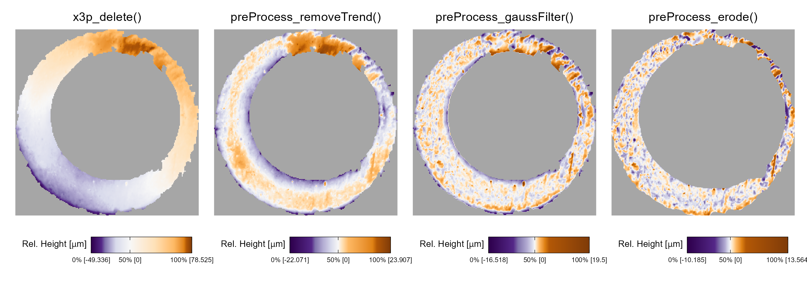
```

Next, we compute a set of similarity features for two pre-processed cartridge case scans.

### Comparing

In this section, we introduce a set of similarity features for two cartridge case scans.
We calculate features at two scales: between two full scans and between individual cells.
Analogous to how a forensic examiner uses a comparison microscope with different magnification levels, this allows us to assess the similarity between two scans at the macro and micro levels.

#### Notational Conventions

First, we introduce notation that will be used to define the features.
Let $A$ and $B$ denote two surfaces matrices that we wish to compare.
For simplicity, we assume that $A,B \in \mathbb{R}^{k \times k}$ for $k > 0$.\footnote{This assumption of equally-sized, square matrices is easily enforced by padding the matrices with additional missing values.
Due to the presence of (structurally) missing values around the breech face impression region, additional padding does not interfere with the structure of the scan.}
We use lowercase letters and subscripts to denote a particular value of a matrix: $a_{ij}$ is the value in the $i$-th row and $j$-th column, starting from the top-left corner, of matrix $A$.
We refer to the two known-match cartridge cases in Figure \@ref(fig:matchPair) as exemplar matrices $A$ and $B$.

To accommodate structurally missing values, we adapt standard matrix algebra as follows: if an element of either matrix $A$ or $B$ is missing, then any element-wise operation including this element is also missing.
Standard matrix algebra holds for non-missing elements.
For example, the addition operator is defined as:
\begin{align*}
A \oplus_{NA} B = (a_{ij} \oplus_{NA} b_{ij})_{1 \leq i,j \leq k} = 
\begin{cases}
a_{ij} + b_{ij} & \text{if both $a_{ij}$ and $b_{ij}$ are numbers} \\
NA &\text{otherwise}
\end{cases}
\end{align*}
Other element-wise operations such as $\ominus_{NA}$ are defined similarly.
For readability, we will use standard operator notation $+, -, >, <, I(\cdot), ...$ and assume the extended, element-wise operations as defined above.

```{r matchPair,out.width="\\textwidth",echo=FALSE,fig.pos="htbp",fig.cap="A matching pair of processed cartridge case scans. We measure the similarity between these cartridge cases using the distinguishable breech face impressions on their surfaces."}
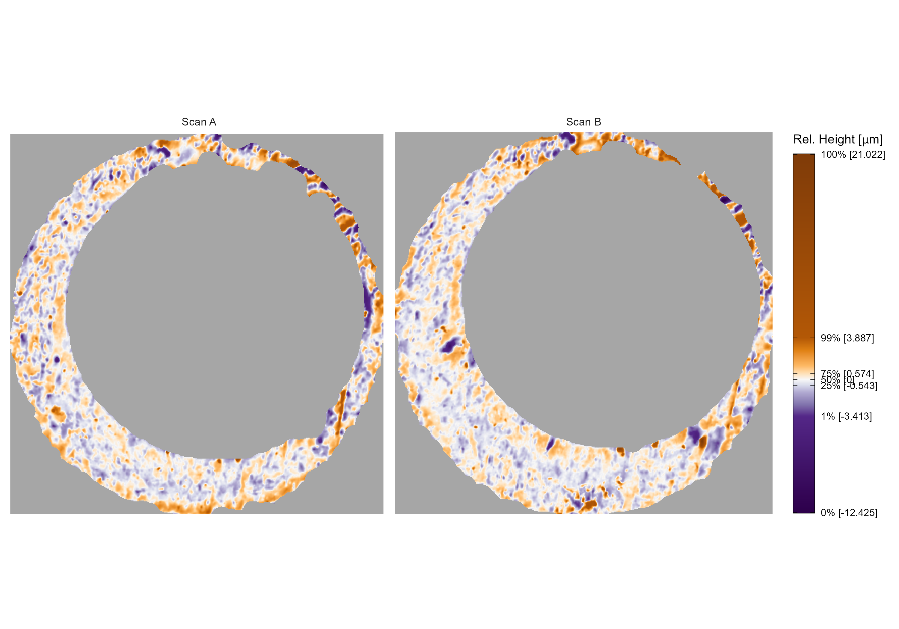
```

#### Registration Estimation

A critical step in comparing $A$ and $B$ is to find a transformation of $B$ such that it aligns best to $A$ (or vice versa).
In image processing, this is called *image registration.* 
Noting that $A$ and $B$ are essentially grayscale images with structurally missing values, we rely on a standard image registration technique [@Brown1992].

In our application, a registration is composed of a discrete translation by $(m,n) \in \mathbb{Z}^2$ and rotation by $\theta \in [-180^\circ,180^\circ]$.
To determine the optimal registration, we calculate the *cross-correlation function* (CCF) between $A$ and $B$, which measures the similarity between $A$ and $B$ for every possible translation of $B$, denoted $(A \star B)$.
We estimate the registration by calculating the maximum CCF value across a range of rotations of matrix $B$.
Let $B_\theta$ denote $B$ rotated by an angle $\theta \in [-180^\circ,180^\circ]$ and $b_{\theta_{mn}}$ the $m,n$-th element of $B_\theta$.
Then the estimated registration $(m^*,n^*,\theta^*)$ is: 

$$
(m^*,n^*,\theta^*) = \arg \max_{m,n,\theta} (a \star b_\theta)_{mn}.
$$ 

In practice we consider a discrete grid of rotations $\pmb{\Theta} \subset [-180^\circ,180^\circ]$.
The registration procedure is outlined in Image Registration Algorithm.
We refer to the matrix that is rotated as the "target."
The result is the estimated registration of the target matrix to the "source" matrix.

**Image Registration Algorithm**

| **Data**: Source matrix $A$, target matrix $B$, and rotation grid $\pmb{\Theta}$

| **Result**: Estimated registration of $B$ to $A$, $(m^*, n^*, \theta^*)$, and cross-correlation function maximum $CCF_{\max}$

| **for** $\theta \in \pmb{\Theta}$ **do**

|    Rotate $B$ by $\theta$ to obtain $B_\theta$;

|    Calculate $CCF_{\max,\theta} = \max_{m,n} (a \star b)_{mn}$;

|    Calculate translation $[m_{\theta}^*, n_{\theta}^*] = \arg \max_{m,n} (a \star b_\theta)_{mn}$;

| **end**

| Calculate overall maximum correlation $CCF_{\max} = \max_{\theta} \{CCF_{\max, \theta} : \theta \in \pmb{\Theta}\}$;

| Calculate rotation $\theta^* = \arg \max_{\theta} \{CCF_{\max,\theta} : \theta \in \pmb{\Theta}\}$;

| **return** Estimated rotation $\theta^*$, translation $m^* = m_{\theta^*}^*$, and $n^* = n_{\theta^*}^*$, and $CCF_{\max}$

</br>

To accommodate missing values, we also compute the *pairwise-complete correlation* using only the complete value pairs, meaning neither value is missing, between $A$ and $B$.

#### Registration-Based Features

##### Full-Scan Registration

We first estimate the registration between two full scans $A$ and $B$ using Image Registration Algorithm with a rotation grid $\pmb{\Theta} = \{-30^\circ, -27^\circ,...,27^\circ,30^\circ\}$.
This results in an estimated registration $(m^*,n^*,\theta^*)$ and similarity measure $CCF_{\max}$.
We also perform Image Registration Algorithm with the roles of $A$ and $B$ reversed, meaning the target scan $A$ is aligned to source scan $B$.

To accommodate these two comparison directions, we introduce a new subscript $d = A,B$, referring to the source scan in Image Registration Algorithm.
Consequently, we obtain two sets of sets of estimated registrations, $(m^*_d,n^*_d,\theta^*_d)$ and $CCF_{\max,d}$, for $d=A,B$.\footnote{In reality, the true aligning registrations in the two comparison directions are opposites of each other. However, because we compare discretely-indexed arrays using a nearest-neighbor interpolation scheme, the estimated registrations differ slightly.}
For $d = A$, we then apply the registration transformation $(m^*_A,n^*_A,\theta^*_A)$ to $B$ to obtain $B^*$ and compute the pairwise-complete correlation, $cor_{\text{full},A}$, between $A$ and $B^*$.
We repeat this in the other comparison direction to obtain $cor_{\text{full},B}$ and average the two:

$$
cor_{\text{full}} = \frac{1}{2}\left(cor_{A,\text{full}} + cor_{B,\text{full}}\right).
$$

We assume that the **full-scan pairwise-complete correlation** is large for truly matching cartridge cases.

##### Cell-Based Registration

We next perform a cell-based comparison procedure, which begins with selecting one of the matrices, say $A$, as the "source" matrix that is partitioned into a grid of cells.
The left side of Figure \@ref(fig:cellGridExample) shows an example of such a cell grid overlaid on a scan.
Each of these source cells will be compared to the "target" matrix, in this case $B^*$.
Because $A$ and $B^*$ are already partially aligned from the full-scan registration procedure, we compare each source cell to $B^*$ using a new rotation grid of $\pmb{\Theta}'_A = \{\theta^*_A - 2^\circ, \theta^*_A - 1^\circ,\theta^*_A,\theta^*_A + 1^\circ,\theta^*_A + 2^\circ\}$.

We now extend the surface matrix notation introduced previously to accommodate cells.
Let $A_{t}$ denote the $t$-th cell of matrix $A$, $t = 1,...,T_A$ where $T_A$ is the total number of cells containing non-missing values in scan $A$ (e.g., $T_A = 43$ in Figure \@ref(fig:cellGridExample)) and let $(a_t)_{ij}$ denote the $i,j$-th element of $A_t$.

The cell-based comparison procedure is outlined in Cell-Based Comparison Algorithm.

**Cell-Based Comparison Algorithm**

| **Data**: Source matrix $A$, target matrix $B^*$, grid size $R \times C$, and rotation grid $\pmb{\Theta}_{A}'$

| **Result**: Estimated translations and $CCF_{\max}$ values per cell, per rotation

| Partition $A$ into a grid of $R \times C$ cells;

| Discard cells containing only missing values, leaving $T_A$ remaining cells;

| **for** $\theta \in \pmb{\Theta}_{A}'$ **do**

|    Rotate $B^*$ by $\theta$ to obtain $B_{\theta}^*$;

|    **for** $t = 1,...,T_A$ **do**

|       Calculate $CCF_{\max,A,t,\theta} = \max_{m,n} (a_t \star b_{\theta}^*)_{mn}$;

|       Calculate translation $[m_{A,t,\theta}^*, n_{A,t,\theta}^*] = \arg \max_{m,n} (a_t \star b_{\theta}^*)_{mn}$;

|    **end**

| **end**

| **return** $\pmb{F}_A = \{(m_{A,t,\theta}^*, n_{A,t,\theta}^*, CCF_{\max,A,t,\theta}, \theta) : \theta \in \pmb{\Theta}_{A}', t = 1,...,T_A\}$

</br>

Rather than exclusively returning the registration that maximizes the overall CCF as in Image Registration Algorithm, Cell-Based Comparison Algorithm returns the set $\pmb{F}_A$ of translations and CCF values for each of the $T_A$ cells and each rotation in $\pmb{\Theta}'_A$.

```{r cellGridExample,out.width="\\textwidth",echo=FALSE,fig.pos="htbp",fig.cap="Estimated registrations of cells from a non-match pair of cartridge cases. A source scan (left) is separated into an $8 \\times 8$ grid of cells. We exclude cells containing only missing values (visualized here as gray pixels). Each source cell is compared to a target scan (right) to estimate where it aligns best. We show a handful of cells at their estimated alignment in the target scan and magnify the surfaces captured by cell pairs 5, 1 and 7, 7. Although the cartridge case pair is non-matching, we note that there are similarities in the surface markings for these cell pairs."}
knitr::include_graphics("images/chapter4-images/cellGridExample_nonMatch.png")
```

Figure \@ref(fig:cellGridExample) shows the estimated registrations of cells between two non-match cartridge cases.
We magnify the surface values captured by cell pairs 5, 1 and 7, 7 and note the similarities in the surface values; for example, the dark purple region in the middle of the cell 7, 7 pair.

Just as with the whole-scan registration, we calculate the pairwise-complete correlation between each cell $A_t$ and a matrix $B_{\theta,t}^*$ of the same size extracted from $B^*_{\theta}$ after translating by $[m^*_{A,\theta},n^*_{A,\theta}]$.
From this we obtain a set of pairwise-complete correlations for each cell and rotation: $\{cor_{A,t,\theta} : t = 1,...,T_A, \theta \in \pmb{\Theta}'_A\}$.

We repeat Cell-Based Comparison Algorithm and the pairwise-complete correlation calculation using $B$ as the source scan and $A^*$ as the target, resulting in cell-based registration set $\pmb{F}_B$ and pairwise-complete correlations $\{cor_{B,t,\theta} : t = 1,...,T_B, \theta \in \pmb{\Theta}'_B\}$.

For $d = A,B$ and $t = 1,...,T_d$, define the cell-wise maximum pairwise-complete correlation as: 

$$
cor_{d,t} = \max_{\theta} \{cor_{d,t,\theta} : \theta \in \pmb{\Theta}'_d\}
$$

We compute two features, the **average** and **standard deviation of the cell-based pairwise-complete correlations**, using the correlation data:

\begin{align*}
\overline{cor}_{\text{cell}} &= \frac{1}{T_A + T_B} \sum_{d \in \{A,B\}} \sum_{t=1}^{T_d} cor_{d,t} \\
s_{cor} &= \sqrt{\frac{1}{T_A + T_B - 1} \sum_{d \in \{A,B\}} \sum_{t=1}^{T_d} (cor_{d,t} - \overline{cor}_{\text{cell}})^2}
\end{align*} 

We expect $\overline{cor}_{\text{cell}}$ and $s_{cor}$ to be large for truly matching cartridge case pairs relative to non-matching pairs.

For $d = A,B$ and $t = 1,...,T_d$, define the per-cell estimated translations and rotation as: 
\begin{align*}
\theta^*_{d,t} &= \arg \max_{\theta} \{CCF_{\max,d,t,\theta} : \theta \in \pmb{\Theta}'_d\} \\
m^*_{d,t} &= m^*_{\theta^*_{d,t},d,t} \\
n^*_{d,t} &= n^*_{\theta^*_{d,t},d,t}
\end{align*} 

We compute the **standard deviation of the cell-based estimated registrations** using the estimated translations and rotations:

\begin{align*}
s_{\theta^*} =  \sqrt{\frac{1}{T_A + T_B - 1} \sum_{d \in \{A,B\}} \sum_{t=1}^{T_d} (\theta^*_{d,t} - \bar{\theta}^*)^2} \\
s_{m^*} =  \sqrt{\frac{1}{T_A + T_B - 1} \sum_{d \in \{A,B\}} \sum_{t=1}^{T_d} (m^*_{d,t} - \bar{m}^*)^2} \\
s_{n^*} = \sqrt{\frac{1}{T_A + T_B - 1} \sum_{d \in \{A,B\}} \sum_{t=1}^{T_d} (n^*_{d,t} - \bar{n}^*)^2}
\end{align*} 

where 

\begin{align*}
\bar{m}^* &= \frac{1}{T_A + T_B} \sum_{d \in \{A,B\}}\sum_{t=1}^{T_d} m^*_{d,t} \\
\bar{n}^* &= \frac{1}{T_A + T_B} \sum_{d \in \{A,B\}} \sum_{t=1}^{T_d} n^*_{d,t} \\
\bar{\theta}^* &= \frac{1}{T_A + T_B} \sum_{d \in \{A,B\}} \sum_{t=1}^{T_d} \theta^*_{d,t}.
\end{align*}

We expect $s_{\theta^*}, s_{m^*},s_{n^*}$ to be small for truly matching cartridge case pairs relative to non-matching pairs.

From the full-scan and cell-based registration procedures, we obtain six features summarized in Table `r knitr::asis_output(ifelse(knitr::is_html_output(), '\\@ref(tab:registrationFeatures-html)', '\\@ref(tab:registrationFeatures-latex)'))`.

```{r registrationFeatures-latex,echo=FALSE,eval=knitr::is_latex_output(),fig.align='center'}
data.frame(x = c("$cor_{\\text{full}}$",
                 "$\\overline{cor}_{\\text{cell}}$",
                 "$s_{cor}$",
                 "$s_{m^*}$",
                 "$s_{n^*}$",
                 "$s_{\\theta^*}$"),
           y = c("Full-scan pairwise-complete correlation",
                 "Average cell-based pairwise-complete correlation",
                 "Standard deviation of the cell-based pairwise-complete correlations",
                 "Standard deviation of the cell-based vertical translaitons (in microns)",
                 "Standard deviation of the cell-based horizontal translations (in microns)",
                 "Standard deviation of the cell-based rotations (degrees)")) %>%
  knitr::kable(format = "latex",escape = FALSE,
               col.names = NULL,
               caption = "Six similarity features based on registering full scans and cells.",
               linesep = "",booktabs = TRUE) %>%
  kableExtra::kable_styling(full_width = TRUE) %>%
  kableExtra::row_spec(row = 0,bold = TRUE)
```


```{r registrationFeatures-html,echo=FALSE,eval=knitr::is_html_output(),fig.align='center'}
data.frame(x = c("$cor_{\\text{full}}$",
                 "$\\overline{cor}_{\\text{cell}}$",
                 "$s_{cor}$",
                 "$s_{m^*}$",
                 "$s_{n^*}$",
                 "$s_{\\theta^*}$"),
           y = c("Full-scan pairwise-complete correlation",
                 "Average cell-based pairwise-complete correlation",
                 "Standard deviation of the cell-based pairwise-complete correlations",
                 "Standard deviation of the cell-based vertical translaitons (in microns)",
                 "Standard deviation of the cell-based horizontal translations (in microns)",
                 "Standard deviation of the cell-based rotations (degrees)")) %>%
  knitr::kable(col.names = NULL,
               caption = "Six similarity features based on registering full scans and cells.",
               format = "html",escape = FALSE)
```


#### Density-Based Features

We wish to identify when multiple cells agree on, or cluster around, a particular registration value.
However, pursuant with the notion that only certain regions of matching cartridge cases contain distinctive markings, it is unreasonable to assume and empirically rare that **all** cells agree on a single registration.
In fact, it is common for many cells to disagree on a registration.
For example, the left scatterplot in Figure \@ref(fig:dbscanScatterplot) shows the per-cell estimated translations $[m^*_{A,t,\theta}, n^*_{A,t,\theta}]$ when scan $A$ is used as source and $B^*$ as target rotated by $\theta = 3^\circ$.
The right scatterplot shows the per-cell estimated translations with the roles of $A$ and $B^*$ reversed for $\theta = -3^\circ$.
We see distinctive clusters, the black points, in both plots among many noisy, gray points.
The task is to isolate the clusters amongst such noise.

We use the Density-Based Spatial Clustering of Applications with Noise (DBSCAN) algorithm proposed by @Ester1996 to identify clusters.
Compared to other clustering algorithms such as k-means [@MacQueen1967], DBSCAN does not require a pre-defined number of expected clusters.
Instead, the algorithm forms clusters if the number of points within an $\epsilon > 0$ distance of a point exceeds some pre-defined threshold, $minPts > 1$.
If a point does not belong to a cluster, then DBSCAN labels that point as "noise."
In Figure \@ref(fig:dbscanScatterplot), we use DBSCAN with $\epsilon = 5$ and $minPts = 5$ to identify clusters of size 14 and 13, respectively, visualized as black points.
These cluster sizes suggest that the scans match.
Additionally, the mean cluster centers are approximately opposites of each other: $(\hat{m}_A,\hat{n}_A,\hat{\theta}_A) \approx (16.9, -16.7, 3^\circ)$ when $A$ is used as source compared to $(\hat{m}_B,\hat{n}_B,\hat{\theta}_B) \approx (-16.2, 16.8, -3^\circ)$ when $B^*$ is used as source.
This provides further evidence of a match.

```{r compDataComputation,include=FALSE}
if (!file.exists("data/compData.RData")) {
  compData <- 
    dplyr::bind_rows(map_dfr(seq(-30,30,by = 3),
                             ~ cmcR::comparison_allTogether(reference = reference_eroded,
                                                            target = target_eroded,
                                                            theta = .,
                                                            numCells = c(8,8),
                                                            maxMissingProp = .99,
                                                            returnX3Ps = TRUE)) %>%
                       mutate(direction = "comparison_refToTarget"),
                     map_dfr(seq(-30,30,by = 3),
                             ~ cmcR::comparison_allTogether(reference = target_eroded,
                                                            target = reference_eroded,
                                                            theta = .,
                                                            numCells = c(8,8),
                                                            maxMissingProp = .99,
                                                            returnX3Ps = TRUE)) %>%
                       mutate(direction = "comparison_targetToRef"))
  
  save(compData,file = "data/compData.RData")
}

load("data/compData.RData")
```

```{r dbscanScatterExample,cache=FALSE,include=FALSE}
estimRotations <- compData %>%
  group_by(direction,theta) %>%
  group_split() %>%
  map_dfr(function(dat){
    
    densEstim <- MASS::kde2d(x = dat$x,y = dat$y,n = 100)
    
    data.frame(maxDens = max(c(densEstim$z)),
               theta = unique(dat$theta),
               direction = unique(dat$direction))
    
  }) %>%
  group_by(direction) %>%
  dplyr::top_n(n = 1,wt = maxDens) %>%
  dplyr::select(direction,theta) %>%
  rename(thetaHat = theta)

plt1 <- compData %>%
  dplyr::select(-c(cellHeightValues,alignedTargetCell)) %>%
  left_join(estimRotations,by = "direction") %>%
  filter(theta == thetaHat) %>%
  mutate(direction = factor(direction,labels = c("Scan A vs. Scan B*","Scan B* vs. Scan A")),
         label = paste0(direction,", Rotation: ",theta)) %>%
  filter(direction == "Scan A vs. Scan B*") %>%
  group_by(label) %>%
  group_split() %>%
  map_dfr(function(dat){
    
    dat %>%
      mutate(clust = dbscan::dbscan(x = dat %>% dplyr::select(x,y),eps = 5,minPts = 5)$cluster,
             clust = factor(ifelse(clust == 0,0,1),labels = c("Noise","Cluster")))
    
  }) %>%
  ggplot(aes(x=x,y,y,colour = clust)) +
  # geom_point() +
  geom_jitter(width = 3,height = 3,size = 1) +
  coord_fixed(expand = TRUE) +
  facet_wrap(~ label,nrow = 1) +
  theme_bw() +
  labs(x = "horizontal shift n",
       y = "vertical shift m",
       colour = "DBSCAN") +
  theme(axis.text = element_text(size = 6),
        legend.position = "bottom") +
  geom_vline(xintercept = 0,linetype = "dashed") +
  geom_hline(yintercept = 0,linetype = "dashed") +
  scale_colour_manual(values = c("gray65","black")) +
  xlim(c(-100,100)) +
  ylim(c(-100,100)) +
  theme(legend.position = "none")

plt2 <- compData %>%
  dplyr::select(-c(cellHeightValues,alignedTargetCell)) %>%
  left_join(estimRotations,by = "direction") %>%
  filter(theta == thetaHat) %>%
  mutate(direction = factor(direction,labels = c("Scan A vs. Scan B*","Scan B* vs. Scan A")),
         label = paste0(direction,", Rotation: ",theta)) %>%
  filter(direction == "Scan B* vs. Scan A") %>%
  group_by(label) %>%
  group_split() %>%
  map_dfr(function(dat){
    
    dat %>%
      mutate(clust = dbscan::dbscan(x = dat %>% dplyr::select(x,y),eps = 5,minPts = 5)$cluster,
             clust = factor(ifelse(clust == 0,0,1),labels = c("Noise","Cluster")))
    
  }) %>%
  ggplot(aes(x=x,y,y,colour = clust)) +
  # geom_point() +
  geom_jitter(width = 3,height = 3,size = 1) +
  coord_fixed(expand = TRUE) +
  facet_wrap(~ label,nrow = 1) +
  theme_bw() +
  labs(x = "(negative) horizontal shift n",
       y = "(negative) vertical shift m",
       colour = "DBSCAN") +
  theme(axis.text = element_text(size = 6),
        legend.position = "bottom") +
  geom_vline(xintercept = 0,linetype = "dashed") +
  geom_hline(yintercept = 0,linetype = "dashed") +
  scale_colour_manual(values = c("gray65","black")) +
  scale_x_reverse(limits = c(100,-100)) +
  scale_y_reverse(limits = c(100,-100)) +
  theme(legend.position = "none")

pltLegend <- plt1 %>%
  cowplot::get_legend() %>%
  cowplot::plot_grid()

ggsave(filename = "figures/dbscanScatterplot.png", plot = plt1+plt2, 
       width = 8, height = 4)
knitr::plot_crop("figures/dbscanScatterplot.png")
```


```{r dbscanScatterplot,out.width=".8\\textwidth",echo=FALSE,fig.pos="htbp",fig.cap="Cluster assignments based on the Density Based Spatial Clustering with Applications to Noise (DBSCAN) algorithm for estimated translations in two comparison directions. Using scan $A$ as source results in a cluster of size 14 (left) compared to 13 when scan $B^*$ is used as source (right). Noting the reversed axes in the right plot, we see that the clusters are located approximately opposite of each other. Points are jittered for visibility."}
knitr::include_graphics("figures/dbscanScatterplot.png")
```

To calculate the density-based features, we first use a 2D kernel density estimator [@MASS] to identify the rotation $\hat{\theta}_d$ at which the per-cell translations achieve the highest density.
Next, we compute clusters using the DBSCAN algorithm amongst the estimated translations $\{(m^*_{d,t,\hat{\theta}_d},n^*_{d,t,\hat{\theta}_d}) : t = 1,...,T_d\}$ like those shown in Figure \@ref(fig:dbscanScatterplot).^[If more than one cluster is identified, we binarize the points based on whether they were assigned to any cluster or if they are a noise point and proceed as if there is only one cluster. We assume that two or more clusters form only because of the course rotation grid considered. Were a finer grid used, the points would coalesce into a single cluster around the true translation value. This assumption has empirical support through our experimentation.]
Let $\pmb{C}_d$ denote the set of cells in the DBSCAN cluster.
We treat the mean cluster centers as the estimated translations $[\hat{m}_d,\hat{n}_d]$.

We calculate four features from the density-based clustering procedure: **average DBSCAN cluster size** $C$, the **DBSCAN cluster indicator** $C_0$, and the **root sum of squares of the dens**ity-estimated registrations $(\Delta_\theta, \Delta_{\text{trans}})$ defined as:

\begin{align*}
C &= \frac{1}{2}\left(|\pmb{C}_A| + |\pmb{C}_B|\right) \\
C_0 &= I(|\pmb{C}_A| > 0 \text{ and } |\pmb{C}_B| > 0)\\
\Delta_\theta &= |\hat{\theta}_A + \hat{\theta}_B| \\
\Delta_{\text{trans}} &= \sqrt{(\hat{m}_A + \hat{m}_B)^2 + (\hat{n}_A + \hat{n}_B)^2}
\end{align*} 

where $|\pmb{C}_d|$ denotes the cardinality of $\pmb{C}_d$ and $I(\cdot)$ is the identity function equal to 1 if the predicate argument "$\cdot$" evaluates to TRUE and 0 otherwise.
We use both $C$ and $C_0$ because of potential missingness in the values of $C$ if no cluster is identified.
Missing $C$ values are imputed using the median non-missing value when fitting classifiers, so the missingness information is retained in $C_0$.

For truly matching cartridge case pairs, we expect $C$ to be large, $C_0$ to be 1, and $\Delta_\theta, \Delta_{\text{trans}}$ to be small relative to non-matching pairs. We obtain four density-based features summarized in Table `r knitr::asis_output(ifelse(knitr::is_html_output(), '\\@ref(tab:dbscanFeatures-html)', '\\@ref(tab:dbscanFeatures-latex)'))`.

```{r dbscanFeatures-latex,echo=FALSE,eval=knitr::is_latex_output(),fig.align='center'}
data.frame(x = c("$C$",
                 "$C_0$",
                 "$\\Delta_{\\theta}$",
                 "$\\Delta_{\\text{trans}}$"),
           y = c("Average DBSCAN cluster size",
                 "DBSCAN cluster indicator",
                 "Root sum of squares of the cluster-estimated translations (in microns)",
                 "Root sum of squares of the cluster-estimated translations (in microns)")) %>%
  knitr::kable(format = "latex",escape = FALSE,
               col.names = NULL,
               caption = "Four similarity features based on the density-based clustering procedure.",
               linesep = "",booktabs = TRUE) %>%
  kableExtra::kable_styling(full_width = TRUE) %>%
  kableExtra::row_spec(row = 0,bold = TRUE)
```


```{r dbscanFeatures-html,echo=FALSE,eval=knitr::is_html_output(),fig.align='center'}
data.frame(x = c("$C$",
                 "$C_0$",
                 "$\\Delta_{\\theta}$",
                 "$\\Delta_{\\text{trans}}$"),
           y = c("Average DBSCAN cluster size",
                 "DBSCAN cluster indicator",
                 "Root sum of squares of the cluster-estimated translations (in microns)",
                 "Root sum of squares of the cluster-estimated translations (in microns)")) %>%
  knitr::kable(col.names = NULL,
               caption = "Four similarity features based on the density-based clustering procedure.",
               format = "html",escape = FALSE)
```


#### Visual Diagnostic Features

The final set of features we calculate are based on visual diagnostic tools described in Chapter 3.
These numerical features quantify the qualitative observations one can make from the diagnostics.

To create the visual diagnostics, we perform element-wise matrix operations.
For a matrix $X \in \mathbb{R}^{k \times k}$ and Boolean-valued condition matrix $cond: \mathbb{R}^{k \times k} \to \{TRUE,FALSE\}^{k \times k}$, we define an element-wise filter operation $\mathcal{F}: \mathbb{R}^{k \times k} \to \mathbb{R}^{k \times k}$ as:

\begin{align*}
\mathcal{F}_{cond}(X) = 
(f_{ij})_{1 \leq i,j \leq k} =
\begin{cases}
x_{ij} &\text{if $cond$ is $TRUE$ for element $i,j$} \\
NA &\text{otherwise}
\end{cases}
\end{align*}

Of particular interest in our application is the (absolute) difference between surface matrices.
For example, $\mathcal{F}_{|A - B^*| > \tau}(A)$ contains elements of matrix $A$ where the pair of scans $A$ and $B^*$ deviate by at least $\tau > 0$.
Surface values in $A$ and $B^*$ that are "close," meaning within $\tau$ distance, to each other are replaced with $NA$ in this filtered matrix.

First, we calculate the correlation $cor_{d,\text{full},\text{diff}}$ between the filtered matrices $\mathcal{F}_{|A - B^*| > \tau}(A)$ and $\mathcal{F}_{|A - B^*| > \tau}(B^*)$ for $d = A$ and $\mathcal{F}_{|A^* - B| > \tau}(A^*)$ and $\mathcal{F}_{|A^* - B| > \tau}(B)$ for $d = B$.
We use the average \textbf{full-scan differences correlation} as a feature:
\begin{align*}
cor_{\text{full},\text{diff}} = \frac{1}{2}\left(cor_{A,\text{full},\text{diff}} + cor_{B,\text{full},\text{diff}}\right).
\end{align*}

We assume that $cor_{\text{full},\text{diff}}$ will be large for matching cartridge case pairs relative to non-matching pairs.
Said another way, we assume that regions of matching cartridge cases that are different will still follow similar trends.
This can occur due to variability in the amount of contact between a cartridge case and breech face across multiple fires of a single firearm.
We calculate the correlation by vectorizing the two filtered surface matrices and treating missing values by case-wise deletion.

As before, we extend our notation to accommodate cell comparisons $t = 1,...,T_d$ for $d = A,B$ using subscripts: $cor_{d,t,\text{diff}}$.
For example, $cor_{A,t,\text{diff}}$ is the correlation between cell filtered surface matrices $\mathcal{F}_{|A_t - B_{t,\theta_t^*}^*| > \tau}(A_t)$ and $\mathcal{F}_{|A_t - B_{t,\theta_t^*}^*| > \tau}(B_{t,\theta_t^*}^*)$ where $B_{t,\theta_t^*}^*$ is the matrix extracted from $B^*$ that maximizes the CCF with $A_t$.
We calculate the **average cell-based differences correlation** across all cells and both directions:

$$
\overline{cor}_{\text{cell},\text{diff}} = \frac{1}{T_A + T_B} \sum_{d \in \{A,B\}} \sum_{t=1}^{T_d} cor_{d,t,\text{diff}}
$$


Next, we consider features based on the elements of the Boolean $cond$ matrix.
Consider Figure \@ref(fig:filterLabeling) that shows the filtered element-wise average $\mathcal{F}_{|A - B^*| < \tau}\left(\frac{1}{2}(A + B^*)\right)$ on the left and the associated $cond$ matrix $|A - B^*| > \tau$ visualized in black-and-white in the middle with filtered elements, whose $cond$ value is $TRUE$, shown in white.

We first calculate the ratio between such a $cond$ matrix and its complement.
For $d = A$, we consider the $cond$ matrices $|A - B^*| \leq \tau$ and $|A - B^*| > \tau$.
The ratio is given by

$$
r_{d} = \frac{\pmb{1}^T I(|A - B^*| \leq \tau) \pmb{1}}{\pmb{1}^T I(|A - B^*| > \tau) \pmb{1}}
$$

where $\pmb{1} \in \mathbb{R}^k$ is a column vector of ones and $I(\cdot)$ is the element-wise, matrix-valued indicator function.
We consider the average **full-scan similarities vs. differences ratio** across the two comparison directions:

$$
r_{\text{full}} = \frac{1}{2}(r_A + r_B).
$$

We expect $r_{\text{full}}$ to be large for matching pairs compared to non-matching pairs.
That is, truly matching pairs will have more similarities than differences.

We also calculate features based on the ratio for cell comparisons $t = 1,...,T_d$, $d = A,B$.
Let $r_{d,t}$ denote the ratio for cell comparison $t$ in direction $d$.
We consider the **average** and **standard deviation of the cell-based similarities vs. differences ratio**:

\begin{align*}
\bar{r}_{\text{cell}} &= \frac{1}{T_A + T_B} \sum_{d \in \{A,B\}} \sum_{t = 1}^{T_d} r_{d,t} \\
s_{\text{cell}, r} &= \sqrt{\frac{1}{T_A + T_B - 1} \sum_{d \in \{A,B\}} \sum_{t = 1}^{T_d} (r_{d,t} - \bar{r}_{\text{cell}})^2}.
\end{align*}

We expect $\bar{r}_{\text{cell}}$ and $s_{\text{cell}, r}$ to be large for matching cartridge case pairs relative to non-match pairs.

Another aspect of the $cond$ matrix we consider is the size of the individual filtered regions.
For two matching cartridge cases, we expect that there are few differences compared to similarities *and* that the different regions are relatively small.
We use a connected components labeling algorithm detailed in @hesselink_concurrent_2001 to identify individual "neighborhoods" of filtered elements [@imager].
More precisely, the algorithm returns a set of sets $\pmb{S}_d = \{S_{d,1},S_{d,2},...,S_{d,L_d}\}$ where each $S_{d,l}$ is a set of indices of the $cond$ matrix that have a value of $TRUE$ and are connected by a chained-together sequence of 4 (Rook's) neighborhoods.
The right side of Figure \@ref(fig:filterLabeling) shows each $S_{d,l}$ distinguished by different fill colors, $l = 1,...,L_d$.

```{r compDataFullScan,cache=TRUE,include=FALSE}
if(!file.exists("data/compData_fullScans.RData")){
  compData_fullScans <- 
    bind_rows(map_dfr(seq(-30,30,by = 3),
                      ~ cmcR::comparison_allTogether(reference = reference_eroded,
                                                     target = target_eroded,
                                                     theta = .,
                                                     numCells = c(1,1),
                                                     maxMissingProp = .99,
                                                     sideLengthMultiplier = 1.1,
                                                     returnX3Ps = TRUE)) %>%
                mutate(direction = "comparison_refToTarget") %>%
                filter(pairwiseCompCor == max(pairwiseCompCor)),
              map_dfr(seq(-30,30,by = 3),
                      ~ cmcR::comparison_allTogether(reference = target_eroded,
                                                     target = reference_eroded,
                                                     theta = .,
                                                     numCells = c(1,1),
                                                     maxMissingProp = .99,
                                                     sideLengthMultiplier = 1.1,
                                                     returnX3Ps = TRUE)) %>%
                mutate(direction = "comparison_targetToRef") %>%
                filter(pairwiseCompCor == max(pairwiseCompCor)))
  
  save(compData_fullScans,file = "data/compData_fullScans.RData")
}
```

```{r scanFilterBinarized,include=FALSE,cache = TRUE}
load("data/compData_fullScans.RData")

scanA <- compData_fullScans %>%
  filter(direction == "comparison_refToTarget") %>%
  pull(cellHeightValues) %>%
  .[[1]]

scanBStar <- compData_fullScans %>%
  filter(direction == "comparison_refToTarget") %>%
  pull(alignedTargetCell) %>%
  .[[1]]

scanA$surface.matrix <- (scanA$surface.matrix*scanA$cmcR.info$scaleByVal + scanA$cmcR.info$centerByVal)

scanBStar$surface.matrix <- (scanBStar$surface.matrix*scanBStar$cmcR.info$scaleByVal + scanBStar$cmcR.info$centerByVal)

compPlt <- impressions::x3p_comparisonPlot(
  x3p1 = scanA,
  x3p2 = scanBStar,
  plotLabels = c("Scan A","Scan B*","Filtered Element-wise\nAverage",
                 "Scan A\nFiltered\nDifferences","Scan B*\nFiltered\nDifferences"),
  labelSize = 2.5,
  legendLength = grid::unit(4,"in"),
  legendHoriz = -1.3,
  legendQuantiles = c(0,.01,.05,.5,.95,.99,1))

plt1 <- ggplot_build(compPlt$patches$plots[[3]])

plt1 <- plt1$data[[2]] %>%
  ggplot(aes(x=x,y=y,fill=fill)) +
  geom_raster() +
  scale_fill_identity() +
  coord_fixed(expand = FALSE) +
  theme_void() +
  geom_path(data = plt1$data[[4]],
            aes(x=x,y=y,group=group),
            size = .2,
            colour = "gray40",
            inherit.aes = FALSE)

scanFilterBinarized <- scanA %>% 
  impressions::x3p_elemAverage(scanBStar) %>%
  impressions::x3p_to_dataFrame() %>%
  mutate(value = (abs(c({scanA$surface.matrix - scanBStar$surface.matrix})) > impressions::x3p_sd(scanA,scanBStar)))

plt2 <- scanFilterBinarized %>%
  ggplot(aes(x=x,y=y,fill=value)) +
  geom_raster() +
  scale_fill_manual(values = c("black","white"),na.value = "gray65") +
  coord_fixed(expand = FALSE) +
  theme_void() +
  theme(legend.position = "none")


scanFilterLabeled <- scanFilterBinarized %>%
  mutate(x = x + 1,y = y + 1,
         value = ifelse(!value | is.na(value),0,1)) %>%
  imager::as.cimg() %>%
  imager::label() %>%
  as.data.frame() %>%
  mutate(value = factor(value))

plt3 <- scanFilterLabeled %>%
  ggplot(aes(x=x,y=y,fill=value)) +
  geom_raster() +
  coord_fixed(expand = FALSE) +
  theme_void() +
  theme(legend.position = "none") +
  scale_fill_manual(values = c("gray65",sample(RColorBrewer::brewer.pal(12,"Paired"),size = length(unique(scanFilterLabeled$value)) - 1,replace = TRUE)))

plt <- (plt1 | plt2 | plt3) & theme(panel.border = element_rect(colour = "black",fill = NA))

ggsave(plot = plt,filename = "figures/filterLabeling.png")
knitr::plot_crop("figures/filterLabeling.png")
```


```{r filterLabeling,out.width="\\textwidth",echo=FALSE,fig.pos="htbp",fig.cap='(Left) After aligning two scans, we filter regions that are "different" from each other, meaning the absolute difference between surface values is larger than some threshold. (Middle) We binarize the scan into "filtered" or "non-filtered" regions - shown in white and black, respectively. (Right) Using a connected components labeling algorithm, we identify connected "neighborhoods" of filtered elements. We assume that these neighborhoods will be small, on average, if comparing truly matching cartridge cases.'}

```

We calculate the following features using the full-scan labeled neighborhoods:

\begin{align*}
\overline{|S|}_{\text{full}} &= \frac{1}{L_A + L_B} \sum_{d \in \{A,B\}} \sum_{l=1}^{L_d} |S_{d,l}| \\
s_{\text{full},|S|} &= \sqrt{\frac{1}{L_A + L_B - 1} \sum_{d \in \{A,B\}} \sum_{l=1}^{L_d} (|S_{d,l}| - \overline{|S|}_{\text{full}})^2}
\end{align*}

where $|S_{d,l}|$ is the cardinality of $S_{d,l}$.
We assume that the **average** and **standard deviation of the full-scan neighborhood sizes** will be small for matching cartridge case  pairs relative to non-matching pairs.
That is to say, we assume that the the regions of $A$ and $B$ that are different will all be small, on average, and vary little in size.
This assumption is appropriate assuming that the breech face leaves consistent markings on fired cartridge cases.

Again, we extend our notation to accommodate individual cells.
Let $\pmb{S}_{d,t} = \{S_{d,t,1},...,S_{d,t,L_{d,t}}\}$ denote the set of labeled neighborhoods for a cell $t = 1,...,T_d$, $d = A,B$.
We calculate the per-cell average and standard deviation of the labeled neighborhood cell size:

\begin{align*}
\overline{|S|}_{d,t} &= \frac{1}{L_{d,t}} \sum_{l=1}^L |S_{d,t,l}| \\
s_{d,t,|S|} &= \sqrt{\frac{1}{L_{d,t} - 1} \sum_{l=1}^{L_{d,t}} (|S_{d,t,l}| - \overline{|S|}_{\text{cell},d,t})^2}.
\end{align*}

We assume that the cell-based $\overline{|S|}_{d,t}$ and $s_{d,t,|S|}$ will be small, on average, for truly matching cartridge cases.
Consequently, we use the sample average of these as features:

\begin{align*}
\overline{|S|}_{\text{cell}} &= \frac{1}{T_A + T_B} \sum_{d \in \{A,B\}} \sum_{t=1}^{T_d} \overline{|S|}_{d,t} \\
\bar{s}_{\text{cell},|S|} &= \frac{1}{T_A + T_B} \sum_{d \in \{A,B\}} \sum_{t=1}^{T_d} s_{d,t,|S|}
\end{align*}

We assume that the **average cell-wise neighborhood size** and the **average standard deviation of the cell-wise neighborhood sizes** will be small for matching cartridge case pairs relative to non-match pairs.

Table `r knitr::asis_output(ifelse(knitr::is_html_output(), '\\@ref(tab:visualDiagnosticFeatures-html)', '\\@ref(tab:visualDiagnosticFeatures-latex)'))` summarizes the nine features based on visual diagnostics.
This concludes our explanation of the ACES feature set.
Next, we use the 19 ACES features to train and test classifier models.

```{r visualDiagnosticFeatures-latex,echo=FALSE,eval=knitr::is_latex_output(),fig.align='center'}
data.frame(x = c("$cor_{\\text{full},\\text{diff}}$",
                 "$\\overline{cor}_{\\text{cell},\\text{diff}}$",
                 "$r_{\\text{full}}$",
                 "$\\bar{r}_{\\text{cell}}$",
                 "$s_{\\text{cell}, r}$",
                 "$\\overline{|S|}_{\\text{full}}$",
                 "$s_{\\text{full},|S|}$",
                 "$\\overline{|S|}_{\\text{cell}}$",
                 "$\\bar{s}_{\\text{cell},|S|}$"),
           y = c("Full-scan differences correlation",
                 "Average cell-wise differences correlation",
                 "Full-scan similarities vs. differences ratio",
                 "Average cell-based similarities vs. differences ratio",
                 "Standard deviation of the cell-based similarities vs. differences ratio",
                 "Average full-scan neighborhood size",
                 "Standard deviation of the full-scan neighborhood sizes",
                 "Average cell-wise neighborhood sizes",
                 "Average standard deviation of the cell-wise neighborhood sizes")) %>%
  knitr::kable(format = "latex",escape = FALSE,
               col.names = NULL,
               caption = "Nine similarity features calculated based on visual diagnostics.",
               linesep = "",booktabs = TRUE) %>%
  kableExtra::kable_styling(full_width = TRUE) %>%
  kableExtra::row_spec(row = 0,bold = TRUE)
```


```{r visualDiagnosticFeatures-html,echo=FALSE,eval=knitr::is_html_output(),fig.align='center'}
data.frame(x = c("$cor_{\\text{full},\\text{diff}}$",
                 "$\\overline{cor}_{\\text{cell},\\text{diff}}$",
                 "$r_{\\text{full}}$",
                 "$\\bar{r}_{\\text{cell}}$",
                 "$s_{\\text{cell}, r}$",
                 "$\\overline{|S|}_{\\text{full}}$",
                 "$s_{\\text{full},|S|}$",
                 "$\\overline{|S|}_{\\text{cell}}$",
                 "$\\bar{s}_{\\text{cell},|S|}$"),
           y = c("Full-scan differences correlation",
                 "Average cell-wise differences correlation",
                 "Full-scan similarities vs. differences ratio",
                 "Average cell-based similarities vs. differences ratio",
                 "Standard deviation of the cell-based similarities vs. differences ratio",
                 "Average full-scan neighborhood size",
                 "Standard deviation of the full-scan neighborhood sizes",
                 "Average cell-wise neighborhood sizes",
                 "Average standard deviation of the cell-wise neighborhood sizes")) %>%
  knitr::kable(col.names = NULL,
               caption = "Nine similarity features calculated based on visual diagnostics.",
               format = "html",escape = FALSE)
```

### Scoring

We use a data set of 510 cartridge cases fired from 25 firearms.
We randomly split the data into 10 firearms for training and 15 firearms for testing.
This resulted in a training data set of 210 cartridge cases, $\binom{210}{2} = 21,945$ pairwise comparisons, and a testing set of 300 cartridge cases, $\binom{300}{2} = 44,850$ pairwise comparisons.
Because we consider every pairwise comparison between these scans, there is a relatively large class imbalance between matches and non-matches in these data sets.
Specifically, non-matching comparisons make up 19,756 of the 21,945 (90.0%) training comparisons and 41,769 of the 44,850 (93.1%) testing comparisons.

We use 10-fold cross-validation repeated thrice [@caret] to train two binary classifiers based on a logistic regression and a random forest [@breiman; @randomForest].
These models predict the probability that a pair of cartridge cases match.
Then, the model classifies the pair as a match or non-match depending on whether the match probability exceeds a set threshold.
On top of the tunable parameters of each model (e.g., the DBSCAN parameters $\epsilon$ and $minPts$), we treat this threshold as a parameter to be optimized.

Models trained to maximize accuracy on imbalanced data often exhibit a "preference" for classifying new observations as the majority class [@Fernndez2018], which in our case are non-matches.
An optimization criterion commonly used for imbalanced data is to select the model that maximizes the area under the Receiver Operating Characteristic (ROC) curve, which measures the performance of a model under different threshold values [@James2013].
The model that maximizes this area, commonly abbreviated AUC, is one that performs best under a variety of threshold values relative to the other models - this consistency is a desired trait.
Using the ROC curve, we choose the match probability threshold that balances the true negative and true positive (equivalently, the false positive and false negative) rates on the training data.

Once we have a trained model, we use it to predict the match probability and classify a new cartridge case pair.
However, rather than referring to the number returned by the trained model as a "probability," which implicitly assumes a homogeneous source population between the training and test cartridge cases, we simply call the number a "score" where larger values correspond with more similar cartridge cases.
We compute this score for the pairwise comparisons in the test data as a means of comparing the generalizability of the various models.
The following section details the results of this cross-validation training/testing procedure.

## Results

### ROC Curves

First, we consider results from the training procedure.
\@ref(fig:rocPlot) shows the resulting ROC curves for four classifier models trained on the training data set.
We consider training the logistic regression (LR) and random forest (RF) models under two feature sets: a subset of the full ACES feature set consisting of the Cluster Indicator feature $C_0$ and the six registration-based features summarized in Table `r knitr::asis_output(ifelse(knitr::is_html_output(), '\\@ref(tab:registrationFeatures-html)', '\\@ref(tab:registrationFeatures-latex)'))` vs. all 19 ACES features.
We consider the "$C_0$ + Registration" subset of features to represent the features used in Congruent Matching Cells methods [@song_proposed_2013; zhang_convergence_2021].

The ROC curves allow us to visually compare the behavior of these four classifiers under various score thresholds where
curves closer to the top-left corner are preferred.
Broadly speaking, the four models perform comparably as evidenced by the similar curves on the right side of \@ref(fig:rocPlot).
The left side shows a zoomed-in version of the top left corner of plot, which makes it easier to compare the different curves.
Visually, we see that the choice of feature group has a larger impact on the outcome classification behavior than the choice between the logistic regression or random forest models.

To numerically compare the four models, we compute the area under the ROC curve (AUC) as well as the score threshold (Thresh.) that balances the false negative and false positive rates (the equal error rate or EER).
The AUC for the All ACES logistic regression and random forest classifiers are higher than the AUC of the two classifiers trained on the $C_0$ + Registration feature set.
Each model has a different score threshold that yields the equal error rate, which we visualize as points along the four ROC curves in \@ref(fig:rocPlot).
We use these thresholds to compute both the training and test classification results summarized below.
We see that the All ACES, logistic regression model has the lowest equal error rate out of the four models with the All ACES, random forest model a close second.

```{r rocPlot,fig.align='center',fig.cap='ROC curves for logistic regression (LR) and random forest (RF) models trained using two feature sets - all 19 ACES features vs. a subset of seven ACES features. On the left, we zoom into the top-left corner of the ROC curve plot to better distinguish between the four curves. We see that the models trained on the full ACES feature set have higher area under the curve (AUC) and lower equal error rate (EER) values than on the subset. We also show the score classification cutoffs (Thresh.) used for each of the four models to achieve the equal error rate values.',fig.pos="htbp",out.width="\\textwidth"}
knitr::include_graphics("images/chapter4-images/rocPlot.png")
```

### Optimized Model Comparison

Figure \@ref(fig:trainTestAccuracy) summarizes the training and testing accuracy, true negative and true positive rates for five binary classifiers.
We distinguish between the training and testing results using gray and black points/line segments, respectively, which allows us to assess the generalizability of the various models.
The conclusions drawn from Figure \@ref(fig:trainTestAccuracy) are intended to primarily be qualitative and comparative across models.
Table \@ref(tab:trainDataResults) and Table \@ref(tab:testDataResults) in the Appendix provide a numerical summary of these results.

```{r trainTestAccuracy,fig.align='center',fig.cap='We summarize classification accuracy, true negative, and true positive rates for both the training and testing results, represented as gray and black points/lines respectively, for five binary classifier models. Our primary interest is the test data results, but visualizing the training data results allows us to assess the generalizability of the models after training. In the first row, we consider a classifier based on a single feature, the Cluster Indicator feature $C_0$, as a baseline. The remaining rows show results from training/testing classifiers based on a random forest (RF) and logistic regression (LR) under various feature sets and optimization critieria. The second row shows results based on a subset of seven features from the ACES feature set while the third row shows results using all 19 ACES features.',fig.pos="htbp",out.width="\\textwidth"}
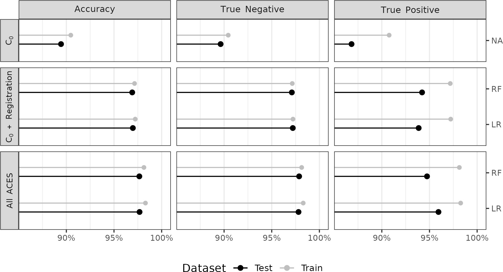
```

We first compare the training and testing results across the five models and three columns in Figure \@ref(fig:trainTestAccuracy).
In general, the true negative rates based on the test data are slightly lower than those of the training data indicating that the models' ability to distinguish between non-matching comparisons generalizes well to the testing data.
In contrast, the true positive rates tend to be lower for the test data compared to the training data across the various models, which indicates a potential difference between the training and testing data.
As we discuss below, there is a single firearm among the 15 test firearms that contributes the majority of false negative (misclassified match) test classifications.
Despite lower true positive rates, the overall accuracy between the training and testing sets are comparable due to the large class imbalance between matching and non-matching comparisons in both.

In the first row, we consider a baseline classifier based solely on the Cluster Indicator feature $C_0$.
Namely, if the DBSCAN algorithm finds clusters in the cell-based translations from both directions of a cartridge case comparison, then that pair is classified as a match.
This is analogous to the classification rule used in @zhang_convergence_2021.
We optimized this $C_0$-based classifier by choosing the DBSCAN parameters $\epsilon$ and $minPts$ that resulted in the most balanced training true negative and true positive rates, resulting in $\epsilon = 15$ and $minPts = 8$.
The optimized $C_0$-based classifier performs considerably worse across the three measures compared to the other models with test accuracy 89.44%, true negative rate 89.64%, and true positive rate 86.82%.

The second row of Figure \@ref(fig:trainTestAccuracy) summarizes results from training the two classifier models on a subset of the full ACES feature set consisting of the Cluster Indicator feature $C_0$ and the six registration-based features summarized in Table `r knitr::asis_output(ifelse(knitr::is_html_output(), '\\@ref(tab:registrationFeatures-html)', '\\@ref(tab:registrationFeatures-latex)'))`.
We consider this subset of features to represent the features used in Congruent Matching Cells methods [@song_proposed_2013; @zhang_convergence_2021].
In general, we see that the logistic regression (LR) and random forest (RF) models perform comparable to each other in accuracy, true negative, and true positive rates.
Despite the fact that the models in the second and third rows were selected based on balancing the training true negative and true positive rates, we note that these rates for the test data are not as well-balanced; namely, the true negative rates still tend to be larger than the true positive rates.
Below, we explore this discrepancy by analyzing the contribution of various test firearms towards the true positive rates.

The third row of Figure \@ref(fig:trainTestAccuracy) summarizes the classification results based on using all 19 ACES features.
If we compare the "$C_0$ + Registration"-trained models in the second vs. the "All ACES"-trained models in the third row, we see that the addition of the other ACES features leads to improved test true negative and true positive rates (and consequently overall accuracy) with the most noticeable gains observed in the true positive rate.
Across all five models, the All ACES-trained logistic regression model has the largest overall test accuracy and true positive rates of 97.68% and 95.94%, respectively.
The All ACES-trained random forest model has the largest overall true negative rate of 97.87%, although the All ACES, logistic regression model is a close second at 97.81% (see Table \@ref(tab:testDataResults) for more details).

### Similarity Score Investigation

While it's useful to consider the accuracy, true negative, and true positive rates to compare various models, forensic examiners would likely not use the binary classification returned by a model in casework.
Instead, they would consider the match probability predicted by the model as a similarity score and incorporate it into their decision-making process.
As such, we also consider the distribution of the predicted similarity scores for matching and non-matching comparisons.
Figure \@ref(fig:testProbs) shows a dot plot of the predicted similarity scores for the 41,769 non-match and 3,181 match comparisons in the test set.
Specifically, these probabilities are predicted by the logistic regression model selected to maximize the AUC based on the full ACES feature set.
As we expect, few non-match comparisons have large similarity scores, which justifies the low false positive rate observed in Figure \@ref(fig:trainTestAccuracy).
However, there is a surprising number of matching comparisons that also have a low match probability.

```{r testProbs,fig.align='center',fig.cap='A dot plot of the predicted similarity scores for the non-match and match comparisons in the test set based on a logistic regression model. As we expect, the non-match comparisons tend to have a low match probability. However, we see that there are many matching comparisons that also have a low match probability.',fig.pos="htbp",out.width="\\textwidth"}
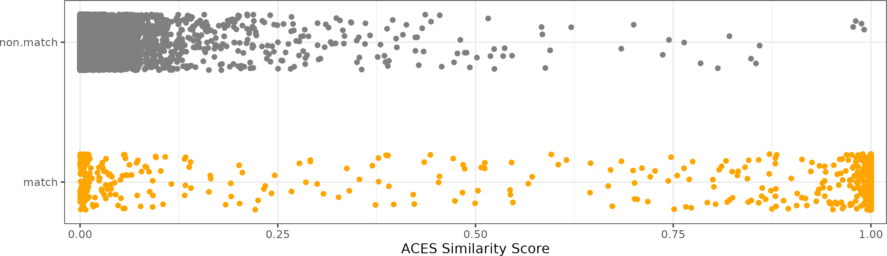
```

To explain the matching comparisons with low similarity scores, we visualize in Figure \@ref(fig:testProbs-byFirearm) the predicted similarity scores for matching test comparisons distinguished by the 15 test firearm ID. 
We see that the firearm T has far more matching comparisons with low similarity scores compared to the other 14 test firearms.
This is further underscored by the right side of the Figure \@ref(fig:testProbs-byFirearm), which shows the ratio of misclassifications to total comparisons for every pair of test firearms based on the same logistic regression model used in Figure \@ref(fig:testProbs).
The main diagonal shows the false negative misclassifications while the off-diagonal shows the false positives.
We use blank tiles for comparisons where 0 misclassifications occurred.
We see that the false negative rate for firearm T of 27.1% is far greater than that of other firearm pairs.
The 95 false negative firearm T comparisons comprise 76% of all 125 false negative test comparisons and about 3% of all 3,181 matching test comparisons.
In sum, the model performs distinctly worse at identifying matching comparisons from firearm T compared to the other firearms, which partially explains the lower test true positive rates noted in Figure \@ref(fig:trainTestAccuracy).
Upon visual inspection of the scans from firearm T, we noted a lack of consistent markings on their surfaces, which isn't the case for scans from other test firearms.

<!-- (Left) A dot plot of the predicted similarity scores for the match comparisons in the tet set based on a logistic regression model, separated by firearm. We see that firearm T has more matching comparisons with low similarity scores than other test fierarms. (Right) Misclassifications divided by total number of pairwise comparisons for each pair of test firearms based on the same logistic regression model, We do not show comparisons with 0 misclassifications. We note that the proportion of misclassified matching comparisons of firearm T of 21.7\\% is much higher than that of other comparisons. -->

```{r testProbs-byFirearm, fig.cap='(Left) A dot plot of the predicted similarity scores for the match comparisons in the test set based on a logistic regression model, separated by firearm. We see that firearm T has more matching comparisons with low similarity scores than the other test firearms. (Right) Misclassifications divided by total number of pairwise comparisons for each pair of test firearms based on the same logistic regression model. We do not show comparisons with 0 misclassifications. We note that the proportion of misclassified matching comparisons from firearm T of 27.1 percent is much higher than that of other comparisons.', fig.align='center', fig.pos="htbp",out.width="\\textwidth"}
knitr::include_graphics("images/chapter4-images/misclassifPlt.png")
```

### Feature Importance

Finally, we consider the relative importance of the 19 ACES features by fitting 10 replicate random forests using the full ACES feature set with fixed random seeds.
For each replicate, we measure a variable's importance using the Gini Index, which measures the probability of making a misclassification for a given model [@hastie_elements_2008].
A larger decrease in the Gini Index corresponds with higher importance.
Figure \@ref(fig:rfVarImpPlt) shows the distribution of the mean Gini Index decrease for the 19 ACES features.
Noting the log scale on which these points are plotted, we see that the most important features consist of a combination of density-based features $C_0$, $C$, and $\Delta_{\text{trans}}$ and registration-based correlation features $\overline{\text{cor}}_{\text{cell}}$ and $\text{cor}_{\text{full}}$.
In general, the visual diagnostic features tend to have lower importance scores compared the registration and density-based features.
We discuss the sensitivity of these importance scores to various algorithm parameter choices in the next section.

```{r rfVarImpPlt,out.width="\\textwidth",echo=FALSE,fig.pos="htbp",fig.cap="Variable importance measures from fitting a random forest to the training data set, repeated 10 times under various random seeds. The top features consist of  density-based features $C$ and $C_0$ and registration-based features $\\overline{\\text{cor}}_{\\text{cell}}$ and $\\text{cor}_{\\text{full}}$. We plot points on a log scale and vertically jitter them for visibility."}
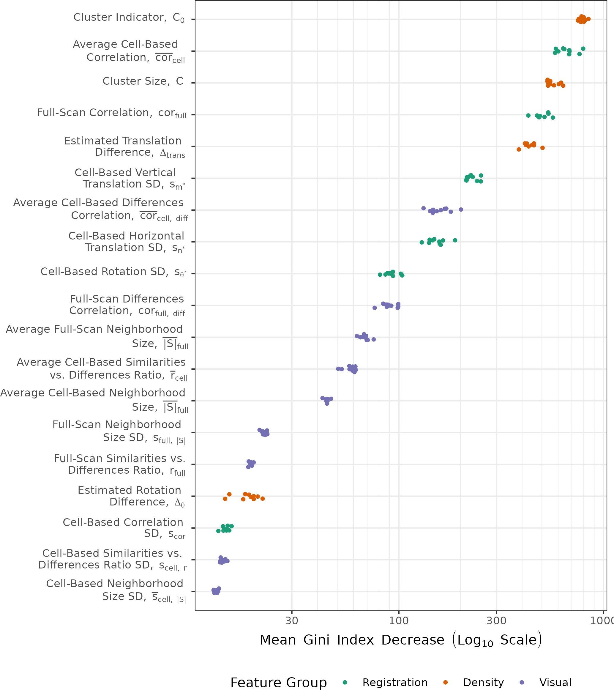
```

## Discussion

### Comparison to CMC Methodology

We use a $C_0$-based classifier as a baseline because it is analogous to the classification rule proposed in @zhang_convergence_2021.
Similarly, the cell-based registration features are based on the the same cell-based comparison procedure used in @song_proposed_2013 and summarized in cell-based comparison.
Together, we consider $C_0$ and the registration-based features a fusion of previously proposed cartridge case similarity scoring algorithms.
This is why we fit separate classifiers based on these features for the training and testing results shown in Figure \@ref(fig:testProbs-byFirearm).
Table `r knitr::asis_output(ifelse(knitr::is_html_output(), '\\@ref(tab:previousWorkComparison-html)', '\\@ref(tab:previousWorkComparison-latex)'))` summarizes the similarities between the ACES algorithm and the algorithms proposed in @zhang_convergence_2021 and @song_proposed_2013.
Another key difference between ACES and both of the previous algorithms is the training/testing procedure used to optimize and validate model parameters.

```{r previousWorkComparison-latex,echo=FALSE,eval=knitr::is_latex_output(),fig.align='center'}
data.frame("Original Paper" = 
             c("Song (2013)","Zhang et al. (2021)"),
           "Similarities to ACES" = c("Use the cell-based comparison algorithm to estimate cell-based registrations","Use DBSCAN algorithm to identify cells that reach a consensus registration."),
           "Original Use" = c("Call cells Congruent Matching Cells if their registrations are close to a reference value. Classify a cartridge case pair as a match if the CMC count is at least 6.","Classify a cartridge case pair as a match if a DBSCAN cluster is identified."),
           "ACES Use" = c("Compute six summative features based on full-scan and cell registrations. Use features in a classifier model.","Compute four numerical features based on DBSCAN clusters across both comparison directions. Use features in a classifier model.")) %>%
  knitr::kable(format = "latex",escape = FALSE,
               col.names = c("Original Paper","Similarities to ACES",
                             "Original Use","ACES Use"),
               caption = "Comparison of the ACES algorithm to previous work. Although ACES shares similarities to previously-proposed algorithms, it includes additional nuance by computing features across both comparison directions and using these features in a classifier model.",
               linesep = "",booktabs = TRUE) %>%
  kableExtra::kable_styling(full_width = TRUE) %>%
  kableExtra::row_spec(row = 0,bold = TRUE)
```


```{r previousWorkComparison-html,echo=FALSE,eval=knitr::is_html_output(),fig.align='center'}
data.frame("Original Paper" = 
             c("Song (2013)","Zhang et al. (2021)"),
           "Similarities to ACES" = c("Use the cell-based comparison algorithm to estimate cell-based registrations","Use DBSCAN algorithm to identify cells that reach a consensus registration."),
           "Original Use" = c("Call cells Congruent Matching Cells if their registrations are close to a reference value. Classify a cartridge case pair as a match if the CMC count is at least 6.","Classify a cartridge case pair as a match if a DBSCAN cluster is identified."),
           "ACES Use" = c("Compute six summative features based on full-scan and cell registrations. Use features in a classifier model.","Compute four numerical features based on DBSCAN clusters across both comparison directions. Use features in a classifier model.")) %>%
  knitr::kable(col.names = c("Paper","Translation $T_x, T_y$ (in pixels)",
                             "Rotation $\\theta$ (in degrees)","$CCF_{\\max}$"),
               caption = "Comparison of the ACES algorithm to previous work. Although ACES shares similarities to previously-proposed algorithms, it includes additional nuance by computing features across both comparison directions and using these features in a classifier model.",
               format = "html",escape = FALSE)
```

Table `r knitr::asis_output(ifelse(knitr::is_html_output(), '\\@ref(tab:classifMethodComparison-html)', '\\@ref(tab:classifMethodComparison-latex)'))` shows the test classification error rates of the Congruent Matching Cells (CMC) algorithm proposed in @song_proposed_2013, the $C_0$-based classifier like the one proposed in @zhang_convergence_2021, and the two ACES logistic regression models selected to balance the true negative and true positive rates and maximize the classification accuracy.
We obtained the CMC results by applying the implementation available in the cmcR R package [@cmcR] on the same test data set used in the Results section.
We used the optimization procedure described in @Zemmels2023 to select CMC parameters.
The $C_0$-based error rates are the same as those shown in the first row of Figure \@ref(fig:trainTestAccuracy).
The ACES logistic regression models perform better than the other classifiers on this test data set, most notably when compared to the CMC method in identifying matching cartridge case pairs.
Interestingly, the $C_0$-based classifier has a lower false negative error rate compared to the All ACES-trained, maximum accuracy logistic regression model, although it has a much higher false positive rate.

```{r classifMethodComparison-latex,echo=FALSE,eval=knitr::is_latex_output(),fig.align='center'}
data.frame("Classification Method" = c("CMC Method","Only $C_0$ feature","ACES LR"),
           "Error" = c(3.9,9.5,2.3),
           "False Positive (\\%)" = c(2.3,9.6,2.2),
           "False Negative (\\%)" = c(25.8,9.2,3.8)) %>%
  knitr::kable(format = "latex",escape = FALSE,
               col.names = c("Original Paper","Error","False Positive (\\%)","False Negative (\\%)"),
               caption = 'Testing classification error, false positive, and false negative rates for four types of classifier models. The CMC method results are derived from the implementation available in the cmcR R package. The "Only $C_0$ feature" classifier is analogous to the classification rule used in Zhang et al. (2021). The last row shows results from the Logistic Regression classifier trained on the all 19 ACES features.',
               linesep = "",booktabs = TRUE) %>%
  kableExtra::kable_styling(full_width = TRUE) %>%
  kableExtra::row_spec(row = 0,bold = TRUE)
```


```{r classifMethodComparison-html,echo=FALSE,eval=knitr::is_html_output(),fig.align='center'}
data.frame("Classification Method" = c("CMC Method","Only $C_0$ feature","ACES LR"),
           "Error" = c(3.9,9.5,2.3),
           "False Positive (\\%)" = c(2.3,9.6,2.2),
           "False Negative (\\%)" = c(25.8,9.2,3.8)) %>%
  knitr::kable(col.names = c("Original Paper","Error","False Positive (\\%)","False Negative (\\%)"),
               caption = 'Testing classification error, false positive, and false negative rates for four types of classifier models. The CMC method results are derived from the implementation available in cmcR R package. The "Only $C_0$ feature" classifier is analogous to the classification rule used in Zhang et al. (2021). The last row shows results from the Logistic Regression classifier trained on the all 19 ACES features.',
               format = "html",escape = FALSE)
```

Both the registration and density-based features aim to measure similarities between two cartridge case surfaces.
These features embody the notion assumed in the CMC methodology that matching cartridge cases should have similar markings, so their cell-based correlations should be large and estimated registrations should agree.
However, \@ref(fig:cellGridExample) demonstrates that even non-matching cartridge case pairs may share similar markings.
We are bound to find similarities if that is all we look for, so it is worthwhile to also consider dissimilarities.
The visual diagnostic features accomplish this by partitioning scans into similar and different regions.
The similarities vs. differences ratio and labeled neighborhood size features measure how extreme the differences are between two scans while the differences correlation features determine whether there are similarities among the different regions.

This direct comparison of the surface values aligns with the Theory of Identification which says that an examination should involve the comparison of the "relative height or depth, width, curvature and spatial relationship" of cartridge case impressions [@AFTE1992].
Comparison algorithms like ACES will inevitably be used to augment the opinion of a forensic examiner, who may need to present algorithmic results to judges or juries as part of their expert testimony.
As such, it is important that forensic examiners are able to interpret and explain the results of a comparison algorithm.
The visual diagnostic features are useful for explaining the behavior of the algorithm in a manner that aligns with more traditional identification theory.

### Sensitivity to Parameter Choice

When selecting the optimal models presented in \@ref(fig:trainTestAccuracy), we performed a good deal of searching across various parameter choices.
For example, given the relative importance of the density-based features illustrated in \@ref(fig:rfVarImpPlt), we were interested in assessing the sensitivity of the various classifier models to DBSCAN parameter choice.
\@ref(fig:aucSensitivity) shows a heat map of AUC values for the four combinations of feature group and classifier model shown in \@ref(fig:trainTestAccuracy) across a grid of DBSCAN parameter values $\epsilon \in \{3,...,15\}$ and $minPts \in \{3,...,10\}$.
Darker tiles correspond with higher AUC values, which in turn are associated with more preferred models.
We draw a black square around the specific $(\epsilon, minPts)$ values resulting in the maximum AUC for each of the models (which we also show in \@ref(fig:rocPlot).
Interestingly, we see that all four models achieve optimum AUC for smaller values of $\epsilon$ and $minPts$.
Larger values of $\epsilon$ will naturally lead to larger clusters as the $\epsilon$-neighborhood around each point grows.
It makes sense then for $\epsilon$ to remain small so as to avoid the formation of false positive clusters.
Conversely, larger values of $minPts$ will naturally lead to fewer clusters, albeit of larger size.
The fact that the optimal $\epsilon$ and $minPts$ are both relatively small suggests that matching comparisons may not have many cells that "agree" on a registration, but the cells that do agree form a strong consensus (i.e., form tight clusters).

We also note the variability in the AUC values across the DBSCAN parameter space.
Specifically, we see that the "$C_0$ + Registration" models achieve the highest AUCs along a set of values in the bottom-left corner - where $\epsilon \approx minPts$ for $\epsilon,minPts < 10$.
In our experimentation, we noticed that these $\epsilon, minPts$ values are also where the cluster indicator $C_0$ feature has highly-ranked importance (as is the case in \autoref{fig:varImp-dbscan}).
Both the AUC values and the variable importance of $C_0$ decrease as either $\epsilon$ or $minPts$ increase, which indicates that the $C_0$ + Registration models rely heavily on $C_0$ to distinguish between matching and non-matching comparisons.
Comparatively, we see that the AUC values for the "All ACES" models are more consistently high across the parameter space, indicating a robustness to parameter choice.

```{r aucSensitivity,out.width="\\textwidth",echo=FALSE,fig.pos="htbp",fig.cap='A heat map of AUC values associated with four classifier models across a grid of values for the two DBSCAN parameter $\\epsilon$ and $minPts$. Darker tiles correspond with higher AUC. The four models are a combination of two feature groups ($C_0$ + Registration vs. All ACES) and two models (Random Forest and Logistic Regression). The "All ACES"-trained models have higher and more consistent AUCs compared to the "$C_0$ + Registration"-trained models.'}
knitr::include_graphics("images/chapter4-images/dbscanAUC_sensitivity.png")
```

To better understand the behavior of the AUC values in \@ref(fig:aucSensitivity), consider \@ref(fig:varImp-dbscan) showing the Mean Gini Decrease for each of the 19 ACES features across the grid of $\epsilon \in \{3,...,15\}$ and $minPts \in \{3,...,10\}$ values.
We see that the density Cluster Indicator $C_0$, Cluster Size $C$, and  Translation Difference $\Delta_{\text{trans}}$ have high variable importance for some combinations of $\epsilon$ and $minPts$, but are generally less consistent than the registration cell-based and full scan correlations $\overline{cor}_{\text{cell}}$ and $cor_{\text{full}}$.
This implies that the density features can be highly informative under optimal conditions, yet quickly lose importance under sub-optimal conditions.
In our experimentation, we noticed that other ACES features "take up the mantle" when $C_0$ or $C$ have low importance, which explains the relative stability in AUC values observed in the "All ACES"-trained models shown in \@ref(fig:aucSensitivity).

The relationship between $C_0$ and $C$ (first two plots in the first row) is noteworthy by the sharp boundary defined by the line $minPts = \epsilon$.
Above this line, when $minPts > \epsilon$, we see that $C_0$ is considered more important than $C$.
In other words, as the minimum size required to be classified as a cluster ($minPts$) and the neighborhood radius ($\epsilon$) both become stricter, there will naturally be fewer clusters formed.
In these instances, knowing whether a cluster is formed is more informative than the size of that cluster.
However, the importance of $C_0$ below the line, when $minPts < \epsilon$, is seemingly replaced by $C$ rising in importance.
That is, when $minPts$ and $\epsilon$ are less strict, then more clusters will form and the actual size of the cluster becomes more informative than the fact that it exists.

```{r varImp-dbscan,out.width="\\textwidth",echo=FALSE,fig.pos="htbp",fig.cap="A heat map of variable importance measures for the 19 features in the ACES data set across a grid of values for the two DBSCAN parameter $\\epsilon$ and $minPts$. Darker tiles correspond with higher importance. As in \\autoref{fig:rfVarImpPlt}, we visualze the importance measures on a log-transformed color scale to more clearly see variability among smaller values. We see that features like the Cell-Based Cluster Indicator $C_0$ and Cell-Based Cluster Size $C$ have inconsistent importance measures across the difference values of $\\epsilon$ and $minPts$ while the cell-based and full scan correlation features $\\overline{cor}_{\\text{cell}}$ and $cor_{\\text{full}}$ have more consistent importance."}
knitr::include_graphics("images/chapter4-images/varImp-dbscan.png")
```

The $\epsilon$ and $minPts$ values are not the only parameters that can be tuned.
We also computed the ACES features using two different cell grids: $4 \times 4$ and $8 \times 8$.
Each cell in the $4 \times 4$ grid captures a larger portion of the cartridge case's surface compared to the $8 \times 8$ grid, which would presumably be useful for the visual diagnostic-based features.
However, the $8 \times 8$ grid has the benefit of having more cells with which to measure consensus using the registration and density-based features.
Our experimentation showed that the $4 \times 4$ cell grid features resulted in categorically better classification results compared to the $8 \times 8$ features.
Throughout this paper, we present the $4 \times 4$ results.

One would expect that having more cells would make it easier to measure the consensus.
However, even the density-based features, such as the cluster size feature $C$, had better separation between matching and non-matching comparisons when the $4 \times 4$ cell grid was used compared to the $8 \times 8$ grid.
Further, performing classification using a combination of the $4 \times 4$ and $8 \times 8$ features actually led to *lower* overall test accuracy compared to just using the $4 \times 4$ grid.
We chalk this outcome up to the specific cell-based registration procedure we used.
Recall from image registration algorithm that we first perform a pre-registration using the full scans and a rotation grid $\pmb{\Theta}$.
Using the full scan-estimated rotation $\theta_d^*$, we then perform the cell-based comparison procedure using a limited rotation grid $\pmb{\Theta}_d' = \{\theta_d^* - 2^\circ, \theta_d^* - 1^\circ,...,\theta_d^* + 2^\circ\}$.

To save on computational time, rather than comparing each source cell to the full target scan, we compare it to a slightly larger region that is located in the same position in the target scan ($1.1 \times$ the side length of the source cell).
Assuming the full scan registration was successful, a source cell isn't allowed to "move" very far in this region to register.
This in contrast to, for example, the original CMC methodology proposed in @song_proposed_2013 where each source cell is compared to a region in the target scan that is much larger, 2 or 3 times the side length.
The consequence of our implementation is that cells, even for non-matching comparisons, tend to have registration values close to the origin (i.e., no movement), and are therefore more likely to form DBSCAN clusters compared to if we used larger target regions.
In this case, a higher number of cells actually leads to a higher chance of forming "false positive" clusters for a non-match comparison, which is exactly what we observe from the $8 \times 8$ comparisons.
The formation of false positive clusters is far rarer in the $4 \times 4$ cell grid case.
We hypothesize that the $8 \times 8$ cell grid results could improve if a different target region size were used.
However, our implementation makes sense pragmatically, since the CCF computation grows exponentially with the size of the region cell or target region, and conceptually, since the full scan registration should result in a rough alignment of two matching scans before applying the cell-based comparison with a finer rotation grid.

### Model Selection Considerations

Our intention in fitting the logistic regression and random forest classification models using different feature sets is to explore each model's strengths and weaknesses.
A critical step in putting the ACES algorithm into practice will be to settle on a single model.
Pragmatically, it seems reasonable to choose the model with the highest estimated accuracy on available test data.
However, we noted that models trained by this optimization criterion on imbalanced data tend to over-classify the majority class.
This is the case for the CMC method results we summarized in Table `r knitr::asis_output(ifelse(knitr::is_html_output(), '\\@ref(tab:classifMethodComparison-html)', '\\@ref(tab:classifMethodComparison-latex)'))`, but is also true for ACES statistical models trained to maximize overall accuracy.
For example, if we were to shift the similarity score classification threshold for the All ACES logistic regression model to maximize the overall accuracy on the training data, the resulting score threshold is 0.54 with test accuracy, true negative, and true positive rates of 99.4%, 99.9%, and 92.4%.
Given the large true negative rate, we might favor this model from an ethical perspective since misclassifying a truly non-matching cartridge case pair may incriminate an innocent individual.
However, the true positive rate is considerably lower than the "balanced" results summarized in \@ref(fig:trainTestAccuracy).
Further exploration of different optimization criteria is warranted.

Another aspect to consider when choosing a model is interpretability and explainability.
If an algorithm is applied in forensic casework, then evidentiary conclusions derived from the algorithm's output will inevitably be presented to a non-expert judge or jury.
More interpretable models are easier to understand, and therefore should be preferred.
The classification behavior of the logistic regression and classification tree models are arguably easier to explain than the random forest model.
For example, the logistic regression model parameters can be understood in terms of the estimated increase in odds of a match.
Paired with its comparable performance to the random forest, we propose the logistic regression model with all 19 ACES features as the preferred model that balances interpretability with accuracy.

## Conclusion

In this paper, we introduced the Automatic Cartridge Evidence Scoring (ACES) algorithm to measure the similarity between two fired cartridge cases based on their breech face impressions.
In particular, we defined a set of 19 similarity features and used these features to train and test classifier models.
We validated our algorithm on a set of 510 cartridge cases - the largest validation study of a cartridge case similarity scoring algorithm to-date.
Compared to predominant algorithms like the CMC algorithm described in @song_proposed_2013, the ACES logistic regression model achieves higher test accuracy rates while having more balanced true positive and true negative rates.
We propose a logistic regression classifier trained on the ACES feature set as a new benchmark to which future scoring methods are compared.

Before the ACES algorithm can be put into practice, we must devise new stress-tests, using new ammunition and firearm combinations, to assess its robustness.
There is also an opportunity to optimize additional parameters, such as the number of cells used in cell-based comparison or parameters used in pre-processing, to measure their effects on final results.
A variety of factors, such as make/model and wear of the evidence or the algorithm parameters used, affect the discriminative power of the 19 features defined in this paper.
We view the current version of the ACES algorithm as more a foundation for future improvements than a final solution.
We expect the ACES feature set to evolve over time; for discriminatory features to replace less informative features.
Given the gravity of the application, we stress interpretability as a guiding principle for future feature engineering and model selection.
A misunderstood feature or result may lead a lay judge or juror to an incorrect conclusion.
Additionally, we urge future researchers to use a train/test procedure similar to the one outlined in this paper to validate proposed methods.

We developed the [scored](https://jzemmels.github.io/scored/) R package as an open-source companion to this paper.
The code and data used in this paper are available at <https://github.com/jzemmels/jdssvSubmission>.

\newpage

# Computational Details {.unnumbered}

```{r,include=TRUE,echo=TRUE}
sessionInfo()
```


\newpage

```{=tex}
\setcounter{section}{0}
\renewcommand{\thesection}{\Alph{section}}
```

# Appendix {.unnumbered}

## Registration Procedure Details

In our application, a registration is composed of a discrete translation by $(m,n) \in \mathbb{Z}^2$ and rotation by $\theta \in [-180^\circ,180^\circ]$.
Under this transformation, the index $i,j$ maps to a new index $i^*,j^*$ by: 

\begin{align*}
\begin{pmatrix} j^* \\ i^* \end{pmatrix} =
\begin{pmatrix} n \\ m \end{pmatrix} +
\begin{pmatrix} \cos(\theta) & -\sin(\theta) \\ \sin(\theta) & \cos(\theta) \end{pmatrix} \begin{pmatrix} j \\ i \end{pmatrix}.
\end{align*}

The value $b_{ij}$ now occupies the index $i^*, j^*$. 
In practice, we use *nearest-neighbor interpolation* meaning $i^*$ and $j^*$ are rounded to the nearest integer.
<!-- \footnote{Technical note: We pad the dimensions of matrix $B$ as-needed assuming free boundary conditions (0-padding) so as to not crop-out any of the original values [cite a boundary condition reference here]. For notational simplicity, we'll refer to this padded matrix as $B$ also.} -->

To determine the optimal registration, we calculate the *cross-correlation function* (CCF) between $A$ and $B$, which measures the similarity between $A$ and $B$ for every possible translation of $B$.
Denoted $(A \star B)$, the CCF between $A$ and $B$ is a 2D array of dimension $2k - 1 \times 2k - 1$ with the $m,n$-th element given by:

$$
(a \star b)_{mn} = \sum_{i=1}^k \sum_{j=1}^k a_{mn} \cdot b_{i + m, j + n}
$$ 

where $1 \leq m,n \leq 2k - 1$.
The value $(a \star b)_{mn}$ quantifies the similarity between $A$ and $B$ after $B$ is translated $m$ elements horizontally and $n$ elements vertically.
The CCF is often normalized between -1 and 1 for interpretability.

The above definition of the CCF is computationally taxing, particularly for large matrices.
The Cross-Correlation Theorem provides an equivalent expression for the CCF:

$$
(A \star B) = \mathcal{F}^{-1}\left(\overline{\mathcal{F}(A)} \odot \mathcal{F}(B)\right)
$$

where $\mathcal{F}$ and $\mathcal{F}^{-1}$ are the discrete Fourier and inverse discrete Fourier transforms, respectively, $\overline{\mathcal{F}(A)}$ is the complex conjugate, and $\odot$ is an element-wise (Hadamard) product [@fft_brigham].
We trade the moving sum computation from the previous CCF expression for two forward Fourier transforms, an element-wise product, and an inverse Fourier transform.
The Fast Fourier Transform (FFT) algorithm reduces the computational load considerably [cite Tukey].

We estimate the registration by calculating the maximum CCF value across a range of rotations of matrix $B$.
Let $B_\theta$ denote $B$ rotated by an angle $\theta \in [-180^\circ,180^\circ]$ and $b_{\theta_{mn}}$ the $m,n$-th element of $B_\theta$.
Then the estimated registration $(m^*,n^*,\theta^*)$ is: 

$$
(m^*,n^*,\theta^*) = \arg \max_{m,n,\theta} (a \star b_\theta)_{mn}.
$$

In practice we consider a discrete grid of rotations $\pmb{\Theta} \subset [-180^\circ,180^\circ]$.
The registration procedure is outlined in Image Registration Algorithm.
We refer to the matrix that is rotated as the "target."
The result is the estimated registration of the target matrix to the "source" matrix.

The Fast Fourier Transform algorithm used in Image Registration Algorithm does not permit missing values in $A$ or $B$.
It is common for cartridge case scans to contain many missing values - the gray regions in Figure \@ref(fig:matchPair) represent structural values in the scan.
Thus, when calculating the CCF we impute these missing values with the average non-missing value in the scan.
To measure the similarity between $A$ and $B$ while accounting for missingness, we calculate the correlation between the non-missing intersection of the aligned scans.

### Cell-Based Registration Details

Following the full-scan registration, we next perform a cell-based registration procedure.
@song_proposed_2013 points out that breech face impressions rarely appear uniformly on a cartridge case surface.
Rather, distinguishing markings appear in specific, usually small, regions of a scan (the author refers to these as *valid correlation regions*).
Calculating a correlation between two whole scans does not necessarily capture the similarity between these regions.
@song_proposed_2013 proposes partitioning a scan into a rectangular grid of "cells" to isolate the valid correlation regions.
Figure \@ref(fig:cellGridExample) shows an example of two non-match cartridge cases where the source matrix (left) is partitioned into an $8 \times 8$ grid of cells.

The cell-based comparison procedure begins with selecting one of the matrices, say $A$, as the "source" matrix to be partitioned into a grid of cells.
Each of these source cells will be compared to the "target" matrix, in this case $B^*$.
Because $A$ and $B^*$ are already partially aligned based on the course rotation grid $\pmb{\Theta}$, we compare each source cell to $B^*$ using a new rotation grid of $\pmb{\Theta}'_A = \{\theta^*_A - 2^\circ, \theta^*_A - 1^\circ,\theta^*_A,\theta^*_A + 1^\circ,\theta^*_A + 2^\circ\}$.

If two cartridge cases are truly matching, then we assume that multiple cells will "agree" on a particular translation value at the true rotation.
This agreement phenomenon is illustrated in Figure \@ref(fig:estimatedTranslationFaceted) where each point represents the translation that maximizes the CCF for a particular cell and rotation.
The points appear randomly distributed for most of the rotation values except around $\theta = 3$ where a tight cluster of points forms around translation $[m,n] \approx [17,-16]$.
This is evidence to suggest that a true registration exists for these two cartridge cases, implying that they match.
The task is to determine when cells reach a registration consensus.

```{r estimatedTranslation, include=FALSE}
load("data/compData.RData")
plt <- compData %>%
  dplyr::select(-c(cellHeightValues,alignedTargetCell)) %>%
  filter(direction == "comparison_refToTarget") %>%
  filter(theta >= -3 & theta <= 9) %>%
  ggplot(aes(x=x,y,y)) +
  geom_vline(xintercept = 0,linetype = "dashed", colour = "grey50") +
  geom_hline(yintercept = 0,linetype = "dashed", colour = "grey50") +
  # geom_point() +
  geom_jitter(width = 3,height = 3, alpha=.8) +
  coord_fixed(expand = TRUE) +
  facet_wrap(~ theta,nrow = 1,labeller = label_both) +
  theme_bw() +
  labs(x = "horizontal shift n", y = "vertical shift m") +
  theme(axis.text = element_text(size = 6)) 
ggsave(plt, filename = "figures/estimatedTranslationFaceted.png", width = 12, height = 3)
knitr::plot_crop("figures/estimatedTranslationFaceted.png")
```

```{r estimatedTranslationFaceted,out.width="\\textwidth",echo=FALSE,fig.pos="htbp", fig.cap="A scatterplot where points represent the cell-wise estimated translations faceted by rotation for a matching pair of cartridge cases. As evidenced by the tight cluster in the middle facet, it appears that multiple cells agree on a translation of $[m, n] \\approx  [17,-16]$ after rotating by $3^\\circ$. Points are jittered for visibility."}

```

### Registration-Based Feature Distributions

Figure \@ref(fig:registrationDensities) shows density plots of the registration-based features for 21,945 cartridge case pairs.
The first two rows show densities for the sample mean and standard deviation of the cell-based registrations, respectively.
The third row shows densities for the pairwise-complete correlation features.
The standard deviation of the cell-based registrations discriminate more between match vs. non-match pairs than the sample means, which justifies their inclusion in the final feature set.
[More to say here?]

```{r registrationDensities,out.width="\\textwidth",echo=FALSE,fig.pos="htbp",fig.cap = 'Density plots of the Registration-Based features for 21,945 cartridge case pairs. The standard deviation of the cell-based registrations distinguish between match and non-match pairs better than the mean values.'}
knitr::include_graphics("images/chapter4-images/featureDensity_registration.png")
```

## DBSCAN Algorithm Details

<!-- Figure \@ref(fig:dbscanIllustration) depicts an illustration of the DBSCAN algorithm [cite Wikimedia commons]. \hh{XXX get rid of this figure - I'm sure that you can explain the dbscan algorithm as well without giving space to figures that aren't yours. Space is the most valuable resource in a paper :)} -->
DBSCAN has two parameters: a neighborhood radius $\epsilon$ and a minimum point threshold $Minpts$.
<!-- In Figure \@ref(fig:dbscanIllustration), $Minpts = 4$ and $\epsilon$ is arbitrary and represented by the radius of the circles drawn around each point - each circle represents the $\epsilon$-neighborhood for its center point. -->
First, the algorithm identifies cluster "core" points that contain at least $Minpts$ points within an $\epsilon$ distance.^[Euclidean distance, in our application]
These points form the beginning of a cluster.
All points within an $\epsilon$-neighborhood of a core point are included in the associated cluster.
Clusters whose core points are within each other's $\epsilon$-neighborhood are combined into a single cluster.
Any point outside of the $\epsilon$-neighborhood of a core point are called "noise points."
Unlike other clustering algorithms, the DBSCAN algorithm does not require a specified number of expected clusters as a parameter; any points not belonging to a cluster are "noise." 
<!-- and are shown in red in Figure \@ref(fig:dbscanIllustration). -->
<!-- The yellow points $B$ and $C$ are within the $\epsilon$-neighborhood of a core point, but are not themselves core points. -->
<!-- They are also included in the cluster making the overall cluster size 8. -->
<!-- Finally, the blue point labelled $N$ is not in any core point's $\epsilon$-neighborhood and is thus classified as a "noise point." -->

<!-- **[Add image to illustrate DBSCAN?]** -->

<!-- ```{r,out.width=".7\\textwidth",echo=FALSE,fig.pos="htbp",fig.cap = '\\label{fig:dbscanIllustration} Illustration of the DBSCAN algorithm [cite]. Red and yellow points are part of the same cluster with the former forming the "core" of the cluster. The blue point is not part of a cluster and is classified as a "noise point." Figure by Chire - Own work, CC BY-SA 3.0, https://commons.wikimedia.org/w/index.php?curid=17045963'} -->
<!-- knitr::include_graphics("images/dbscanIllustration.png") -->
<!-- ``` -->

### Density-Based Feature Distributions

Figure \@ref(fig:densityDistributions) shows the distributions of the density-based features $C$, $\Delta_\theta$, and $\Delta_{\text{trans}}$. 
The stacked bar chart in the top-left shows the proportion of comparisons where no DBSCAN cluster is identified by outcome (match or non-match).
We see that the vast majority of comparisons for which no DBSCAN cluster is identified are non-match comparisons. indicating that $C_0$ is a good indicator of ground-truth.
In fact, there is only one non-match comparison that resulted in a DBSCAN cluster.
It's difficult to see in the plots, but the $C$ value for this non-match pair is 5 and the $\Delta_{\text{trans}}$ value is 23.9.
As expected, $C$ tends to be relatively large for matching comparisons while $\Delta_{\theta}$ and $\Delta_{\text{trans}}$ tends to be small.

```{r densityDistributions,out.width="\\textwidth",echo=FALSE,fig.pos="htbp",fig.cap = 'Distributions of the density-based features for 21,945 cartridge case pairs. The Cluster Size and Estimated Translation Difference features may be missing (\\texttt{NA}) if no DBSCAN cluster is identified, which commonly occurs for non-matching cartridge case pairs as evidenced by the stacked bar chart in the top left. This explains the near absence of non-matching comparisons from Cluster Size and Estimated Translation Difference plots. Whether a cluster is identified for a particular comparison strongly predicts whether it is a match or a non-match, which justifies the inclusion of the cluster indicator feature $C_0$.'}

```

## Visual Diagnostic Details

The Complementary Comparison Plot visualizes the similarities and differences between two scans.
Figure \@ref(fig:fullScanComparisonPlot) shows a Complementary Comparison plot between scan $A$ and $B^*$ defined previously.
The left column shows Scans $A$ and $B^*$.
The middle column shows a filtered element-wise average between $A$ and $B^*$; namely $\mathcal{F}_{|A - B^*| < \tau}\left(\frac{1}{2}(A + B^*)\right)$.
This filtered element-wise average emphasizes similarities between $A$ and $B^*$.
The right column shows $\mathcal{F}_{|A - B^*| > \tau}(A)$ and $\mathcal{F}_{|A - B^*| > \tau}(B^*)$ on top and bottom, respectively.
These plots emphasize the differences between the two scans.
The complementary comparison plot is a powerful tool for assessing the estimated alignment and identifying similarities and differences between two surface matrices.
We repeat this in the other comparison direction $(d = B)$ to obtain filtered matrices $\mathcal{F}_{|A^* - B| < \tau}\left(\frac{1}{2}(A^* + B)\right)$, $\mathcal{F}_{|A^* - B| > \tau}(A^*)$ and $\mathcal{F}_{|A^* - B| > \tau}(B)$.^[As with the registration-based features, in reality these matrices should be equivalent across the two comparison directions. However, there are slight differences due to the discretely-indexed nature of the surface matrices.]

```{r fullScan_comparisonPlot_code,cache=TRUE,include=FALSE}
compPlt <- impressions::x3p_comparisonPlot(
  x3p1 = scanA,
  x3p2 = scanBStar,
  plotLabels = c("Scan A","Scan B*","Filtered Element-wise\nAverage",
                 "Scan A\nFiltered\nDifferences","Scan B*\nFiltered\nDifferences"),
  labelSize = 2.5,
  legendLength = grid::unit(4,"in"),
  legendHoriz = -1.3,
  legendQuantiles = c(0,.01,.05,.5,.95,.99,1))

ggsave(plot = compPlt,filename = "figures/fullScan_comparisonPlot.png",dpi = 500)
knitr::plot_crop("figures/fullScan_comparisonPlot.png")
```

```{r fullScanComparisonPlot,out.width="\\textwidth",echo=FALSE,fig.pos="htbp",fig.cap="Full scan comparison plot."}
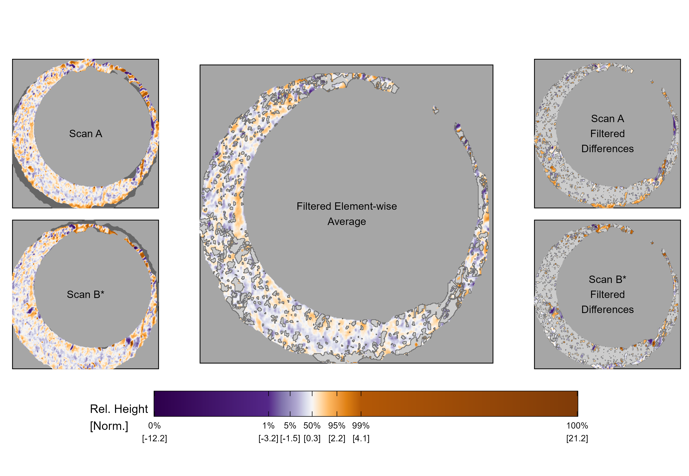
```

We make a series of qualitative assumptions related to how a Complementary Comparison Plot will look for matching and non-matching cartridge case pairs.
We develop a set of features that measure the degree to which these assumptions are met by a particular cartridge case pair.
<!-- We now describe each feature and their associated assumptions. -->

### Visual Diagnostic Feature Distributions

Figure \@ref(fig:visualDiagnosticDensities) shows the distribution of the six visual diagnostic-based features.
As expected, matching comparisons at the full-scan and cell-based levels tend to have smaller neighborhood sizes and higher correlation values on average.


```{r visualDiagnosticDensities,out.width="\\textwidth",echo=FALSE,fig.pos="htbp",fig.cap = 'Distributions of the visual diagnostic-based features for 21,945 cartridge case pairs. Matching comparisons tend to have smaller neighborhood sizes on average and higher correlation values than non-matches indicating their utility in a classifier.'}
knitr::include_graphics("images/chapter4-images/featureDensity_visualDiag.png")
```

## Model-Specific Results

Table \@ref(tab:trainDataResults) summarizes the accuracy, true positive, and true negative rates based on the training data for the 13 binary classifier models.
We see that the Logistic Regression (LR) and Random Forest (RF) models perform comparably, particularly having the exact same True Negative rate in the last two rows of the table.
The CART model performs consistently worse compared to the other two models.

```{r trainResultsTable}
# from: https://stackoverflow.com/a/65844319/14000041
linesep<-function(x,y=character()){
  if(!length(x))
    return(y)
  linesep(x[-length(x)], c(rep('',x[length(x)]-1),'\\addlinespace',y))  
}

structure(list(Model = structure(c(1L, 2L, 2L, 2L, 2L, 3L, 3L, 
                                   3L, 3L, 4L, 4L, 4L, 4L), levels = c("Baseline", "CART", "RF", 
                                                                       "LR"), class = "factor"), `Feature Set` = structure(c(1L, 2L, 
                                                                                                                             2L, 3L, 3L, 2L, 2L, 3L, 3L, 2L, 2L, 3L, 3L), levels = c("$C_0$", 
                                                                                                                                                                                     "$C_0$ + Registration", "All ACES"), class = "factor"), Criterion = structure(c(1L, 
                                                                                                                                                                                                                                                                     2L, 3L, 2L, 3L, 2L, 3L, 2L, 3L, 2L, 3L, 2L, 3L), levels = c("", 
                                                                                                                                                                                                                                                                                                                                 "Max. AUC", "Max. Accuracy"), class = "factor"), Accuracy = c("94.67", 
                                                                                                                                                                                                                                                                                                                                                                                               "94.32", "98.11", "97.37", "98.56", "97.09", "98.90", "98.34", 
                                                                                                                                                                                                                                                                                                                                                                                               "99.50", "97.33", "98.93", "98.25", "\\textbf{99.56}"), `True Positive` = c("97.32", 
                                                                                                                                                                                                                                                                                                                                                                                                                                                                           "97.68", "91.09", "87.54", "86.86", "97.09", "93.09", "\\textbf{98.32}", 
                                                                                                                                                                                                                                                                                                                                                                                                                                                                           "95.91", "97.32", "93.59", "98.23", "96.50"), `True Negative` = c("94.37", 
                                                                                                                                                                                                                                                                                                                                                                                                                                                                                                                                             "93.95", "98.89", "98.47", "99.87", "97.09", "99.55", "98.34", 
                                                                                                                                                                                                                                                                                                                                                                                                                                                                                                                                             "\\textbf{99.90}", "97.33", "99.53", "98.25", "\\textbf{99.90}")), class = "data.frame", row.names = c(NA, 
                                                                                                                                                                                                                                                                                                                                                                                                                                                                                                                                                                                                                                                    -13L))%>%
  dplyr::select(`Feature Set`,Criterion,Model,Accuracy,`True Negative`,`True Positive`) %>%
  arrange(`Feature Set`,Criterion,Model) %>%
  knitr::kable(caption = "Accuracy, True Positive, and True Negative rates based on the training data for the 13 binary classifier models. This table shows a numeric summary of the results shown in [Figure]. We bold the largest values in each column for emphasis.",
               label = "trainDataResults",
               format = "latex",
               escape = FALSE,
               align = c("l","l","l",
                         "r","r","r"),
               linesep = linesep(c(1,3,3,3,3)),
               booktabs=TRUE)
```


Table \@ref(tab:testDataResults) summarizes the accuracy, true positive, and true negative rates based on the test data for the 13 binary classifier models.
We see that the Logistic Regression (LR) model performs slightly better than the Random Forest (RF) model in most cases while the CART model consistently lags behind the other two. 
The true positive rates for the test data are noticeably lower to those for the training data summarized in Table \@ref(tab:trainDataResults), although the true negative rates are similar.

```{r testResultsTable}
structure(list(Model = structure(c(1L, 2L, 2L, 2L, 2L, 3L, 3L, 
                                   3L, 3L, 4L, 4L, 4L, 4L), levels = c("Baseline", "CART", "RF", 
                                                                       "LR"), class = "factor"), `Feature Set` = structure(c(1L, 2L, 
                                                                                                                             2L, 3L, 3L, 2L, 2L, 3L, 3L, 2L, 2L, 3L, 3L), levels = c("$C_0$", 
                                                                                                                                                                                     "$C_0$ + Registration", "All ACES"), class = "factor"), Criterion = structure(c(1L, 
                                                                                                                                                                                                                                                                     2L, 3L, 2L, 3L, 2L, 3L, 2L, 3L, 2L, 3L, 2L, 3L), levels = c("", 
                                                                                                                                                                                                                                                                                                                                 "Max. AUC", "Max. Accuracy"), class = "factor"), Accuracy = c("94.20", 
                                                                                                                                                                                                                                                                                                                                                                                               "93.82", "98.21", "96.80", "98.88", "96.79", "98.81", "97.55", 
                                                                                                                                                                                                                                                                                                                                                                                               "99.34", "96.97", "98.78", "97.86", "\\textbf{99.38}"), `True Positive` = c("94.73", 
                                                                                                                                                                                                                                                                                                                                                                                                                                                                           "95.16", "88.22", "88.09", "86.73", "93.93", "89.81", "95.42", 
                                                                                                                                                                                                                                                                                                                                                                                                                                                                           "92.44", "94.03", "90.10", "\\textbf{95.59}", "92.63"), `True Negative` = c("94.16", 
                                                                                                                                                                                                                                                                                                                                                                                                                                                                                                                                                       "93.73", "98.94", "97.45", "99.78", "97.00", "99.48", "97.71", "99.85", 
                                                                                                                                                                                                                                                                                                                                                                                                                                                                                                                                                       "97.18", "99.42", "98.03", "\\textbf{99.88}")), class = "data.frame", row.names = c(NA, 
                                                                                                                                                                                                                                                                                                                                                                                                                                                                                                                                                                                                                                           -13L)) %>%
  dplyr::select(`Feature Set`,Criterion,Model,Accuracy,`True Negative`,`True Positive`) %>%
  arrange(`Feature Set`,Criterion,Model) %>%
  knitr::kable(caption = "Accuracy, True Positive, and True Negative rates based on the test data for the 13 binary classifier models. This table shows a numeric summary of the results shown in [Figure]. We bold the largest values in each column for emphasis.",
               label = "testDataResults",
               format = "latex",
               escape = FALSE,
               align = c("l","l","l",
                         "r","r","r"),
               linesep = linesep(c(1,3,3,3,3)),
               booktabs=TRUE)
```


<!-- **[Write full logistic regression model here]** -->

```{r logRegOddsMult,fig.pos="H",fig.align='center',out.extra='',eval=FALSE}
load("data/logisticRegOddsMultipliers.RData")

logisticRegOddsFactors %>%
  slice(1:5) %>%
  mutate(logistOddsFactor = case_when(varName == "noClusterIndTRUE" ~ "$2.8 \\times 10^{40}$",
                                      varName == "differenceCor_ave" ~ "9,934.6",
                                      varName == "cell_theta_sd" ~ "243.7",
                                      varName == "clustCenterDiff" ~ "1.5",
                                      varName == "cell_y_sd" ~ "1.1",
                                      TRUE ~ "")) %>%
  mutate(varName = case_when(varName == "noClusterIndTRUE" ~ "Cluster Indicator",
                             varName == "differenceCor_ave" ~ "Full-Scan Differences Correlation",
                             varName == "cell_theta_sd" ~ "Cell-Based Rotation SD",
                             varName == "clustCenterDiff" ~ "Estimated Translation Difference",
                             varName == "cell_y_sd" ~ "Cell-Based Horizontal Translation SD",
                             TRUE ~ "")) %>%
  knitr::kable(col.names = c("Feature Name","Odds Multiplier"),
               align = c("l","r"),label = "logistOddsMult",
               caption = "Logistic regression-estimated multiplicative increase in the odds that a cartridge case pair is truly matching for a one unit increase in the associated feature, holding all other features constant. For brevity, we consider the top five features in terms of the odds multiplier. Note that the Cluster Indicator feature only takes on values 0 or 1.",
               format = "latex",booktabs = TRUE,escape = FALSE)
```

Figure \@ref(fig:trainedCART) shows the trained CART model.
For each node, The first line is the predicted class if it were treated as a terminal node.
The second line is the estimated probability that an observation is a non-match given that it falls into the node.
The third line is the percentage of all observations that fall into the node.
We see that splits are made on the three variables that are ranked as most important in Figure \@ref(fig:rfVarImpPlt); namely, $C_0$, $\overline{cor}_{\text{cell}}$, and $s_{m^*}$.

[Figure of fitted CART model here.]


<!--chapter:end:chapters/03_cartridgeCasePipeline.Rmd-->

